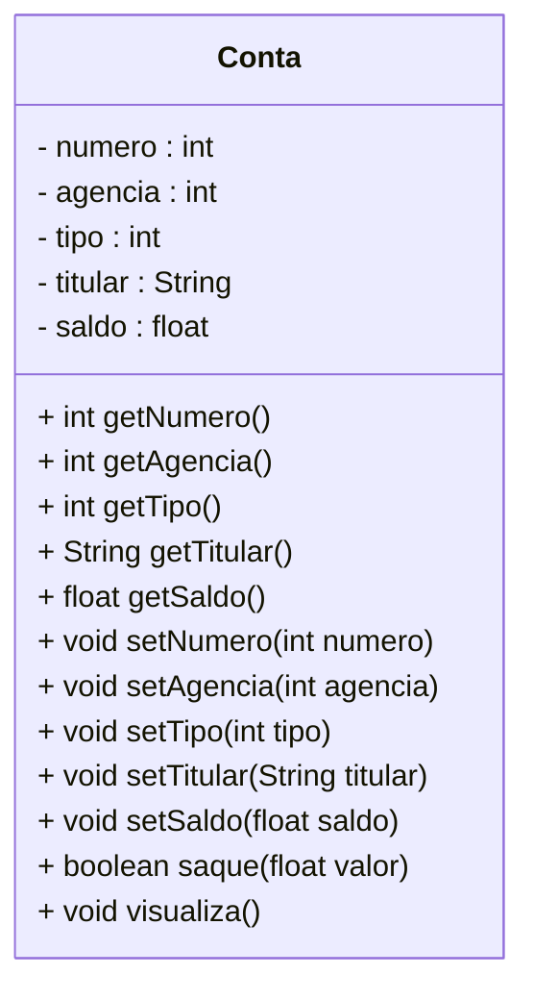

<h1>Programação Orientada a Objetos - Parte 01</h1>
<h2>Classes, Objetos e Encapsulamento</h2>

Em geral, quanto maior o software, mais complexo é o seu desenvolvimento, devido às muitas partes que compõem o todo e o relacionamento entre estas partes. 

Uma razão frequente para as dificuldades de implementação, testes e manutenção é que, em geral, quando se segue uma lógica de projeto de software voltado apenas nas funcionalidades, o sistema é desenvolvido e estruturado de acordo com o que ele faz, sem uma preocupação em representar o processo de uma maneira similar ao que acontece no mundo real, ou seja, no dia a dia.

O problema dessa abordagem é que, de tempos em tempos, as empresas mudam seus processos e procedimentos. Isso significa que, o software também terá que mudar e se ele foi todo estruturado de acordo com o que ele precisava fazer antes, pode ser que agora ele precise ser totalmente reestruturado ou ser refeito, a menos que façamos um POG "Programação Orientada a Gambiarras" para manter as coisas funcionando.

Entretanto, alguns desenvolvedores pensaram há algumas décadas atrás: "***Se as funções de uma empresa e de um software mudam com muita frequência, eu não posso usá-las como base para a organização da minha aplicação***". Essa foi a primeira grande conclusão dos fatos acima. A partir deste pensamento, surgiu a pergunta que levou à segunda grande conclusão: "***Mas o que é que, em uma empresa e em seus processos, raramente muda?***" Por sorte alguém conseguiu perceber o que raramente muda em uma empresa: ***As Coisas!***

***Como assim, as coisas???*** 

**Simples: tudo aquilo que é físico**. Existe uma grande constância no uso de formulários, na produção de um determinado produto, nos funcionários envolvidos em um procedimento, entre outros. As entidades são muito constantes, os objetos envolvidos na realização dos processos são, quase sempre, os mesmos. A partir destas observações, surgiu a segunda grande conclusão: "***Vamos basear a estrutura do software nos objetos envolvidos em seus processos e não nos processos em si***".

**Programação Orientada a Objetos** (POO) **é um Paradigma de Programação que ajuda a definir a estrutura de programas de computadores, baseado nos conceitos do mundo real, sejam eles Reais ou Abstratos.** A ideia é simular as coisas que existem e acontecem no mundo real no mundo virtual.

- O mundo real é composto de objetos que interagem entre si.
- Um modelo orientado a objetos é composto por objetos que interagem entre si.

> **Abstrato, segundo o Dicionário**
>
> **Abstrato:** Algo que não é concreto; que resulta da abstração, que opera unicamente com ideias, com associações de ideias, não diretamente com a realidade sensível, que possui um alto grau de generalização.

Da teoria dos sistemas, definimos um sistema como **um conjunto de entidades que interagem entre si a fim de produzir um resultado comum**. A partir desta definição concluímos que é natural o uso de "objetos programa" a fim de compor um sistema computacional.

<br />

<h2>1. Objetos</h2>

No mundo real, objetos podem ser animados ou inanimados, mas **qualquer um deles possui características que podem ser classificadas como atributos ou comportamentos**. Na imagem abaixo, vemos alguns exemplos de objetos:

<div align="center"></div>

Observe que nos exemplos acima cada Objeto foi definido de forma Genérica: Animal, Pessoa, Produto e Conta. 

Analisando o Objeto Conta, por exemplo, nós sabemos que a Conta é de um Banco, mas não sabemos os detalhes da Conta como:

1) Qual é o número da Conta?
2) Qual é o numero da Agência Bancária?
3) Quem é o titular da Conta?
4) Qual é o tipo da Conta?
5) Qual é o Saldo da Conta?

O Objeto Conta foi definido de uma forma Abstrata, Genérica, com poucos ou nenhum detalhe. Nesta etapa da modelagem do Sistema Orientado à Objetos, o foco é apenas identificar os Objetos Genéricos, ou seja, uma generalização da Abstração. Aqui não são levados em conta as especificidades e sim a criação de uma modelo que represente toda e qualquer Conta Bancária.

Modelar um Sistema baseado em Objetos traz algumas vantagens:

- **Simplificação da concepção do sistema:** a transição da realidade para o modelo é
  facilitada.

- **Simplificação da compreensão do modelo:** como o modelo é mais próximo da realidade,
  a compreensão do modelo por quem compreende o problema real é quase automática.

- **Simplificação do Gerenciamento do sistema:** assim como na realidade, os objetos são
  estáveis na solução de um problema, ou seja, os objetos mudam muito pouco; quando é
  necessário resolver problemas ligeiramente diferentes, modificamos a forma com que os
  objetos interagem e não os objetos em si.

<br />

<h3>1.1. O que são Objetos em Programação?</h3>

Em programação (e, de certa forma também na vida real), um Objeto é uma Entidade caracterizada por um conjunto de operações e um estado, caracterizados por **funções (chamados de Métodos) e campos (chamados de Atributos)**, podendo ainda ser **compostos por outros Objetos (os Atributos podem ser Objetos de outras Classes)**.

Note que um objeto é uma estrutura similar à uma "estrutura de dados", porém, além de "dados", um objeto pode armazenar também "funções". Em um objeto os dados são chamados de **Atributos** e as funções são chamadas de **Métodos**.

Todo o Objeto possui 3 características fundamentais: **Identidade** (nome), **Estado** (propriedades ou atributos) e **Comportamento** (ações ou métodos), como veremos adiante.

<h2>2. Classes</h2>

Classes são como pequenos programas, que podem ser considerados novos tipos de dados. Uma classe pode ser considerada como um "molde" de um Objeto, sendo uma descrição de como um objeto pode ser criado. Uma forma interessante de explicar é que uma classe está para um objeto assim como a planta de uma casa está para a casa. 

<div align="center"></div>

Repare que a classe em si é um conceito abstrato, como um molde, que se torna concreto e palpável através da criação de um objeto. Chamamos essa criação de **Instanciação da Classe**, como se estivesse usando a Classe como molde para criar vários Objetos.

<div align="center"></div>

Na imagem acima vemos que uma Planta pode ser utilizada para construir N casas. Da mesma forma, uma Classe pode instanciar (criar) vários Objetos.

Como todo programa, uma classe é composta por algumas variáveis, que chamamos de **Atributos** e algumas funções que chamaremos de **Métodos**, conforme vimos no tópico anterior. 

Os **Atributos são responsáveis por identificar as características do Objeto**. Veja no exemplo abaixo:

<div align="center"></div>

Observe que definindo os Atributos do Objeto nós conseguimos identificar os detalhes da Conta e automaticamente conseguimos responder as perguntas. Cada classe deve representar um conceito (Conta, Pessoa, Animal, Produto) e um conceito pode ser descrito através dos seus Atributos (Conta: titular, tipo, banco, agencia e etc.).

Os **Métodos são responsáveis por definir as ações que irão modificar e/ou interagir com os Atributos**.

<div align="center"></div>

Observe no Diagrama acima, que ele identifica algumas ações que os Objetos Conta possuem (Sacar, Depositar, Transferir, Abrir conta e Fechar conta).

Observe também que os **Atributos são identificados por substantivos** e os **Métodos são identificados por verbos**.

Na Computação, um Sistema Orientado a Objetos é visto como um conjunto de Objetos agrupados em Classes de Objetos similares que interagem através da troca de mensagens (Chamada dos Métodos). Cada **classe** é um **modelo** **estático** que permite especificar um conjunto de características do conceito que representa. Cada **objeto** é uma **entidade** **dinâmica** criada a partir de uma classe, que possui os dados sobre os quais são realizadas as operações disponíveis em sua Classe. **Todos os objetos são instâncias de uma classe, ou seja, é a materialização de um conceito formalizado**.

**Exemplo:** 

<div align="center"></div>

**Conta** **é uma classe que define um modelo de Objeto.**

**A Conta da Maria Joaquina e a Conta do João da Silva são instâncias da Classe Conta, ou seja, Objetos gerados a partir do modelo definido pela Classe.**

<br />

<h3>2.1. Representação Gráfica</h3>

Para representar uma Classe graficamente na Orientação Objetos, utilizamos o **Diagrama de Classes**, que faz parte da **UML - Unified Model Language**, que é uma Linguagem de Modelagem Unificada para Sistemas Orientados a Objetos. Veja o Diagrama de Classes da nossa Classe Conta:



O Diagrama de Classes é organizado da seguinte forma:

<div align="center"></div>

- **Nome:** Nome da Classe.
- **Atributos:** São os dados (variáveis) da Classe. Os Atributos devem vir acompanhados do seu tipo de dado.
- **Métodos:** São as ações da Classe. Os Métodos devem vir acompanhados do seu tipo de dado de saída e podem vir acompanhados do tipo de dado de entrada.

<br />

<h2>3. Modificadores</h2>

Os Modificadores merecem um tópico a parte. Os modificadores são palavras-chave da Linguagem Java, que servem para definir a visibilidade e algumas propriedades de uma Classe, Método ou Atributo.

<br />

<h3>3.1. Modificadores de Visibilidade</h3>

Modificadores de Visibilidade ou Modificadores de acesso determinam como o Método, Atributo e a própria Classe serão manipulados no decorrer do desenvolvimento do programa, ou seja, qual (is) Classes podem chamar uma determinada Classe, chamar um determinado Método e acessar os Atributos.

Um conceito importante, que interfere diretamente no conceito de visibilidade, é o conceito de **Pacotes**, visto em <a href="09.md">**Métodos**</a>. Caso você tenha alguma dúvida, acesse o conteúdo.

<br />

<h4>3.1.1. Modificadores de Acesso - Classes</h4>

As Classes possuem apenas 2 modificadores de acesso:

| **Modificador** | **Descrição**                                                |
| --------------- | ------------------------------------------------------------ |
| **padrão**      | Uma Classe padrão ou friendly (identificado pela ausência de modificadores), poderá ser acessada por todas as Classes que estiverem **no mesmo pacote**. |
| **public**      | Uma Classe public poderá ser acessado por qualquer classe em qualquer pacote. |

<br />

|  | <div align="left"> **ALERTA DE BSM:** *Mantenha a Atenção aos Detalhes ao criar as Classes do projeto. Os modificadores de acesso (padrão e public) nunca poderão ser combinados.* </div> |
| ------------------------------------------------------------ | ------------------------------------------------------------ |

<br />

<h4>3.1.2. Modificadores de Acesso - Métodos e Atributos</h4>

Os Métodos e os Atributos possuem 4 modificadores de acesso:

| **Modificador** | **Descrição**                                                | UML  |
| --------------- | ------------------------------------------------------------ | :--: |
| **padrão**      | Um Método ou Atributo padrão (identificado pela ausência de modificadores) poderá ser acessado por todas as classes que estiverem **no mesmo pacote**, que a classe que possui o Atributo. |      |
| **public**      | Um Método ou Atributo public poderá ser acessado por qualquer classe em qualquer pacote. O acesso a um método só é permitido se você tiver primeiro acesso à classe (Pública). |  +   |
| **protected**   | Um Método ou Atributo protected é protegido e pode ser chamado por todas as classes que compõe o pacote **package**. A grande diferença para o modificador padrão é que uma classe (mesmo que esteja fora do pacote), que estende a Classe com o Atributo ou o Método protected, ela terá acesso a ele, logo o acesso é por pacote e por herança. |  #   |
| **private**     | Um Método ou Atributo private possui o acesso restrito. Somente a Classe que o definiu pode acessá-lo, ou seja, um método privado só poderá ser acessado dentro da classe que o definiu. |  -   |

<br />

|  | <div align="left"> **ALERTA DE BSM:** *Mantenha a Atenção aos Detalhes ao criar os Métodos e Atributos do projeto. Os modificadores de acesso (padrão, public, private e protected) nunca poderão ser combinados.* </div> |
| ------------------------------------------------------------ | ------------------------------------------------------------ |

<br />

Observe que na coluna UML da tabela acima, temos o símbolo que identifica a visibilidade do Método. O mais comum na Modelagem de uma Classe é **manter os Atributos Private (-) e os Métodos Public (+)**, para garantir o Encapsulamento dos Atributos, como veremos na sequência.

Na imagem abaixo podemos visualizar a hierarquia dos modificadores de visibilidade:

<div align="center"></div>

A imagem acima mostra o nível de visibilidade dos Atributos e Métodos, do nível de acesso mais restrito (Private) ao nível de acesso total e irrestrito (Public). Na tabela abaixo temos um resumo:

| Modificador   | Classe | Pacote | Sub Classe | Mundo |
| ------------- | :----: | :----: | :--------: | :---: |
| **public**    |   ✔    |   ✔    |     ✔      |   ✔   |
| **protected** |   ✔    |   ✔    |     ✔      |   ❌   |
| **padrão**    |   ✔    |   ✔    |     ❌      |   ❌   |
| **private**   |   ✔    |   ❌    |     ❌      |   ❌   |

<br />

|  | <div align="left"> **ATENÇÃO:** *Os Modificadores de acesso de um Atributo definem quais Classes poderão acessar o Atributo, da mesma forma que os Modificadores de acesso de um Método definem quais Classes terão acesso ao Método.* </div> |
| ------------------------------------------------------------ | ------------------------------------------------------------ |

<br />

<div align="left"> <a href="https://docs.oracle.com/javase/tutorial/java/javaOO/accesscontrol.html" target="_blank"><b>Documentação: Modificadores de acesso</b></a></div>

<br />

<h3>3.2. Modificadores Non-Access</h3>

O modificador Non-Access  permite especificar algumas propriedades específicas de uma Classe, Método ou Atributo,  determinando como as Classes que herdarão uma Classe, Método ou Atributo, podem ou não instanciar uma Classe,  redefinir e/ou alterar um Método ou Atributo. 

<br />

<h4>3.2.1. Modificadores Non-Access - Classes</h4>

As Classes possuem apenas 2 modificadores Non-Access:

| Modificador  | Descrição                                                    |
| ------------ | ------------------------------------------------------------ |
| **abstract** | Uma classe abstrata não pode ser usada para criar objetos, ou seja, instanciar objetos de forma direta. Para acessar uma classe abstrata, ela deve ser herdada por outra classe e instanciada por meio desta herança. |
| **final**    | Uma Classe final não pode ser Herdada (estendida) por outra Classe. |

<br />

|  | <div align="left"> **ALERTA DE BSM:** *Mantenha a Atenção aos Detalhes ao criar as Classes do projeto. Os modificadores Non-Access (abstract e final) nunca poderão ser combinados.* </div> |
| ------------------------------------------------------------ | ------------------------------------------------------------ |

<br />

<h4>3.2.2. Modificadores Non-Access - Métodos</h4>

Os Métodos possuem 3 modificadores Non-Access principais:

| Modificador  | Descrição                                                    |
| ------------ | ------------------------------------------------------------ |
| **abstract** | Um  método abstrato não implementa nenhuma funcionalidade, somente  assina o  método e faz com que a primeira subclasse concreta seja  obrigada a  implementar o método. Uma classe que possua um método  abstrato deve  obrigatoriamente ser abstrata. |
| **final**    | Um  método final define que ele não pode ser sobrescrito e/ou modificado. |
| **static**   | Um método **static** é um método da Classe, ou seja, são métodos que não dependem de um Objeto, quando eles são invocados, executam uma função sem a dependência de um objeto ou instância de uma classe,  conseguindo chamar direto qualquer Método da classe. |

Na tabela acima, destacamos os principais modificadores Non-Access da Linguagem Java. 

**Observações importantes:**

- Um método nunca poderá ser abstract e final
- Um método nunca poderá ser abstract e private
- Um método final nunca poderá ser sobrescrito ou sobrecarregado
- Um método abstrato nunca poderá ser implementado
- Se um método for abstrato a classe também será abstrata

<br />

<h4>3.2.3. Modificadores Non-Access - Atributos</h4>

Os Atributos possuem 2 modificadores Non-Access principais:

| Modificador | Descrição                                                    |
| ----------- | ------------------------------------------------------------ |
| **final**   | Um atributo final é uma constante, ou seja, não pode ser modificado. |
| **static**  | Um atributo **static** é um atributo da Classe, ou seja, não dependem de um Objeto ou instância de uma classe. |

Na tabela acima, destacamos os principais modificadores Non-Access da Linguagem Java. 

<br />

<div align="left"> <a href="https://www.w3schools.com/java/java_modifiers.asp" target="_blank"><b>Documentação: Modificadores Non-Access</b></a></div>
<br />

##  Exemplo 01: Classe Conta com os respectivos Atributos e Modificadores de Acesso

```java
public class Conta {

    /*Atributos da Classe Conta*/
	private int numero;
	private int agencia;
	private int tipo;
	private String titular;
	private float saldo;
  
}
```

<br />

<div align="left"> <a href="https://docs.oracle.com/javase/tutorial/java/javaOO/classdecl.html" target="_blank"><b>Documentação: Declaração de Classes</b></a></div>

<div align="left"> <a href="https://docs.oracle.com/javase/tutorial/java/javaOO/variables.html" target="_blank"><b>Documentação: Declaração de Atributos</b></a></div>

<br />

<h2>4. Métodos Especiais</h2>

Ao construirmos nossas Classes como modelo para construção de Objetos, precisamos implementar alguns Métodos especiais:

<h3>4.1. Método Construtor</h3>

Para criar (instanciar) um novo Objeto de uma Classe, precisamos implementar um Método para gerar este novo Objeto. O Método responsável por esta tarefa em uma Classe é o **Método Construtor**. 

**Um Método Construtor é um Método especial, definido para cada classe**. Entre as suas principais características, podemos destacar:

- Determina as ações associadas à **inicialização** de **cada objeto criado**.
- Toda vez que o programa instancia um novo Objeto da Classe, ele é o Método que será **invocado**. 
- A **assinatura de um construtor** diferencia-se das assinaturas dos outros métodos por não ter nenhum tipo de retorno (nem mesmo **void**).
- O **nome do construtor** deve ser o próprio **nome da classe**. 
- O construtor pode receber argumentos, como qualquer Método. Geralmente ele recebe variáveis com o mesmo nome doa Atributos da Classe.
- Toda **Classe deve ter menos um Método construtor** definido, mesmo que de forma implícita. 
- Se nenhum construtor for explicitamente definido pelo programador da classe, um construtor *default* (**0** para tipos numéricos primitivos, **false** para **boolean** e **null** para referências), que não recebe argumentos, é criado pelo compilador Java. 
- Se a pessoa desenvolvedora criar pelo menos um método construtor, o construtor *default* **não será** criado automaticamente - se ele o desejar, deverá criar um construtor sem argumentos explicitamente (Construtor de Objetos Nulos). 
- Usando o mecanismo de Sobrecarga (veremos este assunto no próximo tópico), mais de um construtor pode ser definido para oferecer diversas maneiras de inicializar os objetos dessa classe. 

<br />

##  Exemplo 02: Método Construtor da Classe Conta

```java
public class Conta {

     /*Atributos da Classe Conta*/
	private int numero;
	private int agencia;
	private int tipo;
	private String titular;
	private float saldo;
  
    /*Método Construtor da Classe Conta - com todos os parâmetros*/
	public Conta(int numero, int agencia, int tipo, String titular, float saldo) {
		this.numero = numero;
		this.agencia = agencia;
		this.tipo = tipo;
		this.titular = titular;
		this.saldo = saldo;
	}
    
}	
```

Observe que o Método Construtor está definido como **public** para que as outras Classes tenham acesso ao Método e possam instanciar novos Objetos da Classe Conta.

Observe que em cada atributo foi adicionada a palavra reservada **this**. O motivo é simples: sempre que
os nomes dos parâmetros (variáveis) de um método forem iguais aos nomes dos atributos de uma classe, devemos usar a palavra reservada **this** para **identificar quem é o atributo**. Observe que os parâmetros do Método Construtor tem o mesmo nome e tipo dos atributos.

<br />

<div align="left"> <a href="https://docs.oracle.com/javase/tutorial/java/javaOO/constructors.html" target="_blank"><b>Documentação: Método Construtor</b></a></div>

<div align="left"> <a href="https://docs.oracle.com/javase/tutorial/java/javaOO/thiskey.html" target="_blank"><b>Documentação: Palavra reservada this</b></a></div>


<br />

<h3>4.2. Métodos Get e Set</h3>

Os métodos GET e SET são **técnicas padronizadas para gerenciamento sobre o acesso dos atributos**. Nesses métodos determinamos quando será alterado um atributo e o acesso ao mesmo, tornando o controle e as modificações mais práticas e limpas, sem a necessidade de alterar a assinatura do método usado para acessar o atributo. Estes Métodos são essenciais porquê os Atributos da Classe são privados e portanto só podem ser manipuladas por estes métodos da classe.

<h4>4.2.1. Métodos SET</h4>

Os métodos SET servem para modificar os atributos. Eles são chamados de setters. Se o nome do atributo é nome, o nome do setter será setIdade( int idade). Entre parênteses devemos indicar o novo valor desejado para o atributo (parâmetro). É recomendado que o setter valide os novos valores para variáveis de instância, inclusive retornando um valor ou mensagem para indicar que os dados são inválidos.

**Método set do Atributo Numero da Classe Conta:**

```java
	public void setNumero(int numero) {
		this.numero = numero;
	}
```

Observe que no atributo numero foi adicionada a palavra reservada **this**, porquê o nome da variável do método Set é igual ao nome do atributo da classe. Você deve criar um Método Set para cada Atributo da Classe.

<h4>4.2.2. Métodos GET</h4>

Agora já sabemos como mudar os valores dos atributos, vamos entender como ler os dados dos atributos. Os métodos GET servem para ler os dados dos atributos. Eles também são chamados de getters. Se o nome do atributo é nome, o nome do getter será getNome(). Observe que diferente do Método Set, ele não recebe parâmetro. Eles também são conhecidos como métodos de acesso ou métodos de consulta, porquê obtêm os valores dos atributos do Objeto.

Método do Atributo Numero da Classe Conta:**

```java
	public int getNumero() {
		return numero;
	}
```

Basicamente um Método get retorna o valor do atributo. 

Embora os métodos get e set possam fornecer acesso a dados private, o acesso é restringido pela implementação dos métodos feita pelo programador.

Qual a vantagem de usar getters e setters?
1. Se você não quiser que um atributo seja modificado por outras classes, remova o setter daquela variável.
2. Se você não quiser que um atributo seja lido por outras classes, remova o getter daquela variável.
3. O setter permite validar os dados antes de armazená-los, evitando que dados incorretos sejam colocados nos atributos.
4. O getter permite esconder o formato (tipo de dado) com que um atributo está armazenado.

<br />

##  Exemplo 03: Métodos Get e Set da Classe Conta

```java
public class Conta {

     /*Atributos da Classe Conta*/
	private int numero;
	private int agencia;
	private int tipo;
	private String titular;
	private float saldo;
  
    /*Método Construtor da Classe Conta - com todos os parâmetros*/
	public Conta(int numero, int agencia, int tipo, String titular, float saldo) {
		this.numero = numero;
		this.agencia = agencia;
		this.tipo = tipo;
		this.titular = titular;
		this.saldo = saldo;
	}
    
    /*Métodos Get e Set da Classe Conta*/
    public int getNumero() {
		return numero;
	}

	public void setNumero(int numero) {
		this.numero = numero;
	}

	public int getAgencia() {
		return agencia;
	}

	public void setAgencia(int agencia) {
		this.agencia = agencia;
	}

	public int getTipo() {
		return tipo;
	}

	public void setTipo(int tipo) {
		this.tipo = tipo;
	}

	public String getTitular() {
		return titular;
	}

	public void setTitular(String titular) {
		this.titular = titular;
	}

	public float getSaldo() {
		return saldo;
	}

	public void setSaldo(float saldo) {
		this.saldo = saldo;
	}
    
}	
```

<br />

<div align="left"> <a href="https://www.w3schools.com/java/java_encapsulation.asp" target="_blank"><b>Documentação: Métodos GET e SET</b></a></div>

<br />

<h2>5. Encapsulamento</h2>

**Encapsular**, nada mais é do que proteger os atributos de uma classe de acesso externo, permitindo somente sua manipulação de forma indireta. 

Encapsular os dados de uma aplicação significa evitar que estes sofram acessos indevidos. Para isso, é criada uma estrutura que contém métodos que podem ser utilizados por qualquer outra classe, sem causar inconsistências no desenvolvimento de um código.

Na prática, isso é feito por meio de dois métodos: os getters e os setters, que forma vistos no tópico anterior. Os Métodos getters tem por objetivo retornar o valor que lhe foi pedido, mas de forma a não prejudicar a integridade do dado em si, enquanto os Métodos setters recebem como argumento uma informação, que pode ser qualquer tipo de dado suportados pela linguagem. Dessa forma, não haverá o risco de ocorrerem acessos indevidos. Veja o exemplo abaixo:

Na Classe Conta, além dos Métodos Construtor, Getters e Setters, nós vamos criar um Método para sacar um valor da conta. Se os atributos puderem ser acessados diretamente em qualquer trecho do código, haverá o risco de o saldo ser alterado sem passar pelo método sacar(). Para evitar isso, podemos usar os métodos get e set para evitar o acesso direto. Logo, **para proteger os atributos da Classe, principalmente o saldo, utilizamos os métodos get saldo e set saldo**. 

**Quais as vantagens de encapsular?**

Com base no fato de que o encapsulamento evita o acesso indevido a alguns tipos de dados, diversas vantagens podem ser notadas, entre elas podemos destacar:

- **Manutenção de código:** Com o encapsulamento, **isso passa a ser mais fácil, uma vez que, com a devida proteção de acesso aos dados**, a pessoa desenvolvedora achará mais rápido algum ponto onde o código precisa ser melhorado. Sem o encapsulamento, seria bem difícil encontrar os pontos de inconsistência do código.
- **Reuso de código:** Com o encapsulamento, **o programa terá mais chances de ter o código reaproveitado** em outros projetos, poupando bastante tempo da equipe de desenvolvimento.
- **Desenvolvimento acelerado e simplificado:** O encapsulamento transforma a implementação de alguns códigos em uma espécie de caixa preta. Na prática, isso significa que **as classes externas não precisam acessar alguns dados de forma direta.** Assim, o desenvolvimento dos sistemas passa a ficar simplificado e acelerado.

<br />

<h2>6. Instanciando um Objeto</h2>

Para instanciar Objetos da Classe Conta, nós utilizaremos uma outra Classe chamada Menu. Nesta Classe nós iremos implementar um velho conhecido de vocês: O Método main()!

##  Exemplo 04: Instanciar Objetos da Classe Conta

```java
package conta;

import conta.model.Conta;

public class Menu {

	public static void main(String[] args) {
		
	  	Conta c1 = new Conta(123456, 123, 1, "Maria dos Santos", 2500.0f);
    	c1.visualiza();
    
    	Conta c2 = new Conta(123456, 123, 1, "João da Silva", 2000.0f);
    	c2.visualiza();
    
    	c1.setSaldo(100000.0f);
    	c1.setTitular("Maria Joaquina");
    	c1.visualiza();

	}

}
```

Observe que foram criados 2 Objetos (c1 e c2) do tipo Conta. Para instanciar os Objetos, o Método Construtor foi chamados através da palavra reservada **new**. 

Para acessar os Métodos da Classe Conta, utiliza-se o padrão **objeto.método()**. 

**Exemplo:** 

```java
c1.visualiza();
```

Observe que os 2 Métodos set foram utilizados para alterar os dados no Objeto c1.

**Exemplo:** 

```java
c1.setSaldo(100000.0f);
c1.setTitular("Maria Joaquina");
```

<br />

<div align="left"> <a href="https://docs.oracle.com/javase/tutorial/java/javaOO/objectcreation.html" target="_blank"><b>Documentação: Instanciando Objetos</b></a></div>

<div align="left"> <a href="https://www.w3schools.com/java/ref_keyword_new.asp" target="_blank"><b>Documentação: Palavra reservada new</b></a></div>

<div align="left"> <a href="https://docs.oracle.com/javase/tutorial/java/javaOO/usingobject.html" target="_blank"><b>Documentação: Usando Objetos</b></a></div>

<br /><br />

------

## 🔑**Pontos chave:**

1. **Programação Orientada a Objetos** (POO) **é um paradigma de programação que ajuda a definir a estrutura de programas de computadores, baseado nos conceitos do mundo real, sejam eles reais ou abstratos.** A ideia é simular as coisas que existem e acontecem no mundo real no mundo virtual.
2. Um **Objeto** é uma abstração utilizada no desenvolvimento de software para representar um objeto da vida real, que possui estados e comportamentos. Os objetos de software costumam ser utilizados para modelar objetos do mundo real encontrados no cotidiano. 
3. Uma **Classe** é uma planta ou protótipo a partir do qual os objetos são criados. Basicamente, as classes modelam as características e as ações de um objeto (estado e comportamento), com **atributos** e **métodos**.
4. Objetos são **instanciados** a partir das classes. Eles têm valores atribuídos a seus atributos e executam ações (ou as ações são executadas neles) por meio de métodos.
5. Para criar (instanciar) um novo Objeto de uma Classe, precisamos implementar um Método para gerar este novo Objeto. O Método responsável por esta tarefa em uma Classe é o **Método Construtor**. 
6. Os métodos **SET** servem para modificar os atributos. Eles são chamados de setters. Se o nome do atributo é nome, o nome do setter será setIdade( int idade).
7. Os métodos **GET** servem para ler os dados dos atributos. Eles também são chamados de getters. Se o nome do atributo é nome, o nome do getter será getNome().
8. **Encapsular**, nada mais é do que proteger membros de uma classe de acesso externo, permitindo somente sua manipulação de forma indireta. 
9. Encapsular os dados de uma aplicação significa evitar que estes sofram acessos indevidos. Para isso, é criada uma estrutura que contém métodos que podem ser utilizados por qualquer outra classe (GET e SET), sem causar inconsistências no desenvolvimento de um código.

<br /><br />

<div align="left"><a href="README.md">Voltar</a></div>
