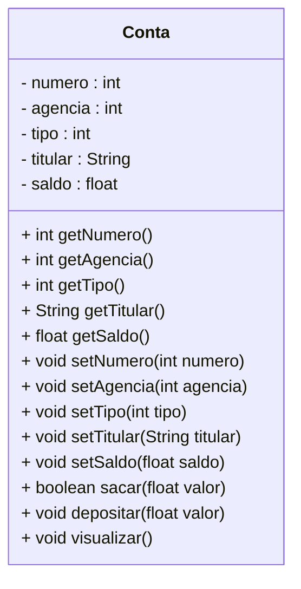

<h1>Programação Orientada a Objetos - Parte 01</h1>
<br />

<h2>Classes, Objetos e Encapsulamento</h2>


Em geral, quanto maior o software, mais complexo se torna o seu desenvolvimento, devido à quantidade de partes que o compõem e ao relacionamento entre essas partes.

Uma das principais razões para dificuldades na implementação, testes e manutenção de sistemas está na forma como eles são projetados. Quando se adota uma lógica de projeto focada exclusivamente nas funcionalidades, o sistema é estruturado com base apenas no que ele **faz**, e não **em como ou por que ele funciona daquela maneira no mundo real**. Nessa abordagem funcional, muitas vezes não há uma preocupação em representar os elementos do domínio de forma próxima à realidade, o que pode comprometer a flexibilidade e a evolução do sistema ao longo do tempo.

O problema é que, com o passar do tempo, os processos e procedimentos dentro das empresas mudam — e, inevitavelmente, o software precisa acompanhar essas mudanças. Se o sistema foi construído apenas com base em funcionalidades específicas (como *"emitir relatório"*, *"calcular imposto"*, *"gerar pedido"*), qualquer alteração nos processos pode exigir uma reestruturação significativa do código, ou até a sua reescrita completa. A menos, é claro, que se opte por remendos improvisados, conhecidos no jargão dos desenvolvedores como POG — “Programação Orientada a Gambiarras”.

Diante dessas dificuldades, alguns desenvolvedores passaram a refletir:

**"Se as funções de uma empresa e de um sistema mudam com frequência, então não posso usá-las como base estrutural para minha aplicação."**

Essa foi a **primeira grande conclusão**. Em seguida, surgiu a **pergunta fundamental**:

**"O que é que, em uma empresa e nos seus processos, raramente muda?"**

A resposta está nas **coisas** — nos **elementos** que fazem parte do domínio e que representam entidades tangíveis ou conceituais com estabilidade relativa. São os **objetos**: produtos, clientes, funcionários, departamentos, documentos, formulários, equipamentos, entre outros.

Esses elementos costumam permanecer constantes ao longo do tempo, mesmo quando os processos mudam. Com base nisso, surgiu uma nova abordagem:

**"Vamos estruturar o software com foco nos objetos envolvidos nos processos, e não apenas nos processos em si."**

A partir dessa abordagem conceitual, que prioriza a modelagem baseada nos elementos do mundo real, surgiu a **Programação Orientada a Objetos (POO)**.

<br />

<h2>1. Programação Orientada a Objetos (POO)</h2>


A **Programação Orientada a Objetos** (POO) é um paradigma de programação que propõe a modelagem de sistemas com base nos objetos do mundo real — sejam eles **concretos** (como uma *Pessoa*, *Carro*, *Produto*) ou **abstratos** (como *Contrato*, *Transação*, *Sessão*), favorecendo a modularização, o reuso e a manutenção do código.

A principal ideia é simular no ambiente computacional a forma como os objetos se comportam e interagem no mundo real:

- No mundo real, objetos interagem entre si para realizar tarefas.
- Em um sistema orientado a objetos, os programas são compostos por objetos que se comunicam através de mensagens (métodos), manipulando seus próprios dados (atributos) e executando comportamentos (ações).

> **Abstrato**, segundo o dicionário:
>
> *Algo que não é concreto; que resulta da abstração. Opera unicamente com ideias, com associações de ideias, não diretamente com a realidade sensível. Possui um alto grau de generalização.*

Com base na **teoria geral dos sistemas**, um sistema pode ser definido como **um conjunto de entidades que interagem entre si com o objetivo de produzir um resultado comum**. A POO parte exatamente dessa ideia: cada **objeto do sistema** representa uma entidade com responsabilidades bem definidas, contribuindo para o funcionamento global da aplicação.

<br />

<h2>2. Objetos</h2>


No mundo real, objetos podem ser **animados ou inanimados**, mas **todos eles possuem características que podem ser classificadas como atributos e comportamentos**. Esses elementos são fundamentais para representar objetos de forma estruturada em um sistema orientado a objetos.

Na imagem abaixo, temos alguns exemplos de objetos representados de maneira genérica:

<div align="center"></div>

Observe que os objetos apresentados — *Animal*, *Pessoa*, *Produto* e *Conta* — são definidos de forma abstrata, ou seja, **sem detalhamento específico**.

Vamos analisar o objeto **Conta**. Sabemos que se trata de uma **conta bancária**, porém, não foram informados detalhes como:

1. Qual é o número da conta?
2. Qual é o número da agência bancária?
3. Quem é o titular da conta?
4. Qual é o tipo da conta?
5. Qual é o saldo disponível?

Neste momento da modelagem orientada a objetos, o foco está na **identificação dos objetos genéricos**, ou seja, em uma **abstração inicial** do sistema. A ideia é representar **conceitos amplos** que servirão como base para a construção de entidades mais específicas posteriormente. A **generalização** facilita o entendimento e a estruturação do sistema, permitindo uma transição gradual do mundo real para o modelo computacional.

<br />

<h3>2.1. Vantagens da modelagem orientada a objetos</h3>


Modelar um sistema com base em objetos proporciona diversas vantagens:

- **Facilidade na concepção do sistema:** a transição do mundo real para o modelo orientado a objetos é mais natural e intuitiva.
- **Facilidade na compreensão do modelo:** por refletir a realidade, o modelo pode ser entendido facilmente por pessoas que conhecem o domínio do problema, mesmo que não dominem a tecnologia.
- **Facilidade no gerenciamento e manutenção:** objetos representam entidades relativamente estáveis ao longo do tempo. Em geral, **os objetos permanecem os mesmos**, e as mudanças ocorrem nas formas como eles interagem. Isso reduz o impacto das alterações no código.

<br />

<h3>2.2. O que são Objetos em Programação?</h3>


Em programação — e também no mundo real — um **objeto** é uma **entidade que possui identidade, estado e comportamento**.

- **Identidade:** é o nome ou a referência que identifica o objeto.
- **Estado:** é representado pelos **atributos** (também chamados de campos ou variáveis de instância).
- **Comportamento:** é representado pelos **métodos**, ou seja, as ações que o objeto pode executar.

Na linguagem Java, por exemplo, um objeto é uma instância de uma **classe**, que define sua estrutura (atributos) e seu comportamento (métodos). Além disso, **um atributo pode ser outro objeto**, o que permite composições mais complexas — isso é conhecido como **composição de objetos**, e é uma das bases do reuso e modularidade no paradigma orientado a objetos.

**Em resumo:**

> Um **objeto** é como uma **estrutura de dados evoluída**, que **combina dados (atributos) com comportamentos (métodos)** em uma única entidade.

Essa abordagem é o que torna a Programação Orientada a Objetos uma das mais utilizadas no desenvolvimento de sistemas modernos, sendo amplamente suportada por linguagens como Java, C++, C#, Python, entre outras.

<br />

<h2>3. Classes</h2>


No paradigma da Programação Orientada a Objetos (POO), **uma classe é uma estrutura que define um novo tipo de dado**, combinando atributos (dados) e métodos (comportamentos). A classe funciona como um **molde** ou **projeto** a partir do qual objetos podem ser criados.

Uma analogia comum e eficaz é comparar **a classe com a planta de uma casa**, e **o objeto com a casa construída a partir dessa planta**:

<div align="center"></div>

Perceba que a **classe é um conceito abstrato**, que se torna **concreto** com a criação de objetos. Esse processo de criação de um objeto a partir de uma classe é chamado de **instanciação**.

<div align="center"></div>

Na imagem acima, vemos que assim como uma planta pode ser usada para construir várias casas, uma classe pode ser usada para instanciar diversos objetos:

<br />

<h3>3.1.Estrutura de uma Classe</h3>


Toda classe é composta, essencialmente, por dois elementos principais:

- **Atributos** – responsáveis por representar as características do objeto.
- **Métodos** – responsáveis por representar os comportamentos (ações) que o objeto pode realizar ou sofrer.

Vamos observar um exemplo prático para ilustrar:

<div align="center"></div>

Neste exemplo, definimos a classe **Conta** com os **atributos**:

- `número`
- `agência`
- `titular`
- `tipo` 
- `saldo`. 

Com essas informações, conseguimos detalhar a conta e responder perguntas como:

- Qual é o número da conta?
- Qual é o tipo da conta?
- Quem é o titular?

Cada **classe representa um conceito** (como `Conta`, `Pessoa`, `Animal`, `Produto`), e **cada conceito é descrito por seus atributos** — que, em geral, são **substantivos**.

Já os **métodos** descrevem as **ações que um objeto pode executar ou sofrer** — como `sacar`, `depositar`, `transferir`, entre outros. Essas ações, por convenção, são representadas por **verbos**, como demonstrado a seguir:

<div align="center"></div>

Observe que todos os métodos definidos atuarão diretamente sobre o objeto `Conta`, ou seja, incidem sobre os dados e comportamentos da instância criada a partir da classe.

<br />

<h3>3.2.Objetos e Instâncias</h3>


Na computação, um **sistema orientado a objetos** é formado por **objetos que interagem entre si** por meio da **troca de mensagens**, ou seja, chamadas de métodos. Esses objetos são **instâncias de classes**, e compartilham uma estrutura comum, mas possuem dados próprios.

- A **classe** é uma **definição estática**, um modelo.
- O **objeto** é uma **entidade dinâmica**, criada a partir da classe.
- Todos os objetos são **instâncias de uma classe**, ou seja, são a concretização de um conceito.

**Exemplo Prático:** 

<div align="center"></div>

Neste exemplo:

- `Conta` é a **classe** que define um modelo genérico de conta bancária.
- `Objeto01` e o `Objeto 02` são **instâncias da classe Conta**, ou seja, **objetos concretos criados a partir desse modelo**.

Cada objeto possui seus próprios valores para os atributos definidos na classe `Conta`, mas compartilham os mesmos métodos e estrutura básica.

<br />

<h3>3.3. Representação Gráfica</h3>


Na Programação Orientada a Objetos, a representação gráfica de uma **classe** é feita por meio do **Diagrama de Classes**, um dos diagramas mais importantes da **UML (Unified Modeling Language)** — a Linguagem de Modelagem Unificada. A UML é um padrão amplamente adotado para a **visualização, especificação, construção e documentação de sistemas orientados a objetos**.

Os **Diagramas de Classe** são fundamentais na modelagem de sistemas orientados a objetos, pois:

- **Facilitam a comunicação** entre analistas, desenvolvedores e demais stakeholders, promovendo um entendimento comum da estrutura e do funcionamento do sistema.
- **Apoiam a documentação técnica**, servindo como uma representação visual clara e organizada das classes, atributos, métodos e seus relacionamentos.
- **Servem como referência para a implementação**, especialmente em linguagens orientadas a objetos como Java, C#, Python, entre outras.
- **Tornam explícita a estrutura do sistema**, refletindo os princípios da Programação Orientada a Objetos e permitindo a análise de dependências, hierarquias e responsabilidades entre os componentes.

Na imagem abaixo, temos o Diagrama de Classes da classe `Conta`:



O **Diagrama de Classes** é organizado em três seções principais:

<div align="center"></div>

<br />

### ✅ Estrutura do Diagrama de Classes

1. **Nome da Classe**
   - Localizado na parte superior. 
   - Geralmente é escrito com a primeira letra maiúscula, seguindo a convenção da linguagem Java.
   - **Exemplo:** `Gato`

2. **Atributos (ou Propriedades)**
   - Representam os **dados** ou características da classe.
   - São escritos com o seguinte padrão:
     `visibilidade nome : tipo`
   - **Exemplo:** `- idade : int`

3. **Métodos (ou Operações)**

   - Representam os **comportamentos** ou ações que a classe pode executar.
   - Seguem o padrão: `visibilidade nome(parâmetros) : tipoRetorno`
   - Exemplo: `+ comer(quantidade: float) : void`

<br />

### ✅ Convenções de Visibilidade

Os símbolos antes dos atributos e métodos indicam a **visibilidade** (ou modificador de acesso):

| Símbolo | Visibilidade                            | Acesso permitido por                |
| ------- | --------------------------------------- | ----------------------------------- |
| `+`     | **Pública**                             | Qualquer classe                     |
| `-`     | **Privada**                             | Apenas a própria classe             |
| `#`     | **Protegida**                           | A própria classe e suas subclasses  |
| `~`     | **Friendly** (*padrão/package-private*) | Qualquer classe do **mesmo pacote** |

<br />

<h2>4. Modificadores</h2>


Os modificadores merecem um tópico à parte.

Em Java, os **modificadores** são palavras-chave utilizadas para definir a **visibilidade**, o **nível de acesso** e algumas **características especiais** de uma classe, método ou atributo.

Eles são fundamentais para o controle da estrutura e do encapsulamento no código, permitindo estabelecer **quem pode acessar** ou **modificar** determinados membros da aplicação.

<br />

<h3>4.1. Modificadores de Visibilidade</h3>


Os **Modificadores de Visibilidade**, também chamados de **Modificadores de Acesso**, determinam como uma **classe**, **atributo** ou **método** poderá ser acessado ao longo do desenvolvimento do sistema. Em outras palavras, eles definem **quem pode acessar o quê** dentro do código.

Um conceito essencial para entender visibilidade em Java é o de **pacotes** (`package`), visto no tópico <a href="13.md">**Métodos**</a>. Caso você tenha alguma dúvida, acesse o conteúdo.

<br />

<h4>4.1.1. Modificadores de Acesso - Classes</h4>


As classes podem utilizar apenas dois modificadores de acesso:

### ✅ Modificadores de Acesso - Classes

| **Modificador**              | **Descrição**                                                |
| ---------------------------- | ------------------------------------------------------------ |
| **padrão** (sem modificador) | Também chamado de *friendly*. A classe poderá ser acessada apenas por outras classes **dentro do mesmo pacote**. |
| **public**                   | A classe poderá ser acessada por qualquer outra classe, independentemente do pacote em que estiver. |

<br />

> [!NOTE]
>
> **ALERTA DE BSM** 
>
> *Mantenha a Atenção aos Detalhes!* 
>
> Ao definir o modificador de uma classe: `padrão` e `public`, lembre-se que eles são mutuamente exclusivos, ou seja, **não podem ser combinados.**

<br />

<h4>4.1.2. Modificadores de Acesso - Métodos e Atributos</h4>


Métodos e atributos podem utilizar quatro modificadores de acesso distintos:

### ✅ Modificadores de Acesso - Métodos e Atributos

| **Modificador**              | **Descrição**                                                | UML  |
| ---------------------------- | ------------------------------------------------------------ | ---- |
| **padrão** (sem modificador) | O acesso é permitido apenas por classes **dentro do mesmo pacote**. | ~    |
| **public**                   | O acesso é permitido por **qualquer classe**, em qualquer pacote. O método só pode ser acessado se a classe também for pública. | +    |
| **protected**                | Permite acesso às classes **do mesmo pacote** e também a qualquer **subclasse**, mesmo que esteja em outro pacote. | #    |
| **private**                  | O acesso é restrito **apenas à própria classe** onde foi declarado. | -    |

<br />

> [!NOTE]
>
> **ALERTA DE BSM** 
>
> *Mantenha a Atenção aos Detalhes!* 
>
> Ao definir o modificador de uma classe: `padrão`, `public`, `private` e `protected`, lembre-se que eles são mutuamente exclusivos, ou seja, **não podem ser combinados.**

<br />

> [!TIP]
>
> Na modelagem de classes, é comum adotar a prática de manter **atributos como `private`** e **métodos como `public`**, promovendo o **encapsulamento**, que será explorado no próximo tópico.

<br />

A imagem abaixo ilustra a hierarquia dos modificadores de acesso, do mais restrito ao mais permissivo:

<div align="center"></div>

A imagem acima mostra o nível de visibilidade dos Atributos e Métodos, do nível de acesso mais restrito (Private) ao nível de acesso total e irrestrito (Public). Na tabela abaixo temos um resumo:

### ✅ Modificadores de Acesso - Hierarquia

| Modificador   | Classe | Pacote | Sub Classe | Mundo |
| ------------- | :----: | :----: | :--------: | :---: |
| **public**    |   ✔    |   ✔    |     ✔      |   ✔   |
| **protected** |   ✔    |   ✔    |     ✔      |   ❌   |
| **padrão**    |   ✔    |   ✔    |     ❌      |   ❌   |
| **private**   |   ✔    |   ❌    |     ❌      |   ❌   |

<br />

> [!IMPORTANT]
>
> Os modificadores de acesso aplicados a um atributo ou método determinam quais classes podem interagir com esses elementos, respeitando o nível de visibilidade definido. 

<br />

<div align="left"> <a href="https://docs.oracle.com/javase/tutorial/java/javaOO/accesscontrol.html" target="_blank"><b>Documentação: Modificadores de acesso</b></a></div>

<br />

<h3>4.2. Modificadores Non-Access</h3>


Os **Modificadores Non-Access** definem **comportamentos específicos** de uma classe, método ou atributo, como possibilidade de herança, sobrescrita, imutabilidade, entre outros.

<br />

<h4>4.2.1. Modificadores Non-Access - Classes</h4>


As classes podem utilizar os seguintes modificadores Non-Access:

### ✅ Modificadores Non-Access - Classes

| **Modificador** | **Descrição**                                                |
| --------------- | ------------------------------------------------------------ |
| **abstract**    | Indica que a classe **não pode ser instanciada diretamente**. Deve ser obrigatoriamente herdada por outra classe. |
| **final**       | Impede que a classe seja herdada. Nenhuma outra classe poderá herdá-la. |

<br />

> [!NOTE]
>
> **ALERTA DE BSM** 
>
> *Mantenha a Atenção aos Detalhes!* 
>
> Uma classe não pode ser ao mesmo tempo `abstract` e `final`, pois **uma impede herança e a outra exige herança**.

<br />

<h4>4.2.2. Modificadores Non-Access - Métodos</h4>


Métodos podem utilizar os seguintes modificadores non-access:

### ✅ Modificadores Non-Access - Métodos

| **Modificador** | **Descrição**                                                |
| --------------- | ------------------------------------------------------------ |
| **abstract**    | Define a **assinatura do método sem implementação**. A implementação é obrigatória na primeira subclasse concreta. A classe que o contém também deve ser `abstract`. |
| **final**       | Impede que o método seja sobrescrito por subclasses.         |
| **static**      | O método **pertence à classe**, e não a uma instância. Pode ser chamado diretamente pela classe, sem necessidade de criar um objeto. |

<br />

 **Regras importantes:**

- Um método `static` não pode acessar diretamente atributos ou métodos de uma  instância.
- Um método **nunca pode ser** `abstract` e `final` ao mesmo tempo.
- Um método **nunca pode ser** `abstract` e `private`.
- Um método `final` **não pode ser sobrescrito**.
- Um método `abstract` **não possui corpo**, apenas a assinatura.

<br />

<h4>4.2.3. Modificadores Non-Access - Atributos</h4>


Atributos também podem utilizar modificadores non-access, como:

### ✅ Modificadores Non-Access - Atributos

| **Modificador** | **Descrição**                                                |
| --------------- | ------------------------------------------------------------ |
| **final**       | Torna o atributo **constante**: seu valor **não pode ser alterado** após a inicialização. |
| **static**      | Define que o atributo **pertence à classe**, e não às instâncias. É compartilhado entre todos os objetos. |

<br />

> [!IMPORTANT]
>
> Um atributo `final static` é uma **constante global**, geralmente declarada com letras maiúsculas: `public static final double PI = 3.14;`

<br />

<div align="left"> <a href="https://www.w3schools.com/java/java_modifiers.asp" target="_blank"><b>Documentação: Modificadores Non-Access</b></a></div>
<br />

##  Exemplo 01: Classe Conta

<br />

> [!WARNING]
>
> A partir deste ponto, estamos partindo do princípio de que o projeto **Conta Bancária** já foi devidamente criado e que a **Classe Menu** foi implementada conforme os conteúdos:
>
>  - <a href="pr01.md">Projeto Conta Bancária - Classe Menu</a>
>  - <a href="pr02.md">Projeto Conta Bancária - Classe Menu - Colorido</a>
>
>  Caso ainda não tenha concluído essas etapas, recomendamos que você retorne aos tópicos indicados antes de prosseguir.

<br />

A seguir, iniciaremos a construção da **Classe `Conta`**, que faz parte do projeto **Conta Bancária**. Essa classe será desenvolvida **passo a passo**, com o objetivo de facilitar o entendimento de cada componente que a compõe — desde os atributos e construtores até os métodos responsáveis pelas operações bancárias.

Durante a implementação, serão explicados os conceitos envolvidos, como encapsulamento, visibilidade, assinatura de métodos e boas práticas de organização do código em Java.

Esse processo guiado permitirá compreender, de forma prática e progressiva, como estruturar uma classe orientada a objetos no contexto de um sistema bancário.

<br />

<h2>👣 Passo 01 - Classe Conta - Criar os atributos</h2>


**Código Java**

```java
public class Conta {

    /*Atributos da Classe Conta*/
	private int numero;
	private int agencia;
	private int tipo;
	private String titular;
	private float saldo;
  
}
```

<br />

<div align="left"> <a href="https://docs.oracle.com/javase/tutorial/java/javaOO/classdecl.html" target="_blank"><b>Documentação: Declaração de Classes</b></a></div>

<div align="left"> <a href="https://docs.oracle.com/javase/tutorial/java/javaOO/variables.html" target="_blank"><b>Documentação: Declaração de Atributos</b></a></div>

<br />

<h2>5. Métodos Especiais</h2>


Ao desenvolver nossas **classes como modelos para criação de objetos**, é essencial implementar alguns **métodos especiais** que definem o comportamento padrão desses objetos. Um dos principais é o **método construtor**, responsável pela inicialização correta de cada instância da classe.

<br />

<h3>5.1. Método Construtor</h3>


Para criar (ou instanciar) um novo objeto a partir de uma classe, utilizamos o **método construtor** — um método especial projetado exclusivamente para essa finalidade.

As principais características de um método construtor são:

- Define as ações executadas durante a **inicialização de um objeto**.
- É **invocado automaticamente** sempre que um novo objeto da classe é criado.
- **Não possui tipo de retorno**, nem mesmo `void`, o que o diferencia de outros métodos.
- O **nome do construtor deve ser exatamente igual ao nome da classe**.
- Pode **receber parâmetros**, geralmente com os mesmos nomes dos atributos da classe, para facilitar a atribuição inicial dos valores.
- Toda **classe deve ter pelo menos um construtor**. Se nenhum for declarado, o compilador Java cria automaticamente um **construtor padrão** (default), sem parâmetros, que inicializa os atributos com valores padrão (`0` para números, `false` para booleanos e `null` para referências).
- Se a pessoa desenvolvedora **definir manualmente qualquer construtor**, o construtor padrão **não será gerado automaticamente**. Caso seja necessário, deverá ser criado explicitamente.
- É possível definir **vários construtores** para a mesma classe utilizando o conceito de **sobrecarga de métodos** (que será abordado mais adiante). Essa prática permite criar objetos de maneiras diferentes, dependendo da necessidade do sistema.

<br />

<h2>👣 Passo 02 - Classe Conta - Criar o Método Construtor</h2>


**Código Java**

```java
public class Conta {

     /*Atributos da Classe Conta*/
	private int numero;
	private int agencia;
	private int tipo;
	private String titular;
	private float saldo;
  
    /*Método Construtor da Classe Conta - com todos os parâmetros*/
	public Conta(int numero, int agencia, int tipo, String titular, float saldo) {
		this.numero = numero;
		this.agencia = agencia;
		this.tipo = tipo;
		this.titular = titular;
		this.saldo = saldo;
	}
    
}	
```

Observe que o **Método Construtor** foi declarado como `public` para permitir que outras classes do sistema tenham acesso a ele e possam **instanciar novos objetos da classe `Conta`**. Essa visibilidade é fundamental, pois garante que a classe esteja disponível para ser utilizada externamente no contexto da aplicação.

Além disso, note que foi utilizada a palavra-chave **`this`** em cada atribuição de atributo. Isso ocorre porque, quando os **nomes dos parâmetros do construtor** são **iguais aos nomes dos atributos da classe**, é necessário usar `this` para **diferenciar o atributo da variável local (parâmetro)**.

Em outras palavras, `this.nome` faz referência ao atributo da classe, enquanto `nome` sozinho se refere ao parâmetro recebido. Esse recurso é essencial para evitar ambiguidades e garantir que os valores passados no momento da criação do objeto sejam corretamente atribuídos aos atributos da instância.

<br />

<div align="left"> <a href="https://docs.oracle.com/javase/tutorial/java/javaOO/constructors.html" target="_blank"><b>Documentação: Método Construtor</b></a></div>

<div align="left"> <a href="https://docs.oracle.com/javase/tutorial/java/javaOO/thiskey.html" target="_blank"><b>Documentação: Palavra reservada this</b></a></div>


<br />

<h3>5.2. Métodos Get e Set</h3>


Os métodos *get* e *set* são técnicas padronizadas para o gerenciamento de acesso aos atributos de uma classe. Através desses métodos, é possível controlar quando e como os atributos podem ser consultados ou modificados. Esse controle torna o código mais seguro, limpo e de fácil manutenção, uma vez que evita a exposição direta dos atributos.

A utilização desses métodos é especialmente importante quando os atributos da classe são declarados como **privados** (`private`), o que significa que só podem ser acessados diretamente de dentro da própria classe. Para manipulá-los externamente, devemos utilizar os métodos públicos `get` e `set`.

<br />

<h4>5.2.1. Métodos SET</h4>


Os métodos *set* são utilizados para **modificar o valor dos atributos** da classe. Também conhecidos como *setters*, seguem a convenção de nomenclatura `setNomeDoAtributo`.

Por exemplo, se o atributo se chama `numero`, o método que altera seu valor deve se chamar `setNumero(int numero)`. O valor desejado é passado como **parâmetro**, e a atribuição é feita dentro do corpo do método.

É importante destacar que, nesses métodos, é **recomendável aplicar validações** nos dados recebidos antes de atribuí-los ao atributo. Dessa forma, evitamos o armazenamento de dados incorretos ou inconsistentes.

**Exemplo: Método `setNumero` da classe `Conta`:**

```java
	public void setNumero(int numero) {
		this.numero = numero;
	}
```

Observe o uso da palavra-chave **`this`**. Ela é necessária para indicar que estamos nos referindo ao atributo da classe, já que o nome da variável passada como parâmetro é o mesmo (`numero`).

Cada atributo da classe pode (e deve) possuir seu próprio método `set`, sempre respeitando a convenção de nomenclatura.

<br />

<h4>5.2.2. Métodos GET</h4>


Os métodos *get* são utilizados para **consultar ou retornar o valor atual de um atributo**. Também chamados de *getters*, seguem a convenção `getNomeDoAtributo`.

Se o atributo for `numero`, o nome do método será `getNumero()`. Diferente dos *setters*, os *getters* **não recebem parâmetros** e simplesmente retornam o valor armazenado no atributo.

Esses métodos também são conhecidos como **métodos de acesso** ou **métodos de consulta**, pois oferecem uma forma segura de obter informações dos objetos.

**Exemplo: Método `getNumero` da classe `Conta`:**

```java
	public int getNumero() {
		return numero;
	}
```

Perceba que o método apenas retorna o valor do atributo. Quando necessário, também é possível incluir regras de negócio ou formatação dentro do método `get`.

Embora os métodos `get` e `set` permitam acessar atributos privados, esse acesso continua **restrito** à lógica definida pelo programador, o que garante maior segurança e encapsulamento.

<br />

<h4>5.2.3. Vantagens de utilizar os Métodos getters e setters</h4>


1. Permitem **controlar o acesso** aos atributos da classe, seguindo os princípios do encapsulamento.
2. É possível **restringir a leitura ou modificação** de atributos, simplesmente omitindo o `get` ou o `set` correspondente.
3. Os `setters` possibilitam **validar os dados antes de armazená-los**, garantindo integridade dos objetos.
4. Os `getters` permitem **ocultar o tipo ou o formato interno** de um atributo, oferecendo uma interface mais flexível ao usuário da classe.
5. Facilitam futuras **alterações internas**, sem impactar diretamente as demais classes que utilizam os objetos.

<br />

<h2>👣 Passo 03 - Classe Conta - Criar os Métodos Get e Set</h2>


**Código Java**

```java
public class Conta {

     /*Atributos da Classe Conta*/
	private int numero;
	private int agencia;
	private int tipo;
	private String titular;
	private float saldo;
  
    /*Método Construtor da Classe Conta - com todos os parâmetros*/
	public Conta(int numero, int agencia, int tipo, String titular, float saldo) {
		this.numero = numero;
		this.agencia = agencia;
		this.tipo = tipo;
		this.titular = titular;
		this.saldo = saldo;
	}
    
    /*Métodos Get e Set da Classe Conta*/
    public int getNumero() {
		return numero;
	}

	public void setNumero(int numero) {
		this.numero = numero;
	}

	public int getAgencia() {
		return agencia;
	}

	public void setAgencia(int agencia) {
		this.agencia = agencia;
	}

	public int getTipo() {
		return tipo;
	}

	public void setTipo(int tipo) {
		this.tipo = tipo;
	}

	public String getTitular() {
		return titular;
	}

	public void setTitular(String titular) {
		this.titular = titular;
	}

	public float getSaldo() {
		return saldo;
	}

	public void setSaldo(float saldo) {
		this.saldo = saldo;
	}
    
}	
```

Os métodos *get* e *set* são fundamentais para acessar e modificar os atributos da classe `Conta`. Esses métodos seguem o princípio do encapsulamento da programação orientada a objetos, permitindo que os dados sejam acessados ou alterados de forma controlada, sem expor diretamente os atributos da classe. 

Os métodos *get* retornam os valores atuais dos atributos, enquanto os métodos *set* permitem atribuir novos valores aos atributos, garantindo assim maior segurança e flexibilidade no gerenciamento das informações da conta.

**É importante destacar que, caso um atributo não possua seus respectivos métodos *get* ou *set*, a leitura ou a alteração desse valor não será possível fora da própria classe**. Isso pode limitar funcionalidades importantes, como a visualização do titular ou a atualização do saldo. Por isso, é essencial garantir que todos os atributos relevantes estejam acompanhados de seus métodos de acesso e modificação, conforme a necessidade do projeto.

<br />

<div align="left"> <a href="https://www.w3schools.com/java/java_encapsulation.asp" target="_blank"><b>Documentação: Métodos GET e SET</b></a></div>

<br />

### 5.3. Métodos Auxiliares


Além dos métodos construtores, getters e setters, uma classe pode conter **métodos auxiliares**, que representam **ações específicas que os objetos daquela classe podem executar**. No caso da Classe `Conta`, vamos implementar os métodos `sacar()`, `depositar()` e `visualizar()`.

Esses métodos são fundamentais para simular operações comuns em contas bancárias:

- O **método `sacar()`** permite realizar uma retirada de valor da conta, desde que haja saldo suficiente.
- O **método `depositar()`** possibilita adicionar valores ao saldo da conta.
- E o **método `visualizar()`** exibe as informações detalhadas da conta, como número, agência, tipo, titular e saldo.

Essas funcionalidades aumentam a **interatividade com os objetos da classe** e tornam a aplicação mais dinâmica, permitindo que o usuário manipule os dados de forma prática e segura.

<br />

<h2>👣 Passo 04 - Classe Conta - Criar os Métodos Auxiliares</h2>


**Código Java**

```java
public class Conta {

     /*Atributos da Classe Conta*/
	private int numero;
	private int agencia;
	private int tipo;
	private String titular;
	private float saldo;
  
    /*Método Construtor da Classe Conta - com todos os parâmetros*/
	public Conta(int numero, int agencia, int tipo, String titular, float saldo) {
		this.numero = numero;
		this.agencia = agencia;
		this.tipo = tipo;
		this.titular = titular;
		this.saldo = saldo;
	}
    
    /*Métodos Get e Set da Classe Conta*/
    public int getNumero() {
		return numero;
	}

	public void setNumero(int numero) {
		this.numero = numero;
	}

	public int getAgencia() {
		return agencia;
	}

	public void setAgencia(int agencia) {
		this.agencia = agencia;
	}

	public int getTipo() {
		return tipo;
	}

	public void setTipo(int tipo) {
		this.tipo = tipo;
	}

	public String getTitular() {
		return titular;
	}

	public void setTitular(String titular) {
		this.titular = titular;
	}

	public float getSaldo() {
		return saldo;
	}

	public void setSaldo(float saldo) {
		this.saldo = saldo;
	}
    
    // Métodos Auxiliares
   public boolean sacar(float valor) {

		if (this.saldo < valor) {
			System.out.println("\n Saldo Insuficiente!");
			return false;
		}

		this.saldo = this.saldo - valor;
		return true;
	}

	public void depositar(float valor) {

		this.saldo = this.saldo + valor;

	}
	
	public void visualizar() {

		String tipo = "";
		
		switch(this.tipo) {
		case 1:
			tipo = "Conta Corrente";
		break;
		case 2:
			tipo = "Conta Poupança";
		break;
		}
		
		System.out.println("\n\n***********************************************************");
		System.out.println("Dados da Conta:");
		System.out.println("***********************************************************");
		System.out.println("Numero da Conta: " + this.numero);
		System.out.println("Agência: " + this.agencia);
		System.out.println("Tipo da Conta: " + tipo);
		System.out.println("Titular: " + this.titular);
		System.out.println("Saldo: " + this.saldo);

	}
    
    
}	
```

O método `sacar(float valor)` realiza uma verificação para garantir que o valor solicitado não seja maior que o saldo disponível. Caso o saldo seja insuficiente, uma mensagem de alerta é exibida, e o método retorna `false`. Se o saque for possível, o valor é subtraído do saldo e o método retorna `true`.

O método `depositar(float valor)` é mais direto: ele simplesmente adiciona o valor informado ao saldo atual da conta. Essa operação não exige validações adicionais, já que não há restrições para depósitos positivos. Ambos os métodos utilizam o `setSaldo()` e o `getSaldo()` para manter o encapsulamento dos atributos, respeitando as boas práticas da programação orientada a objetos.

Por fim, o método `visualizar()` tem a função de exibir os principais dados da conta. Ele identifica o tipo da conta com base em seu valor numérico (1 para Conta Corrente e 2 para Conta Poupança) e imprime as informações formatadas no console, incluindo número da conta, agência, tipo, titular e saldo. Esse método é útil para facilitar a conferência dos dados durante a execução do programa.

<br />

## 6. Encapsulamento


O **Encapsulamento** é um dos pilares da Programação Orientada a Objetos e consiste em **proteger os atributos de uma classe contra acessos diretos e não controlados**, restringindo sua manipulação apenas por meio de **métodos específicos**.

Essa abordagem garante que os dados internos de um objeto sejam acessados e modificados de maneira **segura, controlada e coerente**, evitando comportamentos inesperados ou inconsistências.

Na prática, o encapsulamento é implementado através da combinação de:

- **Atributos privados** (`private`), que não podem ser acessados diretamente por outras classes.
- **Métodos públicos** (`public`), chamados de **getters** e **setters**, que controlam o acesso e a modificação dos atributos.

<br />

<h3>6.1. Por que encapsular?</h3>


O encapsulamento tem como principal objetivo **evitar que atributos sejam alterados de forma indevida ou acidental**, protegendo a integridade dos dados da aplicação. Ao centralizar o acesso e a alteração por meio de métodos, é possível validar, restringir ou até mesmo bloquear certas operações.

Por exemplo, na classe `Conta`, não é permitido alterar diretamente (atribuição) o valor do atributo `saldo`. Em vez disso, criamos métodos auxiliares como `sacar()` e `depositar()`, que garantem que a operação só seja executada se atender a critérios definidos (como não sacar um valor maior que o saldo disponível).

Além disso, os métodos `get` e `set` permitem:

- Restringir a leitura ou escrita de determinados dados.
- Validar as informações antes de armazená-las.
- Manter a consistência do estado interno do objeto.

> **Importante:** Mesmo que os métodos `get` e `set` ofereçam acesso aos atributos privados, o controle está centralizado neles. Cabe ao programador decidir como e quando os dados podem ser lidos ou modificados.

<br />

<h3>6.2. Métodos Auxiliares e o Encapsulamento</h3>


Na classe `Conta`, além dos métodos `get` e `set`, criamos métodos auxiliares que operam sobre os dados encapsulados:

- **`sacar()`**: verifica o saldo e realiza a retirada de valor.
- **`depositar()`**: adiciona um valor ao saldo da conta.
- **`visualizar()`**: exibe as informações da conta de forma estruturada.

Esses métodos **interagem com os atributos de forma controlada**, reforçando a aplicação do encapsulamento. Assim, qualquer lógica relacionada à manipulação do saldo, por exemplo, está concentrada dentro da própria classe.

<br />

<h3>6.3. Vantagens do Encapsulamento</h3>


O uso do encapsulamento traz diversas vantagens no desenvolvimento orientado a objetos:

- **Segurança e proteção dos dados**: impede modificações diretas e indesejadas nos atributos.
- **Validação centralizada**: permite aplicar regras de negócio no momento da leitura ou alteração dos dados.
- **Facilidade de manutenção**: alterações na lógica interna da classe não afetam diretamente as outras partes do sistema.
- **Reutilização e modularidade**: classes encapsuladas são mais organizadas, coesas e reutilizáveis.
- **Desenvolvimento mais ágil e confiável**: como os dados são acessados via métodos, o desenvolvedor não precisa conhecer a implementação interna da classe.

<br />

> ⚠️ **Ponto de Atenção: Encapsulamento vs Segurança da Informação**
>
> Embora compartilhem objetivos semelhantes, é importante **não confundir encapsulamento com segurança da informação**:
>
> - **Encapsulamento** é um conceito de design de software, focado na **proteção lógica dos dados dentro do código**.
> - **Segurança da informação** abrange práticas e tecnologias mais amplas, como **criptografia, autenticação, controle de acesso, backups, monitoramento e auditoria**, em nível de sistema, rede e infraestrutura.
>
> Em resumo: **encapsular protege o código; segurança da informação protege os dados como um todo**.

<br />

<h2>7. Instanciando um Objeto</h2>


Para que possamos utilizar a Classe `Conta` e acessar seus atributos e métodos, precisamos **instanciar objetos** a partir dela. Para isso, utilizaremos a classe `Menu`, que será responsável por executar a aplicação e interagir com o usuário.

Dentro da classe `Menu`, implementamos o **método `main()`**, ponto de entrada de qualquer aplicação Java. É a partir dele que o programa será iniciado e os objetos da classe `Conta` serão criados e manipulados.

<br />

<h2>👣 Passo 05 - Classe Menu - Instanciar Objetos da Classe Conta</h2>


**Código Java**

```java
package conta;

import java.util.Scanner;
import conta.model.Conta;
import conta.util.Cores;

public class Menu {

	public static void main(String[] args) {
		
		// Teste da Classe Conta
		
         // Instanciar um novo objeto da classe Conta
         Conta c1 = new Conta(1, 123, 1, "Adriana Sanches", 10000.0f);
		
         // Visualizar os dados
         c1.visualizar();
         
         // Alterar o Saldo e o nome do Titular
         c1.setSaldo(15000.0f);
		c1.setTitular("Maria Joaquina");
		c1.visualizar();
		
         // Sacar
         c1.sacar(12000.0f);
		c1.visualizar();
		
         // Depositar
         c1.depositar(5000.0f);
		c1.visualizar();

		// Código da Classe Menu...
    }
}
```

**Resultado do Código:**

```bash

***********************************************************
Dados da Conta:
***********************************************************
Numero da Conta: 1
Agência: 123
Tipo da Conta: Conta Corrente
Titular: Adriana Sanches
Saldo: 10000.0


***********************************************************
Dados da Conta:
***********************************************************
Numero da Conta: 1
Agência: 123
Tipo da Conta: Conta Corrente
Titular: Maria Joaquina
Saldo: 15000.0


***********************************************************
Dados da Conta:
***********************************************************
Numero da Conta: 1
Agência: 123
Tipo da Conta: Conta Corrente
Titular: Maria Joaquina
Saldo: 3000.0


***********************************************************
Dados da Conta:
***********************************************************
Numero da Conta: 1
Agência: 123
Tipo da Conta: Conta Corrente
Titular: Maria Joaquina
Saldo: 8000.0
```

Neste último passo, criamos e testamos um objeto da classe `Conta`, identificado como `c1`. 

Para instanciá-lo, utilizamos o **método construtor** da classe `Conta`, com a palavra reservada `new`, que aloca dinamicamente o objeto na memória. Todos os atributos necessários (número, agência, tipo, titular e saldo) foram passados como argumentos na criação do objeto.

A partir do objeto instanciado, podemos acessar os métodos da classe por meio da sintaxe **objeto.método()**. 

Por exemplo, ao chamar `c1.visualizar()`, exibimos todos os dados da conta no console. 

Já os métodos `setSaldo()` e `setTitular()` permitem alterar dinamicamente os dados do objeto. 

Métodos como `sacar()` e `depositar()` também podem ser chamados para modificar o saldo da conta de forma segura e controlada.

Esse exemplo prático demonstra como é possível manipular os dados de um objeto a partir de seus métodos públicos, reforçando o conceito de encapsulamento na Programação Orientada a Objetos.

<br />

<div align="left"> <a href="https://docs.oracle.com/javase/tutorial/java/javaOO/objectcreation.html" target="_blank"><b>Documentação: Instanciando Objetos</b></a></div>

<div align="left"> <a href="https://www.w3schools.com/java/ref_keyword_new.asp" target="_blank"><b>Documentação: Palavra reservada new</b></a></div>

<div align="left"> <a href="https://docs.oracle.com/javase/tutorial/java/javaOO/usingobject.html" target="_blank"><b>Documentação: Usando Objetos</b></a></div>

<br />

<h2>8. Record</h2>


Os **Records** foram introduzidos no Java 14 e se tornaram um recurso definitivo a partir do Java 16. Eles representam um tipo especial de **classe imutável**, projetada para armazenar dados de forma simples e sem a necessidade de muito código repetitivo (*boilerplate*).

Assim como classes tradicionais, que acabamos de estudar, os **records** são usados para criar **objetos**, mas com características próprias que os diferenciam:

- Estrutura fixa e imutável.
- Construtor gerado automaticamente.
- Foco em representar **dados**, não comportamentos complexos.

> Enquanto as **classes tradicionais** podem ser projetadas para múltiplos comportamentos e estados mutáveis, os **records** priorizam a simplicidade e a imutabilidade.

<br />

<h3>8.1. O que é um Record?</h3>


Um **record** em Java:

- É uma forma especial de declarar uma classe **imutável**.
- Todos os campos definidos no cabeçalho são **final** e obrigatoriamente inicializados no momento da criação.
- Pode implementar interfaces.
- Não pode estender outras classes.
- Pode conter métodos e construtores adicionais, mas não pode ter campos fora do cabeçalho principal.

**Sintaxe:**

```java
public record NomeDoRecord(TipoCampo1 campo1, TipoCampo2 campo2) {}
```

<br />

<h3>8.2. Por que utilizar Records?</h3>


Os **records** são úteis quando precisamos criar classes para **armazenar dados simples** de forma rápida, evitando a repetição de código que normalmente escreveríamos em classes tradicionais, como:

- Atributos privados.
- Construtor que inicializa todos os atributos.
- Métodos `getters`.

### Principais vantagens:

- **Menos código:** o compilador gera automaticamente métodos essenciais.
- **Imutabilidade:** os dados não podem ser alterados após a criação.
- **Leitura fácil:** a definição é clara e concisa.
- **Perfeito para DTOs (Data Transfer Objects)** e respostas de API.

<br />

**Exemplo - Record**

<br />

> [!WARNING]
>
> **ATENÇÃO!**
>
> Este exemplo é **apenas ilustrativo**. **Não inclua estes códigos em nenhuma classe ou arquivo** do Projeto Conta Bancária. O código abaixo serve apenas para fins de estudo e compreensão dos conceitos apresentados.

<br />

**Classe Pessoa**

```java
public record Pessoa(String nome, int idade) { }
```

**Classe TestaPessoa**

```java
public class TestaPessoa {
    public static void main(String[] args) {
        
        Pessoa p1 = new Pessoa("Renata Lima", 25);

        System.out.printf("Nome: %s%n", p1.nome());
        System.out.printf("Idade: %d%n", p1.idade()); 
        System.out.println(p1);

    }
}
```

**Resultado do Código:**

```bash
Nome: Renata Lima
Idade: 25
Pessoa[nome=Renata Lima, idade=25]
```

No exemplo acima o compilador criou o construtor e os métodos `nome()` e `idade()` (equivalentes a getters).

<br />

------

## 🔑**Pontos chave:**

1. A **Programação Orientada a Objetos (POO)** é um paradigma que propõe modelar sistemas com base em entidades do mundo real, chamadas **objetos**, que possuem **atributos** (estado) e **métodos** (comportamento).
2. O paradigma orientado a objetos **favorece a modularização, o reuso e a manutenção do código**, pois permite representar de forma mais próxima a realidade os elementos envolvidos no domínio do sistema.
3. A **modelagem orientada a objetos** proporciona uma compreensão mais intuitiva do sistema, facilitando a comunicação entre equipe técnica e especialistas do domínio.
4. Um **objeto** é qualquer entidade com **identidade, estado e comportamento**. Ele é uma instância de uma **classe**, que funciona como molde para sua criação.
5. As **classes** definem a estrutura dos objetos e são compostas por **atributos** (dados) e **métodos** (ações). A criação de um objeto a partir de uma classe é chamada de **instanciação**.
6. Objetos são **instanciados** a partir das classes. Eles têm valores atribuídos a seus atributos e executam ações (ou as ações são executadas neles) por meio de métodos.
7. Os **modificadores de acesso** definem a visibilidade dos elementos da aplicação (classes, atributos e métodos), sendo os principais: `public`, `private`, `protected` e `padrão` (sem modificador).
8. Os **modificadores non-access** definem comportamentos adicionais, como herança (`abstract`), impedimento de sobrescrita (`final`) e associação direta à classe (`static`).
9. O **método construtor** é responsável por inicializar os atributos de um objeto no momento da sua criação. Ele não possui tipo de retorno e deve ter o mesmo nome da classe.
10. Os métodos **set** são utilizados para **atribuir ou alterar valores dos atributos** de uma classe. Por isso, são chamados de **setters**. Seguindo a convenção Java, se o nome do atributo for `titular`, o nome do método será `setTitular(String titular)`, indicando que ele recebe um parâmetro do mesmo tipo do atributo e modifica seu valor.
11. Os métodos **get** têm a função de **acessar e retornar os valores dos atributos**. São conhecidos como **getters**. De acordo com a mesma convenção, se o atributo for `titular`, o método correspondente será `getTitular()`, que não recebe parâmetros e retorna o valor atual do atributo.
12. O **encapsulamento** é promovido ao tornar atributos privados e expô-los através de métodos públicos `get` e `set`, controlando o acesso aos dados internos dos objetos.
13. **Record** é uma forma especial de classe imutável, focada em representar dados.

<br /><br />

<div align="left"><a href="README.md">Voltar</a></div>
