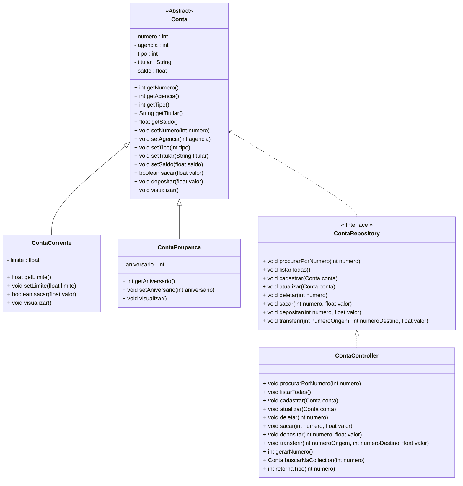

<h1>Projeto 01 - Conta Bancária - Iniciando o Projeto Java</h1>

<h2>1. O Projeto Conta Bancária</h2>

O Projeto Conta Bancária será o nosso Projeto Guia no aprendizado dos Conceitos e aplicação da Orientação a Objetos. Todo o código que implementarmos no projeto Conta Bancária servirá de base para a construção do Projeto Java, que marca o final do Bloco 01. O Projeto Conta Bancária receberá novas funcionalidades a cada nova Sessão e depois que você adquirir e praticar os novos conhecimentos, você poderá aplicar no Projeto Java. Veja o Diagrama de Classes do Projeto Conta Bancária completo na figura abaixo:



<br />

O Projeto será composto pelas seguintes Classes e Interfaces:

| Classe/Interface    | Descrição                                                    |
| ------------------- | ------------------------------------------------------------ |
| **Menu**            | Classe principal, que conterá o Método main, responsável por criar o Menu inicial da aplicação com todas as funcionalidades do sistema. |
| **Cores**           | Classe utilitária, que possui a função de aplicar cores ao Menu. |
| **Conta**           | Classe responsável por definir o Objeto Conta genérico.      |
| **ContaCorrente**   | Classe responsável por definir o Objeto Conta Corrente.      |
| **ContaPoupanca**   | Classe responsável por definir o Objeto Conta Poupanca.      |
| **ContaRepository** | Interface responsável por encapsular os Métodos que serão utilizados no Menu da aplicação |
| **ContaController** | Classe responsável por implementar a Interface ContaRepository. |

Antes de começar a criar as nossas Classes, vamos criar o nosso Projeto no Eclipse/STS.

 <h2>👣 Passo 01 - Criar o Projeto</h2>

1. Abra o Eclipse/STS

<div align="center"></div>

2. Clique no menu **File** e clique na opção **New 🡪 Java Project**, como mostra a animação abaixo:

<div align="center"></div>

3. Será aberta a janela  **New Java Project**.

<div align="center"></div>

<h2>👣 Passo 02 - Setup do Projeto</h2>

1. Vamos configurar o nome do projeto (Project name), como **conta**, conforme a figura abaixo:

<div align="center"></div>

2. Clique no botão **Finish** para concluir.

3. Aguarde a conclusão do processo de criação do projeto. Você pode acompanhar o progresso no canto direito inferior do STS, conforme mostra a figura abaixo:

<div align="center"></div>

4. A estrutura do nosso projeto ficará semelhante a imagem abaixo:

<div align="center"></div>


<h2>👣 Passo 03 - Criar o Pacote principal - conta</h2>

Na Source Folder Principal (**src**), vamos criar o pacote principal da nossa aplicação (**conta**), onde todo o nosso código será desenvolvido. Na figura abaixo, podemos visualizar o pacote:

<div align="center"></div>

1. No lado esquerdo superior, na Guia **Package explorer**, clique com o botão direito do mouse sobre a Source Folder Principal (**src**) e clique na opção  **New 🡪 Package**, como mostra a animação abaixo:

<div align="center"></div>

2. Na janela **New Java Package**, no item **Name**, informe o nome da Package: **conta**, como mostra a figura abaixo:

<div align="center"></div>

3. Clique no botão **Finish** para concluir.

A estrutura de pacotes da aplicação ficará igual a figura abaixo:

<div align="center"></div>

<h2>👣 Passo 04 - Criar a Classe Menu</h2>

Agora vamos criar a Classe principal que chamaremos de **Menu**.

1. Clique com o botão direito do mouse sobre o **Pacote conta** e na sequência, clique na opção **New 🡪 Class**, como mostra a animação abaixo:

<div align="center"></div>

3. Na janela **New Java Class**, no item **Name**, digite o nome da Classe (**Menu**) e marque a opção **public static void main(String[] args)**, como mostra a figura abaixo:

<div align="center"></div>

4. Clique no botão **Finish** para concluir.
4. Na imagem abaixo, vemos o código inicial da **Classe Menu**:

 <div align="left"></div>

<br />

<div align="left"> <a href="https://github.com/rafaelq80/conta_bancaria_java/blob/main/src/conta/Menu.java" target="_blank"><b>Código fonte: Menu.java</b></a>
<br />

Vamos implementar o código da Classe Menu - versão monocromática (sem as cores). Vamos analisar o código abaixo:

 <div align="left"></div>

**Linha 3:** Importamos o Pacote java.util.Scanner, que permite a entrada de dados via teclado.

**Linha 9:** Instanciamos um Objeto da **Classe Scanner**, chamado **leia**, que será responsável por efetuar a entrada de dados via teclado.

**Linha 11:** Criamos a variável do tipo **int**, chamada **opcao**, que receberá o número da opção do Menu, que deverá ser executada.

 <div align="left"></div>

**Linha 13:** Iniciamos a estrutura de repetição while, responsável por gerar o Menu e repeti-lo na tela. Na condição do menu, inserimos a opção **true** para que o loop seja infinito, desta forma, o loop será finalizado apenas se a opção 9 for digitada.

**Linhas 15 a 33:** Construímos a parte visual do nosso Menu. Os espaços em branco antes e depois dos itens do menu e as linhas me branco não foram construídas com tabulações (tecla Tab do teclado) e sim com espaços em branco simples.

**Linha 35:** Através do **Objeto leia**, utilizamos o **Método nextInt()** para ler um número inteiro e armazenar na variável **opcao**.

 <div align="left"></div>

**Linhas 37 a 41:** Através do condicional if, verificamos se o valor da variável opcao é 9. Caso seja, será exibida a mensagem de saída (linha 38), o Objeto leia será finalizado (linha 39) e o programa será finalizado (linha 40).

 <div align="left"></div>

**Linhas 43 a 79:** Através do condicional case, checaremos se o valor da variável opcao está no intervalo entre 1 e 8. Conforme o numero, será exibida uma mensagem diferente na tela. Caso o numero esteja fora do intervalo 1 a 8 e seja diferente de 9, será exibida na tela a mensagem **Opção Inválida!**

Execute o projeto clicando no botão **Run**. 

O visual do Menu deve ser semelhante ao da figura abaixo:

 <div align="center"></div>

O código completo, você confere abaixo:

```java
package conta;

import java.util.Scanner;

public class Menu {
	public static void main(String[] args) {

		Scanner leia = new Scanner(System.in);

		int opcao;

		while (true) {

			System.out.println("*****************************************************");
			System.out.println("                                                     ");
			System.out.println("                BANCO DO BRAZIL COM Z                ");
			System.out.println("                                                     ");
			System.out.println("*****************************************************");
			System.out.println("                                                     ");
			System.out.println("            1 - Criar Conta                          ");
			System.out.println("            2 - Listar todas as Contas               ");
			System.out.println("            3 - Buscar Conta por Numero              ");
			System.out.println("            4 - Atualizar Dados da Conta             ");
			System.out.println("            5 - Apagar Conta                         ");
			System.out.println("            6 - Sacar                                ");
			System.out.println("            7 - Depositar                            ");
			System.out.println("            8 - Transferir valores entre Contas      ");
			System.out.println("            9 - Sair                                 ");
			System.out.println("                                                     ");
			System.out.println("*****************************************************");
			System.out.println("Entre com a opção desejada:                          ");
			System.out.println("                                                     ");

			opcao = leia.nextInt();

			if (opcao == 9) {
				System.out.println("\nBanco do Brazil com Z - O seu Futuro começa aqui!");
				leia.close();
				System.exit(0);
			}

			switch (opcao) {
				case 1:
					System.out.println("Criar Conta\n\n");

					break;
				case 2:
					System.out.println("Listar todas as Contas\n\n");

					break;
				case 3:
					System.out.println("Consultar dados da Conta - por número\n\n");

					break;
				case 4:
					System.out.println("Atualizar dados da Conta\n\n");

					break;
				case 5:
					System.out.println("Apagar a Conta\n\n");

					break;
				case 6:
					System.out.println("Saque\n\n");

					break;
				case 7:
					System.out.println("Depósito\n\n");

					break;
				case 8:
					System.out.println("Transferência entre Contas\n\n");

					break;
				default:
					System.out.println("\nOpção Inválida!\n");
					break;
			}
		}
	}

}
```

<br />

<div align="left"> <a href="https://github.com/rafaelq80/conta_bancaria_java/blob/01_Menu/src/conta/Menu.java" target="_blank"><b>Código fonte: Menu.java</b></a>
<br />

<div align="left"> <a href="https://github.com/rafaelq80/conta_bancaria_java/tree/01_Menu" target="_blank"><b>Código fonte: Projeto Conta Bancária</b></a>
<br /><br />

<div align="left"><a href="README.md">Voltar</a></div>