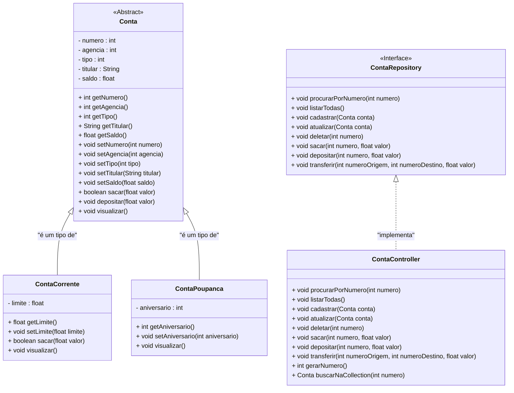

<h1>Projeto 01 - Conta Bancária - Criando o Projeto Java</h1>

<br />

<h2>1. O Projeto Conta Bancária</h2>


O **Projeto Conta Bancária** será o nosso **projeto base** para o aprendizado dos principais **conceitos de Programação Orientada a Objetos (POO)** e sua aplicação prática em Java. Todo o código que desenvolveremos ao longo desse projeto servirá como **fundamento para a construção do Desafio de Projeto do Performance Goal**, que será entregue no final do **Bloco 01**.

A cada nova **sessão de estudo**, o Projeto Conta Bancária será **incrementado com novas funcionalidades**, acompanhando a evolução do seu aprendizado. Assim, após compreender e praticar os novos conteúdos, você estará preparado para **aplicá-los no desenvolvimento do seu próprio Projeto Java**.

Confira abaixo o **Diagrama de Classes completo** do Projeto Conta Bancária, que servirá como referência para toda a implementação:



<br />

O projeto será estruturado com as seguintes **Classes** e **Interfaces**, cada uma com responsabilidades bem definidas:

| Classe/Interface    | Descrição                                                    |
| ------------------- | ------------------------------------------------------------ |
| **Menu**            | Classe principal da aplicação. Contém o método `main` e é responsável por exibir o menu inicial com todas as funcionalidades do sistema. |
| **Cores**           | Classe utilitária usada para aplicar cores ao menu, melhorando a experiência visual no terminal. |
| **Conta**           | Classe base que define a estrutura genérica de uma conta bancária. |
| **ContaCorrente**   | Classe que estende `Conta` e representa uma conta corrente, com suas características específicas. |
| **ContaPoupanca**   | Classe que estende `Conta` e representa uma conta poupança, com funcionalidades próprias. |
| **ContaRepository** | Interface que declara os métodos que serão implementados e utilizados no menu da aplicação. |
| **ContaController** | Classe que implementa a interface `ContaRepository`, sendo responsável pela lógica de manipulação das contas. |

Antes de começarmos a implementação das classes, vamos **criar o projeto no Eclipse ou Spring Tool Suite (STS)**, garantindo a estrutura inicial para a aplicação.

<br />

<h2>👣 Passo 1 - Criar uma nova Workspace</h2>


Vamos criar uma Workspace exclusiva para o Projeto Conta Bancária:

1. No STS, clique no Menu **File 🡪 Switch Workspace 🡪 Other...**

<div align="center"></div>

2. Na janela **Spring Tools for Eclipse Launcher**, clique no botão **Browse...**

<div align="center"></div>

3. Crie a pasta **conta_bancaria** na **Área de Trabalho** e na sequência, clique no botão **Selecionar pasta**. 

<div align="center"></div>

4. De volta a janela **Spring Tools for Eclipse Launcher**, no item **Copy Settings**, marque todas as opções, em especial, a opção **Preferences**, para copiar as configurações da Workspace atual para a nova Workspace. Clique no botão **Launch** para concluir.

<div align="center"></div>

5. Aguarde o STS reiniciar.
6. O STS será inicializado em uma nova Workspace (pasta conta_bancaria), sem nenhum projeto.

<div align="center"></div>

<br />

<h2>👣 Passo 2 - Criar o projeto Java</h2>


Vamos criar o Projeto Conta Bancária no STS:

1. Para criar um novo **Projeto Java**, clique no menu **File 🡪 New 🡪 Java Project**.

<div align="center">
  
</div>


2. Será aberta a janela **New Java Project**, onde iremos escolher o nome do projeto. 

<div align="center">
  
</div>


3. O nome do projeto Java será **conta_bancaria**. 
3. Digite o nome do projeto no item **Project Name**, marque a opção **Create separate folders for sources and class files** e desmarque a opção **Create module-info.java file** e clique em **Finish** para concluir.

<div align="center">
  
</div>


5. A janela **New Java Project** será fechada e voltaremos a tela padrão
6. Observe na janela **Package Explorer** que o projeto foi criado, como vemos na imagem abaixo:

<div align="center">
  
</div>

<br />

<h2>👣 Passo 03 - Criar o Pacote principal - conta</h2>


Na Source Folder Principal (**src**), vamos criar o pacote principal da nossa aplicação (**conta_bancaria**), onde todo o nosso código será desenvolvido:

1. Clique com o botão direito do mouse na pasta **src** e no menu que será aberto, clique na opção **New 🡪 Package**

<div align="center">
  
</div>


2. Na janela **New Java Package**, no item **Name**, informe o nome do pacote **conta_bancaria**.

<div align="center">
  
</div>

3. Observe na janela **Package Explorer**, que o novo pacote foi adicionado ao nosso projeto.

<div align="center">
  
</div>

<br />

<h2>👣 Passo 04 - Criar a Classe Menu</h2>


<br />

Vamos criar a Classe **Menu**, que será a classe principal da nossa aplicação:

1. Clique com o botão direito do mouse sobre o pacote **conta_bancaria** e no menu que será aberto, clique na opção **New 🡪 Class**:

<div align="center">
  
</div>


2. Na janela **New Java Class**, no item **Name:** informe o nome da Classe: **Menu** (indicado pela seta vermelha), marque a opção **public static void main(String[] args)** - (indicado pela seta azul), para criar o método `main` e clique no botão **Finish** para concluir.

<div align="center">
  
</div>


3. Na janela **Package Explorer**, observe que o pacote, anteriormente vazio, mudou de cor, indicando que existe conteúdo em seu interior, no caso, a classe **Menu**:

<div align="center">
  
</div>


4. Observe também que a Classe **Menu** será aberta na Área de Edição do Código.

<div align="center">
  
</div>

5. Vamos implementar o código da **classe `Menu`**, em sua **versão monocromática**, ou seja, **sem a utilização de cores** no terminal. A seguir, faremos uma análise detalhada do código apresentado:

 <div align="left"></div>

**Linha 3:** Importamos o pacote `java.util.Scanner`, que permite a entrada de dados pelo teclado. Esse recurso será utilizado para capturar as opções escolhidas pelo usuário no menu.

**Linha 9:** Instanciamos um objeto da classe `Scanner`, chamado **leia**, que será responsável por capturar as entradas digitadas pelo usuário no teclado.

**Linha 11:** Declaramos a variável do tipo `int` chamada **opcao**, que armazenará o número correspondente à opção do menu escolhida pelo usuário.

 <div align="left"></div>

**Linha 13:** Iniciamos a estrutura de repetição `while`, que será responsável por exibir o menu continuamente. A condição `true` indica que o laço será **infinito**, ou seja, continuará em execução até que ocorra uma instrução de **interrupção manual** — neste caso, quando a opção **0** for selecionada.

**Linhas 15 a 33:** Construímos a estrutura visual do menu. Os espaços em branco ao redor dos itens e as linhas vazias foram criados com **espaços simples**, e **não com tabulações** (tecla *Tab*). Isso garante que a formatação fique uniforme ao ser exibida no terminal.

**Linha 35:** Utilizamos o método `nextInt()` do objeto **leia** para ler a entrada do usuário como um número inteiro, atribuindo o valor à variável **opcao**.

 <div align="left"></div>

**Linhas 37 a 42:** Utilizamos uma estrutura condicional `if` para verificar se o valor da variável **opcao** é igual a **0**. Se for, serão executadas as seguintes ações:

- Exibição da mensagem de encerramento (linha 38);
- Chamada do método `sobre()` para mostrar os dados da pessoa desenvolvedora (linha 39);
- Encerramento do objeto **leia** com `close()` (linha 40), liberando os recursos associados ao teclado;
- Finalização do programa com o comando `System.exit(0)` (linha 41).

 <div align="left"></div>

**Linhas 43 a 79:** Utilizamos a estrutura `switch` (condicional por casos) para tratar as opções de 1 a 8. Cada número acionará uma mensagem específica, simulando funcionalidades futuras. Se a entrada do usuário não corresponder a nenhuma dessas opções, será exibida a mensagem **"Opção Inválida!"**.

 <div align="left"></div>

**Linhas 83 a 89:** Implementamos o método **`sobre()`**, que imprime os dados da pessoa desenvolvedora na tela.
<br />

> [!WARNING]
>
> Substitua as informações das linhas 86 e 87 pelos seus dados pessoais, como **nome completo, e-mail e link do GitHub**, garantindo que o menu reflita a autoria do projeto.

6. Salve a classe `Menu` pressionando o atalho **CTRL + S**, ou **clicando no ícone Salvar na Barra de Ferramentas** (indicado em vermelho na imagem):

<div align="center">
  
</div>

<br />

<h2>👣 Passo 5 - Executar o projeto</h2>


Após salvarmos, a classe `Menu` está pronta para ser testada:

1. Para executar o Projeto Conta Bancária, clique no botão **Run**, localizado na **Barra de Ferramentas**
2. O menu será exibido no console com um visual semelhante ao da imagem abaixo:

 <div align="center"></div>

Ao digitar a **opção 0**, será exibida uma mensagem personalizada, contendo os **seus dados pessoais**, conforme exemplo apresentado na imagem abaixo e o sistema será finalizado. 

 <div align="center"></div>

Certifique-se de que o método `sobre()` esteja corretamente implementado com suas informações pessoais (nome, e-mail e GitHub).

O código Java completo, você confere abaixo:

```java
package conta_bancaria;

import java.util.Scanner;

public class Menu {
	public static void main(String[] args) {

		Scanner leia = new Scanner(System.in);

		int opcao;

		while (true) {

			System.out.println("*****************************************************");
			System.out.println("                                                     ");
			System.out.println("                BANCO DO BRAZIL COM Z                ");
			System.out.println("                                                     ");
			System.out.println("*****************************************************");
			System.out.println("                                                     ");
			System.out.println("            1 - Criar Conta                          ");
			System.out.println("            2 - Listar todas as Contas               ");
			System.out.println("            3 - Buscar Conta por Numero              ");
			System.out.println("            4 - Atualizar Dados da Conta             ");
			System.out.println("            5 - Apagar Conta                         ");
			System.out.println("            6 - Sacar                                ");
			System.out.println("            7 - Depositar                            ");
			System.out.println("            8 - Transferir valores entre Contas      ");
			System.out.println("            0 - Sair                                 ");
			System.out.println("                                                     ");
			System.out.println("*****************************************************");
			System.out.println("Entre com a opção desejada:                          ");
			System.out.println("                                                     ");

			opcao = leia.nextInt();

			if (opcao == 0) {
				System.out.println("\nBanco do Brazil com Z - O seu Futuro começa aqui!");
				sobre();
                 leia.close();
				System.exit(0);
			}

			switch (opcao) {
				case 1:
					System.out.println("Criar Conta\n\n");

					break;
				case 2:
					System.out.println("Listar todas as Contas\n\n");

					break;
				case 3:
					System.out.println("Consultar dados da Conta - por número\n\n");

					break;
				case 4:
					System.out.println("Atualizar dados da Conta\n\n");

					break;
				case 5:
					System.out.println("Apagar a Conta\n\n");

					break;
				case 6:
					System.out.println("Saque\n\n");

					break;
				case 7:
					System.out.println("Depósito\n\n");

					break;
				case 8:
					System.out.println("Transferência entre Contas\n\n");

					break;
				default:
					System.out.println("\nOpção Inválida!\n");
					break;
			}
		}
	}
    
	public static void sobre() {
		System.out.println("\n*********************************************************");
		System.out.println("Projeto Desenvolvido por: ");
		System.out.println("Generation Brasil - generation@generation.org");
		System.out.println("github.com/conteudoGeneration");
		System.out.println("*********************************************************");
	}
}
```

<br />

<h2>👣 Passo 6 - Versionar Projeto com o Git</h2>


Diferentemente do que foi feito com a **Workspace Java**, onde versionamos toda a workspace para manter diversos projetos em um único repositório, neste caso vamos versionar **apenas o projeto Conta Bancária**, criando um **repositório exclusivo** para ele. Essa abordagem facilita a organização, o controle de versões e a manutenção do projeto de forma independente.

A seguir, vamos configurar o versionamento local do **Projeto Conta Bancária**:

1. Acesse o Terminal do STS e verifique se o diretório atual está apontando para a pasta `Workspace java`, conforme mostrado na imagem abaixo. Essa verificação garante que todas as ações sejam executadas no local correto do projeto.

<div align="center">
  
</div>

2. Acesse a pasta do projeto através do comando abaixo:

```bash
cd conta_bancaria
```

3. Inicialize o repositório Git através do comando abaixo:

```bash
git init
```

4. Crie o arquivo `.gitignore` através do comando abaixo:

```bash
touch .gitignore
```

5. Abra o arquivo `.gitignore` no **Notepad (Bloco de Notas)**, através do comando abaixo:

```bash
notepad .gitignore 
```

6. Adicione as regras as regras abaixo no arquivo e salve as alterações:

```gitignore
# ================================
# Arquivos comuns de Java
# ================================
*.class
*.jar
*.war
*.ear
*.log

# ================================
# Pastas de build/output
# ================================
bin/
build/
target/
out/

# ================================
# Eclipse / Spring Tool Suite (STS)
# ================================
.classpath
.project
.settings/
.springBeans
.factorypath
.metadata/

# ================================
# IntelliJ IDEA
# ================================
.idea/
*.iml
*.iws
*.ipr
out/

# ================================
# VS Code
# ================================
.vscode/

# ================================
# Arquivos de sistema (Windows / macOS / Linux)
# ================================
.DS_Store
Thumbs.db
ehthumbs.db
*.swp
*.swo
```

7. Adicione todos os arquivos que devem ser versionados através do comando abaixo:

```bash
git add .
```

8. Faça o primeiro commit através do comando abaixo:

```bash
git commit -m ":tada: Commit inicial - Projeto Conta Bancária"
```

O **Projeto Conta Bancária** agora está versionado com o **Git**, em um **repositório exclusivo**, o que garante maior controle de versões e facilita a organização e o acompanhamento da evolução do projeto de forma independente.

<br />

<h2>👣 Passo 7 - Enviar a Workspace para o Github</h2>


1. Acesse o seu **Github** e crie um novo **Repositório**, através da opção **New repository**, como mostra a imagem abaixo:

<div align="center"></div>

2. Crie o **Repositório Remoto** chamado **conta_bancaria**:

<div align="center"></div>

3. Clique no botão **Create Repository**, para criar o Repositório:

<div align="center"></div>

4. Na próxima janela, copie o endereço **HTTPS do Repositório Remoto**, indicado na imagem abaixo:

<div align="center"></div>

5. Volte para o Terminal do STS e execute o comando abaixo para conectar o seu **Repositório Local** com o seu **Repositório Remoto**, onde o endereço **https**, será o endereço do seu **Repositório Remoto**.

```bash
git remote add origin https://github.com/rafaelq80/conta_bancaria.git
```

<br />

> [!IMPORTANT]
>
> Substitua o endereço: `https://github.com/rafaelq80/conta_bancaria.git` pelo endereço do seu repositório remoto.

<br />

6. Digite o comando abaixo para checar se o seu  **Repositório Local** está conectado com o seu **Repositório Remoto**:

```bash
git remote -v
```

7. Se estiver conectado, será exibida uma mensagem no console, semelhante ao exemplo abaixo:

```
origin  https://github.com/rafaelq80/conta_bancaria.git (fetch)
origin  https://github.com/rafaelq80/conta_bancaria.git (push)
```

8. Na sequência, utilize o comando abaixo, para sincronizar o conteúdo do **Repositório Local** com o seu **Repositório Remoto**:

```bash
git push origin main
```

9. Volte para o Github, atualize a página do seu **Repositório Remoto** e verifique se ele está semelhante a imagem abaixo:

<div align="center"></div>

<br />

<h2>👣 Passo 8 - Adicionar o README no Repositório</h2>


Vamos criar o arquivo `README.md`, que servirá como documento principal de apresentação do repositório. Esse procedimento é necessário apenas uma vez por repositório e será feito dentro da pasta versionada.

1. Acesse o terminal e verifique se ele está na pasta do Projeto Conta Bancária, como vemos na imagem abaixo:

<div align="center">
  
</div>

2. Crie o arquivo `README.md` através do comando abaixo:

```bash
touch README.md
```

3. Abra o arquivo `README.md` no **Notepad (Bloco de Notas)**, através do comando abaixo:

```bash
notepad README.md
```

4. Na sequência, insira o código disponível no arquivo **Modelo README** (link para download abaixo), personalizando as informações com os seus dados (usuario do github, nome do repositório, entre outros):

[**Download - Modelo README**](https://github.com/conteudoGeneration/cookbook_java_fullstack/blob/main/arquivos/modelo_readme_b1_java.md) 

<br />

> [!IMPORTANT]
>
> **Não se esqueça de personalizar o `README.md` do seu repositório. É fundamental ajustar as informações para refletir corretamente o seu projeto. Atente-se especialmente aos seguintes pontos:**
>
> - 🔁 **Atualize o nome do seu usuário do GitHub** nos *badges* e links;
> - 📁 **Substitua o nome do repositório** nos *badges, links* e nos comandos como `git clone`;
>
> Essas alterações garantem que as informações exibidas estejam corretas e vinculadas ao seu repositório.

<br />

<h2>👣 Passo 9 - Atualizar o Repositório Local e Remoto</h2>


Ao contrário do que fizemos com os demais projetos do Bloco 01, que foram organizados e versionados em um único repositório dentro da pasta `Workspace Java`, o **Projeto Conta Bancária** foi versionado separadamente, em um **repositório exclusivo**.

Essa abordagem facilita o controle e a gestão individual do projeto, permitindo que ele evolua de forma independente dos demais.

Por isso, **não será necessário atualizar um repositório central com múltiplos projetos**. Sempre que houver alguma modificação no Projeto Conta Bancária, você deverá **atualizar apenas o repositório específico** correspondente a ele, seguindo os passos abaixo para versionar as alterações no Git local e remoto:

1. Digite o comando abaixo para adicionar as alterações na **Stage Area** do Git:

```bash
git add .
```

2. Na sequência, faça o commit das alterações, através do comando abaixo:

```bash
git commit -m ":books: Criação do README.md do repositório"
```

3. Na sequência, utilize o comando abaixo, para sincronizar o conteúdo do **Repositório Local** com o seu **Repositório Remoto**:

```bash
git push origin main
```

4. Volte para o Github, atualize a página do seu **Repositório Remoto** e verifique se ele foi atualizado com a adição do **README** do projeto, semelhante a imagem abaixo:

<div align="center"></div>

<br />

<div align="left"> <a href="https://github.com/rafaelq80/conta_bancaria_java/tree/01_Menu" target="_blank"><b>Código fonte: Projeto Conta Bancária</b></a></div>

<br /><br />


<div align="left"><a href="README.md">Voltar</a></div>
