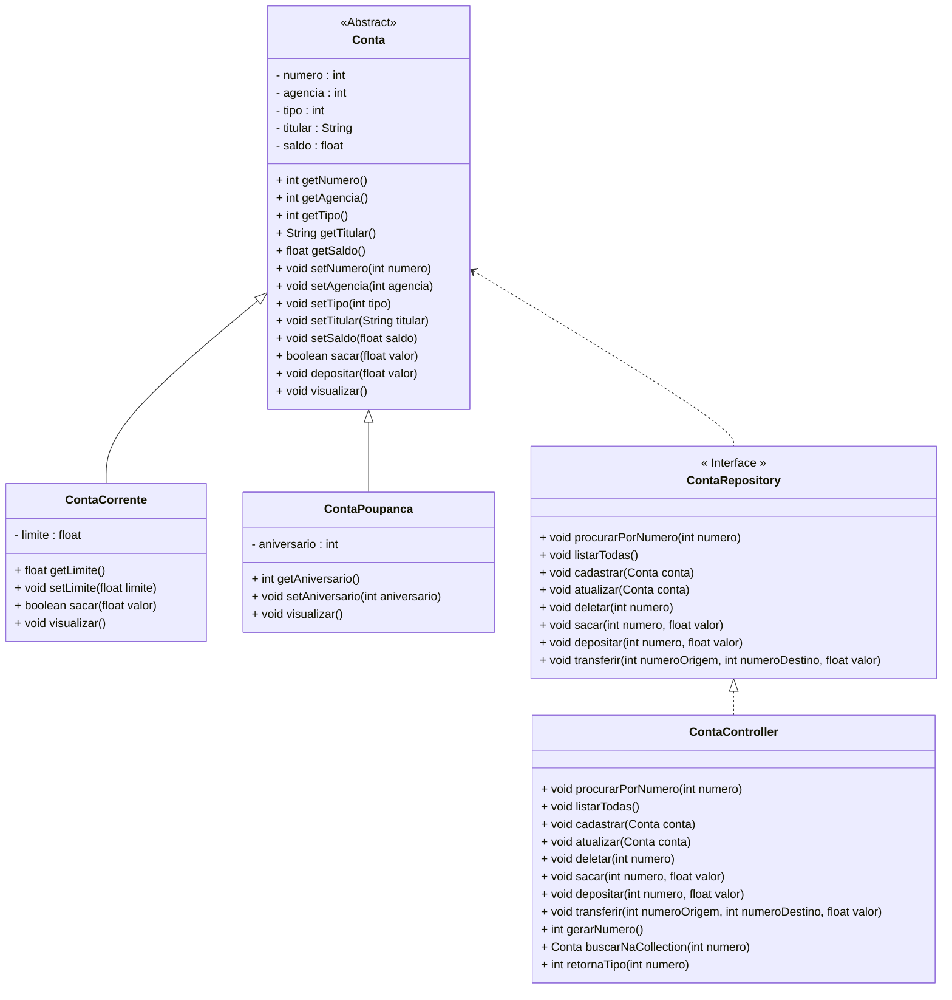

<h1>Projeto 01 - Conta Bancária - Colorindo o Menu </h1>

Na etapa anterior, criamos o Projeto Conta Bancária, que será o nosso Projeto Guia no aprendizado dos Conceitos e aplicação da Orientação a Objetos. Veja o Diagrama de Classes do Projeto Conta Bancária completo na figura abaixo:



<br />

Além de criar o projeto, criamos também a Classe Menu, que é Classe principal do Projeto, que contém o Método main(). Ao executar o Menu, temos o seguinte resultado:

 <div align="center"></div>

Nesta etapa, vamos deixar o nosso Menu colorido, através da Classe Cores. Antes, vamos entender como funcionam as cores no Console do Java. 

<h2>1. Cores no Console do Java</h2>

Os Terminais (console) tradicionalmente recebem uma entrada de bytes e os exibem como texto branco em um fundo preto. Se a entrada contiver “caracteres de controle” específicos, o terminal poderá alterar certas propriedades de exibição do texto, como cor ou fonte. Os terminais conseguem exibir no máximo 16 cores. No entanto, as telas de computador modernas são capazes de exibir cores RGB de 24 bits, que fica inviável para o console exibir tantas cores. Para trabalhar com as 16 cores básicas dentro do Console do Eclipse, utilizaremos o padrão ANSI Escape Code.

As sequências de escape ANSI são um padrão adotados pelos terminais para controlar a localização do cursor, cor, estilo de fonte e outras opções em terminais de texto de vídeo e emuladores de terminal. Certas sequências de caracteres, a maioria começando com um caractere de escape ASCII e um caractere de colchete, quando incorporadas ao texto, fazem o terminal interpretar essas sequências como comandos, em vez de texto para exibição literal. 

No caso das Cores, utilizamos um conjunto de códigos específicos que aplicam as cores na fonte (caracteres) e um segundo conjunto de códigos específicos que aplicam as cores no background (plano de fundo)  do texto. Estes códigos são concatenados com conteúdo que será exibido através do comando **System.out.println()**.

Veja os principais códigos de cores na tabela abaixo:

| **Nome da Cor** | **Código da cor - texto** | **Nome da Cor de fundo** | **Código da cor - fundo** |
| --------------- | :-----------------------: | ------------------------ | :-----------------------: |
| TEXT_BLACK      |       \ u001B [30m        | ANSI_BLACK_BACKGROUND    |       \ u001B [40m        |
| TEXT_RED        |       \ u001B [31m        | ANSI_RED_BACKGROUND      |       \ u001B [41m        |
| TEXT_GREEN      |       \ u001B [32m        | ANSI_GREEN_BACKGROUND    |       \ u001B [42m        |
| TEXT_YELLOW     |       \ u001B [33m        | ANSI_YELLOW_BACKGROUND   |       \ u001B [43m        |
| TEXT_BLUE       |       \ u001B [34m        | ANSI_BLUE_BACKGROUND     |       \ u001B [44m        |
| TEXT_PURPLE     |       \ u001B [35m        | ANSI_PURPLE_BACKGROUND   |       \ u001B [45m        |
| TEXT_CYAN       |       \ u001B [36m        | ANSI_CYAN_BACKGROUND     |       \ u001B [46m        |
| TEXT_WHITE      |       \ u001B [37m        | ANSI_FUNDO BRANCO        |       \ u001B [47m        |

Dentro destas 8 cores, existem algumas variações. No caso de texto, temos as opções **BOLD** (negrito), **UNDERLINE** (sublinhado) e **BRIGHT** (a cor na sua versão mais clara, ou seja mais iluminada). No caso do plano de fundo, existe apenas a variação BRIGHT (a cor na sua versão mais clara, ou seja mais iluminada). As versões iluminadas das cores, você confere na tabela abaixo:

| **Nome da Cor**    | **Código da cor<BR /> texto** | **Nome da Cor de fundo**      | **Código da cor <BR />fundo** |
| :----------------- | :---------------------------: | :---------------------------- | :---------------------------: |
| TEXT_BLACK_BRIGHT  |          \033[0;90m           | ANSI_BLACK_BACKGROUND_BRIGHT  |          \033[0;100m          |
| TEXT_RED_BRIGHT    |          \033[0;91m           | ANSI_RED_BACKGROUND_BRIGHT    |          \033[0;101m          |
| TEXT_GREEN_BRIGHT  |          \033[0;92m           | ANSI_GREEN_BACKGROUND_BRIGHT  |          \033[0;102m          |
| TEXT_YELLOW_BRIGHT |          \033[0;93m           | ANSI_YELLOW_BACKGROUND_BRIGHT |          \033[0;103m          |
| TEXT_BLUE_BRIGHT   |          \033[0;94m           | ANSI_BLUE_BACKGROUND_BRIGHT   |          \033[0;104m          |
| TEXT_PURPLE_BRIGHT |          \033[0;95m           | ANSI_PURPLE_BACKGROUND_BRIGHT |          \033[0;105m          |
| TEXT_CYAN_BRIGHT   |          \033[0;96m           | ANSI_CYAN_BACKGROUND_BRIGHT   |          \033[0;106m          |
| TEXT_WHITE_BRIGHT  |          \033[0;97m           | ANSI_BACKGROUND_BRANCO_BRIGHT |          \033[0;107m          |

Além disso, temos a opção **TEXT_RESET**, que retira as cores tanto do texto, quanto do fundo da tela, retornando ao esquema de cores padrão do console.

Para simplificar a aplicação das Cores no Menu, vamos Criar a Classe Cores, dentro do Pacote util, que conterá diversas variáveis do tipo **final**, onde cada uma representará uma cor específica.

> Uma variável do tipo **final** é uma variável que não pode ser sobreposta, ou seja, ele terá uma valor constante e imutável.

<br />

 <h2>👣 Passo 01 - Criar o Pacote util</h2>

No pacote principal da nossa aplicação (**conta**), vamos criar o pacote **util** (Classes utilitárias):

1. No lado esquerdo superior, na Guia **Package explorer**, clique com o botão direito do mouse sobre o pacote principal da nossa aplicação (**conta**) e clique na opção  **New 🡪 Package**, como mostra a animação abaixo:

<div align="center"></div>

2. Na janela **New Java Package**, no item **Name**, informe o nome da Package: **conta.util**, como mostra a figura abaixo:

<div align="center"></div>

3. Clique no botão **Finish** para concluir.

A estrutura de pacotes da aplicação ficará igual a figura abaixo:

<div align="center"></div>

<h2>👣 Passo 02 - Criar a Classe Cores</h2>

Agora vamos criar a **Classe Cores** no Pacote **util**.

1. Clique com o botão direito do mouse sobre o **Pacote conta.util** e na sequência, clique na opção **New 🡪 Class**, como mostra a animação abaixo:

<div align="center"></div>

3. Na janela **New Java Class**, no item **Name**, digite o nome da Classe (**Cores**), como mostra a figura abaixo:

<div align="center"></div>

4. Clique no botão **Finish** para concluir.
4. Na imagem abaixo, vemos o código inicial da **Classe Cores**:

 <div align="left"></div>

<br />

|  | <div align="left"> **IMPORTANTE:** *Observe que a Classe Cores não possui o Método main(), por não se tratar da Classe Principal do projeto.* </div> |
| ------------------------------------------------------------ | ------------------------------------------------------------ |

<br />


Vamos implementar o código da Classe Cores. Vamos analisar o código abaixo:

 <div align="left"></div>

**Linha 6:** Criamos a variável TEXT_RESET, do tipo final, contendo o código ANSI para resetar as cores do texto e do fundo de tela. O nome da variável está em maiúsculo por se tratar de uma constante, ou seja, o valor não pode ser modificado.

**Linhas 9 a 16:** Criamos as variáveis que contém as 8 cores básicas para serem aplicadas ao texto, do tipo final, contendo os respectivos códigos ANSI. O nomes das variáveis estão em maiúsculo por se tratarem de constantes, ou seja, os valores não podem ser modificados.

**Linhas 19 a 26:** Criamos as variáveis que contém as 8 cores básicas com a propriedade negrito (bold) habilitada, para serem aplicadas ao texto, do tipo final, contendo os respectivos códigos ANSI. O nomes das variáveis estão em maiúsculo por se tratarem de constantes, ou seja, os valores não podem ser modificados.

 <div align="left"></div>

**Linhas 29 a 36:** Criamos as variáveis que contém as 8 cores básicas com a propriedade sublinhado (underline) habilitada, para serem aplicadas ao texto, do tipo final, contendo os respectivos códigos ANSI. O nomes das variáveis estão em maiúsculo por se tratarem de constantes, ou seja, os valores não podem ser modificados.

**Linhas 39 a 46:** Criamos as variáveis que contém as 8 cores básicas com efeito brilho (cor mais clara) habilitada, para serem aplicadas ao texto, do tipo final, contendo os respectivos códigos ANSI. O nomes das variáveis estão em maiúsculo por se tratarem de constantes, ou seja, os valores não podem ser modificados.

 <div align="left"></div>

**Linhas 49 a 56:** Criamos as variáveis que contém as 8 cores básicas com efeito brilho (cor mais clara) e a propriedade negrito (bold) habilitada, para serem aplicadas ao texto, do tipo final, contendo os respectivos códigos ANSI. O nomes das variáveis estão em maiúsculo por se tratarem de constantes, ou seja, os valores não podem ser modificados.

**Linhas 59 a 66:** Criamos as variáveis que contém as 8 cores básicas para serem aplicadas ao fundo da tela (background), do tipo final, contendo os respectivos códigos ANSI. O nomes das variáveis estão em maiúsculo por se tratarem de constantes, ou seja, os valores não podem ser modificados.

 <div align="left"></div>

**Linhas 69 a 76:** Criamos as variáveis que contém as 8 cores básicas com efeito brilho (cor mais clara) para serem aplicadas ao fundo da tela (background), do tipo final, contendo os respectivos códigos ANSI. O nomes das variáveis estão em maiúsculo por se tratarem de constantes, ou seja, os valores não podem ser modificados.

O código completo, você confere abaixo:

```java
package conta.util;

public class Cores {

		//Reset Color
		public static final String TEXT_RESET = "\u001B[0m";

		//Text Color
		public static final String TEXT_BLACK = "\u001B[30m";
		public static final String TEXT_RED = "\u001B[31m";
		public static final String TEXT_GREEN = "\u001B[32m";
		public static final String TEXT_YELLOW = "\u001B[33m";
		public static final String TEXT_BLUE = "\u001B[34m";
		public static final String TEXT_PURPLE = "\u001B[35m";
		public static final String TEXT_CYAN = "\u001B[36m";
		public static final String TEXT_WHITE = "\u001B[37m";

		//Text Color Bold
		public static final String TEXT_BLACK_BOLD = "\033[1;30m";
		public static final String TEXT_RED_BOLD = "\033[1;31m";
		public static final String TEXT_GREEN_BOLD = "\033[1;32m";
		public static final String TEXT_YELLOW_BOLD = "\033[1;33m"; 
		public static final String TEXT_BLUE_BOLD = "\033[1;34m";
		public static final String TEXT_PURPLE_BOLD = "\033[1;35m";
		public static final String TEXT_CYAN_BOLD = "\033[1;36m";
		public static final String TEXT_WHITE_BOLD = "\033[1;37m";

		//Reset Text Underline
		public static final String TEXT_BLACK_UNDERLINED = "\033[4;30m"; 
		public static final String TEXT_RED_UNDERLINED = "\033[4;31m"; 
		public static final String TEXT_GREEN_UNDERLINED = "\033[4;32m"; 
		public static final String TEXT_YELLOW_UNDERLINED = "\033[4;33m"; 
		public static final String TEXT_BLUE_UNDERLINED = "\033[4;34m"; 
		public static final String TEXT_PURPLE_UNDERLINED = "\033[4;35m"; 
		public static final String TEXT_CYAN_UNDERLINED = "\033[4;36m"; 
		public static final String TEXT_WHITE_UNDERLINED = "\033[4;37m"; 
				
		// Text Color High Intensity
		public static final String TEXT_BLACK_BRIGHT = "\033[0;90m";  
		public static final String TEXT_RED_BRIGHT = "\033[0;91m";    
		public static final String TEXT_GREEN_BRIGHT = "\033[0;92m";  
		public static final String TEXT_YELLOW_BRIGHT = "\033[0;93m"; 
		public static final String TEXT_BLUE_BRIGHT = "\033[0;94m";  
		public static final String TEXT_PURPLE_BRIGHT = "\033[0;95m"; 
		public static final String TEXT_CYAN_BRIGHT = "\033[0;96m";   
		public static final String TEXT_WHITE_BRIGHT = "\033[0;97m";  

		// Text Color Bold High Intensity
		public static final String TEXT_BLACK_BOLD_BRIGHT = "\033[1;90m"; 
		public static final String TEXT_RED_BOLD_BRIGHT = "\033[1;91m";   
		public static final String TEXT_GREEN_BOLD_BRIGHT = "\033[1;92m"; 
		public static final String TEXT_YELLOW_BOLD_BRIGHT = "\033[1;93m";
		public static final String TEXT_BLUE_BOLD_BRIGHT = "\033[1;94m";  
		public static final String TEXT_PURPLE_BOLD_BRIGHT = "\033[1;95m";
		public static final String TEXT_CYAN_BOLD_BRIGHT = "\033[1;96m";  
		public static final String TEXT_WHITE_BOLD_BRIGHT = "\033[1;97m"; 

		// Background Color
		public static final String ANSI_BLACK_BACKGROUND = "\u001B[40m";
		public static final String ANSI_RED_BACKGROUND = "\u001B[41m";
		public static final String ANSI_GREEN_BACKGROUND = "\u001B[42m";
		public static final String ANSI_YELLOW_BACKGROUND = "\u001B[43m";
		public static final String ANSI_BLUE_BACKGROUND = "\u001B[44m";
		public static final String ANSI_PURPLE_BACKGROUND = "\u001B[45m";
		public static final String ANSI_CYAN_BACKGROUND = "\u001B[46m";
		public static final String ANSI_WHITE_BACKGROUND = "\u001B[47m";
				
		// Background Color High Intensity
		public static final String ANSI_BLACK_BACKGROUND_BRIGHT = "\033[0;100m";
		public static final String ANSI_RED_BACKGROUND_BRIGHT = "\033[0;101m";
		public static final String ANSI_GREEN_BACKGROUND_BRIGHT = "\033[0;102m";
		public static final String ANSI_YELLOW_BACKGROUND_BRIGHT = "\033[0;103m";
		public static final String ANSI_BLUE_BACKGROUND_BRIGHT = "\033[0;104m";
		public static final String ANSI_PURPLE_BACKGROUND_BRIGHT = "\033[0;105m"; 
		public static final String ANSI_CYAN_BACKGROUND_BRIGHT = "\033[0;106m";  
		public static final String ANSI_WHITE_BACKGROUND_BRIGHT = "\033[0;107m";
		
}
```

<br />

<div align="left"> <a href="https://docs.oracle.com/javase/specs/jls/se17/html/jls-8.html#jls-8.3.1" target="_blank"><b>Documentação: Modificador final</b></a>

<div align="left"> <a href="https://www.w3schools.blog/ansi-colors-java" target="_blank"><b>Documentação: Tabela de Cores - ANSI</b></a>

<br /><br />

<div align="left"> <a href="https://github.com/rafaelq80/conta_bancaria_java/blob/02_Menu_Colorido/src/conta/util/Cores.java" target="_blank"><b>Código fonte: Cores.java</b></a>

<br /><br />

<h2>👣 Passo 03 - Atualizar a Classe Menu</h2>

Neste passo, vamos atualizar o código da Classe Menu adicionando cores. Vamos analisar as alterações no código abaixo:

 <div align="left"></div>

**Linha 5:** Importamos a **Classe Cores**, que permite adicionar Cores nos comandos de saída de dados.

**Linha 17:** Antes do conteúdo do comando **System.out.println()**, concatenamos as constantes **Cores.TEXT_YELLOW** e **Cores.ANSI_BLACK_BACKGROUND**, definindo que o texto será amarelo e o plano de fundo do texto será preto.

|  | <div align="left"> **IMPORTANTE:** *Ao aplicar a cor de fundo, esta cor será aplicada apenas no texto, ou seja, ela não será aplicada em toda a tela. Para aplicar na tela será necessário inserir vários espaços em brancos (como fizemos no Menu) para preencher áreas da tela antes e depois do texto.* </div> |
| ------------------------------------------------------------ | ------------------------------------------------------------ |

 <div align="left"></div>

**Linha 36:** Depois do conteúdo do comando **System.out.println()**, concatenamos a constante **Cores.TEXT_RESET**, definindo que ao finalizar o Menu, o texto e o plano de fundo voltarão a ter as cores padrão.

**Linha 41:** Antes do conteúdo do comando **System.out.println()**, concatenamos a constante **Cores.TEXT_WHITE_BOLD**, definindo que ao sair do programa, a mensagem de finalização será exibida com o texto na cor branca em negrito.

 <div align="left"></div>

**Linhas 48, 52, 56, 60, 64, 68, 72 e 76:** Antes do conteúdo do comando **System.out.println()**, concatenamos a constante **Cores.TEXT_WHITE_BOLD**, definindo que as mensagens de cada opção do Menu será exibida com o texto na cor branca em negrito.

**Linha 80:** Antes do conteúdo do comando **System.out.println()**, concatenamos a constante **Cores.TEXT_RED_BOLD**, definindo que a mensagem de opção inválida do Menu será exibida com o texto na cor vermelha em negrito. Depois do conteúdo do comando **System.out.println()**, concatenamos a constante **Cores.TEXT_RESET**, definindo que depois de exibir a mensagem, o texto e o plano de fundo voltarão a ter as cores padrão.

Execute o projeto clicando no botão **Run**. 

O visual do Menu deve ser semelhante ao da figura abaixo:

 <div align="center"></div>

O código completo, você confere abaixo:

```java
package conta;

import java.util.Scanner;

import conta.util.Cores;

public class Menu {
    public static void main(String[] args) {
        
        Scanner leia = new Scanner(System.in);
		
		int opcao;
				
		while(true) {

			System.out.println(Cores.TEXT_YELLOW + Cores.ANSI_BLACK_BACKGROUND
					+ "*****************************************************");
			System.out.println("                                                     ");
			System.out.println("                BANCO DO BRAZIL COM Z                ");
			System.out.println("                                                     ");
			System.out.println("*****************************************************");
			System.out.println("                                                     ");
			System.out.println("            1 - Criar Conta                          ");
			System.out.println("            2 - Listar todas as Contas               ");
			System.out.println("            3 - Buscar Conta por Numero              ");
			System.out.println("            4 - Atualizar Dados da Conta             ");
			System.out.println("            5 - Apagar Conta                         ");
			System.out.println("            6 - Sacar                                ");
			System.out.println("            7 - Depositar                            ");
			System.out.println("            8 - Transferir valores entre Contas      ");
			System.out.println("            9 - Sair                                 ");
			System.out.println("                                                     ");
			System.out.println("*****************************************************");
			System.out.println("Entre com a opção desejada:                          ");
			System.out.println("                                                     " + Cores.TEXT_RESET);
			
			opcao = leia.nextInt();
				
			if (opcao == 9) {
				System.out.println(Cores.TEXT_WHITE_BOLD + "\nBanco do Brazil com Z - O seu Futuro começa aqui!");
				leia.close();
				System.exit(0);
			}
				
			switch (opcao) {
				case 1:
					System.out.println(Cores.TEXT_WHITE + "Criar Conta\n\n");
				
                    break;
				case 2:
					System.out.println(Cores.TEXT_WHITE + "Listar todas as Contas\n\n");
					
                    break;
				case 3:
					System.out.println(Cores.TEXT_WHITE + "Consultar dados da Conta - por número\n\n");
	
                    break;
				case 4:
					System.out.println(Cores.TEXT_WHITE + "Atualizar dados da Conta\n\n");
					
                    break;
				case 5:
					System.out.println(Cores.TEXT_WHITE + "Apagar a Conta\n\n");
		
                    break;
				case 6:
					System.out.println(Cores.TEXT_WHITE + "Saque\n\n");

                    break;
				case 7:
					System.out.println(Cores.TEXT_WHITE + "Depósito\n\n");
					
                    break;
				case 8:
					System.out.println(Cores.TEXT_WHITE + "Transferência entre Contas\n\n");
					
                    break;
				default:
					System.out.println(Cores.TEXT_RED_BOLD + "\nOpção Inválida!\n" + Cores.TEXT_RESET);
                    break;
			}
		}	
    }

}
```

<br />

<div align="left"> <a href="https://github.com/rafaelq80/conta_bancaria_java/blob/02_Menu_Colorido/src/conta/Menu.java" target="_blank"><b>Código fonte: Menu.java</b></a>

<br /><br />

<div align="left"> <a href="https://github.com/rafaelq80/conta_bancaria_java/tree/02_Menu_Colorido" target="_blank"><b>Código fonte: Projeto Conta Bancária</b></a>

<br /><br />

<div align="left"><a href="README.md">Voltar</a></div>