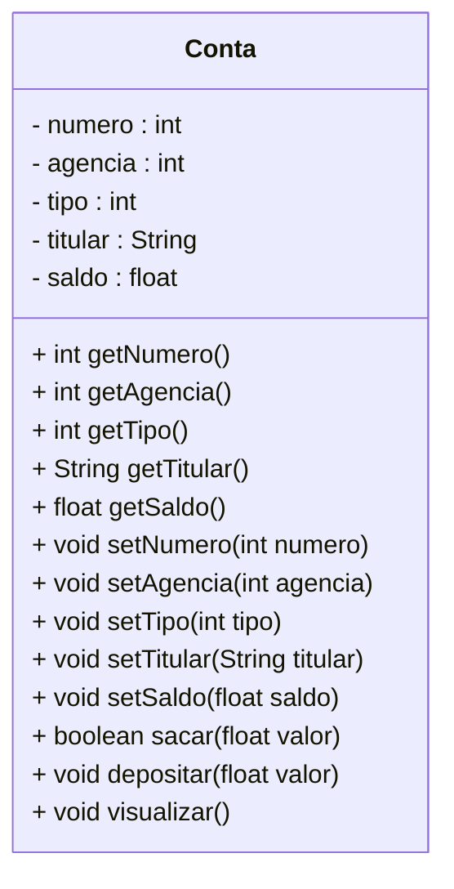

<h1>Projeto 01 - Conta Bancária - Classe Model Conta</h1>

Na etapa anterior, implementamos a Classe Principal **Menu**, com as respectivas opções para manipular os Objetos da Classe Conta. 

Nesta etapa, vamos criar a Classe Conta no Pacote Model da nossa aplicação. O Diagrama de Classes do nosso Projeto ficará da seguinte forma:



<br />

Durante o Desenvolvimento do Projeto Conta, vamos criar dentro do pacote principal, 3 sub pacotes que também podem ser chamados de **Camadas**. Dentro destes sub pacotes, iremos criar as Classes e as Interfaces da nossa aplicação. Os 3 Pacotes que serão criados, respectivamente são:

| Pacote         | Descrição                                                    |
| -------------- | ------------------------------------------------------------ |
| **Model**      | Camada responsável pela abstração dos nossos Objetos. As Classes criadas neste pacote representam os Objetos da nossa aplicação, que serão compostos por seus Atributos (características) e Métodos (ações). |
| **Repository** | Camada responsável por implementa a Interface, que contém diversos Métodos pré-implementados para a manipulação dos dados de um Objeto, como Métodos para salvar, deletar, listar e recuperar dados da Classe. |
| **Controller** | Camada responsável por criar a Classe que será responsável por implementar os Métodos criados na Interface Repository. |

<br />

<h2>👣 Passo 01 - Criar o Pacote Model</h2>

No pacote principal da nossa aplicação (**conta**), vamos criar o pacote **model** (Classes que definem um Modelo de dados):

1. No lado esquerdo superior, na Guia **Package explorer**, clique com o botão direito do mouse sobre o pacote principal da nossa aplicação (**conta**) e clique na opção **New 🡪 Package**, como mostra a animação abaixo:

<div align="center"></div>

2. Na janela **New Java Package**, no item **Name**, informe o nome da Package: **conta.model**, como mostra a figura abaixo:

<div align="center"></div>

3. Clique no botão **Finish** para concluir.

A estrutura de pacotes da aplicação ficará igual a figura abaixo:

<div align="center"></div>

<h2>👣 Passo 02 - Criar a Classe Conta</h2>

Agora vamos criar a **Classe Conta** no Pacote **model**.

1. Clique com o botão direito do mouse sobre o **Pacote conta.model** e na sequência, clique na opção **New 🡪 Class**, como mostra a animação abaixo:

<div align="center"></div>

3. Na janela **New Java Class**, no item **Name**, digite o nome da Classe (**Conta**), como mostra a figura abaixo:

<div align="center"></div>

4. Clique no botão **Finish** para concluir.
5. Na imagem abaixo, vemos o código inicial da **Classe Conta**:

 <div align="left"></div>


Vamos implementar o código da Classe Conta. Vamos analisar o código abaixo:

 <div align="left"></div>

**Linhas 5 a 9:** Criamos as variáveis que representam os Atributos da Classe Conta, que foram definidos no Diagrama de Classes acima. Observe que todos os Atributos possuem o modificador de acesso **private**, ou seja, são acessíveis apenas dentro da Classe Conta. Eles foram criados desta forma para implementar o **Encapsulamento**, ou seja, os dados de um Objeto somente poderão ser alterados e recuperados por uma outra Classe através dos Métodos GET e SET, que serão criados logo abaixo.

<br />

<h2 >👣 Passo 03 - Criar o Método Construtor na Classe Conta</h2>


1. Para criar o Primeiro Construtor, posicione o cursor após o último Atributo da Classe (em nosso exemplo saldo) e clique no menu **Source 🡪 Generate Constructor using fields**.

<div align="center"></div>

2. Na janela **Generate Constructor using fields**, selecione todos os Atributos e marque a opção **Omit call to default constructor super()** como mostra a figura abaixo:

<div align="center"></div>

3. Clique no botão **Generate** para concluir. O Construtor será gerado com todas as anotações nos parâmetros, como mostra a figura abaixo:

 <div align="left"></div>

**Linha 11:** O Método Construtor foi criado com o mesmo nome da Classe (conta) e com os respectivos parâmetros. Observe que as variáveis inseridas possuem os mesmos nomes e tipos dos Atributos da Classe Conta. Ao instanciar uma novo Objeto, o Método Construtor receberá todos os dados do Objeto através deste parâmetros, que serão atribuídos aos Atributos do Objeto da Classe Conta.

**Linhas 12 a 16:** Os dados recebidos nos parâmetros do Método Construtor são atribuídos aos respectivos Atributos da Classe Conta. Como os parâmetros possuem os mesmos nomes do Atributos da Classe, foi utilizada a palavra reservada **this** para diferenciar o Atributo da Classe Conta do parâmetro do Método Construtor da Classe Conta.

 <div align="center"></div>

<br />

<h2>👣 Passo 04 - Criar os Métodos Get e Set</h2>

Depois de criarmos os Atributos e o Método Construtor, precisamos criar os **Métodos Get e Set** para todos os Atributos da Classe Conta. Através destes Métodos, poderemos acessar e modificar os Atributos da Classe Conta a partir de outras Classes e mantermos os nosso Atributos protegidos através do Encapsulamento.

1. Posicione o cursor do mouse após o Método Construtor.
2. No menu **Source**, clique na opção **Generate Getters and Setters...**

<div align="center"></div>

3. Na tela **Generate Getters and Setters**, Clique no botão **Select All** para selecionar todos os Atributos e clique no botão **Generate**.

<div align="center"></div>

4. A geração dos Métodos ficará igual a imagem abaixo:

 <div align="left"></div>

Observe que foi criado um Método GET para cada Atributo da Classe Conta e cada um foi assinado com o mesmo tipo de dado do respectivo Atributo, porquê o valor armazenado no Atributo será retornado, através do comando **return**. Se o Atributo é do tipo String, o comando return obrigatoriamente retornará um dado do tipo String, por exemplo, logo o Método também deve ser assinado com o mesmo tipo de dado do Atributo.

Da mesma forma, foi criado um Método SET para cada Atributo da Classe Conta, entretanto todos os Métodos foram assinados como **void** (sem retorno de valor), porquê o valor do Atributo será alterado e o Método não irá retornar nenhum valor. Como o valor do Atributo será modificado, na assinatura de cada Método SET foi adicionado um parâmetro com o mesmo nome e tipo do respectivo Atributo, e a modificação será efetuada através de uma atribuição, onde o Atributo, identificado pela palavra reservada **this**, receberá o valor recebido através do parâmetro do Método.

<br />

<h2>👣 Passo 05 - Criar os Métodos Específicos</h2>

Vamos criar 3 Métodos Específicos na Classe Conta:

1. **Sacar:** Método responsável por efetuar a operação de saque na Conta;
2. **Depositar:** Método responsável por efetuar a operação de depósito na Conta;
3. **Visualizar:** Método responsável por efetuar a operação de visualizar todos os dados da Conta.

 <div align="left"></div>

**Linha 59:** O Método sacar, do tipo boolean, foi criado contendo o parâmetro **float valor**, que receberá o valor a ser sacado da conta. O parâmetro valor é do tipo float porquê o Atributo saldo é do tipo float.

**Linha 61:** Através do laço condicional if, verifica se o valor do saque é menor do que o saldo disponível na conta. Para obter o saldo atual da conta, foi utilizado o método **getSaldo()**. A palavra reservada **this** foi utilizada para fazer referência ao Objeto que está executando o Método getSaldo().

**Linha 62:** Caso o saldo seja insuficiente, será exibida a mensagem de **Saldo Insuficiente** no console.

**Linha 63:** Como se trata de um Método do tipo boolean, é necessário retornar uma resposta true ou false. Como o saque nesta condição não pode ser efetuada, retornaremos **false**. O comando return tem a função de retornar um valor após o Método finalizar o processamento.

**Linha 66:** Caso a condição anterior seja falsa (o saldo é suficiente), o saque será efetuado. Para atualizar o saldo, foi utilizado o método **setSaldo(float saldo)**. Como parâmetro do Método, foi enviada a operação saldo - valor, onde o saldo atual da conta foi obtido através do método **getSaldo()**. A palavra reservada **this** foi utilizada para fazer referência ao Objeto que está executando o Método getSaldo(). O Método setSaldo(float saldo) irá atualizar o Atributo saldo do Objeto com o resultado da subtração (saldo - valor).

**Linha 67:** Como o saque foi efetuado, retornaremos **true**. 

------

💰 **Exemplo - Saque bem sucedido:**

**Saldo atual:** *R$ 1000.00*

**Valor do Saque:** *R$ 100.00*

*Saldo = 1000.00 - 100.00*

**Saldo atualizado:** *R$ 900.00*

------

💰 **Exemplo - Saque mal sucedido:**

**Saldo atual:** *R$ 1000.00*

**Valor do Saque:** *R$ 2000.00*

*2000.00 é maior do que 1000.00*

**Mensagem:** *Saldo Insuficiente!*

**Saldo atual:** *R$ 1000.00*

------

<br />

 <div align="left"></div>

**Linha 70:** O Método depositar, do tipo void, foi criado contendo o parâmetro **float valor**, que receberá o valor a ser depositado na conta. O parâmetro valor é do tipo float porquê o Atributo saldo é do tipo float. O Método depositar foi definido como void porquê ele não precisa retornar uma confirmação, pois diferente do Método sacar, não é necessário efetuar nenhuma verificação no saldo da conta antes de efetuar o depósito.

**Linha 72:** Para atualizar o saldo, foi utilizado o método **setSaldo(float saldo)**. Como parâmetro do Método, foi enviada a operação saldo + valor, onde o saldo atual da conta foi obtido através do método **getSaldo()**. A palavra reservada **this** foi utilizada para fazer referência ao Objeto que está executando o Método getSaldo(). O Método setSaldo(float saldo) irá atualizar o Atributo saldo do Objeto com o resultado da soma (saldo + valor).

------

💰 **Exemplo - Depósito bem sucedido:**

**Saldo atual:** *R$ 1000.00*

**Valor do Depósito:** *R$ 500.00*

*Saldo = 1000.00 + 500.00*

**Saldo atualizado:** *R$ 1500.00*

------

<br />

 <div align="left"></div>

**Linha 76:** O Método visualizar, do tipo void, foi criado sem parâmetros. O Método visualizar foi definido como void porquê ele não precisa retornar uma confirmação, apenas exibir os dados de um Objeto conta no console.

**Linha 78:** Foi criada a variável String, chamada **tipo**, para receber textualmente o tipo da Conta. Como o Atributo tipo armazena um numero inteiro (int), que representa o código do tipo da conta, vamos criar um laço condicional para ao invés de exibir no console o código numérico, vamos exibir uma descrição para o código. 

**Linhas 80 a 87:** Através do laço condicional case, vamos checar se o tipo da conta é 1 ou 2. Caso seja 1, exibe Conta Corrente, caso seja 2 exibe Conta Poupança. Como parâmetro do comando switch, foi passado o Atributo **tipo**. A palavra reservada **this** foi utilizada para fazer referência ao Atributo **tipo**.


|  | <div align="left">**DICA:** *No parâmetro do comando switch, da mesma forma que foi utilizado o comando this.tipo para selecionar o valor do Atributo tipo do Objeto da Classe Conta, também poderia ter sido utilizado o comando this.getTipo().* </div> |
| ------------------------------------------------------------ | ------------------------------------------------------------ |

**Linhas 89 a 96:** Através do comando de Saída **System.out.println()**, foi construída a exibição dos dados do Objeto Conta no console. Para obter os dados de cada Atributo do Objeto conta, foi utilizada a palavra reservada **this**, para fazer referência ao Objeto que exibirá os dados no console, seguido do nome do Atributo que será exibido em cada linha. Observe que na **linha 94**, foi inserida a variável String **tipo**, contendo a descrição do tipo da conta, ao invés do Atributo tipo, que possui o código numérico do tipo da conta.

O código completo da Classe Conta, você confere abaixo:

```java
package conta.model;

public class Conta {
  
  private int numero;
	private int agencia;
	private int tipo;
	private String titular;
	private float saldo;

	public Conta(int numero, int agencia, int tipo, String titular, float saldo) {
		this.numero = numero;
		this.agencia = agencia;
		this.tipo = tipo;
		this.titular = titular;
		this.saldo = saldo;
	}

	public int getNumero() {
		return numero;
	}

	public void setNumero(int numero) {
		this.numero = numero;
	}

	public int getAgencia() {
		return agencia;
	}

	public void setAgencia(int agencia) {
		this.agencia = agencia;
	}

	public int getTipo() {
		return tipo;
	}

	public void setTipo(int tipo) {
		this.tipo = tipo;
	}

	public String getTitular() {
		return titular;
	}

	public void setTitular(String titular) {
		this.titular = titular;
	}

	public float getSaldo() {
		return saldo;
	}

	public void setSaldo(float saldo) {
		this.saldo = saldo;
	}

	public boolean sacar(float valor) { 
		
		if(this.getSaldo() < valor) {
			System.out.println("\n Saldo Insuficiente!");
			return false;
		}
			
		this.setSaldo(this.getSaldo() - valor);
		return true;
	}

	public void depositar(float valor) {

		this.setSaldo(this.getSaldo() + valor);

	}
	
	public void visualizar() {

		String tipo = "";
		
		switch(this.tipo) {
		case 1:
			tipo = "Conta Corrente";
		break;
		case 2:
			tipo = "Conta Poupança";
		break;
		}
		
		System.out.println("\n\n***********************************************************");
		System.out.println("Dados da Conta:");
		System.out.println("***********************************************************");
		System.out.println("Numero da Conta: " + this.numero);
		System.out.println("Agência: " + this.agencia);
		System.out.println("Tipo da Conta: " + tipo);
		System.out.println("Titular: " + this.titular);
		System.out.println("Saldo: " + this.saldo);

	}
  
}
```

<br />

<div align="left"> <a href="https://github.com/rafaelq80/conta_bancaria_java/blob/03_Model_Conta/src/conta/model/Conta.java" target="_blank"><b>Código fonte: Conta.java</b></a>

<br />

<h2>👣 Passo 06 - Atualizar a Classe Menu</h2>

Neste passo, vamos atualizar o código da Classe Menu adicionando algumas linhas para testar a Classe Conta. Vamos analisar as alterações no código abaixo:

 <div align="left"></div>

**Linha 4:** Através do comando import, a Classe Conta foi importada na Classe Menu.

**Linha 12:** Foi instanciado o Objeto c1, da Classe Conta, através do Método Construtor. Para chamar o Método Construtor, foi utilizada a palavra reservada **new**.

**Linha 13:** O Objeto c1, da Classe Conta, chama o Método visualizar(), que exibirá no console todos os dados do Objeto.

**Linha 14:** O Objeto c1, da Classe Conta, chama o Método sacar(), que tentará fazer um saque na conta. Como o valor passado é maior que o saldo, o saque não será efetuado e será exibida a mensagem: **Saldo Insuficiente!**.

**Linha 15:** O Objeto c1, da Classe Conta, chama novamente o Método visualizar(), para confirmar que o valor do saldo não foi alterado.

**Linha 16:** O Objeto c1, da Classe Conta, chama o Método depositar(), que fará um depósito na conta.

**Linha 17:** O Objeto c1, da Classe Conta, chama novamente o Método visualizar(), para confirmar que o valor do saldo foi alterado.

Execute o projeto clicando no botão **Run**. 

O resultado, você confere abaixo:

```bash
*********************************************************************
Dados da Conta:
*********************************************************************
Numero da Conta: 1
Agência: 123
Tipo da Conta: Conta Corrente
Titular: Adriana
Saldo: 10000.0

 Saldo Insuficiente!


*********************************************************************
Dados da Conta:
*********************************************************************
Numero da Conta: 1
Agência: 123
Tipo da Conta: Conta Corrente
Titular: Adriana
Saldo: 10000.0


*********************************************************************
Dados da Conta:
*********************************************************************
Numero da Conta: 1
Agência: 123
Tipo da Conta: Conta Corrente
Titular: Adriana
Saldo: 15000.0

menu...
```

|  | <div align="left"> **ALERTA DE BSM:** *Mantenha a Atenção aos Detalhes ao executar o projeto. Observe que as linhas acima, serão exibidas antes do Menu, logo você precisará rolar a tela do Console para cima, para visualizar os testes com a Classe Conta.* </div> |
| ------------------------------------------------------------ | ------------------------------------------------------------ |

O código completo da Classe Menu, você confere abaixo:

```java
package conta;

import java.util.Scanner;
import conta.model.Conta;
import conta.util.Cores;

public class Menu {

	public static void main(String[] args) {
		
		// Teste da Classe Conta
		Conta c1 = new Conta(1, 123, 1, "Adriana", 10000.0f);
		c1.visualizar();
		c1.sacar(12000.0f);
		c1.visualizar();
		c1.depositar(5000.0f);
		c1.visualizar();

		Scanner leia = new Scanner(System.in);

		int opcao;

		while (true) {

			System.out.println(Cores.TEXT_YELLOW + Cores.ANSI_BLACK_BACKGROUND
					+ "*****************************************************");
			System.out.println("                                                     ");
			System.out.println("                BANCO DO BRAZIL COM Z                ");
			System.out.println("                                                     ");
			System.out.println("*****************************************************");
			System.out.println("                                                     ");
			System.out.println("            1 - Criar Conta                          ");
			System.out.println("            2 - Listar todas as Contas               ");
			System.out.println("            3 - Buscar Conta por Numero              ");
			System.out.println("            4 - Atualizar Dados da Conta             ");
			System.out.println("            5 - Apagar Conta                         ");
			System.out.println("            6 - Sacar                                ");
			System.out.println("            7 - Depositar                            ");
			System.out.println("            8 - Transferir valores entre Contas      ");
			System.out.println("            9 - Sair                                 ");
			System.out.println("                                                     ");
			System.out.println("*****************************************************");
			System.out.println("Entre com a opção desejada:                          ");
			System.out.println("                                                     " + Cores.TEXT_RESET);

			opcao = leia.nextInt();

			if (opcao == 9) {
				System.out.println(Cores.TEXT_WHITE_BOLD + "\nBanco do Brazil com Z - O seu Futuro começa aqui!");
                  		sobre();
				leia.close();
				System.exit(0);
			}

			switch (opcao) {
			case 1:
				System.out.println(Cores.TEXT_WHITE_BOLD + "Criar Conta\n\n");

				break;
			case 2:
				System.out.println(Cores.TEXT_WHITE_BOLD + "Listar todas as Contas\n\n");

				break;
			case 3:
				System.out.println(Cores.TEXT_WHITE_BOLD + "Consultar dados da Conta - por número\n\n");

				break;
			case 4:
				System.out.println(Cores.TEXT_WHITE_BOLD + "Atualizar dados da Conta\n\n");

				break;
			case 5:
				System.out.println(Cores.TEXT_WHITE_BOLD + "Apagar a Conta\n\n");

				break;
			case 6:
				System.out.println(Cores.TEXT_WHITE_BOLD + "Saque\n\n");

				break;
			case 7:
				System.out.println(Cores.TEXT_WHITE_BOLD + "Depósito\n\n");

				break;
			case 8:
				System.out.println(Cores.TEXT_WHITE_BOLD + "Transferência entre Contas\n\n");

				break;
			default:
				System.out.println(Cores.TEXT_RED_BOLD + "\nOpção Inválida!\n");
				break;
			}
		}

	}
    
	public static void sobre() {
		System.out.println("\n*********************************************************");
		System.out.println("Projeto Desenvolvido por: ");
		System.out.println("Generation Brasil - generation@generation.org");
		System.out.println("github.com/conteudoGeneration");
		System.out.println("*********************************************************");
	}
}

```

<br />

<div align="left"> <a href="https://github.com/rafaelq80/conta_bancaria_java/blob/03_Model_Conta/src/conta/Menu.java" target="_blank"><b>Código fonte: Menu.java</b></a>

<br />

<div align="left"> <a href="https://github.com/rafaelq80/conta_bancaria_java/tree/03_Model_Conta" target="_blank"><b>Código fonte: Projeto Conta Bancária</b></a>

<br /><br />

<div align="left"><a href="README.md">Voltar</a></div>
