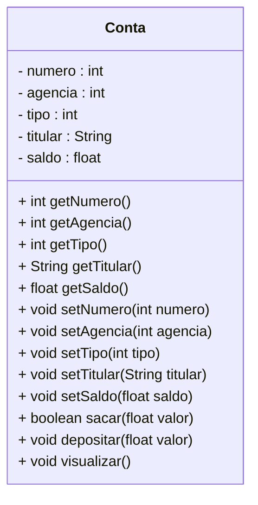

<h1>Projeto 01 - Conta Bancária - Classe Model Conta</h1>


Nas etapas anteriores, implementamos a Classe Principal **Menu**, responsável por exibir as opções e intermediar a manipulação dos objetos da Classe **Conta**.

Nesta nova etapa, daremos continuidade à estruturação do projeto, criando a Classe **Conta** dentro do **Pacote `model`** da aplicação. Essa organização segue boas práticas de separação de responsabilidades, facilitando a manutenção e a escalabilidade do sistema.

Com essa implementação, o **Diagrama de Classes** da Classe Conta será estruturado da seguinte forma:



<br />

Durante o desenvolvimento do **Projeto Conta**, criaremos, dentro do pacote principal, mais três **subpacotes**, que também podem ser chamados de **camadas** da aplicação. Cada um desses pacotes terá uma responsabilidade específica, seguindo a arquitetura em camadas, que facilita a organização e manutenção do código.

Dentro desses pacotes, serão criadas as **classes** e **interfaces** necessárias para o funcionamento da aplicação.

Os três pacotes que serão criados são:

| **Pacote**   | **Descrição**                                                |
| ------------ | ------------------------------------------------------------ |
| `model`      | Camada responsável pela **abstração dos objetos** da aplicação. As classes criadas nesse pacote representam os objetos com seus **atributos** (características) e **métodos** (ações). |
| `repository` | Camada responsável por **definir e implementar a interface de acesso a dados**, contendo métodos para **salvar, deletar, listar** e **recuperar** informações dos objetos. |
| `controller` | Camada responsável por **controlar o fluxo da aplicação**, implementando os métodos definidos na interface `repository` e coordenando as ações que envolvem os objetos. |

<br />

<h2>👣 Passo 01 - Criar o Pacote Model</h2>


No pacote principal da nossa aplicação (**`conta_bancaria`**), vamos criar o pacote **model** (Classes que definem um Modelo de dados):

1. No lado esquerdo superior, na Guia **Package explorer**, clique com o botão direito do mouse sobre o pacote principal da nossa aplicação (**`conta_bancaria`**) e clique na opção  **New 🡪 Package**, como mostra a imagem abaixo:

<div align="center"></div>

2. Na janela **New Java Package**, no item **Name**, informe o nome da Package: **conta_bancaria.model**, como mostra a figura abaixo:

<div align="center"></div>

3. Clique no botão **Finish** para concluir.
3. A estrutura de pacotes da aplicação ficará igual a figura abaixo:

<div align="center"></div>

<br />

<h2>👣 Passo 02 - Criar a Classe Conta</h2>


Agora vamos criar a **Classe Conta** no Pacote **model**.

1. Clique com o botão direito do mouse sobre o **Pacote conta_bancaria.model** e na sequência, clique na opção **New 🡪 Class**, como mostra a imagem abaixo:

<div align="center"></div>

2. Na janela **New Java Class**, no item **Name**, digite o nome da Classe (**Conta**), como mostra a figura abaixo:

<div align="center"></div>

3. Clique no botão **Finish** para concluir.
4. Na imagem abaixo, vemos o código inicial da **Classe Conta**:

 <div align="left"></div>

<br />

> [!IMPORTANT]
>
> **Observe que a classe `Conta` não possui o método `main()`**, pois **não se trata da classe principal do projeto**. Essa classe tem como função definir a estrutura e o comportamento dos objetos do tipo conta.

<br />

<h2>👣 Passo 03 - Criar os atributos da Classe Conta</h2>


Vamos implementar o código da Classe `Conta`, começando pelos atributos:

 <div align="left"></div>

**Linhas 5 a 9:** Foram declaradas as variáveis que representam os **atributos da classe `Conta`**, conforme definidos no **Diagrama de Classes** apresentado anteriormente. Todos os atributos utilizam o modificador de acesso **`private`**, o que significa que só podem ser acessados diretamente **dentro da própria classe**.

Essa prática está alinhada ao princípio do **encapsulamento**, um dos pilares da programação orientada a objetos. Com o encapsulamento, os dados da classe ficam protegidos e só podem ser **acessados ou modificados por meio de métodos públicos**, que são os métodos **`get`** (para leitura) e **`set`** (para alteração), os quais serão implementados a seguir.

<br />

<h2 >👣 Passo 04 - Criar o Método Construtor na Classe Conta</h2>


Na sequência, vamos criar o método construtor, responsável por instanciar (criar) novos objetos da classe `Conta`:

1. Para criar o Primeiro Construtor, posicione o cursor após o último Atributo da Classe (em nosso exemplo saldo) e clique no menu **Source 🡪 Generate Constructor using fields**.

<div align="center"></div>

2. Na janela **Generate Constructor using fields**, selecione todos os Atributos e marque a opção **Omit call to default constructor super()** como mostra a imagem abaixo:

<div align="center"></div>

3. Clique no botão **Generate** para concluir. O Construtor será gerado, como mostra a imagem abaixo:

 <div align="left"></div>

**Linha 11:** O **método construtor** foi criado com o **mesmo nome da classe (`Conta`)** e define os **parâmetros necessários para inicializar um novo objeto**. Observe que as variáveis declaradas nos parâmetros possuem os mesmos nomes e tipos dos atributos da classe `Conta`. Ao instanciar um novo objeto, esse construtor será responsável por **receber os valores iniciais** e atribuí-los aos respectivos atributos da classe.

**Linhas 12 a 16:** Os valores recebidos como parâmetros no construtor são **atribuídos diretamente aos atributos da classe**. Como os nomes dos parâmetros são **iguais aos nomes dos atributos**, utilizamos a **palavra-chave `this`** para **referenciar os atributos da instância atual da classe**, evitando ambiguidade. Assim, garantimos que cada valor recebido seja corretamente armazenado nos atributos do objeto que está sendo criado.

 <div align="center"></div>

<br />

<h2>👣 Passo 05 - Criar os Métodos Get e Set</h2>


Após a criação dos **atributos** e do **método construtor**, o próximo passo é implementar os **métodos `get` e `set`** para cada atributo da classe `Conta`. Esses métodos permitem **acessar e modificar os dados** dos atributos a partir de outras classes, **sem comprometer a segurança e integridade das informações**:

1. Posicione o cursor do mouse após o Método Construtor.
2. No menu **Source**, clique na opção **Generate Getters and Setters...**

<div align="center"></div>

3. Na tela **Generate Getters and Setters**, Clique no botão **Select All** para selecionar todos os Atributos e clique no botão **Generate**.

<div align="center"></div>

4. A geração dos Métodos ficará igual a imagem abaixo:

 <div align="left"></div>

Observe que foi criado um **método `get` para cada atributo** da classe `Conta`. Cada método foi **assinado com o mesmo tipo de dado** do respectivo atributo, pois seu objetivo é **retornar o valor armazenado** nesse atributo por meio do comando **`return`**. Por exemplo, se o atributo é do tipo `String`, o método `get` correspondente deve obrigatoriamente retornar um valor do tipo `String`, e portanto, sua **assinatura deve refletir esse tipo**.

Da mesma forma, foi criado um **método `set` para cada atributo**, sendo todos **assinados com o tipo `void`**, pois **não retornam nenhum valor**. A função desses métodos é **modificar o valor de um atributo específico**, recebendo um parâmetro com **o mesmo tipo e nome do atributo correspondente**. Para evitar ambiguidade, a palavra-chave **`this`** é utilizada para indicar que o valor recebido será atribuído ao atributo da instância atual da classe. Assim, a modificação ocorre por meio de uma **atribuição direta entre o atributo (`this.atributo`) e o parâmetro recebido**.

<br />

<h2>👣 Passo 06 - Criar os Métodos Auxiliares</h2>


Na sequência, vamos criar **três métodos auxiliares** na classe `Conta`, que representam **ações fundamentais** relacionadas à manipulação de uma conta bancária:

1. **`sacar`** – Responsável por realizar a operação de **saque**, subtraindo um valor do saldo da conta, conforme o valor informado;
2. **`depositar`** – Responsável por realizar a operação de **depósito**, adicionando um valor ao saldo da conta;
3. **`visualizar`** – Responsável por **exibir todas as informações** da conta, incluindo número, agência, titular e saldo, facilitando a visualização dos dados do objeto.

Esses métodos complementam o comportamento da classe `Conta` e simulam operações típicas de um sistema bancário, alinhando-se aos princípios da **programação orientada a objetos**.

<br />

### 💲 Método Sacar

 <div align="left"></div>

**Linha 59:** O método `sacar`, do tipo **`boolean`**, foi criado com um **parâmetro `float valor`**, que representa o valor a ser sacado da conta. O tipo `float` foi escolhido para esse parâmetro pois corresponde ao tipo do **atributo `saldo`** da classe `Conta`.

**Linha 61:** Um **comando condicional `if`** é utilizado para verificar se o valor solicitado para saque é **menor ou igual ao saldo disponível**. Como o método está sendo implementado **dentro da própria classe `Conta`**, é possível acessar diretamente o **atributo `saldo`**, sem a necessidade de utilizar o método `getSaldo()`. A **palavra-chave `this`** é utilizada para referenciar o **objeto atual**, deixando claro que estamos acessando o atributo da instância.

**Linha 62:** Se o saldo for insuficiente, ou seja, se o valor solicitado for maior que o saldo, é exibida a mensagem **"Saldo insuficiente"** no console.

**Linha 63:** Como o método é do tipo `boolean`, é necessário **retornar um valor lógico (`true` ou `false`)**. Neste caso, como o saque **não pode ser realizado**, o retorno será **`false`**, indicando falha na operação. O comando `return` encerra a execução do método e retorna o valor especificado.

**Linha 66:** Caso a condição anterior seja falsa (ou seja, o saldo seja suficiente), o saque será efetuado. Para isso, é necessário **atualizar o atributo `saldo`** com o novo valor. Como estamos dentro da própria classe `Conta`, podemos acessar o atributo diretamente. Assim, a operação é realizada subtraindo o valor do saque do saldo atual, conforme o comando:

```java
this.saldo = this.saldo - valor;
```

Nesse contexto, a **palavra-chave `this`** é usada para indicar que estamos manipulando o **atributo `saldo` da instância atual** da classe. Isso garante que o valor atualizado seja armazenado corretamente no objeto que está executando o método.

**Linha 67:** Como o saque foi realizado com sucesso, o método retorna **`true`**, sinalizando que a operação foi concluída corretamente.

O retorno `true` ou `false` no método `sacar()`, permite que outras partes do sistema saibam se a operação foi realizada com sucesso ou não, facilitando a criação de mensagens de validação no Menu, por exemplo.

------

💰 **Exemplo - Saque bem sucedido:**

**Saldo atual:** *R$ 1000,00*

**Valor do Saque:** *R$ 100,00*

*Saldo = 1000.00 - 100,00*

**Saldo atualizado:** *R$ 900,00*

------

💰 **Exemplo - Saque mal sucedido:**

**Saldo atual:** *R$ 1000,00*

**Valor do Saque:** *R$ 2000,00*

*2000.00 é maior do que 1000,00*

**Mensagem:** *Saldo Insuficiente!*

**Saldo atual:** *R$ 1000,00*

------

<br />

### 💲 Método Depositar

 <div align="left"></div>

**Linha 70:** O método `depositar`, do tipo **`void`**, foi criado com o parâmetro **`float valor`**, que representa o valor a ser depositado na conta. O tipo `float` foi utilizado para manter a **compatibilidade com o tipo do atributo `saldo`**. O método foi definido como `void` porque **não há necessidade de retornar um valor**, diferentemente do método `sacar`, que exige uma verificação antes de realizar a operação.

**Linha 72:** Como estamos dentro da própria classe `Conta`, é possível **acessar diretamente o atributo `saldo`** para realizar a atualização. A operação de depósito é feita somando o valor informado ao saldo atual, por meio do seguinte comando:

```java
this.saldo = this.saldo + valor;
```

A **palavra-chave `this`** é utilizada para indicar que estamos nos referindo ao **atributo `saldo` do objeto atual**. Com isso, o novo valor é armazenado corretamente no atributo, refletindo a operação de depósito realizada com sucesso.

------

💰 **Exemplo - Depósito bem sucedido:**

**Saldo atual:** *R$ 1000,00*

**Valor do Depósito:** *R$ 500,00*

*Saldo = 1000.00 + 500,00*

**Saldo atualizado:** *R$ 1500,00*

------

<br />

### 💲 Método Visualizar

 <div align="left"></div>

**Linha 76:** O método `visualizar`, do tipo **`void`**, foi criado **sem parâmetros**. Ele não precisa retornar nenhum valor, pois sua função é apenas **exibir os dados do objeto `Conta` no console**, e não realizar cálculos ou validações.

**Linha 78:** Foi criada uma **variável do tipo `String` chamada `tipo`**, que será utilizada para armazenar a descrição textual do tipo da conta. Como o **atributo `tipo`** é do tipo `int` e armazena um **código numérico** (por exemplo, `1` para Conta Corrente e `2` para Conta Poupança), será utilizado um **comando condicional** para converter esse código em uma **descrição mais legível**, evitando a exibição direta do número no console.

**Linhas 80 a 87:** Um **comando `switch`** é utilizado para verificar o valor armazenado no **atributo `tipo`**. Caso o valor seja `1`, a variável `tipo` recebe a descrição **"Conta Corrente"**; se for `2`, recebe **"Conta Poupança"**. O parâmetro utilizado no `switch` é o próprio **atributo `tipo`**, acessado com o prefixo **`this`**, para deixar explícito que estamos nos referindo ao atributo da instância atual da classe.

**Linhas 89 a 96:** Por meio dos comandos de saída **`System.out.println()`** e **`System.out.printf()`**, os dados do objeto `Conta` são exibidos no console de forma organizada. Para cada linha de exibição, os **atributos da classe** são acessados diretamente, utilizando a palavra-chave **`this`**, indicando que os dados pertencem ao objeto atual. Na **linha 94**, em vez de exibir o código numérico do atributo `tipo`, é exibida a **variável `tipo`**, que contém a descrição textual correspondente, tornando a saída mais clara e compreensível para o usuário. Na **linha 96**, observe que o `saldo` está formatado como moeda, exigindo 2 casas decimais.

O código completo da Classe Conta, você confere abaixo:

```java
package conta_bancaria.model;

public class Conta {

	private int numero;
	private int agencia;
	private int tipo;
	private String titular;
	private float saldo;

	public Conta(int numero, int agencia, int tipo, String titular, float saldo) {
		this.numero = numero;
		this.agencia = agencia;
		this.tipo = tipo;
		this.titular = titular;
		this.saldo = saldo;
	}

	public int getNumero() {
		return numero;
	}

	public void setNumero(int numero) {
		this.numero = numero;
	}

	public int getAgencia() {
		return agencia;
	}

	public void setAgencia(int agencia) {
		this.agencia = agencia;
	}

	public int getTipo() {
		return tipo;
	}

	public void setTipo(int tipo) {
		this.tipo = tipo;
	}

	public String getTitular() {
		return titular;
	}

	public void setTitular(String titular) {
		this.titular = titular;
	}

	public float getSaldo() {
		return saldo;
	}

	public void setSaldo(float saldo) {
		this.saldo = saldo;
	}

	public boolean sacar(float valor) {

		if (this.saldo < valor) {
			System.out.println("\n Saldo Insuficiente!");
			return false;
		}

		this.saldo = this.saldo - valor;
		return true;
	}

	public void depositar(float valor) {

		this.saldo = this.saldo + valor;

	}

	public void visualizar() {

		String tipo = "";

		switch (this.tipo) {
		case 1:
			tipo = "Conta Corrente";
			break;
		case 2:
			tipo = "Conta Poupança";
			break;
		}

		System.out.println("\n\n***********************************************************");
		System.out.println("Dados da Conta:");
		System.out.println("***********************************************************");
		System.out.println("Numero da Conta: " + this.numero);
		System.out.println("Agência: " + this.agencia);
		System.out.println("Tipo da Conta: " + tipo);
		System.out.println("Titular: " + this.titular);
		System.out.printf("Saldo: R$ %.2f%n", this.saldo);

	}

}
```

<br />

<h2>👣 Passo 07 - Atualizar a Classe Menu</h2>


Neste passo, vamos **atualizar o código da classe `Menu`** com o objetivo de **testar o funcionamento da classe `Conta`**. Para isso, serão adicionadas algumas linhas de código responsáveis por instanciar um objeto da classe `Conta`, atribuir valores e chamar os métodos implementados.

A seguir, vamos analisar detalhadamente as alterações realizadas no código:

 <div align="left"></div>

**Linha 5:** Através do comando `import`, a classe `Conta` foi importada para dentro da classe `Menu`, permitindo a criação e manipulação de objetos do tipo `Conta`.

**Linha 14:** Foi instanciado o objeto `c1`, da classe `Conta`, utilizando o **método construtor**. Para isso, foi usada a palavra-chave **`new`**, passando os parâmetros necessários: número, agência, tipo da conta, titular e saldo inicial.

**Linhas 17:** O objeto `c1` chama o método `visualizar()`, que exibe no console **todos os dados da conta**, conforme definidos no momento da criação do objeto.

**Linhas 20 a 22:** O saldo da conta é atualizado para **15.000,00** por meio do método `setSaldo()`, e o nome do titular é alterado para **"Maria Joaquina"** com o método `setTitular()`. Em seguida, o método `visualizar()` é chamado novamente para **exibir os dados atualizados da conta**.

**Linha 25:** O objeto `c1` executa o método `sacar(12000.0f)`. Como o saldo disponível é suficiente, o saque será **realizado com sucesso**, subtraindo o valor do saldo atual.

**Linha 26:** Após o saque, o método `visualizar()` é chamado novamente para **confirmar a atualização do saldo** após a operação.

**Linha 29:** O método `depositar(5000.0f)` é chamado, adicionando o valor informado ao saldo da conta.

**Linha 30:** Por fim, o método `visualizar()` é executado mais uma vez para **exibir os dados atualizados da conta após o depósito**.

<br />

<h2>👣 Passo 08 - Executar o projeto</h2>


Após salvarmos, as classes `Cores` e `Menu`, vamos testar:

1. Para executar o Projeto Conta Bancária, abra a classe `Menu` e clique no botão **Run**, localizado na **Barra de Ferramentas**
2. Antes da exibição do menu, serão apresentados no console os **resultados das ações executadas pelos métodos** da classe `Conta`, conforme demonstrado abaixo:

```bash

***********************************************************
Dados da Conta:
***********************************************************
Numero da Conta: 1
Agência: 123
Tipo da Conta: Conta Corrente
Titular: Adriana Sanches
Saldo: R$ 10000,00


***********************************************************
Dados da Conta:
***********************************************************
Numero da Conta: 1
Agência: 123
Tipo da Conta: Conta Corrente
Titular: Maria Joaquina
Saldo: R$ 15000,00


***********************************************************
Dados da Conta:
***********************************************************
Numero da Conta: 1
Agência: 123
Tipo da Conta: Conta Corrente
Titular: Maria Joaquina
Saldo: R$ 3000,00


***********************************************************
Dados da Conta:
***********************************************************
Numero da Conta: 1
Agência: 123
Tipo da Conta: Conta Corrente
Titular: Maria Joaquina
Saldo: R$ 8000,00
```

<br />

> [!NOTE]
>
> **ALERTA DE BSM** 
>
> *Mantenha a atenção aos detalhes!*
>
> Ao executar o projeto, observe que as linhas exibidas acima **aparecerão no console antes do menu principal**. Portanto, será necessário **rolar a tela do console para cima** para visualizar os testes realizados com a classe `Conta`.

<br />

O código completo da Classe Menu, você confere abaixo:

```java
package conta_bancaria;

import java.util.Scanner;

import conta_bancaria.model.Conta;
import conta_bancaria.util.Cores;

public class Menu {
	public static void main(String[] args) {

		// Teste da Classe Conta
        Conta c1 = new Conta(1, 123, 1, "Adriana Sanches", 10000.0f);

        c1.visualizar();

        c1.setSaldo(15000.0f);
	    c1.setTitular("Maria Joaquina");
		c1.visualizar();

        c1.sacar(12000.0f);
		c1.visualizar();

        c1.depositar(5000.0f);
		c1.visualizar();
		
		Scanner leia = new Scanner(System.in);

		int opcao;

		while (true) {

			System.out.println(Cores.TEXT_YELLOW + Cores.ANSI_BLACK_BACKGROUND
					+ "*****************************************************");
			System.out.println("                                                     ");
			System.out.println("                BANCO DO BRAZIL COM Z                ");
			System.out.println("                                                     ");
			System.out.println("*****************************************************");
			System.out.println("                                                     ");
			System.out.println("            1 - Criar Conta                          ");
			System.out.println("            2 - Listar todas as Contas               ");
			System.out.println("            3 - Buscar Conta por Numero              ");
			System.out.println("            4 - Atualizar Dados da Conta             ");
			System.out.println("            5 - Apagar Conta                         ");
			System.out.println("            6 - Sacar                                ");
			System.out.println("            7 - Depositar                            ");
			System.out.println("            8 - Transferir valores entre Contas      ");
			System.out.println("            0 - Sair                                 ");
			System.out.println("                                                     ");
			System.out.println("*****************************************************");
			System.out.println("Entre com a opção desejada:                          ");
			System.out.println("                                                     " + Cores.TEXT_RESET);

			opcao = leia.nextInt();

			if (opcao == 0) {
				System.out.println(Cores.TEXT_WHITE_BOLD + "\nBanco do Brazil com Z - O seu Futuro começa aqui!");
				sobre();
				leia.close();
				System.exit(0);
			}

			switch (opcao) {
			case 1:
				System.out.println(Cores.TEXT_WHITE + "Criar Conta\n\n");

				break;
			case 2:
				System.out.println(Cores.TEXT_WHITE + "Listar todas as Contas\n\n");

				break;
			case 3:
				System.out.println(Cores.TEXT_WHITE + "Consultar dados da Conta - por número\n\n");

				break;
			case 4:
				System.out.println(Cores.TEXT_WHITE + "Atualizar dados da Conta\n\n");

				break;
			case 5:
				System.out.println(Cores.TEXT_WHITE + "Apagar a Conta\n\n");

				break;
			case 6:
				System.out.println(Cores.TEXT_WHITE + "Saque\n\n");

				break;
			case 7:
				System.out.println(Cores.TEXT_WHITE + "Depósito\n\n");

				break;
			case 8:
				System.out.println(Cores.TEXT_WHITE + "Transferência entre Contas\n\n");

				break;
			default:
				System.out.println(Cores.TEXT_RED_BOLD + "\nOpção Inválida!\n" + Cores.TEXT_RESET);
				break;
			}
		}
	}

	public static void sobre() {
		System.out.println("\n*********************************************************");
		System.out.println("Projeto Desenvolvido por: ");
		System.out.println("Generation Brasil - generation@generation.org");
		System.out.println("github.com/conteudoGeneration");
		System.out.println("*********************************************************");
	}

}


```

<br />

<div align="left"> <a href="https://github.com/rafaelq80/conta_bancaria_java/tree/03_Model_Conta" target="_blank"><b>Código fonte: Projeto Conta Bancária</b></a>

<br /><br />

<div align="left"><a href="README.md">Voltar</a></div>
