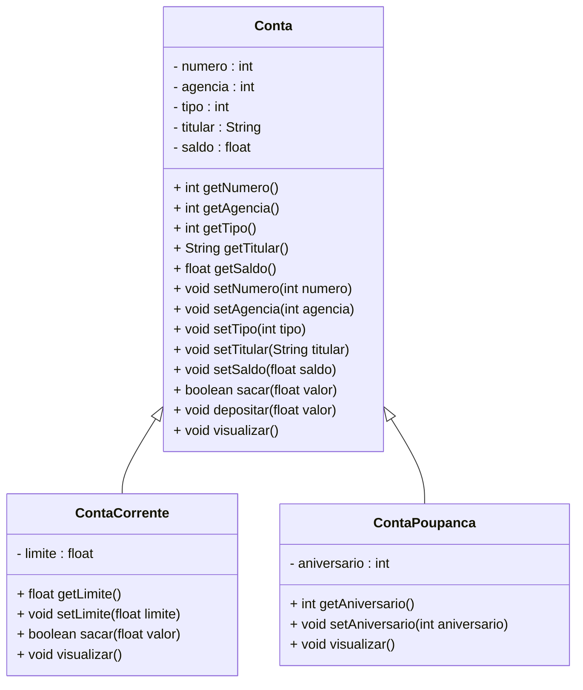

<h1>Projeto 01 - Conta Bancária - Heranças - Classe Conta</h1>


Na etapa anterior, implementamos a nossa primeira **Classe Model**, a classe **Conta**, que representa uma conta bancária genérica com os **atributos comuns** a qualquer tipo de conta.

Nesta etapa, vamos implementar as classes **ContaCorrente** e **ContaPoupanca**, que serão **especializações da classe Conta**, utilizando o conceito de **herança**. Com isso, o **Diagrama de Classes** do nosso projeto ficará da seguinte forma:



<br />

<h2>👣 Passo 01 - Criar a Classe ContaCorrente herdando a Classe Conta</h2>


1. No lado esquerdo superior, na Guia **Package explorer**, clique com o botão direito do mouse sobre o Pacote **conta_bancaria.model**, e na sequência, clique na opção **New 🡪 Class**, como mostra a imagem abaixo:

<div align="center"></div>

2. Na janela **New Java Class**, no item **Name**, digite o nome da Classe **ContaCorrente**, como mostra a imagem abaixo:

<div align="center"></div>

3. Clique no botão **Finish** para concluir.
3. Na imagem abaixo, vemos o código inicial da **Classe ContaCorrente**:

 <div align="left"></div>

<br />

> [!IMPORTANT]
>
> **Observe que a classe `ContaCorrente` não possui o método `main()`**, pois **não se trata da classe principal do projeto**. Essa classe tem como função definir a estrutura e o comportamento dos objetos do tipo conta.

<br />

Agora, vamos implementar o código da classe `ContaCorrente`, herdando a classe `Conta`, conforme ilustrado na imagem abaixo:

<div align="center"></div>

**Linha 3:** Na declaração da classe `ContaCorrente`, adicione a palavra reservada `extends` seguida do nome da classe a ser herdada (`Conta`). Observe que um erro será sinalizado na classe `ContaCorrente` (indicado pela linha verde).

<div align="center"></div>

Ao posicionar o mouse sobre o erro, será exibida uma sugestão como a da imagem acima. Essa mensagem indica que é necessário criar um **método construtor** na classe `ContaCorrente`, que receba todos os atributos esperados pela classe `Conta`.

Para corrigir o erro automaticamente, clique no link sugerido:
 **“Add constructor 'ContaCorrente(int, int, int, String, float)'”**.

Isso irá gerar um construtor com os parâmetros correspondentes aos atributos da classe pai (`Conta`), permitindo a inicialização correta do objeto `ContaCorrente`, como vemos na próxima imagem.

<div align="center"></div>

**Linha 5:** O construtor é criado com o mesmo nome da classe (`ContaCorrente`) e recebe como parâmetros os atributos herdados da classe `Conta`. Note que os nomes e os tipos das variáveis são os mesmos utilizados na classe base. Ao instanciar um novo objeto, o construtor receberá esses dados para inicializar o objeto corretamente.

**Linha 6:** Os atributos da classe `Conta` são inicializados por meio do método **`super()`**. Os argumentos do `super()` correspondem aos parâmetros recebidos no construtor da classe `ContaCorrente` e são repassados ao construtor da classe `Conta`. Essa reutilização de código só é possível graças ao conceito de **herança**.

O método `super()` deve ser a primeira instrução no construtor da subclasse, garantindo que a inicialização da superclasse ocorra antes da inicialização dos atributos específicos.

<br />

<h2>👣 Passo 02 - Adicionar os atributos de Conta Corrente</h2>


Vamos adicionar o atributo `limite`, específico da classe `ContaCorrente`:

<div align="center"></div>

**Linha 5:** Adicionamos o atributo `limite`, que representa um atributo **exclusivo da classe `ContaCorrente`**, conforme definido anteriormente no diagrama de classes. Note que esse atributo utiliza o modificador de acesso **`private`**, o que significa que só pode ser acessado diretamente dentro da própria classe `ContaCorrente`.

**Linha 7:** No construtor da classe `ContaCorrente`, adicionamos o parâmetro `limite`. Ele possui o mesmo nome e tipo do atributo declarado na classe. Ao instanciar um novo objeto do tipo `ContaCorrente`, o construtor receberá os dados da superclasse (`Conta`) por meio da chamada ao método `super()`, enquanto o valor do atributo `limite` será recebido diretamente por esse novo parâmetro.

**Linha 9:** O valor recebido no parâmetro `limite` é atribuído ao atributo `limite` da classe `ContaCorrente`. Como o nome do parâmetro é igual ao nome do atributo da classe, utilizamos a palavra-chave **`this`** para indicar que estamos nos referindo ao atributo da instância atual da classe.

> [!IMPORTANT]
>
> A palavra-chave **`super`** é utilizada para fazer referência à **superclasse**. Nesse contexto, ela serve para invocar o método construtor da classe pai (`Conta`).
>
> Caso a superclasse não possua um construtor declarado, e a subclasse declare um construtor que **não chame explicitamente `super()`**, o compilador Java apresentará um erro, pois espera que a superclasse seja corretamente inicializada.
>
> Repare que, na classe `ContaCorrente`, foram declarados apenas os **atributos e métodos específicos**, ou seja, aqueles que **diferenciam** essa subclasse da classe `Conta`. Isso reforça o conceito de **reutilização de código** proporcionado pela **herança** — tudo o que é comum já está definido na superclasse.

<br />

<h2>👣 Passo 03 - Criar os Métodos Get e Set</h2>


Após definirmos os atributos e o método construtor, é necessário criar os **métodos \*get\* e \*set\*** para o atributo `limite` da classe `ContaCorrente`. Esses métodos permitirão **acessar e modificar o valor do atributo** a partir de outras classes, mantendo a proteção proporcionada pelo **encapsulamento**.

1. Posicione o cursor do mouse após o Método Construtor.
2. No menu **Source**, clique na opção **Generate Getters and Setters...**

<div align="center"></div>

3. Na tela **Generate Getters and Setters**, clique no botão **Select All** para selecionar todos os atributos e clique no botão **Generate**.

<div align="center"></div>

4. A geração dos Métodos ficará igual a imagem abaixo:

<div align="center"></div>

<br />

> [!TIP]
>
> O uso de métodos *get* e *set* é uma prática recomendada para manter os atributos **privados** e permitir acesso controlado, reforçando o conceito de **encapsulamento** na programação orientada a objetos.

<br />

<h2>👣 Passo 04 - Criar os Métodos Específicos</h2>


Vamos criar dois métodos específicos na classe `ContaCorrente`:

1. **`sacar`**: responsável por realizar a operação de saque em uma conta corrente. Este método será implementado sobrescrevendo o método `sacar` da classe `Conta`;
2. **`visualizar`**: responsável por exibir todas as informações da conta corrente. Também será implementado sobrescrevendo o método `visualizar` da classe `Conta`.

 <div align="left"></div>

**Linha 20:** A anotação **`@Override`** foi adicionada na assinatura do método, indicando que o método está sendo sobrescrito. Essa anotação é opcional, mas recomendada, pois facilita a leitura e a validação do código pelo compilador.

**Linha 23:** O método `sacar` da classe `ContaCorrente` é similar ao método `sacar` da classe `Conta`. A principal diferença está na condição de verificação: em uma conta corrente, o saque pode considerar o **saldo somado ao limite disponível**. Para isso, utilizamos os métodos `getSaldo()` e `getLimite()` — ambos acessados com a palavra-chave **`this`**, que faz referência ao objeto atual — para obter os valores e somá-los na verificação.

> [!IMPORTANT]
>
> Na implementação do método `sacar()`, utilizamos os métodos `getSaldo()`, `getLimite()` e `setSaldo()` em vez de acessar diretamente os atributos `saldo` e `limite`, pois esses atributos estão declarados como `private` na classe `Conta`. Isso impede o acesso direto fora da própria classe, garantindo o princípio do **encapsulamento**. 
>
> O uso de métodos *getters* e *setters* é uma prática recomendada na programação orientada a objetos, pois permite controlar e proteger o acesso aos dados, além de possibilitar validações e tratamentos internos sempre que necessário.

 <div align="left"></div>

**Linha 35:** O comando **`super.visualizar()`** invoca o método `visualizar` da classe `Conta`, permitindo reaproveitar a lógica de exibição dos dados comuns a todas as contas.

Dessa forma, evitamos duplicação de código, reaproveitando o comportamento já existente na superclasse e complementando com as informações específicas de cada subclasse.

**Linha 36:** A seguir, usamos o comando de saída `System.out.printf()` para exibir o atributo `limite`, específico da classe `ContaCorrente`. 

> [!IMPORTANT]
>
> As assinaturas dos métodos `sacar()` e `visualizar()` na classe `ContaCorrente` são **iguais às da classe `Conta`**, mas com **implementações diferentes**, caracterizando o conceito de **sobrescrita de métodos** (*override*).
>
> Os métodos `sacar()` e `visualizar()` precisam ser sobrescritos porque os atributos da superclasse `Conta` são `private`, ou seja, não podem ser acessados diretamente pela subclasse. Mesmo que os objetos de `ContaCorrente` contenham esses atributos herdados, a subclasse não pode manipulá-los diretamente sem o uso de métodos públicos da superclasse.
>
> Um ponto de atenção importante sobre a sobrescrita: **um método redefinido em uma subclasse com o mesmo nome e a mesma lista de parâmetros que o método da superclasse oculta esse método original**, passando a utilizar a nova implementação definida na subclasse. Isso permite que a subclasse altere o comportamento herdado conforme necessário.

O código completo da classe `ContaCorrente`, você confere abaixo:

```java
package conta_bancaria.model;

public class ContaCorrente extends Conta{

	private float limite;

	public ContaCorrente(int numero, int agencia, int tipo, String titular, float saldo, float limite) {
		super(numero, agencia, tipo, titular, saldo);
		this.limite = limite;
	}
	
	public float getLimite() {
		return limite;
	}

	public void setLimite(float limite) {
		this.limite = limite;
	}

	@Override
	public boolean sacar(float valor) { 
		
		if(this.getSaldo() + this.getLimite() < valor) {
			System.out.println("\n Saldo Insuficiente!");
			return false;
		}
		
		this.setSaldo(this.getSaldo() - valor);
		return true;
		
	}
	
    @Override
	public void visualizar() {
		super.visualizar();
		System.out.println("Limite de Crédito: " + this.limite);
	}
    
}
```

<br />

<h2>👣 Passo 05 - Criar a Classe ContaPoupanca herdando a Classe Conta</h2>


1. No lado esquerdo superior, na Guia **Package explorer**, clique com o botão direito do mouse sobre o Pacote **conta_bancaria.model**, e na sequência, clique na opção **New 🡪 Class**, como mostra a imagem abaixo:

<div align="center"></div>

2. Na janela **New Java Class**, no item **Name**, digite o nome da Classe **ContaPoupanca**, como mostra a figura abaixo:

<div align="center"></div>

3. Clique no botão **Finish** para concluir.
4. Na imagem abaixo, vemos o código inicial da **Classe ContaPoupanca**:

<div align="center"></div>

<br />

> [!IMPORTANT]
>
> **Observe que a classe `ContaPoupanca` não possui o método `main()`**, pois **não se trata da classe principal do projeto**. Essa classe tem como função definir a estrutura e o comportamento dos objetos do tipo conta.

<br />

Vamos implementar o código da Classe ContaPoupanca herdando a Classe Conta, conforme o código abaixo:


```java
package conta_bancaria.model;

public class ContaPoupanca extends Conta{

	private int aniversario;

	public ContaPoupanca(int numero, int agencia, int tipo, String titular, float saldo, int aniversario) {
		super(numero, agencia, tipo, titular, saldo);
		this.aniversario = aniversario;
	}

	public int getAniversario() {
		return aniversario;
	}

	public void setAniversario(int aniversario) {
		this.aniversario = aniversario;
	}
	
    @Override
	public void visualizar() {
		super.visualizar();
		System.out.println("Aniversário da conta: " + this.aniversario);
	}
    
}
```

A implementação da classe `ContaPoupanca` é bastante semelhante à da classe `ContaCorrente`.

Note que, na **classe `ContaPoupanca`**, foram declaradas apenas as **diferenças em relação à superclasse `Conta`**, ou seja, os **atributos e métodos específicos** dessa subclasse. Isso evidencia o reuso automático proporcionado pelo conceito de **herança**. Além disso, somente o método `visualizar()` foi sobrescrito, já que é o único que requer uma implementação personalizada para exibir o atributo exclusivo `aniversario`.

<br />

<h2>👣 Passo 06 - Atualizar a Classe Menu</h2>


1. Abra a Classe Menu;
2. Importe as **Classes ContaCorrente e ContaPoupanca**, como mostra a imagem abaixo:

<div align="center"></div>

3. Adicione os testes das **Classes ContaCorrente e ContaPoupanca**, como mostra a imagem abaixo:

<div align="center"></div>

Observe que foram instanciados objetos das classes `ContaCorrente` e `ContaPoupanca`, e, em seguida, foram chamados os respectivos métodos de cada classe, demonstrando o comportamento específico de cada tipo de conta.

<br />

<h2>👣 Passo 07 - Executar o projeto</h2>


Após salvarmos, as 3 classes, vamos testar:

1. Para executar o Projeto Conta Bancária, abra a classe `Menu` e clique no botão **Run**, localizado na **Barra de Ferramentas**
2. Antes da exibição do menu, serão apresentados no console os **resultados das ações executadas pelos métodos** da classe `Conta`, conforme demonstrado abaixo:

```bash
***********************************************************
Dados da Conta:
***********************************************************
Numero da Conta: 1
Agência: 123
Tipo da Conta: Conta Corrente
Titular: Adriana Sanches
Saldo: R$ 10000,00

 Saldo Insuficiente!


***********************************************************
Dados da Conta:
***********************************************************
Numero da Conta: 1
Agência: 123
Tipo da Conta: Conta Corrente
Titular: Adriana Sanches
Saldo: R$ 10000,00


***********************************************************
Dados da Conta:
***********************************************************
Numero da Conta: 1
Agência: 123
Tipo da Conta: Conta Corrente
Titular: Adriana Sanches
Saldo: R$ 15000,00


***********************************************************
Dados da Conta:
***********************************************************
Numero da Conta: 2
Agência: 123
Tipo da Conta: Conta Corrente
Titular: José da Silva
Saldo: R$ 0,00
Limite de Crédito: R$ 1000,00

 Saldo Insuficiente!


***********************************************************
Dados da Conta:
***********************************************************
Numero da Conta: 2
Agência: 123
Tipo da Conta: Conta Corrente
Titular: José da Silva
Saldo: R$ 0,00
Limite de Crédito: R$ 1000,00


***********************************************************
Dados da Conta:
***********************************************************
Numero da Conta: 2
Agência: 123
Tipo da Conta: Conta Corrente
Titular: José da Silva
Saldo: R$ 5000,00
Limite de Crédito: R$ 1000,00


***********************************************************
Dados da Conta:
***********************************************************
Numero da Conta: 3
Agência: 123
Tipo da Conta: Conta Poupança
Titular: Maria dos Santos
Saldo: R$ 100000,00
Aniversário da conta: 15


***********************************************************
Dados da Conta:
***********************************************************
Numero da Conta: 3
Agência: 123
Tipo da Conta: Conta Poupança
Titular: Maria dos Santos
Saldo: R$ 99000,00
Aniversário da conta: 15


***********************************************************
Dados da Conta:
***********************************************************
Numero da Conta: 3
Agência: 123
Tipo da Conta: Conta Poupança
Titular: Maria dos Santos
Saldo: R$ 104000,00
Aniversário da conta: 15
```

Observe que as operações de saque e depósito realizadas nos objetos das classes `ContaCorrente` e `ContaPoupanca` foram executadas com sucesso, confirmando o correto funcionamento dos métodos em cada tipo de conta.

<br />

> [!NOTE]
>
> **ALERTA DE BSM** 
>
> *Mantenha a atenção aos detalhes!*
>
> Ao executar o projeto, observe que as linhas exibidas acima **aparecerão no console antes do menu principal**. Portanto, será necessário **rolar a tela do console para cima** para visualizar os testes realizados com a classe `Conta`.

<br />

O código completo da Classe Menu, você confere abaixo:

```java
package conta_bancaria;

import java.util.Scanner;

import conta_bancaria.model.Conta;
import conta_bancaria.model.ContaCorrente;
import conta_bancaria.model.ContaPoupanca;
import conta_bancaria.util.Cores;

public class Menu {
	public static void main(String[] args) {

		// Teste da Classe Conta
        Conta c1 = new Conta(1, 123, 1, "Adriana Sanches", 10000.0f);
        c1.visualizar();
		c1.sacar(12000.0f);
		c1.visualizar();
		c1.depositar(5000.0f);
		c1.visualizar();
		
		// Teste da Classe Conta Corrente
		ContaCorrente cc1 = new ContaCorrente(2, 123, 1, "José da Silva", 0.0f, 1000.0f);
		cc1.visualizar();
		cc1.sacar(12000.0f);
		cc1.visualizar();
		cc1.depositar(5000.0f);
		cc1.visualizar();
				
		// Teste da Classe Conta Poupança
		ContaPoupanca cp1 = new ContaPoupanca(3, 123, 2, "Maria dos Santos", 100000.0f, 15);
		cp1.visualizar();
		cp1.sacar(1000.0f);
		cp1.visualizar();
		cp1.depositar(5000.0f);
		cp1.visualizar();
				
		Scanner leia = new Scanner(System.in);

		int opcao;

		while (true) {

			System.out.println(Cores.TEXT_YELLOW + Cores.ANSI_BLACK_BACKGROUND
					+ "*****************************************************");
			System.out.println("                                                     ");
			System.out.println("                BANCO DO BRAZIL COM Z                ");
			System.out.println("                                                     ");
			System.out.println("*****************************************************");
			System.out.println("                                                     ");
			System.out.println("            1 - Criar Conta                          ");
			System.out.println("            2 - Listar todas as Contas               ");
			System.out.println("            3 - Buscar Conta por Numero              ");
			System.out.println("            4 - Atualizar Dados da Conta             ");
			System.out.println("            5 - Apagar Conta                         ");
			System.out.println("            6 - Sacar                                ");
			System.out.println("            7 - Depositar                            ");
			System.out.println("            8 - Transferir valores entre Contas      ");
			System.out.println("            0 - Sair                                 ");
			System.out.println("                                                     ");
			System.out.println("*****************************************************");
			System.out.println("Entre com a opção desejada:                          ");
			System.out.println("                                                     " + Cores.TEXT_RESET);

			opcao = leia.nextInt();

			if (opcao == 0) {
				System.out.println(Cores.TEXT_WHITE_BOLD + "\nBanco do Brazil com Z - O seu Futuro começa aqui!");
				sobre();
				leia.close();
				System.exit(0);
			}

			switch (opcao) {
			case 1:
				System.out.println(Cores.TEXT_WHITE + "Criar Conta\n\n");

				break;
			case 2:
				System.out.println(Cores.TEXT_WHITE + "Listar todas as Contas\n\n");

				break;
			case 3:
				System.out.println(Cores.TEXT_WHITE + "Consultar dados da Conta - por número\n\n");

				break;
			case 4:
				System.out.println(Cores.TEXT_WHITE + "Atualizar dados da Conta\n\n");

				break;
			case 5:
				System.out.println(Cores.TEXT_WHITE + "Apagar a Conta\n\n");

				break;
			case 6:
				System.out.println(Cores.TEXT_WHITE + "Saque\n\n");

				break;
			case 7:
				System.out.println(Cores.TEXT_WHITE + "Depósito\n\n");

				break;
			case 8:
				System.out.println(Cores.TEXT_WHITE + "Transferência entre Contas\n\n");

				break;
			default:
				System.out.println(Cores.TEXT_RED_BOLD + "\nOpção Inválida!\n" + Cores.TEXT_RESET);
				break;
			}
		}
	}

	public static void sobre() {
		System.out.println("\n*********************************************************");
		System.out.println("Projeto Desenvolvido por: ");
		System.out.println("Generation Brasil - generation@generation.org");
		System.out.println("github.com/conteudoGeneration");
		System.out.println("*********************************************************");
	}

}
```

<br />

<div align="left"> <a href="https://github.com/rafaelq80/conta_bancaria_java/tree/05_Model_ContaPoupanca" target="_blank"><b>Código fonte: Projeto Conta Bancária</b></a>

<br /><br />

<div align="left"><a href="README.md">Voltar</a></div>
