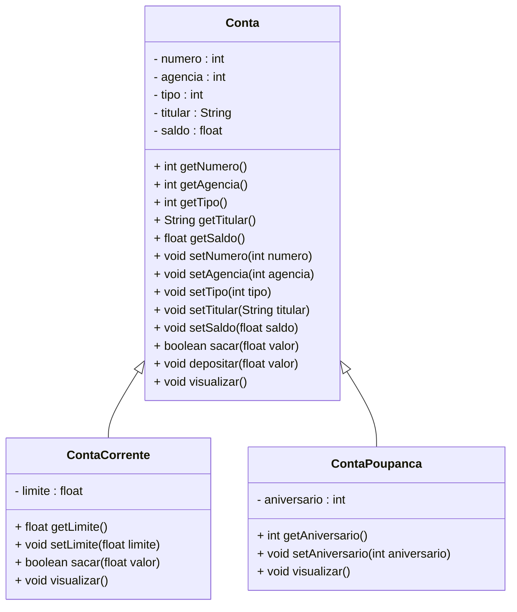

<h1>Projeto 01 - Conta Bancária - Heranças - Classe Conta</h1>

Na etapa anterior, implementamos a nossa primeira Classe Model, a Classe Conta, que define uma Conta Bancária genérica, com os Atributos comuns a toda e qualquer tipo de conta.

Nesta etapa, vamos implementar as Classes Model **ContaCorrente** e **ContaPoupanca** como **Heranças da Classe Conta**. O Diagrama de Classes do nosso Projeto ficará da seguinte forma:



<h2>👣 Passo 01 - Criar a Classe ContaCorrente herdando a Classe Conta</h2>

1. No lado esquerdo superior, na Guia **Package explorer**, clique com o botão direito do mouse sobre o Pacote **conta.model**, e na sequência, clique na opção **New 🡪 Class**, como mostra a animação abaixo:

<div align="center"></div>

2. Na janela **New Java Class**, no item **Name**, digite o nome da Classe **ContaCorrente**, como mostra a figura abaixo:

<div align="center"></div>

3. Clique no botão **Finish** para concluir.
4. Na imagem abaixo, vemos o código inicial da **Classe ContaCorrente**:

<div align="center"></div>

<br />

|  | <div align="left"> **IMPORTANTE:** *Observe que a Classe ContaCorrente não possui o Método main(), por não se tratar da Classe Principal do projeto.* </div> |
| ------------------------------------------------------------ | ------------------------------------------------------------ |

<br />

Vamos implementar o código da Classe ContaCorrente herdando a Classe Conta. Vamos analisar o código abaixo:

<div align="center"></div>

**Linha 3:** Na assinatura da Classe ContaCorrente, vamos adicionar a palavra reservada extends e na sequência a Classe que será herdada (Conta). Observe que será exibido um erro na Classe ContaCorrente (indicado pela linha verde no código). 

<div align="center"></div>

Este erro indica que deve ser criado um Método Construtor na Classe Conta Corrente, contendo todos os Atributos da Classe Conta. Clique no link **Add constructor 'ContaCorrente(int, int, int, String, float)'**, para criar o Método Construtor com parâmetros. 

<div align="center"></div>

**Linha 5:** O Método Construtor foi criado com o mesmo nome da Classe (ContaCorrente) e com os respectivos parâmetros herdados da Classe Conta. Observe que as variáveis inseridas possuem o mesmo nome e tipo dos Atributos da Classe Conta. Ao instanciar uma novo Objeto, o Método Construtor receberá todos os dados do Objeto através deste parâmetros, que serão atribuídos aos Atributos do Objeto

**Linha 6:** Observe que os Atributos da Classe Conta são acessados e modificados através do Método **super()**. Nos argumentos do Método super(), foram adicionados os parâmetros do Método Construtor ContaCorrente, que serão enviados para o Método Construtor da Classe Conta. A reutilização do código da Classe Conta, na Classe ContaCorrente é possível graças ao conceito de Herança.

<div align="center"></div>

**Linha 5:** Vamos adicionar a variável limite, que representa um Atributo específico da Classe ContaCorrente, que foram definidos no Diagrama de Classes acima. Observe que o Atributo possue o modificador de acesso **private**, ou seja, é acessível apenas dentro da Classe ContaCorrente. 

**Linha 7:** Vamos adicionar no Método Construtor ContaCorrente o parâmetro limite. Observe que a variável possui o mesmo nome e tipo do Atributo limite da Classe. Ao instanciar um novo Objeto da Classe ContaCorrente, o Método Construtor receberá todos os dados da Classe Conta através do Método super() e o valor do limite será recebido através do parâmetro limite, que foi adicionado na assinatura do Método Construtor da Classe ContaCorrente.

**Linha 9:** Os dados recebidos no parâmetro limite do Método Construtor da Classe ContaCorrente será atribuído ao Atributo limite da Classe ContaCorrente. Como o parâmetro possui o mesmo nome do Atributo da Classe, foi utilizada a palavra reservada **this** para diferenciar o Atributo da Classe ContaCorrente do parâmetro do Método Construtor ContaCorrente.

> **Observações Importantes!** 
>
> A palavra-chave **super** refere-se a uma **superclasse**. Ela indica a chamada ao Método Construtor da **superclasse**. Caso a **superclasse** não possua um Método Construtor e o Método Construtor da **subclasse** não chamar nenhum outro Método Construtor da **superclasse** explicitamente o compilador java vai informar um erro.
>
> Observe que na **Classe ContaCorrente** foram declaradas apenas **as diferenças (Métodos e Atributos)** entre a **subclasse** e **superclasse**, ou seja, o reuso é automático.

<br />

<h2>👣 Passo 02 - Criar os Métodos Get e Set</h2>

Depois de criarmos os Atributos e o Método Construtor, precisamos criar os **Métodos Get e Set** para o Atributo limite da Classe ContaCorrente. Através destes Métodos, poderemos acessar e modificar os Atributos da Classe ContaCorrente a partir de outras Classes e mantermos o nosso Atributo protegido através do Encapsulamento.

1. Posicione o cursor do mouse após o Método Construtor.
2. No menu **Source**, clique na opção **Generate Getters and Setters...**

<div align="center"></div>

3. Na tela **Generate Getters and Setters**, Clique no botão **Select All** para selecionar todos os Atributos e clique no botão **Generate**.

<div align="center"></div>

4. A geração dos Métodos ficará igual a imagem abaixo:

<div align="center"></div>

<br />

<h2>👣 Passo 03 - Criar os Métodos Específicos</h2>

Vamos criar 3 Métodos Específicos na Classe Conta:

1. **Sacar:** Método responsável por efetuar a operação de saque na ContaCorrente. Este Método será implementado sobrescrevendo o Método sacar da Classe Conta;
2. **Visualizar:** Método responsável por efetuar a operação de visualizar todos os dados da ContaCorrente. Este Método será implementado sobrescrevendo o Método visualizar da Classe Conta

 <div align="left"></div>

**Linha 20:** Foi adicionado na assinatura do Método a anotação **@Override**, indicando que o Método foi sobrescrito. Esta anotação é opcional.

**Linha 23:** O Método sacar da Classe ContaCorrente é praticamente igual ao Método sacar da Classe Conta. A única mudança será no laço condicional if, que verifica se o valor do saque é menor do que o saldo disponível na conta. Numa Conta Corrente, para obter o saldo atual da conta, será necessário somar o saldo e o limite. Observe que foram utilizados os métodos **getSaldo()** e **getLimite()** para obter os valores de ambos os Atributos e posteriormente somar. A palavra reservada **this** foi utilizada para fazer referência ao Objeto que está executando os Métodos.

 <div align="left"></div>

**Linha34:** Foi adicionado o comando **super.visualizar()**, que executa o Método visualizar da Classe Conta. O comando super pode ser utilizado na Classe filha pra chamar qualquer Método da Classe pai.

**Linha 35:** Através do comando de Saída **System.out.println()**, foi adicionado o Atributo limite. Para obter os dados do Atributo limite da Classe ContaCorrente, foi utilizada a palavra reservada **this**, para fazer referência ao Objeto que exibirá os dados no console, seguido do nome do Atributo que será exibido em cada linha.

> **Observações Importantes!**
>
> Observe que as assinaturas dos Métodos **sacar e visualizar** da Classe ContaCorrente são as mesmas da Classe Conta, entretanto eles possuem uma implementação diferente da Classe Conta, logo os Métodos **sacar e visualizar** da Classe Conta foram sobrescritos na Classe ContaCorrente.
>
> Os Métodos **sacar e visualizar** da Classe ContaCorrente foram sobrescritos por um simples motivo: A Classe ContaCorrente **não possui acesso direto** às variáveis de instância privadas (Atributos) da **Superclasse**, ou seja, esses métodos não podem alterar diretamente uma variável de instância, embora cada objeto da Classe **ContaCorrente** tenha uma variável de instância igual a da Superclasse, logo para executarem um processamento diferente da Superclasse, eles precisam ser Sobrescritos.
>
> Um ponto de atenção importante em relação a Sobrescrita é que um **método redefinido em uma Subclasse** com o **mesmo nome** e **mesma lista de parâmetros** que o **método em uma de suas classes antecessoras**, automaticamente oculta o método da classe ancestral (superclasse) a partir da Subclasse, ou seja, ele passa a usar o Método da Subclasse.

O código completo da Classe Conta, você confere abaixo:

```java
package conta.model;

public class ContaCorrente extends Conta{

	private float limite;

	public ContaCorrente(int numero, int agencia, int tipo, String titular, float saldo, float limite) {
		super(numero, agencia, tipo, titular, saldo);
		this.limite = limite;
	}
	
	public float getLimite() {
		return limite;
	}

	public void setLimite(float limite) {
		this.limite = limite;
	}

	@Override
	public boolean sacar(float valor) { 
		
		if(this.getSaldo() + this.getLimite() < valor) {
			System.out.println("\n Saldo Insuficiente!");
			return false;
		}
		
		this.setSaldo(this.getSaldo() - valor);
		return true;
		
	}
	
    @Override
	public void visualizar() {
		super.visualizar();
		System.out.println("Limite de Crédito: " + this.limite);
	}
    
}
```

<br />

<div align="left"> <a href="https://github.com/rafaelq80/conta_bancaria_java/blob/05_Model_ContaPoupanca/src/conta/model/ContaCorrente.java" target="_blank"><b>Código fonte: ContaCorrente.java</b></a>


<br />


<h2>👣 Passo 04 - Criar a Classe ContaPoupanca herdando a Classe Conta</h2>

1. No lado esquerdo superior, na Guia **Package explorer**, clique com o botão direito do mouse sobre o Pacote **conta.model**, e na sequência, clique na opção **New 🡪 Class**, como mostra a animação abaixo:

<div align="center"></div>

2. Na janela **New Java Class**, no item **Name**, digite o nome da Classe **ContaPoupanca**, como mostra a figura abaixo:

<div align="center"></div>

3. Clique no botão **Finish** para concluir.
4. Na imagem abaixo, vemos o código inicial da **Classe ContaPoupanca**:

<div align="center"></div>

<br />

|  | <div align="left"> **IMPORTANTE:** *Observe que a Classe ContaPoupanca não possui o Método main(), por não se tratar da Classe Principal do projeto.* </div> |
| ------------------------------------------------------------ | ------------------------------------------------------------ |

<br />

Vamos implementar o código da Classe ContaPoupanca herdando a Classe Conta, conforme o código abaixo:


```java
package conta.model;

public class ContaPoupanca extends Conta{

	private int aniversario;

	public ContaPoupanca(int numero, int agencia, int tipo, String titular, float saldo, int aniversario) {
		super(numero, agencia, tipo, titular, saldo);
		this.aniversario = aniversario;
	}

	public int getAniversario() {
		return aniversario;
	}

	public void setAniversario(int aniversario) {
		this.aniversario = aniversario;
	}
	
    @Override
	public void visualizar() {
		super.visualizar();
		System.out.println("Aniversário da conta: " + this.aniversario);
	}
    
}
```

Observe que na **Classe ContaPoupanca** foram declaradas apenas **as diferenças (Métodos e Atributos)** entre a **subclasse** e **superclasse**, ou seja, o reuso é automático. Além disso, apenas o Método Visualizar foi Sobrescrito.

<br />

<div align="left"> <a href="https://github.com/rafaelq80/conta_bancaria_java/blob/05_Model_ContaPoupanca/src/conta/model/ContaPoupanca.java" target="_blank"><b>Código fonte: ContaPoupanca.java</b></a>


<br />

<h2>👣 Passo 05 - Atualizar a Classe Menu</h2>

1. Abra a Classe Menu;
2. Importe as **Classes ContaCorrente e ContaPoupanca**, como mostra a imagem abaixo:

<div align="center"></div>

3. Adicione os testes das **Classes ContaCorrente e ContaPoupanca**, como mostra a imagem abaixo:

<div align="center"></div>

Observe que foi instanciado um Objeto da Classe ContaCorrente e outro Objeto da Classe ContaPoupanca, chamando os respectivos Métodos de cada Classe. 

Execute o projeto clicando no botão **Run**. 

O resultado, você confere abaixo:

```bash
*********************************************************************
Dados da Conta:
*********************************************************************
Numero da Conta: 1
Agência: 123
Tipo da Conta: Conta Corrente
Titular: Adriana
Saldo: 10000.0

 Saldo Insuficiente!


*********************************************************************
Dados da Conta:
*********************************************************************
Numero da Conta: 1
Agência: 123
Tipo da Conta: Conta Corrente
Titular: Adriana
Saldo: 10000.0


*********************************************************************
Dados da Conta:
*********************************************************************
Numero da Conta: 1
Agência: 123
Tipo da Conta: Conta Corrente
Titular: Adriana
Saldo: 15000.0


*********************************************************************
Dados da Conta:
*********************************************************************
Numero da Conta: 2
Agência: 123
Tipo da Conta: Conta Corrente
Titular: Mariana
Saldo: 15000.0
Limite de Crédito: 1000.0


*********************************************************************
Dados da Conta:
*********************************************************************
Numero da Conta: 2
Agência: 123
Tipo da Conta: Conta Corrente
Titular: Mariana
Saldo: 3000.0
Limite de Crédito: 1000.0


*********************************************************************
Dados da Conta:
*********************************************************************
Numero da Conta: 2
Agência: 123
Tipo da Conta: Conta Corrente
Titular: Mariana
Saldo: 8000.0
Limite de Crédito: 1000.0


*********************************************************************
Dados da Conta:
*********************************************************************
Numero da Conta: 3
Agência: 123
Tipo da Conta: Conta Poupança
Titular: Victor
Saldo: 100000.0
Aniversário da conta: 15


*********************************************************************
Dados da Conta:
*********************************************************************
Numero da Conta: 3
Agência: 123
Tipo da Conta: Conta Poupança
Titular: Victor
Saldo: 99000.0
Aniversário da conta: 15


*********************************************************************
Dados da Conta:
*********************************************************************
Numero da Conta: 3
Agência: 123
Tipo da Conta: Conta Poupança
Titular: Victor
Saldo: 104000.0
Aniversário da conta: 15

menu...
```

<br />

Observe que as Operações de Saque e Depósito, efetuadas nos Objetos das Classes ContaCorrente e ContaPoupanca, foram efetuados com sucesso.

<br />


|  | <div align="left"> **ALERTA DE BSM:** *Mantenha a Atenção aos Detalhes ao executar o projeto. Observe que as linhas acima, serão exibidas antes do Menu, logo você precisará rolar a tela do Console para cima, para visualizar os testes.* </div> |
| ------------------------------------------------------------ | ------------------------------------------------------------ |

O código completo da Classe Menu, você confere abaixo:

```java
package conta;

import java.util.Scanner;

import conta.model.ContaCorrente;
import conta.model.ContaPoupanca;
import conta.util.Cores;

public class Menu {

	public static Scanner leia = new Scanner(System.in);
	
	public static void main(String[] args) {

		int opcao;

        // Teste da Classe Conta
		Conta c1 = new Conta(3, 123, 1, "Mariana", 500000.0f);
		c1.visualizar();
		c1.sacar(12000.0f);
		c1.visualizar();
		c1.depositar(5000.0f);
		c1.visualizar();
        
		// Teste da Classe Conta Corrente
		ContaCorrente cc1 = new ContaCorrente(1, 123, 1, "José da Silva", 0.0f, 1000.0f);
		cc1.visualizar();
		cc1.sacar(12000.0f);
		cc1.visualizar();
		cc1.depositar(5000.0f);
		cc1.visualizar();
		
        // Teste da Classe Conta Poupança
		ContaPoupanca cp1 = new ContaPoupanca(2, 123, 2, "Maria dos Santos", 100000.0f, 15);
		cp1.visualizar();
        cp1.sacar(1000.0f);
		cp1.visualizar();
		cp1.depositar(5000.0f);
		cp1.visualizar();
		
		while (true) {
			
			System.out.println(Cores.TEXT_YELLOW + Cores.ANSI_BLACK_BACKGROUND + "*****************************************************");
			System.out.println("                                                     ");
			System.out.println("                BANCO DO BRAZIL COM Z                ");
			System.out.println("                                                     ");
			System.out.println("*****************************************************");
			System.out.println("                                                     ");
			System.out.println("            1 - Criar Conta                          ");
			System.out.println("            2 - Listar todas as Contas               ");
			System.out.println("            3 - Buscar Conta por Numero              ");
			System.out.println("            4 - Atualizar Dados da Conta             ");
			System.out.println("            5 - Apagar Conta                         ");
			System.out.println("            6 - Sacar                                ");
			System.out.println("            7 - Depositar                            ");
			System.out.println("            8 - Transferir valores entre Contas      ");
			System.out.println("            9 - Sair                                 ");
			System.out.println("                                                     "); 
			System.out.println("*****************************************************");
			System.out.println("Entre com a opção desejada:                          ");
			System.out.println("                                                     ");
			opcao = leia.nextInt();
			
			if(opcao == 9) {
				System.out.println("\nBanco do Brazil com Z - O seu futuro começa aqui!");
                  		sobre()
				leia.close();
				System.exit(0);
			}
			
			switch(opcao) {
			case 1:
				System.out.println("\n Criar Conta");
				
                 break;
			case 2:
				System.out.println("\n Listar todas as Contas");
				
                 break;
			case 3:
				System.out.println("\n Buscar Conta por número");
				
				break;
			case 4:
				System.out.println("\n Atualizar dados da Conta");
				
                 break;
			case 5:
				System.out.println("\n Apagar Conta");
				
                 break;
			case 6:
				System.out.println("\n Sacar");
				
				break;
             case 7:
				System.out.println("\n Depositar");
				
				break;
             case 8:
				System.out.println("\n Transferir");
				
				break;
			default:
				System.out.println("\nOpção Inválida");
                 break;
			}
        }
	}
	public static void sobre() {
		System.out.println("\n*********************************************************");
		System.out.println("Projeto Desenvolvido por: ");
		System.out.println("Generation Brasil - generation@generation.org");
		System.out.println("github.com/conteudoGeneration");
		System.out.println("*********************************************************");
	}
}
```

<br />

<div align="left"> <a href="https://github.com/rafaelq80/conta_bancaria_java/blob/05_Model_ContaPoupanca/src/conta/Menu.java" target="_blank"><b>Código fonte: Menu.java</b></a>

<br />

<div align="left"> <a href="https://github.com/rafaelq80/conta_bancaria_java/tree/05_Model_ContaPoupanca" target="_blank"><b>Código fonte: Projeto Conta Bancária</b></a>

<br /><br />

<div align="left"><a href="README.md">Voltar</a></div>
