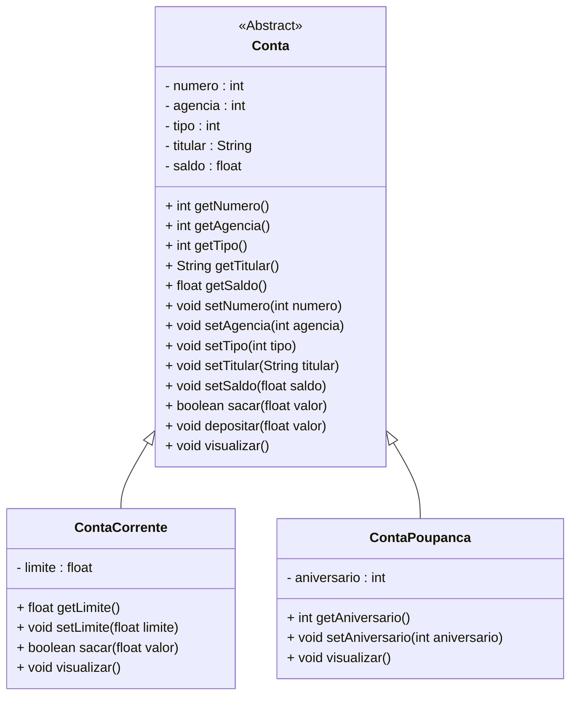

<h1>Projeto 01 - Conta Bancária - Classes Abstratas - Classe Conta</h1>

Na etapa anterior, implementamos as Classes Model **ContaCorrente** e **ContaPoupanca** como **Heranças da Classe Conta**. 

Nesta etapa, vamos transformar a Classe **Conta** em uma **Classe Abstrata**. O Diagrama de Classes do nosso Projeto ficará da seguinte forma:



<br />

<h2>👣 Passo 01 - Implementar a Classe Conta como Classe Abstrata</h2>

1. Abra a Classe **Conta**, localizada no Pacote **conta.model**:

<div align="center"></div>

2. Adicione o modificador **abstract** na assinatura da Classe **Conta**, conforme indicado na imagem abaixo:

<div align="center"></div>

3. O código completo da Classe **Conta**, você confere abaixo:

```java
package conta.model;

public abstract class Conta {
    
    private int numero;
	private int agencia;
	private int tipo;
	private String titular;
	private float saldo;

	public Conta(int numero, int agencia, int tipo, String titular, float saldo) {
		this.numero = numero;
		this.agencia = agencia;
		this.tipo = tipo;
		this.titular = titular;
		this.saldo = saldo;
	}

	public int getNumero() {
		return numero;
	}

	public void setNumero(int numero) {
		this.numero = numero;
	}

	public int getAgencia() {
		return agencia;
	}

	public void setAgencia(int agencia) {
		this.agencia = agencia;
	}

	public int getTipo() {
		return tipo;
	}

	public void setTipo(int tipo) {
		this.tipo = tipo;
	}

	public String getTitular() {
		return titular;
	}

	public void setTitular(String titular) {
		this.titular = titular;
	}

	public float getSaldo() {
		return saldo;
	}

	public void setSaldo(float saldo) {
		this.saldo = saldo;
	}

	public boolean sacar(float valor) {
		
		if(this.getSaldo() < valor) {
			System.out.println("Saldo Insuficiente!");
			return false;
		}
		
		this.setSaldo(this.getSaldo() - valor);
		return true;
		
	}
	
	public void depositar(float valor) {
		this.setSaldo(this.getSaldo() + valor);
	}
	
	public void visualizar() {

		String tipo = "";
		
		switch(this.tipo) {
		case 1:
			tipo = "Conta Corrente";
		break;
		case 2:
			tipo = "Conta Poupança";
		break;
		}
		
		System.out.println("\n\n***********************************************************");
		System.out.println("Dados da Conta:");
		System.out.println("***********************************************************");
		System.out.println("Numero da Conta: " + this.numero);
		System.out.println("Agência: " + this.agencia);
		System.out.println("Tipo da Conta: " + tipo);
		System.out.println("Titular: " + this.titular);
		System.out.println("Saldo: " + this.saldo);
	}
    
}

```

Observe que a única alteração implementada na Classe Conta foi a adição do modificador **abstract** na assinatura da Classe.

<br />

<div align="left"> <a href="https://github.com/rafaelq80/conta_bancaria_java/blob/07_Repository_ContaRepository/src/conta/model/Conta.java" target="_blank"><b>Código fonte: Conta.java</b></a>

<br />

<h2>👣 Passo 02 - Remover os Objetos da Classe Conta da Classe Menu</h2>

Como a Classe Conta se tornou uma Classe Abstrata, **não é possível instanciar Objetos desta Classe**. Observe na imagem abaixo, que depois de salvar a Classe Conta, automaticamente a Classe Menu apresentou uma indicação de erro:

<div align="center"></div>

Para corrigir o erro, precisamos remover o Objeto da Classe Conta, que foi criado na Classe Menu, para testes.

1. Abra a Classe Menu;
2. Apague o Objeto da Classe Conta, que foi criado na Classe Menu, conforme indicado na imagem abaixo:

<div align="center"></div>

3. O código completo da Classe Menu, você confere abaixo:

```java
package conta;

import java.util.Scanner;

import conta.model.ContaCorrente;
import conta.model.ContaPoupanca;
import conta.util.Cores;

public class Menu {

	public static Scanner leia = new Scanner(System.in);
	
	public static void main(String[] args) {

		int opcao;

		// Teste da Classe Conta Corrente
		ContaCorrente cc1 = new ContaCorrente(1, 123, 1, "José da Silva", 0.0f, 1000.0f);
		cc1.visualizar();
		cc1.sacar(12000.0f);
		cc1.visualizar();
		cc1.depositar(5000.0f);
		cc1.visualizar();
		
        // Teste da Classe Conta Poupança
		ContaPoupanca cp1 = new ContaPoupanca(2, 123, 2, "Maria dos Santos", 100000.0f, 15);
		cp1.visualizar();
        cp1.sacar(1000.0f);
		cp1.visualizar();
		cp1.depositar(5000.0f);
		cp1.visualizar();
		
		while (true) {
			
			System.out.println(Cores.TEXT_YELLOW + Cores.ANSI_BLACK_BACKGROUND + "*****************************************************");
			System.out.println("                                                     ");
			System.out.println("                BANCO DO BRAZIL COM Z                ");
			System.out.println("                                                     ");
			System.out.println("*****************************************************");
			System.out.println("                                                     ");
			System.out.println("            1 - Criar Conta                          ");
			System.out.println("            2 - Listar todas as Contas               ");
			System.out.println("            3 - Buscar Conta por Numero              ");
			System.out.println("            4 - Atualizar Dados da Conta             ");
			System.out.println("            5 - Apagar Conta                         ");
			System.out.println("            6 - Sacar                                ");
			System.out.println("            7 - Depositar                            ");
			System.out.println("            8 - Transferir valores entre Contas      ");
			System.out.println("            9 - Sair                                 ");
			System.out.println("                                                     "); 
			System.out.println("*****************************************************");
			System.out.println("Entre com a opção desejada:                          ");
			System.out.println("                                                     ");
			opcao = leia.nextInt();
			
			if(opcao == 9) {
				System.out.println("\nBanco do Brazil com Z - O seu futuro começa aqui!");
				leia.close();
				System.exit(0);
			}
			
			switch(opcao) {
			case 1:
				System.out.println("\n Criar Conta");
				
                 break;
			case 2:
				System.out.println("\n Listar todas as Contas");
				
                 break;
			case 3:
				System.out.println("\n Buscar Conta por número");
				
				break;
			case 4:
				System.out.println("\n Atualizar dados da Conta");
				
                 break;
			case 5:
				System.out.println("\n Apagar Conta");
				
                 break;
			case 6:
				System.out.println("\n Sacar");
				
				break;
             case 7:
				System.out.println("\n Depositar");
				
				break;
             case 8:
				System.out.println("\n Transferir");
				
				break;
			default:
				System.out.println("\nOpção Inválida");
                 break;
			}
        }
	}

}
```

4. Salve e execute o projeto clicando no botão **Run**. 

5. O resultado, você confere abaixo:

   ```bash
   *********************************************************************
   Dados da Conta:
   *********************************************************************
   Numero da Conta: 2
   Agência: 123
   Tipo da Conta: Conta Corrente
   Titular: Mariana
   Saldo: 15000.0
   Limite de Crédito: 1000.0
   
   
   *********************************************************************
   Dados da Conta:
   *********************************************************************
   Numero da Conta: 2
   Agência: 123
   Tipo da Conta: Conta Corrente
   Titular: Mariana
   Saldo: 3000.0
   Limite de Crédito: 1000.0
   
   
   *********************************************************************
   Dados da Conta:
   *********************************************************************
   Numero da Conta: 2
   Agência: 123
   Tipo da Conta: Conta Corrente
   Titular: Mariana
   Saldo: 8000.0
   Limite de Crédito: 1000.0
   
   
   *********************************************************************
   Dados da Conta:
   *********************************************************************
   Numero da Conta: 3
   Agência: 123
   Tipo da Conta: Conta Poupança
   Titular: Victor
   Saldo: 100000.0
   Aniversário da conta: 15
   
   
   *********************************************************************
   Dados da Conta:
   *********************************************************************
   Numero da Conta: 3
   Agência: 123
   Tipo da Conta: Conta Poupança
   Titular: Victor
   Saldo: 99000.0
   Aniversário da conta: 15
   
   
   *********************************************************************
   Dados da Conta:
   *********************************************************************
   Numero da Conta: 3
   Agência: 123
   Tipo da Conta: Conta Poupança
   Titular: Victor
   Saldo: 104000.0
   Aniversário da conta: 15
   
   menu...
   ```

<br />

Observe que o Objeto da Classe Conta foi removido.

<br />


|  | <div align="left"> **ALERTA DE BSM:** *Mantenha a Atenção aos Detalhes ao executar o projeto. Observe que as linhas acima, serão exibidas antes do Menu, logo você precisará rolar a tela do Console para cima, para visualizar os testes.* </div> |
| ------------------------------------------------------------ | ------------------------------------------------------------ |

<br />

<div align="left"> <a href="https://github.com/rafaelq80/conta_bancaria_java/blob/07_Repository_ContaRepository/src/conta/Menu.java" target="_blank"><b>Código fonte: Menu.java</b></a>

<br />

<div align="left"> <a href="https://github.com/rafaelq80/conta_bancaria_java/tree/07_Repository_ContaRepository" target="_blank"><b>Código fonte: Projeto Conta Bancária</b></a>

<br /><br />

<div align="left"><a href="README.md">Voltar</a></div>