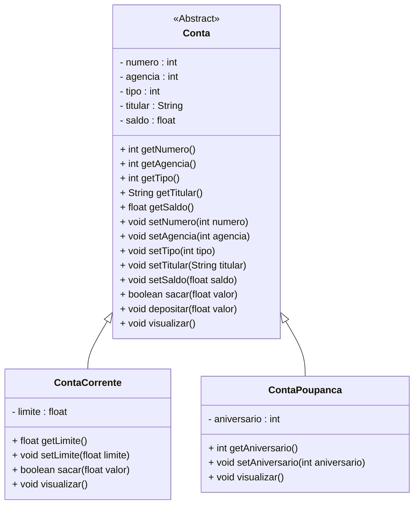

<h1>Projeto 01 - Conta Bancária - Classes Abstratas - Classe Conta</h1>


Na etapa anterior, implementamos as classes modelo **ContaCorrente** e **ContaPoupanca** como subclasses que herdam da classe **Conta**.

Nesta etapa, faremos a transformação da classe **Conta** em uma **classe abstrata**. Com essa alteração, o diagrama de classes do projeto passará a ter a seguinte estrutura:



<br />

<h2>👣 Passo 01 - Implementar a Classe Conta como Classe Abstrata</h2>


1. Abra a Classe **Conta**, localizada no Pacote **conta_bancaria.model**:

<div align="center"></div>

2. Adicione o modificador **abstract** na assinatura da Classe **Conta**, conforme indicado na imagem abaixo:

<div align="center"></div>

3. O código completo da Classe **Conta**, você confere abaixo:

```java
package conta_bancaria.model;

public abstract class Conta {
    
    private int numero;
	private int agencia;
	private int tipo;
	private String titular;
	private float saldo;

	public Conta(int numero, int agencia, int tipo, String titular, float saldo) {
		this.numero = numero;
		this.agencia = agencia;
		this.tipo = tipo;
		this.titular = titular;
		this.saldo = saldo;
	}

	public int getNumero() {
		return numero;
	}

	public void setNumero(int numero) {
		this.numero = numero;
	}

	public int getAgencia() {
		return agencia;
	}

	public void setAgencia(int agencia) {
		this.agencia = agencia;
	}

	public int getTipo() {
		return tipo;
	}

	public void setTipo(int tipo) {
		this.tipo = tipo;
	}

	public String getTitular() {
		return titular;
	}

	public void setTitular(String titular) {
		this.titular = titular;
	}

	public float getSaldo() {
		return saldo;
	}

	public void setSaldo(float saldo) {
		this.saldo = saldo;
	}

	public boolean sacar(float valor) {
		
		if(this.getSaldo() < valor) {
			System.out.println("Saldo Insuficiente!");
			return false;
		}
		
		this.setSaldo(this.getSaldo() - valor);
		return true;
		
	}
	
	public void depositar(float valor) {
		this.setSaldo(this.getSaldo() + valor);
	}
	
	public void visualizar() {

		String tipo = "";
		
		switch(this.tipo) {
		case 1:
			tipo = "Conta Corrente";
		break;
		case 2:
			tipo = "Conta Poupança";
		break;
		}
		
		System.out.println("\n\n***********************************************************");
		System.out.println("Dados da Conta:");
		System.out.println("***********************************************************");
		System.out.println("Numero da Conta: " + this.numero);
		System.out.println("Agência: " + this.agencia);
		System.out.println("Tipo da Conta: " + tipo);
		System.out.println("Titular: " + this.titular);
		System.out.printf("Saldo: R$ %.2f%n", this.saldo);
	}
    
}

```

Observe que a única alteração implementada na Classe Conta foi a adição do modificador **abstract** na assinatura da Classe.

<br />

<h2>👣 Passo 02 - Remover os Objetos da Classe Conta da Classe Menu</h2>


Como a Classe Conta se tornou uma Classe Abstrata, **não é possível instanciar Objetos desta Classe**. Observe na imagem abaixo, que depois de salvar a Classe Conta, automaticamente a Classe Menu apresentou uma indicação de erro:

<div align="center"></div>

Para corrigir o erro, precisamos remover o objeto da classe `Conta`, que foi criado na classe `Menu`, para testes. Lembre-se que ao tornar uma classe abstrata, o compilador impede sua instanciação direta, garantindo que objetos sejam criados apenas a partir de suas subclasses.

1. Abra a Classe Menu;
2. Apague o objeto da classe `Conta` e todos os seus testes, que foram criados na classe `Menu`, conforme indicado na imagem abaixo:

<div align="center"></div>

<br />

<h2>👣 Passo 03 - Ajustes na Classe Menu</h2>


Nesta etapa, vamos transformar a instância da classe `Scanner` em um **atributo estático compartilhado da classe `Menu`**, permitindo seu uso em todos os métodos, especialmente os métodos `static`.

1. Localize a linha: 

```java
Scanner leia = new Scanner(System.in);
```

2. Essa linha costuma estar declarada dentro do método `main`, como mostra a imagem abaixo:

<div align="center"></div>

3. **Mova essa linha para fora do método `main`, dentro da classe `Menu`**, declarando o `Scanner` antes de qualquer método, conforme a imagem abaixo:

<div align="center"></div>

*Essa mudança torna o objeto `leia` acessível globalmente dentro da classe `Menu`, ou seja, todos os métodos da classe poderão utilizá-lo.*

4. Altere a declaração para a seguinte forma:

```java
private static final Scanner leia = new Scanner(System.in);
```

5. O resultado vemos na imagem abaixo:

<div align="center"></div>

**Linha 12:** Com essa modificação, estamos criando uma **única instância imutável** da classe `Scanner`, acessível **exclusivamente dentro da classe `Menu`**, e compartilhada por todos os métodos **`static`**, com a finalidade de capturar a entrada de dados via teclado.

Essa estratégia é especialmente útil quando o código é organizado em métodos distintos, e todos eles precisam realizar leituras do usuário.

Como os métodos do menu, em sua maioria, são declarados como `static`, o atributo `Scanner` também deve ser `static`, permitindo seu uso direto, sem a necessidade de instanciar a classe `Menu`. O modificador `final` foi aplicado para garantir que a referência do objeto `leia` não possa ser alterada durante a execução do programa.

<br />

<h2>👣 Passo 04 - Executar o projeto</h2>


Após salvarmos, as 3 classes, vamos testar:

1. Para executar o Projeto Conta Bancária, abra a classe `Menu` e clique no botão **Run**, localizado na **Barra de Ferramentas**
2. Antes da exibição do menu, serão apresentados no console os **resultados das ações executadas pelos métodos** da classe `Conta`, conforme demonstrado abaixo:

```bash
***********************************************************
Dados da Conta:
***********************************************************
Numero da Conta: 2
Agência: 123
Tipo da Conta: Conta Corrente
Titular: José da Silva
Saldo: R$ 0,00
Limite de Crédito: R$ 1000,00

 Saldo Insuficiente!


***********************************************************
Dados da Conta:
***********************************************************
Numero da Conta: 2
Agência: 123
Tipo da Conta: Conta Corrente
Titular: José da Silva
Saldo: R$ 0,00
Limite de Crédito: R$ 1000,00


***********************************************************
Dados da Conta:
***********************************************************
Numero da Conta: 2
Agência: 123
Tipo da Conta: Conta Corrente
Titular: José da Silva
Saldo: R$ 5000,00
Limite de Crédito: R$ 1000,00


***********************************************************
Dados da Conta:
***********************************************************
Numero da Conta: 3
Agência: 123
Tipo da Conta: Conta Poupança
Titular: Maria dos Santos
Saldo: R$ 100000,00
Aniversário da conta: 15


***********************************************************
Dados da Conta:
***********************************************************
Numero da Conta: 3
Agência: 123
Tipo da Conta: Conta Poupança
Titular: Maria dos Santos
Saldo: R$ 99000,00
Aniversário da conta: 15


***********************************************************
Dados da Conta:
***********************************************************
Numero da Conta: 3
Agência: 123
Tipo da Conta: Conta Poupança
Titular: Maria dos Santos
Saldo: R$ 104000,00
Aniversário da conta: 15
```

Observe que o objeto da classe `Conta` foi removido.

O código completo da Classe Menu, você confere abaixo:

```java
package conta_bancaria;

import java.util.Scanner;

import conta_bancaria.model.ContaCorrente;
import conta_bancaria.model.ContaPoupanca;
import conta_bancaria.util.Cores;

public class Menu {

	public static final Scanner leia = new Scanner(System.in);
	
	public static void main(String[] args) {

		int opcao;

		// Teste da Classe Conta Corrente
		ContaCorrente cc1 = new ContaCorrente(2, 123, 1, "José da Silva", 0.0f, 1000.0f);
		cc1.visualizar();
		cc1.sacar(12000.0f);
		cc1.visualizar();
		cc1.depositar(5000.0f);
		cc1.visualizar();
		
        // Teste da Classe Conta Poupança
		ContaPoupanca cp1 = new ContaPoupanca(3, 123, 2, "Maria dos Santos", 100000.0f, 15);
		cp1.visualizar();
        cp1.sacar(1000.0f);
		cp1.visualizar();
		cp1.depositar(5000.0f);
		cp1.visualizar();
		
		while (true) {
			
			System.out.println(Cores.TEXT_YELLOW + Cores.ANSI_BLACK_BACKGROUND + "*****************************************************");
			System.out.println("                                                     ");
			System.out.println("                BANCO DO BRAZIL COM Z                ");
			System.out.println("                                                     ");
			System.out.println("*****************************************************");
			System.out.println("                                                     ");
			System.out.println("            1 - Criar Conta                          ");
			System.out.println("            2 - Listar todas as Contas               ");
			System.out.println("            3 - Buscar Conta por Numero              ");
			System.out.println("            4 - Atualizar Dados da Conta             ");
			System.out.println("            5 - Apagar Conta                         ");
			System.out.println("            6 - Sacar                                ");
			System.out.println("            7 - Depositar                            ");
			System.out.println("            8 - Transferir valores entre Contas      ");
			System.out.println("            0 - Sair                                 ");
			System.out.println("                                                     "); 
			System.out.println("*****************************************************");
			System.out.println("Entre com a opção desejada:                          ");
			System.out.println("                                                     ");
			opcao = leia.nextInt();
			
			if(opcao == 0) {
				System.out.println("\nBanco do Brazil com Z - O seu futuro começa aqui!");
				sobre();
                  leia.close();
				System.exit(0);
			}
			
			switch(opcao) {
			case 1:
				System.out.println("\n Criar Conta");
				
                 break;
			case 2:
				System.out.println("\n Listar todas as Contas");
				
                 break;
			case 3:
				System.out.println("\n Buscar Conta por número");
				
				break;
			case 4:
				System.out.println("\n Atualizar dados da Conta");
				
                 break;
			case 5:
				System.out.println("\n Apagar Conta");
				
                 break;
			case 6:
				System.out.println("\n Sacar");
				
				break;
             case 7:
				System.out.println("\n Depositar");
				
				break;
             case 8:
				System.out.println("\n Transferir");
				
				break;
			default:
				System.out.println("\nOpção Inválida");
                 break;
			}
        }
	}

    public static void sobre() {
		System.out.println("\n*********************************************************");
		System.out.println("Projeto Desenvolvido por: ");
		System.out.println("Generation Brasil - generation@generation.org");
		System.out.println("github.com/conteudoGeneration");
		System.out.println("*********************************************************");
	}
}
```

<br />

<div align="left"> <a href="https://github.com/rafaelq80/conta_bancaria_java/tree/07_Repository_ContaRepository" target="_blank"><b>Código fonte: Projeto Conta Bancária</b></a>

<br /><br />

<div align="left"><a href="README.md">Voltar</a></div>