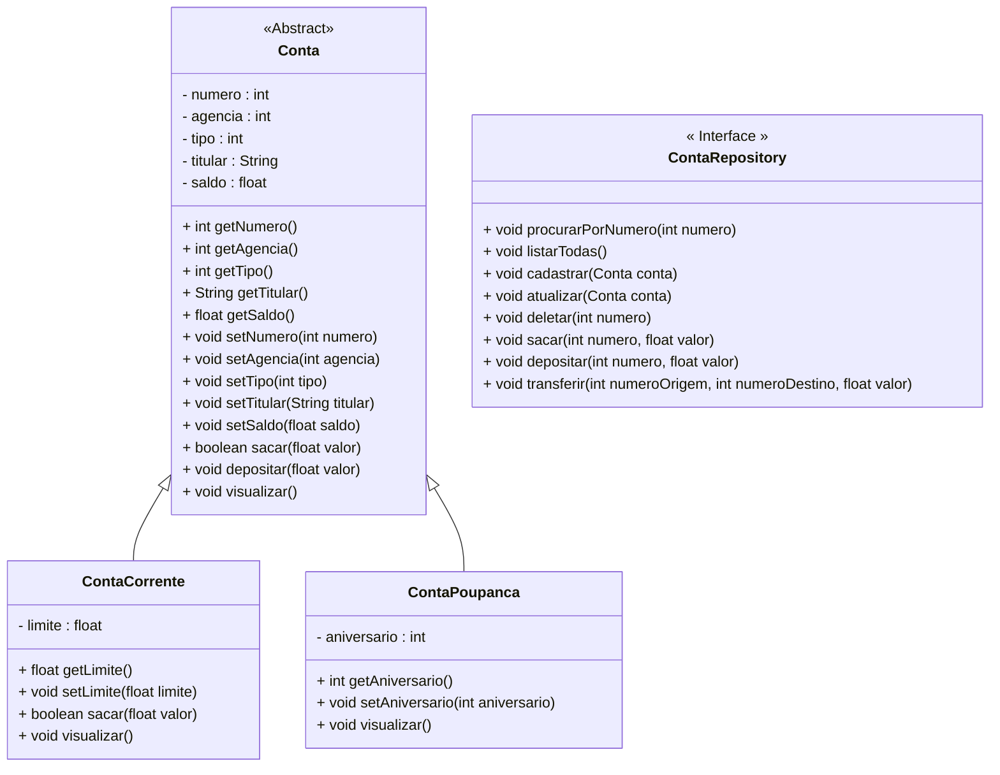

<h1>Projeto 01 - Conta Bancária - Interface - Interface ContaRepository</h1>


Na etapa anterior, implementamos a classe **Conta** como uma **classe abstrata**, ou seja, uma classe base que define atributos e comportamentos comuns, mas que não pode ser instanciada diretamente.

Nesta nova etapa, vamos criar a interface **ContaRepository**, que irá fornecer as **assinaturas dos métodos necessários** para manipular objetos das classes **ContaCorrente** e **ContaPoupanca**. Esses objetos, posteriormente, serão armazenados em uma **Collection**.

Os métodos definidos na interface `ContaRepository` serão implementados por uma classe concreta, a qual ficará responsável pela **lógica interna de cada operação**, como os métodos construtores, os acessores (`get` e `set`) e outras regras específicas. A interface, por sua vez, serve apenas como um **contrato**, ou seja, define **quais operações devem estar disponíveis**, sem se preocupar com **como** serão executadas.

O diagrama de classes do nosso projeto, até o momento, fica representado da seguinte forma:



<br />

<h2>👣 Passo 01 - Criar o Pacote Repository</h2>


No pacote principal da nossa aplicação (**conta**), vamos criar o pacote **repository**, que armazaenará a Interface que define os Métodos de Consulta, Inserção, Atualização e Exclusão dos dados das Contas (CRUD), além dos Métodos Bancários: Saque, Depósito e Transferências:

1. No lado esquerdo superior, na Guia **Package explorer**, clique com o botão direito do mouse sobre o pacote principal da nossa aplicação (**conta_bancaria**) e clique na opção **New 🡪 Package**, como mostra a imagem abaixo:

<div align="center"></div>

2. Na janela **New Java Package**, no item **Name**, informe o nome da package: **conta_bancaria.repository**, como mostra a imagem abaixo:

<div align="center"></div>

3. Clique no botão **Finish** para concluir.
3. A estrutura de pacotes da aplicação ficará igual a imagem abaixo:

<div align="center"></div>

<br />

<h2>👣 Passo 02 - Criar a Interface ContaRepository</h2>


Agora vamos criar a **Interface ContaRepository** no Pacote **repository**.

1. Clique com o botão direito do mouse sobre o **Pacote conta_bancaria.repository** e na sequência, clique na opção **New 🡪 Interface**, como mostra a imagem abaixo:

<div align="center"></div>

3. Na janela **New Java Interface**, no item **Name**, digite o nome da Interface (**ContaRepository**), como mostra a imagem abaixo:

<div align="center"></div>

4. Clique no botão **Finish** para concluir.
5. Na imagem abaixo, vemos o código inicial da **Interface ContaRepository**:

 <div align="left"></div>

<br />

> [!IMPORTANT]
>
> **Observe que a interface `ContaRepository` não possui o método `main()`**, pois **não se trata de uma classe e, muito menos, da classe principal do projeto**.
>
> O objetivo da interface é **definir um conjunto de métodos que deverão ser implementados por uma classe concreta**, responsável por manipular os objetos do tipo `Conta`, como `ContaCorrente` e `ContaPoupanca`.
>
> Em outras palavras, a interface atua como um **contrato**, garantindo que todas as operações necessárias — como cadastrar, listar, atualizar, deletar, sacar, depositar e transferir — estejam disponíveis, independentemente da implementação específica usada no projeto.

<br />

Agora, vamos implementar o código da interface `ContaRepository`, conforme ilustrado na imagem abaixo:

 <div align="left"></div>

**Linhas 8 a 12:** Foram definidas as assinaturas dos métodos relacionados ao **CRUD** (*Create, Read, Update e Delete*) dos objetos das classes `ContaCorrente` e `ContaPoupanca`. Esses métodos serão implementados na **classe `ContaController`**, que será desenvolvida na próxima etapa do Projeto **Conta Bancária**.

**Linhas 15 a 17:** Foram definidas as assinaturas dos métodos de **operações bancárias** — `sacar`, `depositar` e `transferir` — que também serão implementados na **classe `ContaController`**, nas próximas tarefas do projeto.

A seguir, você confere o código completo da interface `ContaRepository`:

```java
package conta_bancaria.repository;

import conta_bancaria.model.Conta;

public interface ContaRepository {

	// CRUD da Conta
	public void listarTodas();
	public void cadastrar(Conta conta);
   	public void procurarPorNumero(int numero);
	public void atualizar(Conta conta);
	public void deletar(int numero);
	
	// Métodos Bancários
	public void sacar(int numero, float valor);
	public void depositar(int numero, float valor);
	public void transferir(int numeroOrigem, int numeroDestino, float valor);
	
}
```

<br />

<h2>👣 Passo 03 - Executar o projeto</h2>


Após salvarmos, a interface, vamos testar:

1. Para executar o Projeto Conta Bancária, abra a classe `Menu` e clique no botão **Run**, localizado na **Barra de Ferramentas**
2. Antes da exibição do menu, serão apresentados no console os **resultados das ações executadas pelos métodos** da classe `Conta`, conforme demonstrado abaixo:

```bash
***********************************************************
Dados da Conta:
***********************************************************
Numero da Conta: 2
Agência: 123
Tipo da Conta: Conta Corrente
Titular: José da Silva
Saldo: R$ 0,00
Limite de Crédito: R$ 1000,00

 Saldo Insuficiente!


***********************************************************
Dados da Conta:
***********************************************************
Numero da Conta: 2
Agência: 123
Tipo da Conta: Conta Corrente
Titular: José da Silva
Saldo: R$ 0,00
Limite de Crédito: R$ 1000,00


***********************************************************
Dados da Conta:
***********************************************************
Numero da Conta: 2
Agência: 123
Tipo da Conta: Conta Corrente
Titular: José da Silva
Saldo: R$ 5000,00
Limite de Crédito: R$ 1000,00


***********************************************************
Dados da Conta:
***********************************************************
Numero da Conta: 3
Agência: 123
Tipo da Conta: Conta Poupança
Titular: Maria dos Santos
Saldo: R$ 100000,00
Aniversário da conta: 15


***********************************************************
Dados da Conta:
***********************************************************
Numero da Conta: 3
Agência: 123
Tipo da Conta: Conta Poupança
Titular: Maria dos Santos
Saldo: R$ 99000,00
Aniversário da conta: 15


***********************************************************
Dados da Conta:
***********************************************************
Numero da Conta: 3
Agência: 123
Tipo da Conta: Conta Poupança
Titular: Maria dos Santos
Saldo: R$ 104000,00
Aniversário da conta: 15
```

**Observe que, até este momento, não houve nenhuma mudança visível na execução do projeto.**

Isso ocorre porque, nesta etapa, apenas **definimos as assinaturas dos métodos** na interface `ContaRepository`, sem implementá-los.

Nas próximas tarefas, esses métodos serão **efetivamente implementados na classe `ContaController`**, permitindo que as funcionalidades de cadastro, consulta, atualização, exclusão e movimentações bancárias comecem a funcionar no projeto **Conta Bancária**.

<br />

<div align="left"> <a href="https://github.com/rafaelq80/conta_bancaria_java/tree/07_Repository_ContaRepository" target="_blank"><b>Código fonte: Projeto Conta Bancária</b></a>
<br /><br />

<div align="left"><a href="README.md">Voltar</a></div>