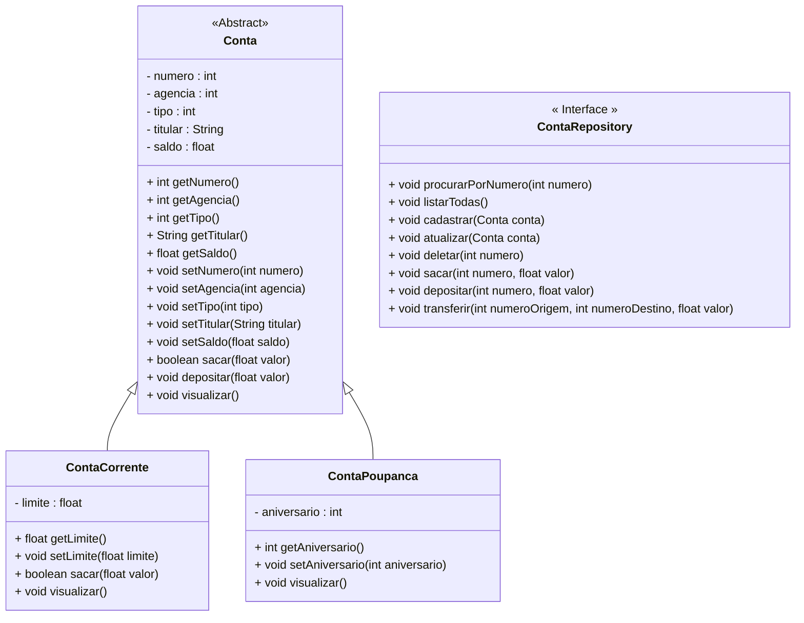

<h1>Projeto 01 - Conta Bancária - Interface - Interface ContaRepository</h1>

Na etapa anterior, implementamos a Classe **Conta** como uma Classe **Abstrata**. 

Nesta etapa, vamos criar a Interface **ContaRepository**, que fornecerá a assinatura dos Métodos necessários para manipular os Objetos das Classes **ContaCorrente** e **ContaPoupanca**, que posteriormente serão armazenados em uma Collection. 

Os Métodos da Interface ContaRepository, posteriormente, serão implementados em uma Classe, de modo a manter os detalhes da implementação (Métodos Construtores, Get e Set, por exemplo), encapsulados na nova Classe. A Interface fornece apenas as assinaturas dos Métodos. O Diagrama de Classes do nosso Projeto ficará da seguinte forma:



<br />

<h2>👣 Passo 01 - Criar o Pacote Repository</h2>

No pacote principal da nossa aplicação (**conta**), vamos criar o pacote **repository**, que armazaenará a Interface que define os Métodos de Consulta, Inserção, Atualização e Exclusão dos dados das Contas (CRUD), além dos Métodos Bancários: Saque, Depósito e Transferências:

1. No lado esquerdo superior, na Guia **Package explorer**, clique com o botão direito do mouse sobre o pacote principal da nossa aplicação (**conta**) e clique na opção **New 🡪 Package**, como mostra a animação abaixo:

<div align="center"></div>

2. Na janela **New Java Package**, no item **Name**, informe o nome da Package: **conta.repository**, como mostra a figura abaixo:

<div align="center"></div>

3. Clique no botão **Finish** para concluir.

<br />

<h2>👣 Passo 02 - Criar a Interface ContaRepository</h2>

Agora vamos criar a **Interface ContaRepository** no Pacote **repository**.

1. Clique com o botão direito do mouse sobre o **Pacote conta.repository** e na sequência, clique na opção **New 🡪 Interface**, como mostra a animação abaixo:

<div align="center"></div>

3. Na janela **New Java Interface**, no item **Name**, digite o nome da Interface (**ContaRepository**), como mostra a figura abaixo:

<div align="center"></div>

4. Clique no botão **Finish** para concluir.
5. Na imagem abaixo, vemos o código inicial da **Interface ContaRepository**:

 <div align="left"></div>


Vamos implementar o código da Interface ContaRepository. Vamos analisar o código abaixo:

 <div align="left"></div>

**Linhas 8 a 12:** Assinamos os Métodos do CRUD (Create, Read, Update e Delete), dos Objetos das Classes ContaCorrente e ContaPoupanca. Estes Métodos serão implementados na **Classe ContaController**, que será implementada na próxima Tarefa do Projeto Conta Bancária. 

**Linhas 15 a 17:** Assinamos os Métodos de Operações Bancárias (Saque, Deposito e Transferencia), dos Objetos das Classes ContaCorrente e ContaPoupanca. Estes Métodos também serão implementados na **Classe ContaController**, que será implementada na próxima Tarefa do Projeto Conta Bancária. 

O Código completo da Interface ContaRepository, você confere abaixo:

```java
package conta.repository;

import conta.model.Conta;

public interface ContaRepository {

	// CRUD da Conta
	public void procurarPorNumero(int numero);
	public void listarTodas();
	public void cadastrar(Conta conta);
	public void atualizar(Conta conta);
	public void deletar(int numero);
	
	// Métodos Bancários
	public void sacar(int numero, float valor);
	public void depositar(int numero, float valor);
	public void transferir(int numeroOrigem, int numeroDestino, float valor);
	
}
```

6. Salve e execute o projeto clicando no botão **Run**. 

Observe que não houve nenhuma mudança visível no projeto. Na próxima tarefa, os Métodos assinados na Interface ContaRepository serão implementados na Classe ContaController.

<br />

<div align="left"> <a href="https://github.com/rafaelq80/conta_bancaria_java/blob/07_Repository_ContaRepository/src/conta/repository/ContaRepository.java" target="_blank"><b>Código fonte: ContaRepository.java</b></a>

<br />

<div align="left"> <a href="https://github.com/rafaelq80/conta_bancaria_java/tree/07_Repository_ContaRepository" target="_blank"><b>Código fonte: Projeto Conta Bancária</b></a>


<br /><br />

<div align="left"><a href="README.md">Voltar</a></div>