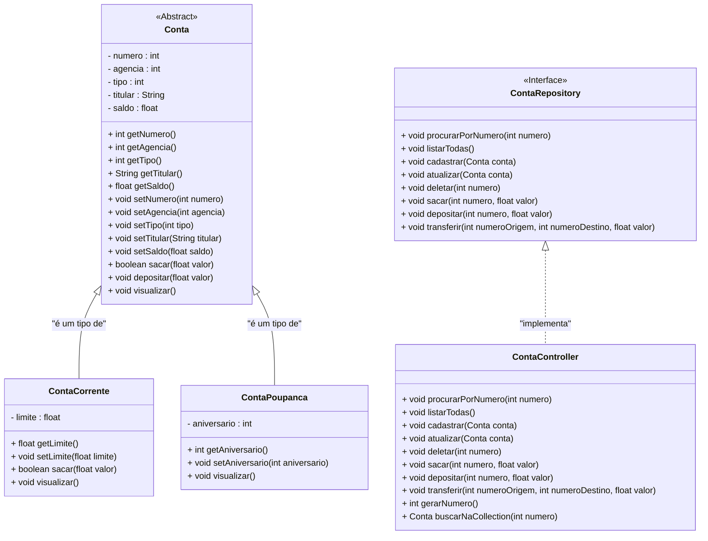

<h1>Projeto 01 - Conta Bancária - ContaController - Parte I</h1>


Nas etapas anteriores, implementamos a interface **ContaRepository**, onde foram assinados cinco métodos do **CRUD** (Criar Conta, Consultar todas as Contas, Consultar Conta pelo número, Atualizar dados da Conta e Apagar Conta) e três métodos bancários (Saque, Depósito e Transferência).

Nesta etapa, vamos criar a classe **ContaController**, que implementará a interface **ContaRepository**. Essa classe será responsável por manipular os objetos das classes **ContaCorrente** e **ContaPoupanca**, armazenando-os em uma coleção do tipo `List` (implementada pela classe `ArrayList`).

Além dos métodos definidos na interface **ContaRepository**, a classe **ContaController** também terá dois métodos auxiliares: **Gerar Número da Conta** e **Buscar Conta na Collection**.

Nesta primeira parte, implementaremos os métodos: **Consultar todas as Contas** e **Criar Conta**.

A estrutura final do projeto, representada pelo **Diagrama de Classes**, ficará conforme apresentado a seguir:



<br />

<h2>👣 Passo 01 - Criar o Pacote Controller</h2>


No pacote principal da nossa aplicação (**conta_bancaria**), vamos criar o pacote **controller**, que armazenará a Classe que implementará os Métodos de Consulta, Inserção, Atualização e Exclusão dos dados das Contas (CRUD), além dos Métodos Bancários: Saque, Depósito e Transferências:

1. No lado esquerdo superior, na Guia **Package explorer**, clique com o botão direito do mouse sobre o pacote principal da nossa aplicação (**conta_bancaria**) e clique na opção **New 🡪 Package**, como mostra a imagem abaixo:

<div align="center"></div>

2. Na janela **New Java Package**, no item **Name**, informe o nome da Package: **conta_bancaria.controller**, como mostra a imagem abaixo:

<div align="center"></div>

3. Clique no botão **Finish** para concluir.
3. A estrutura de pacotes da aplicação ficará igual a imagem abaixo:

<div align="center"></div>

<br />

<h2>👣 Passo 02 - Criar a Classe ContaController</h2>


Agora vamos criar a **classe ContaController** no pacote **conta_bancaria.controller**.

1. Clique com o botão direito do mouse sobre o **pacote conta_bancaria.controller** e na sequência, clique na opção **New 🡪 Class**, como mostra a imagem abaixo:

<div align="center"></div>

3. Na janela **New Java Class**, no item **Name**, digite o nome da Classe (**ContaController**), como mostra a imagem abaixo:

<div align="center"></div>

4. Clique no botão **Finish** para concluir.
5. Na imagem abaixo, vemos o código inicial da **Classe ContaController**:

 <div align="left"></div>

Vamos iniciar a implementação da classe **`ContaController`**, que será responsável por manipular os objetos das classes `ContaCorrente` e `ContaPoupanca`. Essa classe implementará os métodos definidos na **interface `ContaRepository`**, conforme descrito anteriormente.

A implementação será feita **gradualmente, método a método**, para facilitar o entendimento de cada parte do processo. Após a criação de cada método, **implementaremos os respectivos métodos necessários na classe `Menu`**, que serão responsáveis por interagir com os métodos da classe `ContaController`. Dessa forma, as opções do menu poderão utilizar corretamente as funcionalidades implementadas. Ao final de cada etapa, **realizaremos testes práticos para validar o comportamento e garantir que tudo esteja funcionando conforme o esperado**.

Vamos começar **implementando a interface `ContaRepository` na classe concreta `ContaController`**, utilizando o seguinte código:

 <div align="left"></div>

**Linha 3:** Importamos a interface `ContaRepository` (destacado na imagem acima pela **seta vermelha**).

**Linha 5:** Através da palavra reservada **`implements`**, indicamos que a classe `ContaController` implementa a interface `ContaRepository` (destacado na imagem acima pela **linha verde**).

Observe que a classe `ContaController` (em destaque na cor **vermelho**) ainda apresenta um erro. Posicione o mouse sobre o nome da classe para visualizar a sugestão de correção, conforme mostrado na imagem a seguir:

 <div align="left"></div>

A mensagem de erro informa que a classe `ContaController` **deve implementar todos os métodos da interface `ContaRepository`**, mesmo que eles ainda não sejam utilizados. 

Clique no link **“Add unimplemented methods”** (indicado pela **seta vermelha**) para gerar automaticamente todos os métodos da interface.

 <div align="left"></div>

Note que todos os **8 métodos da interface `ContaRepository`** serão **implementados automaticamente** pela IDE. Neste momento, os métodos ainda estão com **corpo vazio** e prontos para que possamos desenvolvê-los individualmente, de forma gradual.

Em seguida, vamos **criar uma `Collection` que armazenará os dados de todas as contas**, funcionando como uma **simulação de banco de dados em memória** da nossa aplicação. Essa estrutura será responsável por armazenar, consultar, atualizar e excluir as contas criadas durante a execução do programa. Veja na imagem abaixo:

 <div align="left"></div>

**Linha 11:** Criamos uma **Collection do tipo `ArrayList`**, parametrizada com a classe abstrata **`Conta`**, e a nomeamos como **`listaContas`**. Essa lista será responsável por armazenar todas as contas criadas durante a execução do sistema, funcionando como um **banco de dados em memória**.

**Linha 12:** Além da coleção, também declaramos uma variável do tipo **`int`**, chamada **`numero`**, que será utilizada para **armazenar o número da última conta criada**. A cada nova conta registrada, esse número será incrementado automaticamente, garantindo que todas as contas possuam numeração sequencial e única.

<br />

<h3>Como a Colection ArrayList irá armazenar os dados?</h3>


Na imagem abaixo, temos uma representação gráfica da Collection ArrayList **listaContas**:

 <div align="left"></div>

Observe que a Collection **`listaContas`** é do tipo **`Conta`** (classe abstrata), e cada novo objeto de suas **subclasses** (`ContaCorrente` ou `ContaPoupanca`) será **armazenado em uma nova linha** da lista.

Assim como nos vetores, **cada posição (linha) da Collection é identificada por um índice numérico inteiro**, começando em 0.

A estrutura **ArrayList preserva a ordem de inserção**, ou seja, **cada novo objeto é adicionado ao final da lista**, mantendo a sequência em que as contas foram criadas.

Embora a Collection <code>listaContas</code> seja declarada como do tipo <strong>Conta</strong> (classe abstrata), ela pode armazenar objetos das classes <code>ContaCorrente</code> e <code>ContaPoupanca</code>. Isso é possível porque essas classes <strong>herdam</strong> a classe <code>Conta</code>, e essa flexibilidade é garantida pelo **Polimorfismo por Inserção**.

<br />

<h2>👣 Passo 03 - Criar o Método Listar Todas - Classe ContaController</h2>


Na sequência, vamos implementar o **método listarTodas**, conforme apresentado no código abaixo:

<div align="center"></div>

**Linha 19:** Observe que a assinatura do método **não possui parâmetros**, pois ele será responsável por exibir **todos os objetos da classe `Conta`** armazenados na `Collection` **listaContas**.

**Linha 20:** Utilizamos o laço de repetição **for...each** para percorrer toda a `Collection listaContas`.

Nesse contexto, a variável local **`conta`**, utilizada para representar um objeto da classe `Conta` a cada iteração, foi declarada com a palavra reservada **`var`**.

> ### 📌 O que é o `var`?
>
> O `var` é uma **palavra-chave introduzida no Java**, que permite declarar **variáveis locais com inferência de tipo**, ou seja, o compilador determina automaticamente o tipo da variável com base no valor atribuído no momento da declaração.
>
> **Exemplo:**
>
> ```java
> var numero = 1;
> ```
>
> O compilador entende que `numero` é do tipo `int`, sendo equivalente a:
>
> ```java
> int numero = 1;
> ```
>
> Essa abordagem **reduz a verbosidade** do código e torna a leitura mais fluida, especialmente em casos com tipos genéricos mais complexos.
>
> <br />
>
> ### ⚠️ Restrições de uso
>
> Apesar de útil, o uso de `var` possui algumas limitações importantes:
>
> - **Só pode ser usado em variáveis locais**, dentro de métodos, blocos ou estruturas de controle.
> - **Não pode ser usado em campos de classe (atributos)**.
> - **O valor deve ser inicializado no momento da declaração**, pois o tipo é inferido a partir do valor atribuído.
>
> #### 🚫 Exemplos inválidos:
>
> ```java
> // Erro: variável de instância
> private var nome; // ❌ Não permitido
> 
> // Erro: sem valor de inicialização
> var idade; // ❌ Não permitido, pois o tipo não pode ser inferido
> ```
>
> <br />
>
> ### 💡 Quando usar `var`
>
> - Quando o tipo da variável é óbvio e melhora a legibilidade do código.
> - Para reduzir a repetição em tipos genéricos:
>
> ```java
> // Sem var
> Map<String, List<Integer>> mapa = new HashMap<>();
> 
> // Com var
> var mapa = new HashMap<String, List<Integer>>();
> ```
>
> O `var` é um recurso que traz mais **clareza e simplicidade** ao código, desde que usado com consciência. Ele **não torna Java uma linguagem de tipagem dinâmica** — a inferência é feita **em tempo de compilação**, e o tipo continua sendo fixo.
>
> <br />
>
> <div align="left"> <a href="https://docs.oracle.com/en/java/javase/13/language/local-variable-type-inference.html" target="_blank"><b>Documentação: Palavra Reservada var</b></a></div>
>
> <br />

No caso do método **`listarTodas`**, como o laço percorre uma `Collection` de objetos `Conta`, o compilador entende que a variável `conta` deve ser tratada como um objeto da classe `Conta`.

**Linha 21:** Invocamos o método **`visualizar`**, responsável por exibir os dados da conta armazenada na variável `conta`. Esse método foi definido na classe model `Conta` e sobrescrito, quando necessário, nas classes filhas **`ContaCorrente`** e **`ContaPoupanca`**.

💾 **Salve as alterações antes de prosseguir!**

<br />

<h2>👣 Passo 04 - Criar o Método Listar Contas - Classe Menu</h2>


Vamos criar o método **listarContas** na classe **Menu**, que terá a função de executar o método **listarTodas** da classe **ContaController**:

1. Na classe **Menu**, insira a linha de código abaixo dentro do escopo da classe, **após a declaração da instância do Scanner (`leia`) e antes do método `main`**:

```java
private static final ContaController contaController = new ContaController();
```

2. Na imagem abaixo, você pode conferir essa alteração, indicada pela seta vermelha:

<div align="center"></div>

**Linha 15:** Criamos um objeto da classe **`ContaController`**, que será responsável por armazenar os dados das contas na coleção `listaContas` e executar os métodos do CRUD, bem como os métodos bancários da aplicação.

Além disso, essa instância foi declarada como **`static`** e **`final`**, ou seja, será criada uma única instância **global e constante** do controlador, evitando múltiplas criações desnecessárias e facilitando o gerenciamento dos dados das contas em todo o sistema.

3. Ainda na classe **Menu**, dentro do escopo da classe, **após a declaração do método sobre()**, adicione o método `listarContas()`, como mostra a imagem abaixo:

<div align="center"></div>

**Linha 124:** Declaração do método `listarContas` como **`private`** e **`static`**, sem parâmetros e sem valor de retorno (`void`).

- **`private`**: o método só pode ser acessado dentro da própria classe onde foi declarado (no caso, `Menu`).
- **`static`**: o método pertence à classe e pode ser chamado sem precisar instanciar um objeto da classe.

**Linha 126:** Chama o método `listarTodas`, através da instância `contaController`, da classe `ContaController`. Essa chamada executa a lógica para listar todas as contas armazenadas na coleção `listaContas`.

4. Na Classe Menu, localize o trecho de código abaixo:

<div align="center"></div>

5. Insira a chamada ao método `listarContas` conforme a imagem abaixo:

<div align="center"></div>

**Linha 69:** Executa o método **`listarContas`** da classe **`Menu`**, que por sua vez chama o método **`listarTodas`** da classe **`ContaController`**, para listar os dados de todas as contas armazenadas na coleção **`listaContas`**.

💾 **Salve as alterações antes de prosseguir!**

<br />

<h2>👣 Passo 05 - Executar o projeto</h2>


Vamos testar a função **2 - Listar todas as Contas** do Projeto Conta Bancária:

1. Para executar o Projeto Conta Bancária, abra a classe `Menu` e clique no botão **Run**, localizado na **Barra de Ferramentas**
2. Será exibido do menu, conforme a imagem abaixo:

<div align="center"></div>

2. Digite a opção **2** (Listar todas as Contas) e veja o resultado abaixo:

```bash
Listar todas as Contas


Pressione Enter para Continuar...

```

Observe que nenhum dado de conta foi exibido, pois as contas criadas para teste **ainda não foram inseridas na Collection `listaContas`**, que está vazia no momento. Para que possamos adicionar contas a essa coleção, é necessário implementar o método **`cadastrar`**, responsável por registrar os objetos de conta na lista.

<br />

<h2>👣 Passo 06 - Criar o Método Cadastrar - Classe ContaController</h2>


Na sequência, vamos implementar o **método Cadastrar Conta**, na classe ContaController, conforme apresentado no código abaixo:

<div align="center"></div>

**Linha 23:** Observe que, na assinatura do método, foi inserido como parâmetro um objeto da classe **`Conta`**, chamado **`conta`**. Esse objeto será adicionado na coleção **`listaContas`**.

**Linha 24:** Para inserir um novo objeto na coleção, utilizamos o método **`add()`** da classe **`ArrayList`**, passando como argumento o objeto **`conta`**.

**Linha 25:** Exibe uma mensagem no console indicando que o objeto **`conta`** foi adicionado à coleção **`listaContas`**. Para identificar a conta cadastrada, utilizamos o método **`getNumero`** da classe model `Conta`, que retorna o número da conta, que foi cadastrada.

Para que o usuário possa cadastrar uma nova conta, é necessário solicitar a entrada dos dados via teclado — **com exceção do número da conta**, que será gerado automaticamente. Esse número será atribuído por meio do método **`gerarNumero()`**, implementado na classe **`ContaController`**, garantindo a criação de identificadores únicos e sequenciais para cada conta registrada.

A entrada dos demais dados será realizada por meio do método **`cadastrarConta()`**, localizado na classe **`Menu`**. Ambos os métodos serão implementados na sequência.

<br />

<h2>👣 Passo 07 - Criar o Método Auxiliar gerarNumero - Classe ContaController</h2>


Para gerar automaticamente o número da conta, vamos criar o método auxiliar **`gerarNumero`** no final da classe `ContaController`, após o método `transferir`, conforme o código abaixo:

<div align="center"></div>

**Linha 62:** Observe que na assinatura do Método não foi inserido nenhum parâmetro, porque o Método tem como único Objetivo retornar o número da conta todas as vezes que uma nova conta for cadastrada.

**Linha 63:** Como a variável numero foi inicializada com zero (0), vamos incrementar a variável através do operador de **pré-incremento (++)**, incrementando de 1 em 1, a cada nova conta que for criada. Este número será retornado como o número da nova Conta. Desta forma, automatizaremos o processo de geração do número da conta, através de uma sequência:

- **1º conta criada** 🡒 *numero = 1*
- **2º conta criada** 🡒 *numero = 2*
- ...
- **N conta criada** 🡒 *numero = N*

> [!IMPORTANT]
>
>  Na prática, este método simula a chave primária auto-incrementável de um banco de dados, assunto que será aprofundado no Bloco 2.

💾 **Salve as alterações antes de prosseguir!**

<br />

<h2>👣 Passo 08 - Criar o Método Cadastrar Conta - Classe Menu</h2>


Para gerar o objeto da classe `Conta`, que será posteriormente adicionado à coleção `listaContas`, é necessário capturar os dados via teclado. Para isso, implementaremos o método `cadastrarConta` na classe `Menu`, que funcionará como um **formulário interativo**.

Esse formulário será implementado com os comandos de entrada (`Scanner`) e saída (`System.out.println`), permitindo que o usuário cadastre uma nova conta por meio do menu da aplicação.

O formulário solicitará os seguintes dados:

- **Número da agência**
- **Nome do titular**
- **Tipo da conta**: Corrente ou Poupança
- **Saldo inicial**
- **Limite** (exclusivo para contas do tipo Corrente)
- **Aniversário** (exclusivo para contas do tipo Poupança)

O número da conta será gerado automaticamente pelo método `gerarNumero`, da classe ContaController.

<br />

### 🧹 Etapa 1 - Limpeza do Código de Teste


Antes de implementarmos o método `cadastrarConta`, precisamos **remover todos os objetos de teste das classes `ContaCorrente` e `ContaPoupanca`, que foram criados na classe `Menu`, para simular o funcionamento da aplicação.

1. Localize as linhas indicadas na imagem abaixo:

<div align="center"></div>

2. Exclua todas essas linhas, pois elas não serão mais utilizadas.

<br />

### 🧩 Etapa 2 - Implementação do Método `cadastrarConta`


3. Na classe `Menu`, **logo após o método `listarContas`**, adicione o método `cadastrarConta`, como vemos na imagem abaixo:

<div align="center"></div>

**Linhas 134 a 139:** Foram criadas as entradas de dados via teclado para os atributos **agencia** e **titular**.

**Linha 138:** Utilizamos o método `skip("\r\n")` da classe `Scanner` para limpar o buffer do teclado e garantir que o `nextLine()` funcione corretamente com nomes compostos.

**Linhas 141 e 142:** Foi criada a entrada de dados via teclado para o atributo **tipo**, que pode ser:

- `1` para Conta Corrente
- `2` para Conta Poupança

**Linhas 144 e 145:** Foi criada a entrada de dados via teclado para o atributo **saldo**.

**Linhas 147 a 159:** Foi criada uma Estrutura Condicional do tipo **Switch Expression**, que checará qual o tipo da conta. 

- Caso a conta seja do **tipo 1 - Conta Corrente**, será solicitada a entrada de dados via teclado para o atributo **limite** e executa o Método **cadastrar** da classe **ContaController**, criando uma nova Conta Corrente.
- Caso a conta seja do **tipo 1 - Conta Poupanca**, será solicitada a entrada de dados via teclado para o atributo **aniversario** e executa o Método **cadastrar** da classe **ContaController**, criando uma nova Conta Poupanca.

> ### 📌 O que é o Switch Expression?
>
> **Switch Expression** é uma versão mais enxuta, moderna e expressiva do tradicional `switch/case`. Ela permite tratar múltiplos casos com mais elegância, tornando o código mais limpo, conciso e menos propenso a erros como a omissão do `break`.
>
> <br />
>
> **Exemplo - Switch Tradicional** 
>
> ```java
> switch (diaSemana) {
>     case 1:
>         System.out.println("Domingo");
>         break;
>     case 2:
>         System.out.println("Segunda-Feira");
>         break;
>     case 3:
>         System.out.println("Terça-Feira");
>         break;
>     case 4:
>         System.out.println("Quarta-Feira");
>         break;
>     case 5:
>         System.out.println("Quinta-Feira");
>         break;
>     case 6:
>         System.out.println("Sexta-Feira");
>         break;
>     case 7:
>         System.out.println("Sábado");
>         break;
> }
> ```
>
> <br />
>
> **Exemplo - Switch Expression**
>
> ```java
> switch (diaSemana) {
>     case 1 -> System.out.println("Domingo");
>     case 2 -> System.out.println("Segunda-Feira");
>     case 3 -> System.out.println("Terça-Feira");
>     case 4 -> System.out.println("Quarta-Feira");
>     case 5 -> System.out.println("Quinta-Feira");
>     case 6 -> System.out.println("Sexta-Feira");
>     case 7 -> System.out.println("Sábado");
> }
> ```
>
> <br />
>
> 🔎 **Vantagens**:
>
> - Código mais conciso.
> - Evita erros com `break`.
> - Pode ser usado para retornar valores (expressão completa).
>
> <br />
>
> ### ⚠️ Restrições e Considerações
>
> - Só pode ser usado com **valores constantes** (como `int`, `String`, `enum`, `char`).
> - **Não substitui completamente** o switch tradicional em todos os contextos, como por exemplo quando múltiplas instruções complexas precisam ser executadas por `case`.
>
> <br />
>
> <div align="left"> <a href="https://docs.oracle.com/en/java/javase/13/language/switch-expressions.html" target="_blank"><b>Documentação: Switch Expressions</b></a></div>
>
> <br />

**Linha 151:** Observe que dentro do Método **cadastrar** foi criado um Objeto da Classe **ContaCorrente**, composto pelos valores das variáveis auxiliares, que receberam dados via teclado. O Atributo **numero**, foi preenchido com o Método auxiliar **gerarNumero()**, criado na Classe **ContaController**.

**Linha 156:** Observe que dentro do Método **cadastrar** foi criado um Objeto da Classe **ContaPoupanca**, composto pelos valores das variáveis auxiliares, que receberam dados via teclado. O Atributo **numero**, foi preenchido com o Método auxiliar **gerarNumero()**, criado na Classe **ContaController**.

<br />

### ⚙️ Etapa 3 - Inserir a Chamada do Método no Menu


4. Na Classe Menu, localize o trecho de código abaixo:

<div align="center"></div>

5. Insira a chamada ao método `cadastrarConta` conforme a imagem abaixo:

<div align="center"></div>

**Linha 64:** Executa o método `cadastrarConta` da classe `Menu`, que coleta os dados digitados pelo usuário e, com base no tipo da conta, cria um objeto e executa o método `cadastrar` da classe `ContaController`, adicionando o novo objeto à coleção `listaContas`.

💾 **Salve as alterações antes de prosseguir!**

<br />

<h2>👣 Passo 09 - Executar o projeto</h2>


Vamos testar a função **1 - Criar Conta** do Projeto Conta Bancária:

1. Para executar o Projeto Conta Bancária, abra a classe `Menu` e clique no botão **Run**, localizado na **Barra de Ferramentas**
2. Será exibido do menu, conforme a imagem abaixo:

<div align="center"></div>

2. Digite a opção **1** (Criar Conta) e observe o resultado:

```bash
Criar Conta

Digite o Numero da Agência: 
123
Digite o Nome do Titular: 
João da Silva
Digite o Tipo da Conta (1-CC ou 2-CP): 
1
Digite o Saldo da Conta (R$): 
1000
Digite o Limite de Crédito (R$): 
500

A Conta número: 1 foi criada com sucesso!


Pressione Enter para Continuar...

```

3. Note que a conta corrente foi cadastrada com sucesso. 
3. Pressione a tecla Enter e, em seguida, crie uma conta poupança:

```bash
Criar Conta

Digite o Numero da Agência: 
456
Digite o Nome do Titular: 
Maria da Silva
Digite o Tipo da Conta (1-CC ou 2-CP): 
2
Digite o Saldo da Conta (R$): 
2000
Digite o dia do Aniversario da Conta: 
10

A Conta número: 2 foi criada com sucesso!


Pressione Enter para Continuar...
```

5. Note que a conta poupança também foi cadastrada com sucesso. 
6. Pressione a tecla Enter e, na sequência, digite a opção **2** (Listar todas as Contas) e observe o resultado:

```bash
Listar todas as Contas

*********************************************************************
Dados da Conta:
*********************************************************************
Numero da Conta: 1
Agência: 123
Tipo da Conta: Conta Corrente
Titular: João da Silva
Saldo: R$ 1000,00
Limite de Crédito: R$ 500,00


*********************************************************************
Dados da Conta:
*********************************************************************
Numero da Conta: 2
Agência: 456
Tipo da Conta: Conta Poupança
Titular: Maria da Silva
Saldo: R$ 2000,00
Aniversário da conta: 10

Pressione Enter para Continuar...

```

Observe que desta vez foram exibidos os dados das 2 contas cadastradas, porque as contas foram inseridas na coleção **listaContas**.

<br />

<h2>👣 Passo 10 - Inserir dados para Teste</h2>


Como a coleção **`listaContas`** não persiste os dados de forma definitiva, como ocorreria em um banco de dados, seria trabalhoso criar novas contas sempre que precisarmos testar a aplicação.

Para facilitar os testes, vamos criar alguns objetos do tipo `Conta` diretamente na classe **Menu**, inserindo-os na Collection **`listaContas`** sempre que o projeto for executado, através do método `criarContasTeste`.

1. Na classe `Menu`, **logo após o método `cadastrarConta`**, adicione o seguinte método:

<div align="center"></div>

**Linhas 165 a 172:** **Criar 2 objetos da classe `ContaCorrente` e 2 objetos da classe `ContaPoupanca`**, inserindo-os na coleção **`listaContas`**. 

4. Na Classe Menu, localize o trecho de código abaixo:

<div align="center"></div>

5. Insira a chamada ao método `criarContasTeste()` conforme a imagem abaixo:

<div align="center"></div>

**Linha 19:** Executa o método `criarContasTeste` da classe `Menu`, que instancia 2 objetos da classe `ContaCorrente` e 2 objetos da classe `ContaPoupanca`, utilizando o método `gerarNumero` para criar os números das contas. Em seguida, cada objeto é cadastrado na coleção `listaContas` por meio do método `cadastrar` da classe `ContaController`.

Desta forma, o método será chamado **automaticamente toda vez que o projeto for executado**, permitindo que o sistema inicie com dados previamente cadastrados na coleção `listaContas` para fins de teste e validação das funcionalidades.

Salve todas as classes!

> [!NOTE]
>
> **DESAFIO!** 
>
> Após a criação do método `criarContasTeste`, execute a aplicação, experimente a opção Listar todas as contas novamente e verifique se os dados das 4 contas foram listadas. 
>
> A melhor forma de aprender uma Linguagem de Programação é praticando!

A implementação dos Métodos do CRUD, continuam na parte II...

<br /><br />

<div align="left"><a href="README.md">Voltar</a></div>
