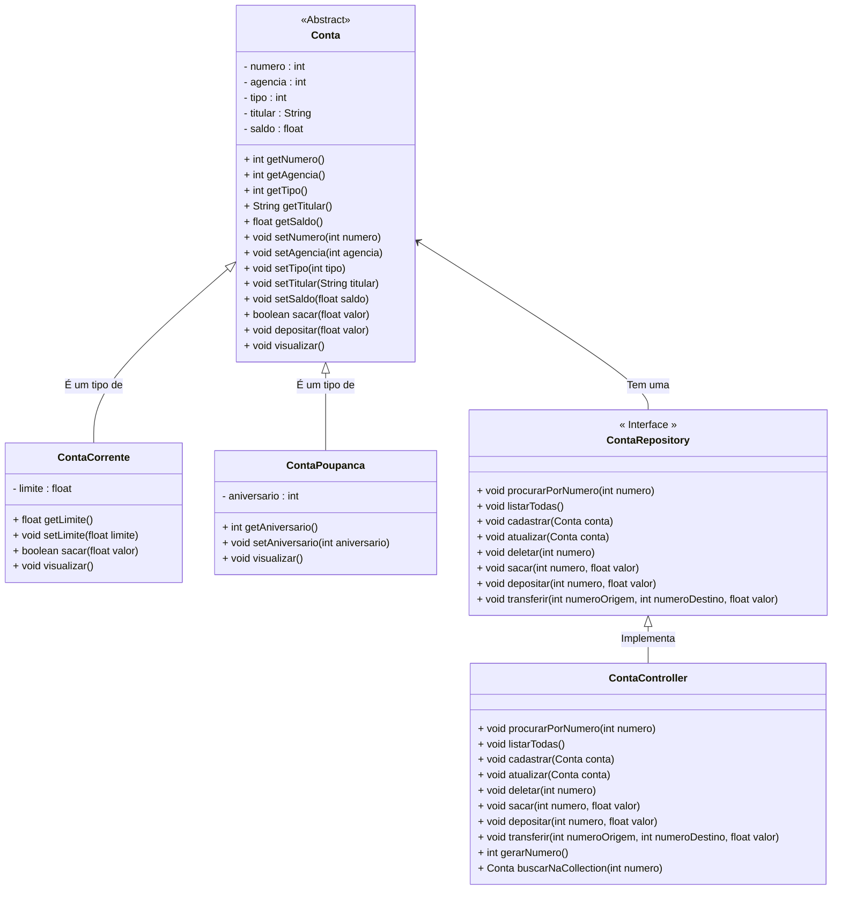

<h1>Projeto 01 - Conta Bancária - ContaController - Parte I</h1>


Na etapa anterior, implementamos a Interface **ContaRepository**, onde foram assinados 5 Métodos do CRUD (Criar Conta, Consultar todas as Contas, Consultar Conta pelo número, Atualizar dados da Conta e Apagar Conta) e 3 Métodos Bancários (Saque, Depósito e Transferência). 

Nesta etapa, vamos criar a Classe **ContaController**, que implementará a Interface **ContaRepository**, que possui a assinatura dos Métodos necessários para manipular os Objetos das Classes **ContaCorrente** e **ContaPoupanca**, e armazená-los em uma Collection do tipo List (Classe ArrayList). Além dos Métodos da Interface **ContaRepository**, também serão implementados 3 Métodos auxiliares (Gerar Numero da Conta, Buscar Conta na Collection e Retornar Tipo da Conta).

O Diagrama de Classes do nosso Projeto ficará da seguinte forma:



<br />

<h2>👣 Passo 01 - Criar o Pacote Controller</h2>

No pacote principal da nossa aplicação (**conta**), vamos criar o pacote **controller**, que armazenará a Classe que implementará os Métodos de Consulta, Inserção, Atualização e Exclusão dos dados das Contas (CRUD), além dos Métodos Bancários: Saque, Depósito e Transferências:

1. No lado esquerdo superior, na Guia **Package explorer**, clique com o botão direito do mouse sobre o pacote principal da nossa aplicação (**conta**) e clique na opção **New 🡪 Package**, como mostra a animação abaixo:

<div align="center"></div>

2. Na janela **New Java Package**, no item **Name**, informe o nome da Package: **conta.controller**, como mostra a figura abaixo:

<div align="center"></div>

3. Clique no botão **Finish** para concluir.

<br />

<h2>👣 Passo 02 - Criar a Classe ContaController</h2>

Agora vamos criar a **Interface ContaController** no Pacote **controller**.

1. Clique com o botão direito do mouse sobre o **Pacote conta.controller** e na sequência, clique na opção **New 🡪 Class**, como mostra a animação abaixo:

<div align="center"></div>

3. Na janela **New Java Class**, no item **Name**, digite o nome da Interface (**ContaController**), como mostra a figura abaixo:

<div align="center"></div>

4. Clique no botão **Finish** para concluir.
5. Na imagem abaixo, vemos o código inicial da **Classe ContaController**:

 <div align="left"></div>

Vamos implementar o código da Classe **ContaController** aos poucos, Método a Método. Após a implementação de cada Método, faremos as alterações necessárias na Classe Menu, para utilizar os Métodos e faremos os respectivos testes.

Vamos começar implementando a Interface ContaRepository na Classe ContaController, através do código abaixo:

 <div align="left"></div>

**Linha 3:** Importamos a Interface ContaRepository (destacado na imagem acima pela seta vermelha). 

**Linha 5:** Através da palavra reservada **implements**, implementamos a Interface ContaRepository na Classe Conta Controller (destacado na imagem acima pela linha azul). Observe que a Classe ContaController (destacado na imagem acima em vermelho), ainda continua com erro. Posicione o Mouse sobre o nome da Classe e veja a imagem abaixo:

 <div align="left"></div>

Observe que a mensagem de erro, informa que a Classe ContaController deve implementar todos os Métodos da Interface ContaRepository, independente de utilizá-los ou não. Clique no link **Add unimplemented methods** (indicado por uma seta na vermelha na imagem acima) para implementar todos os Métodos da Interface ContaRepository.

 <div align="left"></div>

Observe que todos os 8 Métodos da Interface serão implementados, de forma semelhante a imagem acima. Na imagem aparecem os 2 primeiros Métodos, mas no código você notará que foram implementados os 8 Métodos da Interface ContaRepository.

Na sequência, vamos criar a Collection que irá armazenar os dados de todas as Contas, funcionando como um Banco de dados em Memória da nossa aplicação.

 <div align="left"></div>

**Linha 10:** Criamos uma **Collection ArrayList**, do tipo Conta (Classe Abstrata), chamada **listaContas**. 

**Linha 11:** Criamos uma variável do tipo **int** chamada **numero**, armazenará o numero da última conta que foi criada. 

<h2>Como a Colection ArrayList irá armazenar os dados?</h2>

Na imagem abaixo, temos uma representação gráfica da Collection ArrayList **listaContas**:

 <div align="left"></div>

Observe que a Collection **listaContas**, será do tipo **Conta** (Classe Principal) e cada novo Objeto das suas respectivas Sub-Classes, que estendem (herdam) a Classe Conta, será adicionado em uma linha da Collection ArrayList. Assim como os vetores, cada linha é identificada por um número inteiro (índice).

A Collection ArrayList sempre respeita a ordem em que o Objeto foi inserido, ou seja, a cada novo Objeto inserido, uma nova linha será criada após o último Objeto adicionado.

|  | <div align="left"> **ATENÇÃO:** Embora a Collection listaContas seja do tipo Conta (Classe Abstrata), ela consegue armazenar Objetos do tipo ContaCorrente e ContaPoupanca, por se tratarem de Classes que Herdam as características da Classe Conta. Esse conceito é chamado de Polimorfismo de Inserção.</div> |
| ------------------------------------------------------------ | ------------------------------------------------------------ |

<br />

<h2>👣 Passo 03 - Implementar o Método Listar todas as Contas</h2>

Na sequência, vamos implementar o Método Listar todas as Contas, através do código abaixo:

<div align="center"></div>

**Linha 19:** Observe que na assinatura do Método não foi inserido nenhum parâmetro, porque o Método exibirá todos os  Objetos da Classe Conta, armazenados na Collection **listaContas**.

**Linha 20:** Através do Laço de Repetição **for...each**, percorremos toda a **Collection listaContas**. 

Observe que a variável local **conta**, utilizada para receber um Objeto da Classe Conta a cada iteração da Collection, definida pelo Laço de repetição, foi criada através da palavra reservada **var**.

> **var:** É uma palavra reservada do Java, que tem o objetivo de criar variáveis locais, sem a definição do tipo. O tipo da variável é definido por inferência, ou seja, a palavra reservada var define o tipo da variável através do valor de inicialização da variável.
>
> **Exemplo:** 
>
> ```java
> var teste = 1;
> ```
>
> Como o valor atribuído é um inteiro, a palavra reservada **var** entende que esta variável deve ser criada com o tipo **int** (integer), ou seja, o equivalente ao código abaixo:
>
> ```java
> int teste = 1;
> ```
> <br />
>
> <div align="left"> <a href="https://docs.oracle.com/en/java/javase/13/language/local-variable-type-inference.html" target="_blank"><b>Documentação: Palavra Reservada var</b></a>


No código do Método **listarTodas()**, como o Laço de Repetição está percorrendo a Collection listaContas, que armazena Objetos da Classe Conta, a palavra reservada **var** entende por inferência, que a variável **conta** deve ser criada como um Objeto da Classe Conta.

**Linha 21:** Exibe os dados do Objeto da Classe Conta armazenado na variável **conta**, através do Método **visualizar()**, que foi criado na Classe Model Conta e Herdado pelas Classes **ContaCorrente** e ContaPoupanca.

Salve as alterações!

<br />

<h2>👣 Passo 04 - Inserir o Método Listar todas as Contas na Classe Menu</h2>

Agora que implementamos o Método Listar todas as Contas, vamos inserir uma chamada para este Método na Classe Menu:

1. Na Classe Menu, Insira a linha de código abaixo (indicado por uma seta vermelha), no início do Método main():

<div align="center"></div>

**Linha 16:** Cria um Objeto da Classe **ContaController**, para armazenar os dados das contas na Collection listaContas e executar os Métodos do CRUD e os Métodos Bancários.

2. Ainda na Classe Menu, localize o trecho de código abaixo:

<div align="center"></div>

3. Insira a linha de código abaixo (indicado por uma seta vermelha):

<div align="center"></div>

**Linha 83:** Executa o Método **listarTodas()**, da Classe **ContaController**, para listar os dados de todas as contas armazenadas na Collection **listaContas**.

Salve e Execute o projeto clicando no botão **Run**. 

1. Será aberto o Menu, que deve ser semelhante ao da figura abaixo:

<div align="center"></div>

2. Digite a opção **2** (indicado com uma seta verde na imagem acima) e veja o resultado abaixo:

```bash
Listar todas as Contas


Pressione Enter para Continuar...

```

Observe que não foram exibidos os dados de nenhuma conta, porque as contas que nós criamos para teste não foram inseridas na Collection **listaContas**, logo ela está vazia. Para inserirmos dados na Collection **listaContas**, precisamos implementar o Método **cadastrar(Conta conta)**.

<br />

<h2>👣 Passo 05 - Criar o Método Cadastrar Conta</h2>

Na sequência, vamos implementar o Método Cadastrar Conta, através do código abaixo:

<div align="center"></div>

**Linha 27:** Observe que na assinatura do Método, foi inserido como parâmetro um Objeto da Classe Conta, chamado **conta**. Este Objeto será adicionado na Collection **listaContas**.

**Linha 28:** Para inserir um novo Objeto da Classe Conta, utilizamos o Método **add()**, da Collection **ArrayList**, passando como parâmetro o Objeto da Classe Conta, chamado **conta**.

**Linha 29:** Exibe uma mensagem no console, indicando que o Objeto da Classe Conta, chamado **conta** foi adicionado na Collection **listaContas**. Para identificar a conta que foi criada, utilizamos o Método **getNumero()**, da Classe Model Conta, que retornará o número da conta.

Para gerar automaticamente o número da conta, vamos criar o Método auxiliar **gerarNumero()**, no final da Classe ContaController, através do código abaixo:

<div align="center"></div>

**Linha 62:** Observe que na assinatura do Método não foi inserido nenhum parâmetro, porque o Método tem como único Objetivo retornar o número da conta todas as vezes que uma nova conta for cadastrada.

**Linha 63:** Como a variável numero foi inicializada com zero (0), vamos incrementar a variável através do operador de **pré-incremento (++)**, incrementando de 1 em 1, a cada nova conta que for criada. Este número será retornado como o número da nova Conta. Desta forma, automatizaremos o processo de geração do número da conta, através de uma sequência:

- **1º conta criada** 🡒 *numero = 1*
- **2º conta criada** 🡒 *numero = 2*
- ...
- **N conta criada** 🡒 *numero = N*

Salve as alterações!

|  | <div align="left"> **IMPORTANTE:** Na prática, este Método simula a Chave Primária de um Banco de dados, do tipo auto-incremento, que será tema de estudo do Bloco 2.</div> |
| ------------------------------------------------------------ | ------------------------------------------------------------ |

Para gerar o Objeto da Classe Conta, precisamos receber os dados da Conta, via teclado. Para receber os dados via teclado, precisamos criar um "formulário" para cadastrar os dados da Conta através dos Comandos de Entrada e Saída.

<br />

<h2>👣 Passo 06 - Inserir o Método Cadastrar Conta na Classe Menu</h2>

Agora que implementamos o Método Cadastrar Conta, vamos inserir uma chamada para este Método na Classe Menu:

Para Criar uma nova conta, precisamos criar as entradas de dados, ou seja, criar um formulário de cadastro. Para começar, vamos limpar o código da Classe Menu, removendo os Objetos das Classes ContaCorrente e ContaPoupanca, que foram criados para testar a Classe e não serão mais necessários. 

1. Localize no código da Classe Menu as linhas indicadas na imagem abaixo:

<div align="center"></div>

2. Apague estas linhas e Salve o arquivo.

Na sequência, vamos criar algumas variáveis, que irão armazenar temporariamente os dados da nova conta.

1. Crie as novas variáveis na Classe Menu, como mostra o trecho de código abaixo:

<div align="center"></div>

2. O trecho acima, cria as seguintes variáveis:

| Nome        | Tipo   | Descrição                                                    |
| ----------- | ------ | ------------------------------------------------------------ |
| numero      | int    | Numero da conta                                              |
| agencia     | int    | Numero da agência                                            |
| tipo        | int    | Tipo da conta:<br />**1**: *Conta Corrente*<br />**2**: *Conta Poupança* |
| aniversario | int    | Dia do aniversário da Conta Poupança                         |
| titular     | String | Nome do titular da conta                                     |
| saldo       | float  | Saldo disponível na conta                                    |
| limite      | float  | Limite de crédito da conta corrente                          |

<br />

|  | <div align="left"> **ALERTA DE BSM:** *Mantenha a Atenção aos Detalhes ao criar as novas  variáveis na Classe Menu. A variável *opcao*, já havia sido criada na construção da Classe Menu.* </div> |
| ------------------------------------------------------------ | ------------------------------------------------------------ |

<br />

Variáveis criadas, vamos criar o formulário de cadastro e criar a chamada para o Método Cadastrar na Classe Menu

1. Na Classe Menu, localize o trecho de código abaixo:

<div align="center"></div>

2. Insira o trecho de código abaixo:

<div align="center"></div>

**Linhas 65 a 69:** Foram criadas as entradas de dados via teclado para as variáveis **agencia** e **titular**.

**Linha 63:** Observe que foi adicionado o comando **skip** da Classe Scanner. O Método **skip** ignora a entrada que corresponde ao padrão especificado, ignorando os  delimitadores. Em nosso projeto, estamos ignorando **\r** (quebra de linha), para permitir que o comando **nextLine()** leia palavras compostas. Lembre-se que o titular possui pelo menos nome e um sobrenome.

**Linhas 71 a 74:** Foi criado um Laço de repetição **do...while**, para garantir que a variável **tipo** receba via teclado somente os números **1** - *Conta Corrente ou **2** - *Conta Poupança*.

**Linhas 76 a 77:** Foi criada a entrada de dados via teclado para a variável **saldo**.

**Linhas 79 a 90:** Foi criado um Laço condicional do tipo **Switch Expression**, que checará qual o tipo da conta. 

- Caso a conta seja do tipo **Conta Corrente (tipo 1)**, solicita a entrada de dados via teclado para a variável **limite** e executa o Método **cadastrar** da Classe **ContaController**.
- Caso a conta seja do tipo **Conta Poupança (tipo 2)**, solicita a entrada de dados via teclado para a variável **aniversario** e executa o Método **cadastrar** da Classe **ContaController**.

**Linha 83:** Observe que dentro do Método **cadastrar** foi criado um Objeto da Classe **ContaCorrente**, composto pelos valores das variáveis auxiliares, que receberam dados via teclado. O Atributo **numero**, foi preenchido com o Método auxiliar **gerarNumero()**, criado na Classe **ContaController**.

**Linha 88:** Observe que dentro do Método **cadastrar** foi criado um Objeto da Classe **ContaPoupanca**, composto pelos valores das variáveis auxiliares, que receberam dados via teclado. O Atributo **numero**, foi preenchido com o Método auxiliar **gerarNumero()**, criado na Classe **ContaController**.

> **Switch Expression** é uma nova sintaxe, ligeiramente modificada, para o Laço Condicional Switch Case. Com ele, as distinções de caso podem ser formuladas com muito mais elegância, deixando o código mais limpo.
>
> **Exemplo - Switch Case:**
>
> ```java
> switch (dia_semana)
> {
> case 1:
> System.out.println("Domingo");
> break;
> case 2:
> System.out.println("Segunda-Feira");
> break;
> case 3:
> System.out.println("Terça-Feira");
> break;
> case 4:
> System.out.println("Quarta-Feira");
> break;
> case 5:
> System.out.println("Quinta-Feira");
> break;
> case 6:
> System.out.println("Sexta-Feira");
> break;
> case 7:
> System.out.println("Sábado");
> break;
> }
> ```
>
> **Exemplo - Switch Expression:**
>
> ```java
> switch (dia_semana)
> {
> case 1 -> System.out.println("Domingo");
> case 2 -> System.out.println("Segunda-Feira");
> case 3 -> System.out.println("Terça-Feira");
> case 4 -> System.out.println("Quarta-Feira");
> case 5 -> System.out.println("Quinta-Feira");
> case 6 -> System.out.println("Sexta-Feira");
> case 7 -> System.out.println("Sábado");
> }
> ```
>
> Observe que o código escrito com a **Switch Expression** fica muito mais simples e limpo, além de dispensar o uso da instrução **break**.
>
> <br />
>
> <div align="left"> <a href="https://docs.oracle.com/en/java/javase/13/language/switch-expressions.html" target="_blank"><b>Documentação: Switch Expressions</b></a>
> 
>

Salve e Execute o projeto clicando no botão **Run**. 

1. Será aberto o Menu, semelhante ao da figura abaixo:

<div align="center"></div>

2. Digite a opção **1** e faça o Cadastro de uma nova Conta Corrente, como mostra o console abaixo:

```bash
Criar Conta

Digite o Numero da Agência: 
123
Digite o Nome do Titular: 
João da Silva
Digite o Tipo da Conta (1-CC ou 2-CP): 
1
Digite o Saldo da Conta (R$): 
1000
Digite o Limite de Crédito (R$): 
500

A Conta número: 1 foi criada com sucesso!


Pressione Enter para Continuar...

```

3. Observe que a Conta foi Cadastrada com sucesso. Pressione a tecla enter e crie uma Conta Poupança:

```bash
Criar Conta

Digite o Numero da Agência: 
456
Digite o Nome do Titular: 
Maria da Silva
Digite o Tipo da Conta (1-CC ou 2-CP): 
2
Digite o Saldo da Conta (R$): 
2000
Digite o dia do Aniversario da Conta: 
10

A Conta número: 2 foi criada com sucesso!


Pressione Enter para Continuar...
```

4. Digite a opção 2 (indicado com uma seta verde na imagem abaixo):

<div align="center"></div>

5. Veja o resultado abaixo:

```bash
Listar todas as Contas

*********************************************************************
Dados da Conta:
*********************************************************************
Numero da Conta: 1
Agência: 123
Tipo da Conta: Conta Corrente
Titular: João da Silva
Saldo: 1000.0
Limite de Crédito: 500.0


*********************************************************************
Dados da Conta:
*********************************************************************
Numero da Conta: 2
Agência: 456
Tipo da Conta: Conta Poupança
Titular: Maria da Silva
Saldo: 2000.0
Aniversário da conta: 10

Pressione Enter para Continuar...

```

Observe que desta vez foram exibidos os dados das 2 contas cadastradas, porque as contas foram inseridas na Collection **listaContas**.

Como a Collection **listaContas** não persiste (grava) os dados de forma definitiva, como um Banco de dados, daria muito trabalho criar novas contas todas as vezes que precisarmos testar a aplicação. Para simplificar, vamos criar alguns Objetos Conta na Classe Menu, para alimentar a Collection **listaContas** toda vez que executarmos o projeto.

Insira o trecho de código abaixo na Classe Menu:

<div align="center"></div>

O trecho de código destacado em vermelho, cria 2 Objetos da Classe ContaCorrente e 2 Objetos da Classe ContaPoupanca, dentro da Collection **listaContas**, todas as vezes que o projeto for executado.

|  | **DESAFIO:** Após inserir o trecho de código acima, experimente o Método Listar todas as contas e e verifique se os dados das 4 contas foram listadas. A melhor forma de aprender uma Linguagem de Programação é praticando! |
| ------------------------------------------------------------ | :----------------------------------------------------------- |

A implementação dos Métodos do CRUD, continuam na parte II...

<br /><br />

<div align="left"><a href="README.md">Voltar</a></div>
