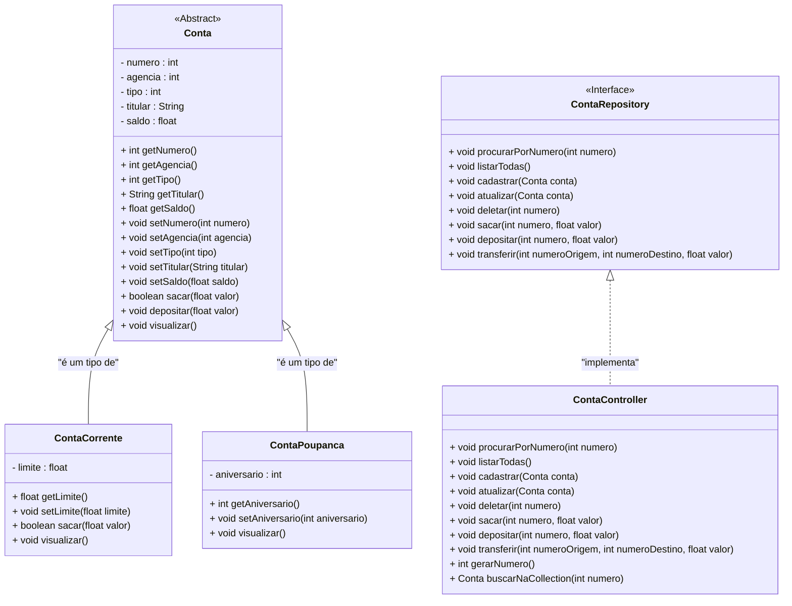

<h1>Projeto 01 - Conta Bancária - ContaController - Parte II</h1>


Na etapa anterior, criamos a classe **`ContaController`**, que **implementa a interface `ContaRepository`**. Essa interface define a assinatura dos métodos necessários para manipular objetos das classes **`ContaCorrente`** e **`ContaPoupanca`**, armazenando-os em memória por meio de uma estrutura **`List`**, instanciada como um **`ArrayList`**.

Foram implementados os métodos **`listarTodas()`** e **`cadastrar()`**, definidos na interface **`ContaRepository`**, além de um método auxiliar chamado **`gerarNumeroConta()`**, responsável por gerar um identificador numérico único para cada nova conta criada.

Na classe **`Menu`**, foram desenvolvidos os métodos correspondentes **`listarContas()`** e **`cadastrarConta()`**, que atuam como formulários de entrada de dados. Esses métodos são responsáveis por capturar as informações fornecidas pelo usuário via teclado e encaminhar para a classe **`ContaController`**, executando os respectivos métodos.

Nesta nova etapa, daremos continuidade à implementação dos demais métodos do CRUD, previstos na interface **`ContaRepository`**, bem como dos métodos auxiliares que apoiam a manipulação, consulta e organização das contas armazenadas na aplicação.

A estrutura final do projeto, representada pelo **Diagrama de Classes**, ficará conforme apresentado a seguir:



<br />

<h2>👣 Passo 01 - Criar o Método Auxiliar buscarNaCollection - Classe ContaController</h2>


Antes de implementarmos o método `procurarPorNumero`, é necessário criar um método auxiliar chamado **`buscarNaCollection`**, posicionado ao final da classe **`ContaController`**, depois do método `gerarNumero`. Esse método será responsável por localizar e retornar um objeto do tipo **`Conta`** com base no número da conta informado, conforme ilustrado abaixo:

<div align="center"></div>

**Linha 66:** A assinatura do método **`buscarNaCollection`** recebe como parâmetro uma variável do tipo **`int`**, chamada **`numero`**, que representa o número da conta que se deseja localizar. Note que o método retornará um objeto da classe Conta, que pode ser uma Conta Corrente ou Conta Poupança.

**Linha 67:** Utiliza-se um laço de repetição **`for-each`** para percorrer todos os elementos da **coleção `listaContas`**.

**Linha 68:** É realizada uma comparação entre o número informado como parâmetro (**`numero`**) e o número da conta armazenado no objeto **`conta`**, acessado por meio do método **`getNumero`**.

**Linha 69:** Caso os números sejam iguais, o método retorna o objeto **`conta`** correspondente e interrompe a execução do laço.

**Linha 73:** Se nenhum objeto com o número correspondente for encontrado na coleção **`listaContas`**, o método retorna **`null`**, indicando que a conta não foi localizada.

<br />

<h2>👣 Passo 02 - Implementar o Método Procurar por Numero - Classe ContaController</h2>


Após a criação do método auxiliar, vamos implementar o método **`procurarContaPorNumero`**, responsável por localizar e exibir os dados de uma conta específica, com base no número informado. Abaixo, temos o código correspondente:

<div align="center"></div>

**Linha 29:** A assinatura do método **`procurarContaPorNumero`** define como parâmetro uma variável do tipo **`int`**, denominada **`numero`**, que representa o número da conta a ser localizada dentro da coleção de contas cadastradas.

**Linha 30:** A variável local **`conta`** é declarada utilizando a palavra-chave **`var`**, que permite a **inferência de tipo**. Nesse contexto, o compilador deduz que **`conta`** é do tipo **`Conta`**, já que ela recebe como valor o retorno do método **`buscarNaCollection(numero)`**, o qual pode retornar um objeto da classe **`Conta`** ou **`null`**, caso nenhuma correspondência seja encontrada.

**Linhas 32 a 36:** O Bloco Condicional **`if-else`** é utilizado para verificar se o objeto **`conta`** retornado é diferente de **`null`**:

- Se a conta for localizada, seus dados são exibidos por meio do método **`visualizar()`**, que foi originalmente definido na classe model **`Conta`** e **sobrescrito** nas subclasses **`ContaCorrente`** e **`ContaPoupanca`**, respeitando as características específicas de cada tipo de conta.
- Caso contrário, uma mensagem será exibida informando que a conta não foi encontrada.

Para que o usuário possa realizar a busca de uma conta específica, é necessário solicitar, via teclado, a entrada do número da conta desejada. Essa funcionalidade será implementada por meio do método **`procurarContaPorNumero()`**, localizado na classe **`Menu`**, que funcionará como um formulário de consulta textual interativo.

<br />

<h2>👣 Passo 03 - Criar o Método Procurar Conta por Número - Classe Menu</h2>


Vamos implementar o método **`procurarContaPorNumero()`** na classe **`Menu`**, que atuará como um **formulário de consulta interativo**.

A consulta solicitará apenas o **Número da Conta**, que será lido via teclado e, em seguida, repassado como argumento para o método **`procurarPorNumero(int numero)`**, pertencente à classe **`ContaController`**. 

1. Na classe `Menu`, **logo após o método `criarContasTeste`**, adicione o método `procurarContaPorNumero`, como vemos na imagem abaixo:

<div align="center"></div>

**Linhas 179 e 180:** É realizada a entrada de dados via teclado, utilizando a classe **`Scanner`**, para capturar o valor da variável **`numero`**, que representa o número da conta a ser consultada na coleção **`listaContas`**.

**Linha 181:** Consome a **quebra de linha pendente** deixada pelo `nextInt()`. Isso é necessário porque, ao pressionar `Enter` após digitar o número, o caractere de nova linha (`\n`) permanece no buffer e poderia interferir em leituras futuras com `nextLine()`. Esta linha "limpa" o buffer.

> ### 📌 O que é um Buffer de Dados?
>
> O **buffer de dados** é como uma **área de espera** na memória do computador. Ele serve para **armazenar temporariamente os dados** enquanto eles estão sendo enviados de um lugar para outro — por exemplo, do **teclado para o programa Java**.
>
> **Exemplo do dia a dia**
>
> Imagine uma fila em um banco. As pessoas (dados) esperam na fila (buffer) até que sejam atendidas pelo caixa (programa).
>
> Quando você digita algo no teclado e **pressiona a tecla Enter**, os dados digitados não vão direto para o programa. Eles primeiro são armazenados no **buffer de entrada**, uma espécie de “memória intermediária”.
>
> Depois disso, a **JVM (Java Virtual Machine)** lê esse conteúdo do buffer e entrega ao seu código, normalmente por meio de comandos como:
>
> ```java
> Scanner leia = new Scanner(System.in);
> String nome = leia.nextLine(); // Lê os dados que estavam no buffer
> ```
>
> Saber que existe um buffer ajuda a entender por que, às vezes, o programa "pula" uma entrada ou parece não esperar pelo usuário: é porque **a entrada já estava no buffer**, e o programa leu rapidamente.

**Linha 183:** O método **`procurarContaPorNumero`**, da classe **`ContaController`**, é executado com o argumento **`numero`**, recebido via teclado. Esse método será responsável por buscar, na coleção **`listaContas`**, o objeto da classe **`Conta`** que possui o número correspondente. 

- Caso encontrado, os dados da conta serão exibidos na tela; 
- Caso contrário, será apresentada uma mensagem informando que a conta não foi localizada.

2. Na Classe Menu, localize o trecho de código abaixo:

<div align="center"></div>

3. Insira a chamada ao método `procurarContaPorNumero` no local indicado na imagem abaixo:

<div align="center"></div>

**Linha 80:** Executa o método **`procurarContaPorNumero`**, da classe **`Menu`**, que solicita ao usuário o número da conta via teclado. Em seguida, esse valor é utilizado para invocar o método **`procurarContaPorNumero`**, da classe **`ContaController`**, responsável por localizar o objeto correspondente na coleção **`listaContas`** e exibir seus dados, caso a conta seja encontrada.

💾 **Salve as alterações antes de prosseguir!**

<br />

<h2>👣 Passo 04 - Executar o projeto</h2>


Vamos testar a função **3 - Buscar Conta por Numero** do Projeto Conta Bancária:

1. Para executar o Projeto Conta Bancária, abra a classe `Menu` e clique no botão **Run**, localizado na **Barra de Ferramentas**
2. Será exibido do menu, conforme a imagem abaixo:

<div align="center"></div>

3. Digite a opção **3** (Buscar Conta por Numero) e observe o resultado:

```bash
Consultar dados da Conta - por número

Digite o número da conta: 
1

***********************************************************
Dados da Conta:
***********************************************************
Numero da Conta: 1
Agência: 123
Tipo da Conta: Conta Corrente
Titular: João da Silva
Saldo: R$ 1000,00
Limite: R$ 100,00

Pressione Enter para Continuar...
```

Observe que ao procurarmos a conta numero **1**, a conta foi encontrada e os seus dados foram exibidos na tela. 

4. Experimente repetir a operação e digitar o numero 10:

```bash
Consultar dados da Conta - por número

Digite o número da conta: 
10

A Conta número: 10 não foi encontrada!

Pressione Enter para Continuar...
```

Observe que ao procurarmos a conta numero **10**, a conta não foi encontrada e uma mensagem foi exibida na tela. 

<br />

<h2>👣 Passo 05 - Implementar o Método Atualizar - Classe ContaController</h2>


Na sequência, vamos implementar o **método Atualizar Conta**, responsável por modificar todos os dados de uma conta já existente, exceto o **numero** e o **tipo**, conforme o código apresentado abaixo:

<div align="center"></div>

**Linha 41:** Observe que, na assinatura do método, foi definido como parâmetro um objeto da classe `Conta`, chamado **`conta`**. Esse objeto representa a conta com os dados atualizados que deverão ser aplicados na coleção **`listaContas`**.

**Linha 42:** Antes de atualizar a conta na lista, é necessário verificar se ela existe. Para isso, foi criada a variável local **`buscaConta`**, que recebe o retorno do método **`buscarNaCollection()`**, responsável por localizar a conta na lista com base no número da conta, obtido por meio do método **`getNumero()`** do objeto `conta`.

**Linhas 44 a 49:** Foi criado um bloco condicional `if` que verifica se a conta foi encontrada:

- **Se encontrada**, o objeto da conta será substituído na coleção `listaContas` por meio do método **`set()`**, que recebe dois parâmetros:
  - **`listaContas.indexOf(buscaConta)`**: retorna o índice (posição) da conta encontrada dentro da lista.
  - **`conta`**: representa o novo objeto com os dados atualizados que substituirá o objeto anterior.
- **Caso contrário**, ou seja, se o objeto `buscaConta` for `null`, será exibida uma mensagem informando que a conta não foi localizada.

Na prática, o método `set()` atualiza a lista substituindo a conta armazenada anteriormente pelo novo objeto `conta`, recebido como argumento do método `atualizar`. Isso garante que os dados atualizados da conta sejam refletidos corretamente na posição correspondente da lista.

💾 **Salve as alterações antes de prosseguir!**

Para permitir que o usuário atualize os dados de uma conta existente, será necessário solicitar novamente as informações via teclado — **com exceção do tipo da conta**, que será identificado previamente antes da execução da atualização.

Essa funcionalidade será implementada no método **`atualizarConta()`**, que deve ser criado dentro da classe **`Menu`**.

<br />

<h2>👣 Passo 06 - Criar o Método Atualizar Conta - Classe Menu</h2>


Para atualizar os dados de uma conta existente na coleção `listaContas`, será implementado o método `atualizarConta` na classe `Menu`. Esse método funcionará como um **formulário interativo de edição**, permitindo a entrada de dados via teclado.

Antes da edição, o sistema identificará o **tipo da conta (Corrente ou Poupança)** com base na busca feita na coleção. Assim, os campos específicos de cada tipo serão exibidos:

- **Número da conta**
- **Número da agência**
- **Nome do titular**
- **Saldo atualizado**
- **Limite** (apenas para contas Corrente)
- **Aniversário** (apenas para contas Poupança)

O **número da conta** e o **tipo da conta** **não poderão ser alterados**, pois são dados fixos da conta original.

Ao final, uma nova instância será criada com os dados informados e **substituirá** a versão anterior na coleção utilizando o método `set`.

1. Na classe `Menu`, **logo após o método `procurarContaPorNumero`**, adicione o método `atualizarConta`, como vemos na imagem abaixo:

<div align="center"></div>

**Linhas 193 e 194:** Exibe no console a mensagem solicitando ao usuário o número da conta a ser atualizada, lê o número digitado pelo usuário e armazena na variável `numero`.

**Linha 195:** Consome a **quebra de linha pendente** deixada pelo `nextInt()`, ou seja,  "limpa" o buffer.

**Linha 197:** Chama o método `buscarNaCollection` para localizar a conta com o número informado e armazena o resultado na variável `conta`.

**Linhas 199 a 243:** Bloco condicional que verifica se a conta foi encontrada (`conta != null`) e, em caso positivo, permite sua atualização.

**Linhas 201 a 204:** Recupera os dados atuais da conta: número da agência, nome do titular, saldo e tipo (1 = Corrente, 2 = Poupança), armazenando-os em variáveis auxiliares.

**Linha 206:** Exibe o número da agência atual e solicita ao usuário um novo número. Informa que, ao pressionar apenas ENTER, o valor atual será mantido.

**Linha 207:** Lê a entrada do usuário como `String` na variável `entrada`. O uso de `nextLine()` é necessário porque permite capturar entradas vazias (ENTER sem digitação).

A variável `entrada` é reutilizada para todos os campos, pois apenas o método `Scanner.nextLine()` é capaz de interpretar corretamente uma entrada vazia. Métodos como `nextInt()` e `nextFloat()` **não aceitam entrada vazia** como válida.

**Linha 208:** Usa o método `isEmpty()`, da classe `String`, para verificar se o usuário pressionou ENTER:

- Caso a variável entrada esteja vazia, o numero da agência atual será mantido; 
- Caso contrário, atualiza o numero da agência com o novo valor informado, que será convertido de `String` para `int`, porque o numero da agência é do tipo `int`. 

Observe que na **Linha 208** foram utilizados dois novos recursos:

- O operador ternário, conhecido como "if ternário", para testar a condição
- O método `Integer.parseInt(entrada)`, para converter uma `String` em um número do tupo `int`.

> ### 📌 O que é o **`Operador Ternário`** em Java?
>
> O **`Operador Ternário`** é uma **forma compacta** de escrever estruturas condicionais simples no Java. Ele é ideal para decisões que envolvem apenas **duas possibilidades**: uma para o caso verdadeiro e outra para o caso falso.
>
> Sua estrutura básica é:
>
> ```java
> condição ? valorSeVerdadeiro : valorSeFalso;
> ```
>
> Essa expressão é conhecida como *if ternário* porque utiliza **três operandos**:
>
> 1. A condição a ser avaliada;
> 2. O valor retornado se a condição for verdadeira;
> 3. O valor retornado se a condição for falsa.
>
> <br />
>
> **Exemplo tradicional com `if`:**
>
> ```java
> int idade;
> if (maiorDeIdade) {
>     idade = 18;
> } else {
>     idade = 17;
> }
> ```
>
> **Equivalente usando `operador ternário`:**
>
> ```java
> int idade = maiorDeIdade ? 18 : 17;
> ```
>
> Essa forma reduz a quantidade de linhas de código e melhora a legibilidade, especialmente para **atribuições simples**.
>
> <br />
>
> <div align="left"> <a href="https://docs-oracle-com.translate.goog/javase/tutorial/java/nutsandbolts/operators.html?_x_tr_sl=en&_x_tr_tl=pt&_x_tr_hl=pt&_x_tr_pto=tc" target="_blank"><b>Documentação: Operador Ternário</b></a></div>
>
> <br />

<br />

> ### 📌 O que são conversores em Java?
>
> Os **conversores em Java** permitem transformar valores de **texto (String)** em **tipos primitivos** ou **objetos** e vice-versa. Essa funcionalidade é essencial quando o programa precisa **ler dados do usuário**, arquivos ou outros sistemas, que geralmente chegam como `String`.
>
> <br />
>
> ### 📥 Conversão de `String` para tipos primitivos
>
> Java oferece métodos utilitários nas classes **wrapper** (como `Integer`, `Double`, `Float`, entre outras.), para realizar essas conversões. Esses métodos são comumente usados quando trabalhamos com entradas de dados.
>
> **Exemplo:**
>
> ```java
> String entrada = "10";
> int numero = Integer.parseInt(entrada);  // Converte String para int
> ```
>
> Esse tipo de conversão é chamada de **conversão explícita**, pois exige que a pessoa desenvolvedora indique claramente o tipo desejado.
>
> <br />
>
> > [!WARNING]
> >
> > Antes de usar a conversão, certifique-se de que a `String` contenha um valor **compatível com o tipo** que está sendo convertido.
>
> <br />
>
> ###  Tabela: Principais conversores em Java
>
> | Tipo de dado desejado | Conversor                        | Descrição                                                    |
> | --------------------- | -------------------------------- | ------------------------------------------------------------ |
> | `int`                 | `Integer.parseInt(String s)`     | Converte `String` em `int`                                   |
> | `float`               | `Float.parseFloat(String s)`     | Converte `String` em `float`; <br />Aceita o caractere ponto como separador de decimal. |
> | `double`              | `Double.parseDouble(String s)`   | Converte `String` em `double`; <br />Aceita o caractere ponto como separador de decimal. |
> | `long`                | `Long.parseLong(String s)`       | Converte `String` em `long`                                  |
> | `boolean`             | `Boolean.parseBoolean(String s)` | Interpreta `"true"` como `true`, caso contrário `false`      |
> | `String`              | `String.valueOf(valor)`          | Converte valores primitivos em `String`                      |
>
> <br />
>
> <div align="left"> <a href="https://docs.oracle.com/javase/8/docs/api/java/lang/Integer.html" target="_blank"><b>Documentação: Conversão para Int</b></a></div>
>
> <div align="left"> <a href="https://docs.oracle.com/javase/8/docs/api/java/lang/Float.html" target="_blank"><b>Documentação: Conversão para Float</b></a></div>
>
> <div align="left"> <a href="https://docs.oracle.com/javase/8/docs/api/java/lang/Double.html" target="_blank"><b>Documentação: Conversão para Double</b></a></div>
>
> <div align="left"> <a href="https://docs.oracle.com/javase/8/docs/api/java/lang/Long.html" target="_blank"><b>Documentação: Conversão para Long</b></a></div>
>
> <div align="left"> <a href="https://docs.oracle.com/javase/8/docs/api/java/lang/Boolean.html" target="_blank"><b>Documentação: Conversão para Boolean</b></a></div>
>
> <div align="left"> <a href="https://docs.oracle.com/javase/8/docs/api/java/lang/String.html" target="_blank"><b>Documentação: Conversão para String</b></a></div>
>
> <br />

<br />

**Linhas 210 e 211:** Exibe o nome atual do titular e solicita ao usuário um novo nome, com a mesma lógica de ENTER para manter. Em seguida, lê o valor para a variável `entrada`.

**Linha 212:** Verifica se a entrada está vazia. Se estiver, mantém o nome atual; caso contrário, atualiza o titular com o novo valor digitado, sem necessidade de conversão (titular é do tipo `String`).

**Linhas 214 e 215:** Exibe o saldo atual da conta e solicita um novo valor. Permite manter o saldo atual ao pressionar ENTER. Depois, lê a entrada do usuário.

**Linha 216:** Verifica se a entrada está vazia. Se estiver, o saldo permanece o mesmo. Caso contrário, converte o valor digitado para `float`.

Note que antes de converter o valor do `saldo` para o tipo `float`, foi utilizado o método `replace(',', '.')` da classe `String`, para ajustar o formato decimal brasileiro ao formato americano exigido pelo Java (ponto como separador decimal).

**Linhas 218 a 239:** Estrutura `switch` (no formato *Switch Expression*) que determina qual lógica de atualização aplicar com base no tipo da conta.

**Linhas 219 a 227:** Caso a conta seja do tipo Corrente (1), inicia o bloco correspondente.

**Linha 220:** Recupera o limite da Conta Corrente. Como o objeto `conta` é do tipo genérico `Conta`, é necessário fazer um **casting explícito** para `ContaCorrente`.

O `casting` é necessário porque o método `getLimite()` existe apenas na subclasse `ContaCorrente`, não na superclasse `Conta`.

>### 📌 O que é o *casting* em Java?
>
>O **casting** (ou **conversão de tipos**) é um recurso da linguagem Java que permite **converter um tipo de dado para outro** de forma explícita ou implícita, possibilitando o uso adequado de variáveis em diferentes contextos.
>
><br />
>
>### 🧩 *Casting* com classes (tipos por referência)
>
>Quando lidamos com **herança** e **polimorfismo**, é comum termos um objeto referenciado por um tipo genérico (superclasse), mas que precisa ser convertido para o tipo mais específico (subclasse) para acessar métodos ou atributos próprios.
>
>**Exemplo:**
>
>```java
>Conta conta = new ContaCorrente();
>float limite = ((ContaCorrente) conta).getLimite();
>```
>
>Nesse exemplo, `conta` é uma variável do tipo `Conta`, mas faz referência a um objeto do tipo `ContaCorrente`. Para acessar o método `getLimite()`, que é exclusivo da subclasse, é necessário realizar o *casting* para `ContaCorrente`.
>
>> [!WARNING]
>>
>> só faça esse *casting* quando tiver certeza do tipo real do objeto. Caso contrário, poderá ocorrer uma exceção em tempo de execução (`ClassCastException`).
>
><br />

**Linhas 222 e 223:** Exibe o limite atual e solicita um novo valor, com a opção de manter o atual. Em seguida, lê a entrada do usuário.

**Linha 224:** Verifica se a entrada está vazia. Se estiver, o limite não é alterado. Caso contrário, converte o novo valor para `float`, utilizando novamente `replace(',', '.')`.

**Linha 226:** Cria uma nova instância de `ContaCorrente` com os dados atualizados e chama o método `atualizar()` da `contaController` para substituir a conta anterior.

**Linhas 228 a 237:** Caso a conta seja do tipo Poupança (2), inicia o bloco correspondente.

**Linha 229:** Recupera o **dia do aniversário** da Conta Poupança. Assim como no caso anterior, é necessário fazer um **casting explícito** para `ContaPoupanca` para acessar o método `getAniversario()`.

**Linhas 231 e 232:** Exibe o aniversário atual e solicita um novo valor, com a opção de manter o atual. Em seguida, lê a entrada do usuário.

**Linha 233:** Verifica se a entrada está vazia. Se estiver, mantém o valor atual. Caso contrário, converte o novo valor para `int`.

**Linha 235:** Cria uma nova instância de `ContaPoupanca` com os dados atualizados e executa a substituição da conta anterior por meio do método `atualizar()`.

**Linha 237:** Caso o tipo da conta seja diferente de 1 ou 2, exibe uma mensagem de erro com destaque colorido, indicando tipo inválido.

**Linha 241:** Caso o método `buscarNaCollection()` retorne `null`, significa que a conta não foi localizada. Neste caso, é exibida uma mensagem informando que o número da conta não existe.

<br />

> [!TIP]
>
> 👉 Caso tenha ficado alguma dúvida sobre os métodos `isEmpty` e `replace` da classe **String**, acesse o conteúdo: <a href="b02.md">Métodos da Classe String</a>.

<br />

2. Na Classe Menu, localize o trecho de código abaixo:

<div align="center"></div>

3. Insira a chamada ao método `atualizarConta` no local indicado na imagem abaixo:

<div align="center"></div>

**Linha 87:** Executa o método `atualizarConta` da classe `Menu`, que captura os dados fornecidos pelo usuário, identifica o tipo da conta, cria um objeto com os dados atualizados e invoca o método `atualizar` da classe `ContaController`, para efetuar a atualização dos dados da conta na coleção `listaContas`.

💾 **Salve as alterações antes de prosseguir!**

<br />

<h2>👣 Passo 07 - Executar o projeto</h2>


Vamos testar a função **4 - Atualizar Dados da Conta** do Projeto Conta Bancária:

1. Para executar o Projeto Conta Bancária, abra a classe `Menu` e clique no botão **Run**, localizado na **Barra de Ferramentas**

2. Será exibido do menu, conforme a imagem abaixo:

<div align="center"></div>

3. Digite a opção **4** e faça a Atualização dos dados da Conta Corrente numero **1**, como mostra o console abaixo:

```bash
Atualizar dados da Conta


Digite o número da conta: 1
Agência atual: 123
Nova Agência (pressione ENTER para manter): 789
Titular atual: João da Silva
Novo Titular (pressione ENTER para manter): João da Silva Santos
Saldo atual: R$ 1000,00
Novo Saldo (pressione ENTER para manter): 5000
Limite atual: R$ 100,00
Novo Limite (pressione ENTER para manter): 500

A conta número 1 foi atualizada com sucesso!

Pressione Enter para Continuar...
```

4. Observe que a Conta foi Atualizada com sucesso. Pressione a tecla enter e atualize a Conta Poupança numero 3:

```bash
Atualizar dados da Conta


Digite o número da conta: 3
Agência atual: 789
Nova Agência (pressione ENTER para manter): 456
Titular atual: Mariana Hernandez
Novo Titular (pressione ENTER para manter): Mariana Chavez
Saldo atual: R$ 10000,00
Novo Saldo (pressione ENTER para manter): 15000
Aniversário atual: 12
Novo Aniversário (pressione ENTER para manter): 15

A conta número 3 foi atualizada com sucesso!

Pressione Enter para Continuar...
```

5. Digite a opção 2 para listar todas as contas:

```bash
Listar todas as Contas


***********************************************************
Dados da Conta:
***********************************************************
Numero da Conta: 1
Agência: 789
Tipo da Conta: Conta Corrente
Titular: João da Silva Santos
Saldo: R$ 5000,00
Limite: R$ 500,00


***********************************************************
Dados da Conta:
***********************************************************
Numero da Conta: 2
Agência: 456
Tipo da Conta: Conta Corrente
Titular: Maria dos Santos
Saldo: R$ 2000,00
Limite: R$ 200,00


***********************************************************
Dados da Conta:
***********************************************************
Numero da Conta: 3
Agência: 456
Tipo da Conta: Conta Poupança
Titular: Mariana Chavez
Saldo: R$ 15000,00
Aniversário da conta: 15


***********************************************************
Dados da Conta:
***********************************************************
Numero da Conta: 4
Agência: 123
Tipo da Conta: Conta Poupança
Titular: Giovanna Giunchetti
Saldo: R$ 8000,00
Aniversário da conta: 23

Pressione Enter para Continuar...
```

Observe que os dados das contas 1 e 3 foram atualizados na coleção **listaContas**.

<br />

> [!NOTE]
>
> **Desafio!**
>
> Experimente atualizar uma conta existente informando **apenas alguns campos**, enquanto mantém os demais **inalterados**. Durante o processo, pressione **Enter** nos campos que você **não deseja modificar** e observe se os dados anteriores são mantidos corretamente.
>
> Esse teste é essencial para validar se a atualização parcial está funcionando como o esperado!

<br />

<h2>👣 Passo 08 - Implementar o Método Deletar - Classe ContaController</h2>


Para finalizar os Métodos do CRUD, vamos implementar o método **Deletar Conta**, responsável por apagar uma conta já existente, conforme o código apresentado abaixo:

<div align="center"></div>

**Linha 54:** Observe que, na assinatura do método, foi declarado como parâmetro uma variável do tipo *int*, chamada **numero**, que representa o número da conta que se deseja excluir.

**Linha 55:** Antes de realizar a exclusão do objeto `Conta` da coleção **listaContas**, é necessário verificar se esse objeto realmente existe. Para isso, foi criada a variável local **conta**, que armazenará o objeto retornado pelo método **buscarNaCollection**.

**Linhas 57 a 63:** O bloco condicional tem como objetivo verificar se o objeto **conta** foi localizado:

**Linha 57:** Se a **conta foi encontrada** o objeto será removido da coleção **listaContas** por meio do método **remove()**, que recebe como argumento o próprio objeto **conta**.

**Linha 58:** Um segundo bloco condicional é utilizado para validar se a remoção foi realizada com sucesso: 

- Caso afirmativo, uma mensagem é exibida ao usuário (**Linha 59**), informando que a conta foi excluída com êxito.

**Linha 62:** Se o método **buscarNaCollection** retornar `null` (ou seja, a conta não foi encontrada), será exibida uma mensagem indicando que a conta informada não existe na base de dados.

💾 **Salve as alterações antes de prosseguir!**

Para permitir que o usuário possa excluir uma conta específica, é necessário solicitar, via teclado, a entrada do número da conta desejada. Essa funcionalidade será implementada por meio do método **`deletarConta()`**, localizado na classe **`Menu`**, que atuará como um formulário de exclusão textual interativo. 

<br />

<h2>👣 Passo 09 - Criar o Método Deletar Conta - Classe Menu</h2>


Vamos implementar o método **`deletarConta()`** na classe **`Menu`**, que atuará como um **formulário de consulta interativo**.

Esse formulário solicitará ao usuário o **número da conta** que deseja excluir, utilizando a entrada via teclado. Após a digitação, será exibida uma **mensagem de confirmação**, permitindo que o usuário cancele ou prossiga com a exclusão.

Caso a exclusão seja confirmada, o número informado será repassado como argumento para o método **`deletar(int numero)`**, localizado na classe **`ContaController`**, responsável por localizar e remover a conta correspondente da coleção.

1. Na classe `Menu`, **logo após o método `atualizarConta`**, adicione o método `deletarConta`, como vemos na imagem abaixo:

<div align="center"></div>

**Linhas 248 e 250:** Exibem no console a mensagem solicitando ao usuário o número da conta a ser excluída. Em seguida, o número digitado é lido e armazenado na variável `numero`.

**Linha 251:** Realiza a limpeza do buffer, consumindo a quebra de linha pendente deixada pela leitura anterior com `nextInt()`.

**Linhas 253 e 254:** Exibem uma mensagem pedindo confirmação da exclusão da conta (S/N). A resposta digitada é lida como `String` e armazenada na variável `confirmacao`.

**Linhas 256 a 260:** Bloco condicional que verifica se a resposta foi "S", utilizando o método `equalsIgnoreCase`, que desconsidera diferenças entre letras maiúsculas e minúsculas.

**Linha 257:** Caso a confirmação seja positiva ("S"), o método `deletar` da classe `contaController` é chamado, recebendo como argumento o número da conta a ser excluída.

**Linha 259:** Se a resposta não for "S", uma mensagem é exibida informando que a operação foi cancelada.

2. Na Classe Menu, localize o trecho de código abaixo:

<div align="center"></div>

3. Insira a chamada ao método `deletarConta` no local indicado na imagem abaixo:

<div align="center"></div>

**Linha 94:** Executa o método **`deletarConta`** da classe **`Menu`**, que por sua vez chama o método **`deletar`** da classe **`ContaController`**, para apagar uma conta específica, armazenada na coleção **`listaContas`**.

💾 **Salve as alterações antes de prosseguir!**

<br />

<h2>👣 Passo 09 - Executar o projeto</h2>


Vamos testar a função **5 - Apagar Conta** do Projeto Conta Bancária:

1. Para executar o Projeto Conta Bancária, abra a classe `Menu` e clique no botão **Run**, localizado na **Barra de Ferramentas**
2. Será exibido do menu, conforme a imagem abaixo:

<div align="center"></div>

3. Digite a opção **5** (Apagar Contas) e observe o resultado:

```bash
Apagar a Conta

Digite o número da conta: 1

Tem certeza que deseja excluir esta conta? (S/N): s

A Conta número: 1 foi deletada com sucesso!

Pressione Enter para Continuar...
```

Ao procurar pela conta número **1**, após a confirmação do usuário, ela foi **localizada e excluída com sucesso**. Em seguida, uma mensagem de confirmação foi exibida na tela, indicando que a operação foi concluída.

3. Experimente repetir a operação e digitar o numero 10:

```bash
Apagar a Conta

Digite o número da conta: 10

Tem certeza que deseja excluir esta conta? (S/N): s

A Conta número: 10 não foi encontrada!

Pressione Enter para Continuar...
```

Observe que, ao buscarmos a conta de número **10**, após a confirmação do usuário, ela foi **não foi localizada**. Em seguida, uma mensagem informando que a conta não foi encontrada foi exibida na tela, indicando que a operação não foi concluída.

4. Experimente repetir a operação digitando o número da conta **4**, mas, desta vez, responda que **não deseja excluir**:

```
Apagar a Conta

Digite o número da conta: 4

Tem certeza que deseja excluir esta conta? (S/N): n

Operação cancelada.

Pressione Enter para Continuar...
```

Observe que a conta será **mantida**, e uma mensagem será exibida informando que a **operação foi cancelada**.

5. Digite a opção **2 (Listar todas as Contas)** e observe que apenas a conta numero 1 foi excluúda:

```bash
Listar todas as Contas


***********************************************************
Dados da Conta:
***********************************************************
Numero da Conta: 2
Agência: 456
Tipo da Conta: Conta Corrente
Titular: Maria dos Santos
Saldo: R$ 2000,00
Limite: R$ 200,00


***********************************************************
Dados da Conta:
***********************************************************
Numero da Conta: 3
Agência: 789
Tipo da Conta: Conta Poupança
Titular: Mariana Hernandez
Saldo: R$ 10000,00
Aniversário da conta: 12


***********************************************************
Dados da Conta:
***********************************************************
Numero da Conta: 4
Agência: 123
Tipo da Conta: Conta Poupança
Titular: Giovanna Giunchetti
Saldo: R$ 8000,00
Aniversário da conta: 23

Pressione Enter para Continuar...
```

Observe que a conta numero **1** não foi encontrada, confirmando que a conta foi apagada. 

<br />

<div align="left"> <a href="https://github.com/rafaelq80/conta_bancaria_java/tree/08_Controller_CRUD" target="_blank"><b>Código fonte: Projeto Conta Bancária</b></a></div>

<br /><br />


<div align="left"><a href="README.md">Voltar</a></div>
