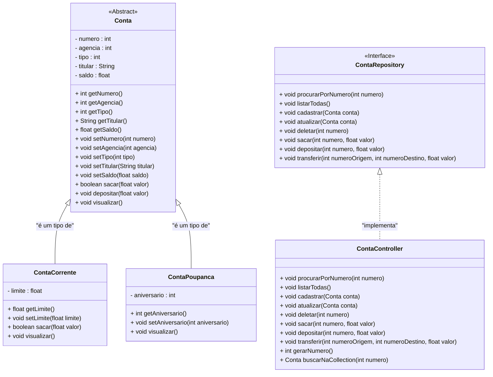

<h1>Projeto 01 - Conta Bancária - ContaController - Parte III</h1>


Na etapa anterior, implementamos os cinco métodos do CRUD na classe **ContaController**. Nesta última etapa do projeto, vamos concluir a implementação da classe **ContaController**, adicionando os três métodos bancários: **saque**, **depósito** e **transferência**.

A estrutura final do projeto, representada pelo **Diagrama de Classes**, ficará conforme apresentado a seguir:



<br />

<h2>👣 Passo 01 - Implementar o Método Sacar - Classe ContaController</h2>


Vamos implementar o Método Sacar, através do código abaixo:

<div align="center"></div>

**Linha 68:** Observe que na assinatura do Método, foram inseridos 2 parâmetros:

- **numero:** Número da conta em que será realizada a operação de saque.

  **valor:** Valor que será debitado da conta.

**Linha 70:** Antes de realizar a operação de saque, é necessário verificar se a conta informada existe. Para isso, foi criada a variável local **buscaConta**, que recebe o objeto da classe **Conta** retornado pela busca na coleção **listaContas**.

**Linhas 72 a 80:** O bloco condicional verifica se a conta foi encontrada (linha 72). A partir disso, temos dois cenários:

- **Se a conta for encontrada:**

  - Um segundo teste é feito para verificar se o saque foi realizado (linha 74).
  - A operação é executada por meio do método **`sacar(valor)`**, que retorna um valor booleano:
    - Se retornar **`true`**, significa que o saque foi realizado com sucesso, e uma mensagem de confirmação é exibida (linha 75).
    - Se retornar **`false`**, indica que o saldo é insuficiente. Nesse caso, o próprio método **`sacar(valor)`** se encarrega de exibir a mensagem informativa ao usuário.

  **Se a conta não for encontrada (linha 79):**

  - Será exibida uma mensagem informando que a conta informada não existe.

💾 **Salve as alterações antes de prosseguir!**

Para permitir que o usuário possa sacar um valor de uma conta e o valor do saque, é necessário solicitar, via teclado, a entrada do número da conta desejada. Essa funcionalidade será implementada por meio do método **`sacar()`**, localizado na classe **`Menu`**, que atuará como um formulário textual interativo. 

<br />

<h2>👣 Passo 02 - Criar o Método Sacar - Classe Menu</h2>


Vamos implementar o método **`sacar()`** na classe **`Menu`**, que atuará como um **formulário de operação bancária interativo**.

Esse formulário solicitará ao usuário dois dados essenciais:

- o **número da conta** na qual será realizada a operação,
- e o **valor a ser sacado**, ambos inseridos via teclado.

Após a entrada dos dados, o número da conta e o valor informado serão repassados como argumentos para o método **`sacar(int numero, float valor)`**, localizado na classe **`ContaController`**, responsável por localizar a conta e executar a operação de saque, caso possível.

1. Na classe `Menu`, **logo após o método `deletarConta`**, adicione o método `sacar`, como vemos na imagem abaixo:

<div align="center"></div>

**Linhas 272 e 273:** Exibem no console uma mensagem solicitando ao usuário o **número da conta** na qual será realizado o saque. Em seguida, o valor digitado é capturado via teclado e armazenado na variável **`numero`**.

**Linhas 275 e 275:** Exibem no console uma mensagem solicitando ao usuário o **valor** que será sacado. Em seguida, o valor digitado é capturado via teclado e armazenado na variável **`valor`**.

**Linha 278:** O método `sacar` da classe `contaController` é chamado, recebendo como argumento o número da conta e o valor do saque.

2. Na Classe Menu, localize o trecho de código abaixo:

<div align="center"></div>

3. Insira a chamada ao método `sacar` no local indicado na imagem abaixo:

<div align="center"></div>

**Linha 101:** Executa o método **`sacar`** da classe **`Menu`**, que por sua vez chama o método **`sacar`** da classe **`ContaController`**, para efetuar o saque de um valor em uma conta específica, armazenada na coleção **`listaContas`**.

💾 **Salve as alterações antes de prosseguir!**

<br />

<h2>👣 Passo 03 - Executar o projeto</h2>


Vamos testar a função **6 - Sacar** do Projeto Conta Bancária:

1. Para executar o Projeto Conta Bancária, abra a classe `Menu` e clique no botão **Run**, localizado na **Barra de Ferramentas**
2. Será exibido do menu, conforme a imagem abaixo:

<div align="center"></div>

3. Digite a opção **6** (Sacar) e observe o resultado abaixo:

```bash
Digite o Numero da conta: 
1
Digite o Valor do Saque (R$): 
100

O Saque na Conta numero: 1 foi efetuado com sucesso!


Pressione Enter para Continuar...
```

No exemplo acima fizemos um saque de **R$ 100,00** na conta numero **1** e uma mensagem de confirmação foi exibida na tela. 

4. Experimente repetir a operação na conta numero 10:

```bash
Digite o Numero da conta: 
10
Digite o Valor do Saque (R$): 
100

A Conta numero: 10 não foi encontrada!

Pressione Enter para Continuar...
```

Observe que a conta numero **10** não foi encontrada e uma mensagem foi exibida na tela. 

Na sequência, vamos confirmar se o saque na conta numero 1 foi efetuado com sucesso:

5. Digite a opção **3**, peça para exibir os dados da conta numero **1** e veja o resultado abaixo:

```bash
Consultar dados da Conta - por número

Digite o número da conta: 
1

*********************************************************************
Dados da Conta:
*********************************************************************
Numero da Conta: 1
Agência: 123
Tipo da Conta: Conta Corrente
Titular: João da Silva
Saldo: 900.0
Limite de Crédito: 100.0

Pressione Enter para Continuar...
```

Observe que o saldo da conta numero **1** foi alterado de **R$ 1000,00** para **R$ 900,00**, confirmando que o saque foi efetuado com sucesso. 

<br />

> [!NOTE]
>
> **DESAFIO!** 
>
> Experimente fazer um saque com um valor maior do que o Saldo da conta e um outro saque passando um valor negativo. 
>
> No caso de uma Conta Corrente, lembre-se que o saldo é composto por: saldo + limite. 
>
> A melhor forma de aprender uma Linguagem de Programação é praticando!

<br />

<h2>👣 Passo 04 - Implementar o Método Depositar</h2>


Na sequência, vamos implementar o Método Depositar, através do código abaixo:

<div align="center"></div>

**Linha 85:** Na assinatura do método, foram definidos dois parâmetros:

- **`numero`**: número da conta na qual será realizado o depósito;
- **`valor`**: valor que será creditado na conta.

**Linha 87:** Antes de realizar a operação de depósito, é necessário verificar se a conta informada realmente existe. Para isso, foi criada a variável local **`conta`**, que recebe o objeto da classe **Conta** retornado pela busca na coleção **`listaContas`**.

**Linhas 89 a 94:** O bloco condicional verifica se o objeto **`conta`** foi encontrado (linha 89).

- Se a conta existir:
  - A operação de depósito será executada por meio do método **`depositar(valor)`** (linha 90);
  - Em seguida, será exibida uma mensagem confirmando o sucesso da operação (linha 91).
- Se a conta não for localizada (linha 93), será exibida uma mensagem informando que a conta não foi encontrada.

💾 **Salve as alterações antes de prosseguir!**

Para permitir que o usuário possa depositar um valor de uma conta específica, é necessário solicitar, via teclado, a entrada do número da conta e o valor do depósito. Essa funcionalidade será implementada por meio do método **`depositar()`**, localizado na classe **`Menu`**, que atuará como um formulário textual interativo. 

<br />

<h2>👣 Passo 05 - Criar o Método Depositar - Classe Menu</h2>


Variáveis criadas, vamos criar o formulário da operação depósito e criar a chamada para o Método Depositar na Classe Menu

1. Na classe `Menu`, **logo após o método `sacar`**, adicione o método `depositar`, como vemos na imagem abaixo:

<div align="center"></div>

**Linhas 284 e 285:** Exibem no console uma mensagem solicitando ao usuário o **número da conta** na qual será realizado o depósito. Em seguida, o valor digitado é capturado via teclado e armazenado na variável **`numero`**.

**Linhas 287 e 288:** Exibem no console uma mensagem solicitando ao usuário o **valor** que será depositado. Em seguida, o valor digitado é capturado via teclado e armazenado na variável **`valor`**.

**Linha 290:** O método `depositar` da classe `contaController` é chamado, recebendo como argumentos o número da conta e o valor do depósito.

2. Na Classe Menu, localize o trecho de código abaixo:

<div align="center"></div>

3. Insira a chamada ao método `depositar` no local indicado na imagem abaixo:

<div align="center"></div>

**Linha 108:** Executa o método **`depositar`** da classe **`Menu`**, que por sua vez chama o método **`depositar`** da classe **`ContaController`**, para efetuar o depósito de um valor para uma conta específica, armazenada na coleção **`listaContas`**.

💾 **Salve as alterações antes de prosseguir!**

<br />

<h2>👣 Passo 06 - Executar o projeto</h2>


Vamos testar a função **7 - Depositar** do Projeto Conta Bancária:

1. Para executar o Projeto Conta Bancária, abra a classe `Menu` e clique no botão **Run**, localizado na **Barra de Ferramentas**
2. Será exibido do menu, conforme a imagem abaixo:

<div align="center"></div>

3. Digite a opção **7** (Depositar) e observe o resultado abaixo:

```bash
Depósito

Digite o Numero da conta: 
1
Digite o Valor do Depósito (R$): 
100

O Depósito na Conta numero: 1 foi efetuado com sucesso!

Pressione Enter para Continuar...
```

No exemplo acima fizemos um depósito de **R$ 100,00** na conta numero **1** e uma mensagem de confirmação foi exibida na tela. 

4. Experimente repetir a operação na conta numero 10:

```bash
Depósito

Digite o Numero da conta: 
10
Digite o Valor do Depósito (R$): 
100

A Conta numero: 10 não foi encontrada ou a Conta destino não é uma Conta Corrente!

Pressione Enter para Continuar...
```

Observe que a conta numero **10** não foi encontrada e uma mensagem foi exibida na tela. 

Na sequência, vamos confirmar se o depósito na conta numero 1 foi efetuado com sucesso:

5. Digite a opção **3**, peça para exibir os dados da conta numero **1** e veja o resultado abaixo:

```bash
Consultar dados da Conta - por número

Digite o número da conta: 
1

*********************************************************************
Dados da Conta:
*********************************************************************
Numero da Conta: 1
Agência: 123
Tipo da Conta: Conta Corrente
Titular: João da Silva
Saldo: 1100.0
Limite de Crédito: 100.0

Pressione Enter para Continuar...
```

Observe que o saldo da conta numero **1** foi alterado de **R$ 1000,00** para **R$ 1100,00**, confirmando que o depósito foi efetuado com sucesso. 

<br />

> [!NOTE]
>
> **DESAFIO!** 
>
> Experimente fazer um depósito passando um valor negativo. 
>
> A melhor forma de aprender uma Linguagem de Programação é praticando!

<br />

<h2>👣 Passo 07 - Implementar o Método Transferir</h2>


Na sequência, vamos implementar o Método Transferir, através do código abaixo:

<div align="center"></div>

**Linha 99:** A assinatura do método define três parâmetros:

- **`numeroOrigem`**: número da conta da qual será debitado o valor (operação de saque);
- **`numeroDestino`**: número da conta que receberá o valor transferido (operação de depósito);
- **`valor`**: valor que será transferido — debitado da conta de origem e creditado na conta de destino.

**Linha 101:** Antes de realizar o saque na conta de origem, é necessário verificar se a conta existe. Para isso, foi criada a variável local **`contaOrigem`**, que recebe o objeto da classe **Conta** retornado pela busca na coleção **`listaContas`**.

**Linha 102:** Da mesma forma, antes de realizar o depósito na conta de destino, é preciso confirmar se essa conta também existe. Foi criada a variável local **`contaDestino`**, que recebe o objeto correspondente, também obtido a partir da coleção **`listaContas`**.

**Linhas 104 a 116:** O bloco condicional (linha 104) verifica se **ambas as contas** — origem e destino — foram encontradas.

- Se **as duas contas** existirem:
  - Um novo teste condicional será executado para verificar se o saque na conta de origem foi bem-sucedido (linha 106). Essa operação é realizada por meio do método **`sacar(valor)`**, que retorna um valor booleano:
    - Se o retorno for **`true`**, significa que o saldo era suficiente e o valor foi debitado com sucesso;
    - Se o retorno for **`false`**, indica saldo insuficiente, e o próprio método **`sacar(valor)`** se encarrega de exibir a mensagem apropriada.
  - Caso o saque seja bem-sucedido, o valor será imediatamente creditado na conta de destino por meio do método **`depositar(valor)`** (linha 107).
  - Com ambas as operações concluídas, uma mensagem de confirmação da transferência é exibida (linha 108).
- Se **uma ou ambas as contas** não forem encontradas (linha 115), o sistema exibirá uma mensagem informando que as contas de origem e/ou destino não foram localizadas.

💾 **Salve as alterações antes de prosseguir!**

Para permitir que o usuário possa transferir um valor de uma conta específica para outra, é necessário solicitar, via teclado, a entrada dos números das contas de origem e destino, além do valor da transferência. Essa funcionalidade será implementada por meio do método **`transferir()`**, localizado na classe **`Menu`**, que atuará como um formulário textual interativo. 

<br />

<h2>👣 Passo 08 - Criar o Método Transferir - Classe Menu</h2>


Variáveis criadas, vamos criar o formulário da operação transferência entre contas e criar a chamada para o Método Transferir na Classe Menu

1. Na classe `Menu`, **logo após o método `depositar`**, adicione o método `transferir`, como vemos na imagem abaixo:

<div align="center"></div>

**Linhas 296 e 297:** Exibem no console uma mensagem solicitando ao usuário o **número da conta de origem** na qual será realizado o saque. Em seguida, o valor digitado é capturado via teclado e armazenado na variável **`numeroOrigem`**.

**Linhas 299 e 300:** Exibem no console uma mensagem solicitando ao usuário o **número da conta de destino** na qual será realizado o depósito. Em seguida, o valor digitado é capturado via teclado e armazenado na variável **`numeroDestino`**.

**Linhas 302 e 303:** Exibem no console uma mensagem solicitando ao usuário o **valor** que será transferido da conta de origem para a conta de destino. Em seguida, o valor digitado é capturado via teclado e armazenado na variável **`valor`**.

**Linha 305:** O método `transferir` da classe `contaController` é chamado, recebendo como argumentos o número da conta de origem, o número da conta de destino e o valor da transferência.

2. Na Classe Menu, localize o trecho de código abaixo:

<div align="center"></div>

3. Insira a chamada ao método `transferir` no local indicado na imagem abaixo:

<div align="center"></div>

**Linha 115:** Executa o método **`transferir`** da classe **`Menu`**, que por sua vez chama o método **`transferir`** da classe **`ContaController`**, para efetuar a transferência de um valor entre duas contas específicas, armazenadas na coleção **`listaContas`**.

💾 **Salve as alterações antes de prosseguir!**

<br />

<h2>👣 Passo 09 - Executar o projeto</h2>


Vamos testar a função **5 - Apagar Conta** do Projeto Conta Bancária:

1. Para executar o Projeto Conta Bancária, abra a classe `Menu` e clique no botão **Run**, localizado na **Barra de Ferramentas**
2. Será exibido do menu, conforme a imagem abaixo:

<div align="center"></div>

3. Digite a opção **8** (Transferir valores entre Contas) e observe o resultado abaixo:

```bash
Transferência entre Contas

Digite o Numero da Conta de Origem: 
1
Digite o Numero da Conta de Destino: 
2
Digite o Valor da Transferência (R$): 
100

A Transferência foi efetuado com sucesso!

Pressione Enter para Continuar...
```

No exemplo acima fizemos uma transferência de **R$ 100,00** da conta numero **1** para a conta numero 2 e uma mensagem de confirmação foi exibida na tela. 

4. Experimente repetir a operação na conta de origem numero 10:

```bash
Transferência entre Contas

Digite o Numero da Conta de Origem: 
10
Digite o Numero da Conta de Destino: 
2
Digite o Valor da Transferência (R$): 
100

A Conta de Origem e/ou Destino não foram encontradas!

Pressione Enter para Continuar...
```

Observe que a conta numero **10** não foi encontrada e uma mensagem foi exibida na tela. 

Na sequência, vamos confirmar se a transferência da conta numero 1 para a conta numero 2 foi efetuada com sucesso:

5. Digite a opção **3**, peça para exibir os dados da conta numero **1** e observe o resultado abaixo:

```bash
Consultar dados da Conta - por número

Digite o número da conta: 
1

*********************************************************************
Dados da Conta:
*********************************************************************
Numero da Conta: 1
Agência: 123
Tipo da Conta: Conta Corrente
Titular: João da Silva
Saldo: 900.0
Limite de Crédito: 100.0

Pressione Enter para Continuar...
```

Observe que o saldo da conta numero **1** foi alterado de **R$ 1000,00** para **R$ 900,00**, confirmando que o saque foi efetuado com sucesso. 

6. Na sequência, vamos checar a conta numero **2**. Observe o resultado abaixo:

```bash
Consultar dados da Conta - por número

Digite o número da conta: 
2

*********************************************************************
Dados da Conta:
*********************************************************************
Numero da Conta: 2
Agência: 124
Tipo da Conta: Conta Corrente
Titular: Maria da Silva
Saldo: 2100.0
Limite de Crédito: 100.0

Pressione Enter para Continuar...
```

Observe que o saldo da conta numero **2** foi alterado de **R$ 1000,00** para **R$ 2100,00**, confirmando que a transferência  foi efetuada com sucesso.

<br />

> [!NOTE]
>
> **DESAFIO!** 
>
> Experimente fazer uma transferência com um valor maior do que o Saldo da conta de origem e uma outra transferência passando um valor negativo. 
>
> No caso de uma Conta Corrente, lembre-se que o saldo é composto por: saldo + limite. 
>
> A melhor forma de aprender uma Linguagem de Programação é praticando!

<br />

<div align="left"> <a href="https://github.com/rafaelq80/conta_bancaria_java/tree/09_Controller_Metodos_Espec%C3%ADficos" target="_blank"><b>Código fonte: Projeto Conta Bancária</b></a></div>

<br /><br />

<div align="left"><a href="README.md">Voltar</a></div>
