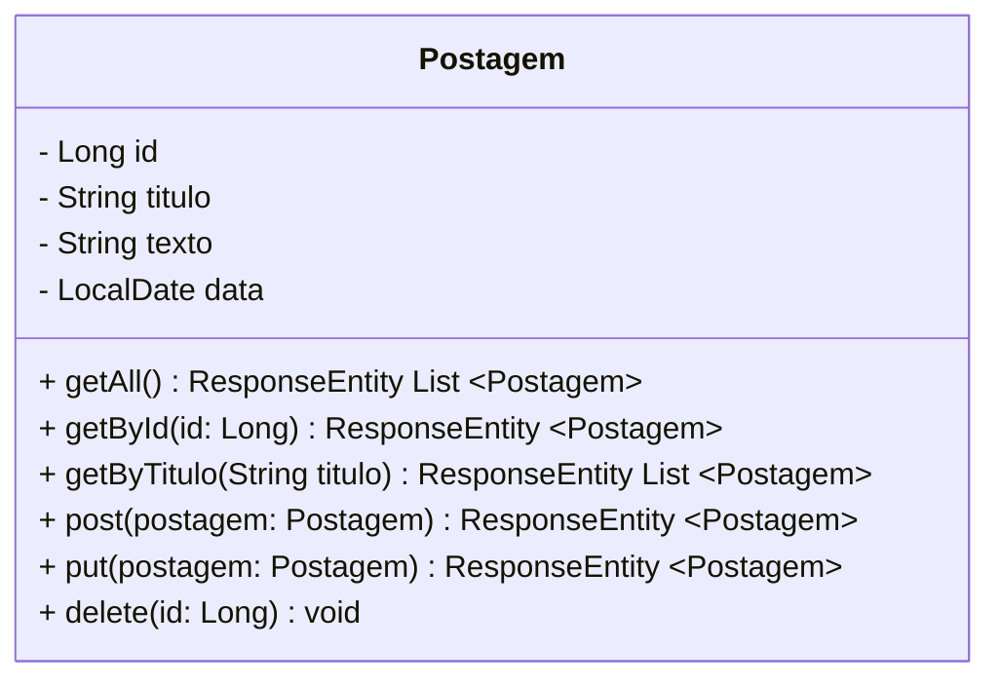
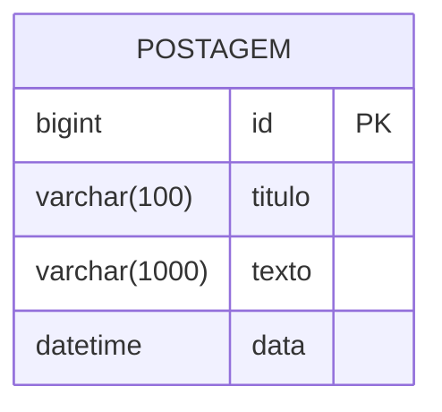

<h1>Projeto 02 - Blog Pessoal - Classe Postagem</h1>

O que veremos por aqui:

1. Apresentação do Recurso Postagem
2. Criar a estrutura de Pacotes
3. Criar a Classe Model Postagem

<h2>1. O Recurso Postagem</h2>

Nesta etapa vamos começar a construir o Recurso Postagem. Veja o Diagrama de Classes abaixo: 

 

Primeiro vamos construir a **Classe Postagem**, que servirá de modelo para construir a tabela **tb_postagens** (Entidade) dentro do nosso Banco de dados **db_blogpessoal**. Os campos (Atributos) da tabela serão os mesmos que estão definidos no Diagrama de Classes acima. Na próxima etapa vamos construir a **Interface PostagemRepository**, que irá nos auxiliar na interação com o Banco de dados. Os Métodos descritos no Diagrama de Classes serão implementados na etapa seguinte, na **Classe PostagemController**.

Depois de criar a Classe Model Postagem, vamos executar o projeto Blog Pessoal no STS. Após a execução veremos que será criado no MySQL, sem a necessidade de gerar código SQL, o Banco de dados **db_blogpessoal** e a tabela **tb_postagens**. Veja abaixo como ficará a estrutura da nossa tabela através do **Diagrama de Entidade e Relacionamentos (DER)**:

O **Dicionário de dados da nossa tabela tb_postagens** será o seguinte:

| Atributo   | Tipo de dado  | Descrição                                         | Chave |
| ---------- | ------------- | ------------------------------------------------- | ----- |
| **id**     | BIGINT        | Identificador único                               | PK    |
| **titulo** | VARCHAR(100)  | Título da postagem                                |       |
| **texto**  | VARCHAR(1000) | Conteúdo da postagem                              |       |
| **data**   | DATETIME(6)   | Data e hora da publicação/atualização da postagem |       |

 

<h2>👣 Passo 01 - Criar o Pacote Model</h2>

Na Source Folder Principal (**src/main/java**), observe que foi criado o pacote principal da nossa aplicação (**com.generation.blogpessoal**), onde todo o nosso código será desenvolvido. Na figura abaixo, podemos visualizar o pacote:

Vamos criar dentro do pacote principal, sub pacotes que chamaremos de **Camadas**. Dentro destes sub pacotes, iremos criar as Classes e Interfaces da nossa aplicação, seguindo o modelo MVC.  Para criarmos o Recurso Postagem, vamos precisar de 3 Camadas:

| Camada         | Descrição                                                    |
| -------------- | ------------------------------------------------------------ |
| **Model**      | Camada responsável pela abstração dos nossos Objetos em registros das nossas tabelas, que serão geradas no Banco de dados. As Classes criadas nesta camada representam os objetos que serão persistidos no Banco de dados. |
| **Repository** | Camada responsável por implementar as Interfaces, que contém diversos Métodos pré-implementados para a  manipulação de dados de uma entidade, como Métodos para salvar, deletar,  listar e recuperar dados da Classe. Para criar estas Interfaces basta Herdar (extends) a Interface JpaRepository. |
| **Controller** | Camada responsável por receber todas as Requisições HTTP (HTTP Request), enviadas por um Cliente HTTP (Insomnia, Postman ou o Front-end da aplicação), para a nossa aplicação e responder (HTTP Response) as requisições de acordo com o resultado do processamento da requisição no Back-end. |

 

|  | 
 **ALERTA DE BSM:** *Mantenha a Atenção aos Detalhes ao criar a Camada Model. Um erro muito comum é criar os pacotes na Source Folder de Testes (imagem abaixo), ao invés de criar na Source Folder Principal.* 
 |
| ------------------------------------------------------------ | ------------------------------------------------------------ |

 

Vamos começar criando a Camada Model:

1. No lado esquerdo superior, na Guia **Package explorer**, clique com o botão direito do mouse sobre a Package **com.generation.blogpessoal**, na Source Folder **src/main/java** e clique na opção  **New 🡪 Package**.

2. Na janela **New Java Package**, no item **Name**, acrescente no final do nome da Package **.model**, como mostra a figura abaixo:

3. Clique no botão **Finish** para concluir.

A estrutura de pacotes da aplicação ficará igual a figura abaixo:

 

<h2>👣 Passo 02 - Criar a Classe Postagem na Camada Model</h2>

Agora vamos criar a Classe Model que chamaremos de **Postagem**.

1. Clique com o botão direito do mouse sobre o **Pacote Model** (**com.generation.blogpessoal.model**), na Source Folder Principal (**src/main/java**), como mostra a figura abaixo:
2. Na sequência, clique na opção **New 🡪 Class**

3. Na janela **New Java Class**, no item **Name**, digite o nome da Classe (**Postagem**), como mostra a figura abaixo:

4. Clique no botão **Finish** para concluir.
4. Na imagem abaixo, vemos a Classe Postagem, criada dentro da camada model:

Agora vamos criar o código da **Classe Model Postagem**, como mostra a imagem abaixo:

 

Vamos analisar o código:

**Linha 1:** Através do comando **package**, estamos informando o nome do pacote (camada), onde a Classe foi criada. Esta informação é inserida automaticamente pelo STS ao criar a Classe.

**Linhas 3 a 14:** Através do comando **import**, estamos indicando todos os pacotes que contém as Classes que estão sendo utilizadas na Classe Postagem.

**Linha 16:** A Anotação **@Entity** indica que esta Classe define uma entidade, ou seja, ela será utilizada para gerar uma tabela no Banco de dados da aplicação.

**Linha 17:** A Anotação **@Table** indica o nome da Tabela no Banco de dados. Caso esta anotação não seja declarada, o Banco de dados criará a tabela com o mesmo nome da Classe Model (Postagem). Observe que o nome da Tabela segue o padrão utilizado no SQL **tb_nome-da-tabela** (tb_postagens). O prefixo **tb** indica que se trata de uma Table (Tabela). O nome da Tabela é recomendado que seja **o mesmo da Classe Model** (postagem), em **letras minúsculas**, **sem espaços em branco ou caracteres especiais e acentos**. Observe que o **nome da tabela está no plural**, porque serão armazenadas várias postagens.

**Nas Linhas 22, 27, 32 e 35** foram criados os Atributos da Classe Postagem, que foram definidos no Diagrama de Classes acima. Veja na tabela abaixo a conversão de **Tipo de dados Java 🡪 MySQL**

| Atributo   | Tipo de dado Java | Tipo de dado MySQL |
| ---------- | ----------------- | ------------------ |
| **id**     | Long              | BIGINT             |
| **titulo** | String            | VARCHAR(100)       |
| **texto**  | String            | VARCHAR(1000)      |
| **data**   | LocalDateTime     | DATETIME(6)        |

 

> [!TIP]
>
> Para relembrar os tipos de dados em Java, <a href="java_tipos.md"><b>clique aqui</b></a> e explore os principais tipos de dados e Classes que o Java oferece.

 

Observe que acima de cada Atributo foram adicionadas algumas Anotações. Estas anotações tem a função de configurar os parâmetros do Banco de dados e criar validações para os dados que serão inseridos no Objeto da Classe Postagem (tamanho, formato e etc).

**Linha 20:** A Anotação **@Id** inidica que o Atributo anotado será a **Chave Primária** (Primary Key - PK) da Tabela **tb_postagens**.

**Linha 21:** A Anotação **@GeneratedValue** indica que a **Chave Primária** será gerada pelo Banco de dados. O parâmetro **strategy** indica de que forma esta **Chave Primária** será gerada. A Estratégia **GenerationType.IDENTITY** indica que a Chave Primária será gerada pelo Banco de dados através da opção **auto-incremento** (auto-increment) do SQL, que gera uma sequência numérica iniciando em 1. 

> [!WARNING]
>
> Não confunda o valor gerado automaticamente pelo **auto incremento da chave primária no banco de dados**, que normalmente inicia em **1**, com o índice utilizado em **Arrays (Vetores ou Matrizes)** nas linguagens de programação, que geralmente inicia em **0**. 
>
> Enquanto o banco de dados utiliza identificadores para diferenciar os registros armazenados, os arrays utilizam índices para acessar posições dentro de uma estrutura de dados em memória. São conceitos diferentes e possuem comportamentos independentes.

 

> [!TIP]
>
> No <a href="#anexo2"><b>Anexo II</b></a>, você poderá conhecer as principais estratégias de geração de chave primária em entidades JPA, utilizando a anotação **`@GeneratedValue`**. Essas estratégias definem como os valores dos identificadores serão gerados automaticamente pelo banco de dados ou pelo provedor JPA, permitindo diferentes abordagens de acordo com a necessidade da aplicação. A configuração correta da estratégia facilita o gerenciamento dos registros e evita a necessidade de atribuir manualmente os valores das chaves primárias no código.

 

**Nas linhas 24 e 29:** A anotação **@NotBlank** não permite que o Atributo seja **Nulo ou contenha apenas espaços em branco**. Você pode configurar uma mensagem para o usuário através do Atributo **message**.

 

> [!WARNING]
>
> A anotação **`@NotBlank`** deve ser utilizada exclusivamente em atributos do tipo **`String`**, pois valida se o campo não está vazio e se contém pelo menos um caractere diferente de espaço em branco. 
>
> Para atributos numéricos, datas ou outros tipos de objetos, utilize a anotação **`@NotNull`**, que verifica se o valor foi informado e não está nulo. Dessa forma, cada anotação deve ser aplicada de acordo com o tipo de dado que será validado na entidade.

 

**Nas linhas 25 e 30:** A anotação **@Size** define o valor **Mínimo (min)** e o valor **Máximo (max)** de caracteres do Atributo. Não é obrigatório configurar os 2 parâmetros. Como o parâmetro **max** foi configurado, observe que o mesmo valor informado será inserido na definição dos Atributos **titulo** (**varchar(100)**) e texto (**varchar(1000)**) na tabela **tb_postagens** no Banco de dados. Você pode configurar uma mensagem para o usuário através do Atributo **message**.

> [!TIP]
>
> Acesse o <a href="guia_jpa.md"><b>Guia do JPA</b></a> e explore outras opções de Validação para os Atributos. Essas validações serão muito úteis em seus projetos futuros.

**Nas linhas 26 e 31:** A anotação **@Column** define as configurações da coluna correspondente ao atributo na tabela do banco de dados. A propriedade **length** determina o tamanho máximo de caracteres que a coluna poderá armazenar. Como o parâmetro **length** foi configurado, observe que os valores informados serão utilizados na definição dos atributos **titulo** (**varchar(100)**) e **texto** (**varchar(1000)**) na tabela **tb_postagens** do banco de dados. Essa configuração permite controlar a estrutura da coluna gerada pelo JPA durante a criação ou atualização da tabela.

**Na linha 34:** A anotação **@UpdateTimestamp** configura o Atributo **data** como **Timestamp**, ou seja, o Spring se encarregará de obter a data e a hora do Sistema Operacional e inserir no Atributo **data** toda vez que um Objeto da Classe Postagem for criado ou atualizado. 

As anotações de controle automático de data e hora são amplamente utilizadas em processos de auditoria de bancos de dados, pois permitem registrar de forma automática quando um objeto foi criado e quando ocorreu sua última atualização. Dessa forma, a aplicação mantém um histórico temporal dos registros sem a necessidade de atribuição manual desses valores no código, facilitando o acompanhamento das alterações realizadas nos dados.

> [!TIP]
>
> No <a href="#anexo3"><b>Anexo III</b></a>, você poderá conhecer as duas principais opções para controle automático de data e hora em entidades JPA: as anotações **`@CreationTimestamp`** e **`@UpdateTimestamp`**. Essas anotações facilitam o controle de auditoria da aplicação, evitando a necessidade de atribuir manualmente esses valores no código.

 

 <a href="https://www.baeldung.com/jpa-entities#entity" target="_blank"><b>Documentação: <i>@Entity</i></b></a>

 <a href="https://www.baeldung.com/jpa-entities#table" target="_blank"><b>Documentação: <i>@Table</i></b></a>

 <a href="https://www.baeldung.com/jpa-entities#id" target="_blank"><b>Documentação: <i>@Id</i></b></a>

 <a href="https://www.baeldung.com/hibernate-identifiers" target="_blank"><b>Documentação: <i>@GeneratedValue</i></b></a>

 <a href="https://jakarta.ee/specifications/bean-validation/3.0/apidocs/jakarta/validation/constraints/notblank" target="_blank"><b>Documentação: <i>@NotBlank</i></b></a>

 <a href="https://jakarta.ee/specifications/bean-validation/3.0/apidocs/jakarta/validation/constraints/size" target="_blank"><b>Documentação: <i>@Size</i></b></a>

 <a href="https://www.baeldung.com/jpa-entities#column" target="_blank"><b>Documentação: <i>@Column</i></b></a>

 <a href="https://thorben-janssen.com/persist-creation-update-timestamps-hibernate/" target="_blank"><b>Documentação: <i>@UpdateTimestamp</i></b></a>

 

<h2>👣 Passo 03 - Criar os Métodos Get e Set</h2>

Depois de criarmos os Atributos, precisamos criar os **Métodos Get e Set** para todos os Atributos da Classe. O Método Construtor não será necessário porquê o Spring utiliza um recurso chamado **Injeção de Dependência** (veremos na Classe PostagemController).

1. Posicione o cursor do mouse no ponto onde será criado os Métodos Get e Set.
2. No menu **Source**, clique na opção **Generate Getters and Setters...**

3. Na tela **Generate Getters and Setters**, Clique no botão **Select All** para selecionar todos os Atributos e clique no botão **Generate**.

4. A geração dos Métodos ficará igual a imagem abaixo:

5. Para concluir, não esqueça de **Salvar** a Classe.

 

<h2>👣 Passo 04 - Executar o projeto</h2>

Existem duas maneiras de executar o seu Projeto Spring no STS:

**Forma 01**

Executar o projeto Spring a partir da Classe principal:

1. No **STS**, na **Package Explorer**, clique na pasta **src/main/java** e na sequência clique no pacote principal **com.generation.blogpessoal**.
2. Clique com o botão direito do mouse sobre o arquivo **BlogpessoalApplication.java**.

3. No menu que será aberto, clique na opção **Run AS 🡪 Spring Boot App** como mostra a figura abaixo:

 

**Forma 02**

Uma segunda forma de executar o seu Projeto Spring é utilizando o **Spring Boot Dashboard**, como mostra a imagem abaixo:

1. Selecione o Projeto que você deseja executar, como mostra a imagem acima.
2. Clique no botão  **Start** para **Executar ou Reiniciar** o Projeto.
3. Para **finalizar** o Projeto, clique no botão  **Stop**.

 

> [!TIP]
>
> Caso a Barra de Ferramentas Principal não esteja visível, utilize o **Menu Window 🡪 Appearence 🡪 Show Toolbar**.

 

Observe no Console do STS, que serão exibidas as linhas abaixo, indicando que a Tabela **tb_postagens** foi criada:

 

<h2>👣 Passo 05 - Checando o Banco de Dados</h2>

Vamos checar se o Banco de Dados **db_blogpessoal** e a Tabela **tb_postagens** foram criados no MySQL.

1. Na Caixa de pesquisas, localize o <b>MySQL Workbench</b> e abra a aplicação.

2. No <b>MySQL Workbench</b>, Clique sobre a <b>Conexão Local instance MySQL80</b>

3. Caso seja solicitada a senha, <b>digite a senha do usuário root</b> e marque a opção <b>Save password in vault</b> para gravar a senha e não perguntar novamente.

4. Será aberta a janela principal do <b>MySQL Workbench</b>. 

5. Na janela **Schemas**, Clique no botão  (Atualizar)

6. Verifique se o Banco de dados **db_blogpessoal** e se a tabela **tb_postagens** foram criados, como mostra a figura abaixo:

 

 <a href="https://github.com/rafaelq80/backend_blogpessoal_spring/tree/02_Classe_Model_Postagem" target="_blank"><b>Código fonte do Projeto</b></a>

 

<h2 id="anexo1">Anexo I - Principais Mensagens de Erro</h2>

| Erro                                                         | Descrição                                                    |
| ------------------------------------------------------------ | ------------------------------------------------------------ |
| ***Failed to configure a DataSource: 'url' attribute is not specified and no embedded datasource could be configured.*** | A configuração da conexão com o Banco de dados não foi implementada. Configure a conexão com o Banco de dados no arquivo **application.properties**. Caso o erro persista, experimente apagar a pasta **.m2**, localizada em: `C:\Users\<seu_usuario>\.m2` |
| ***Access denied for user 'root'@'localhost' (using password: YES)*** | O nome do usuário ou a senha do seu Banco de dados está incorreta. Verifique qual foi a senha que você cadastrou na instalação do seu MySQL e altere no arquivo **application.properties** |

 

<h2 id="anexo2">Anexo II - Estratégias para geração da Chave Primária</h2>

| **Estratégia**              | **Descrição**                                                |
| --------------------------- | ------------------------------------------------------------ |
| **GenerationType.AUTO**     | Valor padrão, deixa com o provedor de persistência a escolha da estratégia mais adequada de acordo com o Banco de dados. |
| **GenerationType.IDENTITY** | Informamos ao provedor de persistência que os valores a serem atribuídos ao identificador único serão gerados pela coluna de auto incremento do banco de dados. Assim, um valor para o identificador é gerado para cada registro inserido no banco. Alguns bancos de dados podem não suportar essa opção. |
| **GenerationType.SEQUENCE** | Informamos ao provedor de persistência que os valores serão gerados a partir de uma sequence. Caso não seja especificado um nome para a sequence, será utilizada uma sequence padrão, a qual será global, para todas as entidades. Caso uma sequence seja especificada, o provedor passará a adotar essa sequence para criação das chaves primárias. Alguns bancos de dados podem não suportar essa opção, como o MySQL por exemplo. |
| **GenerationType.TABLE**    | Com a opção TABLE é necessário criar uma tabela para gerenciar as chaves primárias. Por causa da sobrecarga de consultas necessárias para manter a tabela atualizada, essa opção é pouco recomendada. |

 

<h2 id="anexo3">Anexo III - Controle Automático de Data e Hora</h2>

| Anotação             | Descrição                                                    |
| -------------------- | ------------------------------------------------------------ |
| `@CreationTimestamp` | Configura o atributo como um **Timestamp**, permitindo que o Hibernate preencha automaticamente a data e hora de criação do registro no banco de dados no momento em que o objeto for persistido pela primeira vez. |
| `@UpdateTimestamp`   | Atualiza automaticamente o valor do atributo com a data e hora na criação e no momento da última alteração realizada no registro. Dessa forma, o controle das datas de criação e atualização das entidades é realizado pelo Hibernate, utilizando a data e hora do sistema, sem a necessidade de atribuição manual no código da aplicação. |

  

<a href="README.md">Voltar</a>

