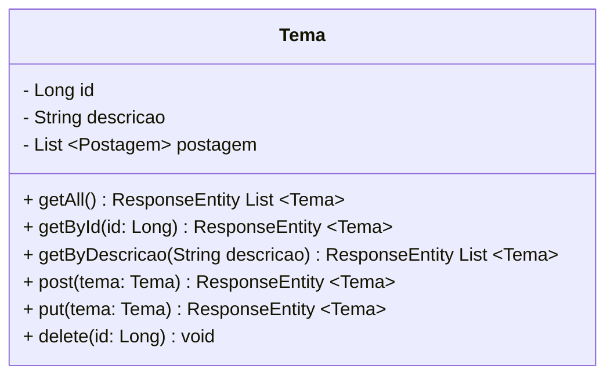
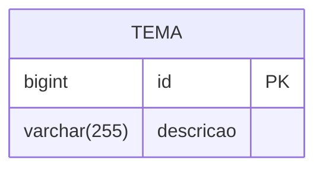
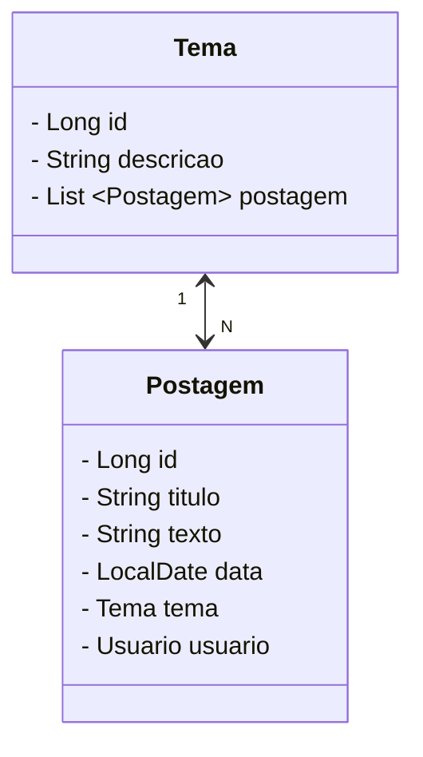
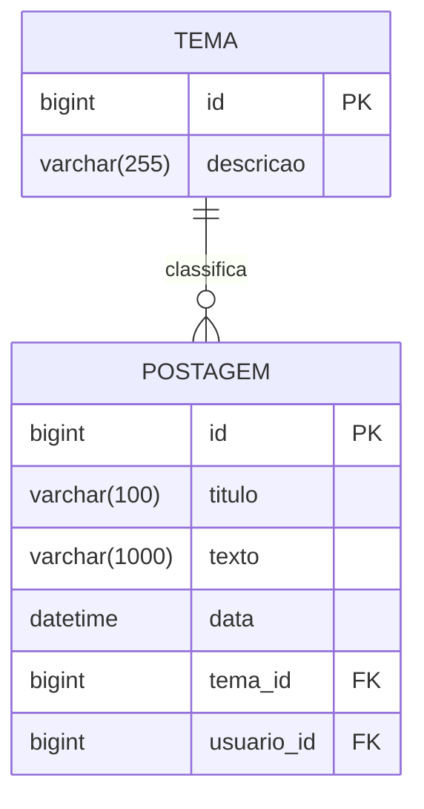

<h1>Projeto 02 - Blog Pessoal - Relacionamento entre Classes - Recurso Tema - Parte 01</h1>


O que veremos por aqui:

1. Apresentação do Recurso Tema
2. Criar a Classe Model Tema
3. Criar o Relacionamento entre as Classes Postagem e Tema

<br />

<h2>1. O Recurso Tema</h2>


Nesta etapa vamos começar a construir o Recurso Tema. Veja o Diagrama de Classes abaixo: 



A **Classe Tema** servirá de modelo para construir a tabela **tb_temas** (Entidade) dentro do nosso Banco de dados **db_blogpessoal**. Os campos (Atributos) da tabela serão os mesmos que estão definidos no Diagrama de Classes acima. Além de construirmos a Classe Tema, também faremos o Relacionamento com a Classe Postagem, construída anteriormente. 

Na próxima etapa vamos construir a **Interface TemaRepository**, que irá nos auxiliar na interação com o Banco de dados e a **Classe TemaController**, onde serão implementados os 6 Métodos descritos no Diagrama de Classes acima.

Depois de criar a Classe Model Tema, vamos executar o projeto Blog Pessoal no STS. Após a execução veremos que será criado no Banco de dados **db_blogpessoal** a tabela **tb_temas**. Veja abaixo como ficará a estrutura da nossa tabela através do **Diagrama de Entidade e Relacionamentos (DER)**:



O Dicionário de dados da nossa tabela tb_temas será o seguinte:

| Atributo      | Tipo de dado | Descrição           | Chave |
| ------------- | ------------ | ------------------- | ----- |
| **id**        | bigint       | Identificador único | PK    |
| **descricao** | varchar(255) | Tema                |       |

<br />

|  | <div align="left"> **ALERTA DE BSM:** *Mantenha a Atenção aos Detalhes ao criar o Recurso Tema. Todas as Camadas (Pacotes: Model, Repository e Controller), já foram criadas no Recurso Postagem.* </div> |
| ------------------------------------------------------------ | ------------------------------------------------------------ |

<br />

|  | <div align="left"> **DICA:** *Caso você tenha alguma dúvida sobre como criar a Classe, executar o projeto, entre outras, consulte a Documentação do Recurso Postagem.* </div> |
| ------------------------------------------------------------ | ------------------------------------------------------------ |

<br />

<h2>👣 Passo 01 - Criar a Classe Tema na Camada Model</h2>


Agora vamos criar a segunda Classe Model que chamaremos de **Tema**.

1. Clique com o botão direito do mouse sobre o **Pacote Model** (**com.generation.blogpessoal.model**), na Source Folder Principal (**src/main/java**), e clique na opção **New 🡪 Class**
2. Na janela **New Java Class**, no item **Name**, digite o nome da Classe (**Tema**), e na sequência clique no botão **Finish** para concluir.
3. Observe na imagem abaixo que o Pacote **model** agora terá 2 Classes:

<div align="center"></div>

Agora vamos criar o código da **Classe Model Tema** conforme o código abaixo:

```java
package com.generation.blogpessoal.model;

import jakarta.persistence.Column;
import jakarta.persistence.Entity;
import jakarta.persistence.GeneratedValue;
import jakarta.persistence.GenerationType;
import jakarta.persistence.Id;
import jakarta.persistence.Table;
import jakarta.validation.constraints.NotBlank;
import jakarta.validation.constraints.Size;

@Entity
@Table(name = "tb_temas")
public class Tema {
	
	@Id
	@GeneratedValue(strategy = GenerationType.IDENTITY)
	private Long id;

	@NotBlank(message = "O Atributo Descrição é obrigatório")
	@Size(max = 255, message = "O atributo Descrição deve ter no máximo 255 caracteres")
	@Column(length = 255)
	private String descricao;
	
	public Long getId() {
		return this.id;
	}

	public void setId(Long id) {
		this.id = id;
	}

	public String getDescricao() {
		return this.descricao;
	}

	public void setDescricao(String descricao) {
		this.descricao = descricao;
	}

}
```

Veja na tabela abaixo a conversão de **Tipo de dados Java 🡪 MySQL, de acordo com o que foi definido no Diagrama de Classes acima:**

| Atributo      | Tipo de dado Java | Tipo de dado MySQL |
| ------------- | ----------------- | ------------------ |
| **id**        | Long              | BIGINT             |
| **descricao** | String            | VARCHAR(255)       |

Caso você tenha alguma dúvida, consulte a **Documentação da Classe Postagem**, pois o código da Classe Tema é muito semelhante.

Para concluir, não esqueça de Salvar o código (**File 🡪 Save All**) e verificar se o Projeto está em execução


<br />

<h2>👣 Passo 02 - Executar o projeto e Checar o Banco de dados</h2>


1. Execute o projeto e verifique no **MySQL Workbench** se a tabela **tb_temas** foi criada no Banco de dados **db_blogpessoal**, como mostra a figura abaixo:

<div align="center"></div>

<br />

<h2>2. Relacionamento de Classes</h2>


**Mapeamento Objeto-Relacional (ORM)** é o processo de conversão das Classes Java em Tabelas (Entidades) no Banco de dados da aplicação e vice-versa. Em outras palavras, isso nos permite interagir com um Banco de dados Relacional. O **Java Persistence API (JPA)** é uma especificação que define como persistir dados em uma Banco de dados a partir de aplicações Java, sem a necessidade de utilizar código SQL. O foco principal do JPA é a camada **ORM**. O Framework responsável por implementar o ORM no Spring é o **Hibernate**. Para mais detalhes, consulte o Cookbook <a href="03.md" target="_blank"><b>Introdução ao JPA</b></a>.

> **Entidade** é uma Classe Java anotada com `@Entity` (Classe Model), que representa uma tabela no banco de dados. Cada instância da entidade representa um registro (linha) da tabela.
>
> **JPA** é a especificação Java que padroniza o uso de ORM. Define como mapear entidades e realizar operações de persistência (salvar, buscar, atualizar, excluir) sem usar SQL diretamente.
>
> **ORM** é uma técnica que converte objetos Java em registros de tabelas relacionais e vice-versa. No Spring Boot, é implementado pelo framework Hibernate.

O **JPA** simplifica o tratamento do modelo de Banco de dados Relacional nos aplicativos Java quando mapeamos cada Tabela para uma única Classe de entidade (Model) e para executar as consultas SQL (INSERT, SELECT, UPDATE e DELETE), o JPA utiliza as **Query Methods**, que são Métodos que fazem o mesmo papel das Queries SQL. 

Da mesma foram que criamos os Relacionamentos entre tabelas no SQL, no JPA, quando estamos trabalhando com um Banco de dados Relacional como o MySQL, também precisamos criar os **Relacionamentos entre as Classes**. A partir do Relacionamento entre as Classes, o **Hibernate** construirá o Relacionamento entre as Tabelas no Banco de dados Relacional. 

Nesta etapa vamos construir o **Relacionamento do Recurso Tema com o Recurso Postagem**. Veja o Diagrama de Classes abaixo: 



<br />

Para construirmos o **Relacionamento entre Classes**, precisamos definir a **Cardinalidade** e a **Direção do Relacionamento**, como veremos a seguir:


<h3>2.1. Direção do Relacionamento</h3>


A **Direção do Relacionamento** define **qual ou quais entidades conhecem a outra** em uma associação entre classes no modelo orientado a objetos. Em JPA, isso afeta como os dados são mapeados e acessados entre as entidades. Quanto ao sentido, podemos definir de uma forma global dois tipos de Relacionamentos:

- **Unidirecional.**
- **Bidirecional.**

Nos **Relacionamentos Unidirecionais**, mapeamos somente uma das entidades  envolvidas no relacionamento. Nestes relacionamentos, temos os conceitos de **Entidade Fonte** e **Entidade Alvo**. A diferença básica é que a **Entidade Fonte** possui o Mapeamento do Relacionamento.

Nos **Relacionamentos Bidirecionais**, as duas entidades são mapeadas e o relacionamento acontece em ambos os sentidos entre as entidades, que se comportam como se existissem dois Relacionamentos Unidirecionais, um para cada entidade envolvida.

Nos Relacionamentos Bidirecionais temos o conceito de **Entidade Proprietária** e **Entidade Inversa**.

- **Entidade Proprietária:** A tabela dessa Entidade será a Proprietária da **Chave Estrangeira - Foreign Key**.
- **Entidade Inversa:** O atributo deve ser anotado e configurado com o comando `mappedBy`.

<br />

<h3>2.2. Cardinalidade de um Relacionamento</h3>


**Cardinalidade** é o conceito que define **quantas instâncias de uma entidade podem se relacionar com quantas instâncias de outra entidade**. Ela é fundamental no mapeamento de **relacionamentos entre classes** no modelo orientado a objetos e também no modelo relacional de bancos de dados.

No contexto do **JPA (Java Persistence API)**, a cardinalidade é representada por anotações específicas que determinam o tipo de associação entre as entidades:

| Tipo de Relacionamento  |      | Anotação      | Descrição                                                    |
| ----------------------- | :--: | ------------- | ------------------------------------------------------------ |
| Um pra um - 1:1         |  🡪   | `@OneToOne`   | Um Objeto da Classe A se relacionará com apenas um Objeto da Classe B. |
| Um pra muitos - 1:N     |  🡪   | `@OneToMany`  | Um Objeto da Classe A se relacionará com muitos Objetos da Classe B. |
| Muitos pra um - N:1     |  🡪   | `@ManyToOne`  | Muitos Objetos da Classe B se relacionarão com apenas um Objeto da Classe A. Esta anotação é utilizada em conjunto com a anotação `@OneToMany` para criar uma Relação Um para Muitos Bidirecional. |
| Muitos pra muitos - N:M |  🡪   | `@ManyToMany` | Muitos Objetos da Classe A se relacionarão com muitos Objetos da Classe B. |

<br/>

No **Relacionamento Unidirecional**, a anotação é inserida em apenas uma Classe, enquanto no **Relacionamento Bidirecional**, a anotação é inserida em ambas as Classes. No Projeto Blog Pessoal, utilizaremos apenas **Relacionamentos Bidirecionais Um para Muitos**.

Depois de criar o **Relacionamento Bidirecional Um para Muitos entre as Classes Postagem e Tema**, vamos executar o projeto Blog Pessoal no STS. Após executar o projeto, o MySQL criará a Relação entre as tabelas **tb_postagens** e **tb_temas** Unidirecional, porque não existe Relação Bidirecional no SQL. Veja abaixo como ficará a estrutura da nossa tabela através do **Diagrama de Entidade e Relacionamentos (DER)** abaixo:



Como o JPA faz o mapeamento das Tabelas em Objetos, caso o Relacionamento Bidirecional esteja habilitado, a Relação funcionará independente do Banco de Dados ser Unidirecional. 

<br />

<h2>👣 Passo 01 - Criar a Relação ManytoOne na Classe Postagem</h2>


A Classe Postagem será o lado N:1 da Relação Bidirecional, ou seja, **Muitas Postagens podem ter apenas Um Tema**. Para criar a Relação vamos inserir depois do último Atributo da Classe Postagem (data), as 3 linhas destacadas em vermelho na figura abaixo:

<div align="left"></div>

**Linha 37:** A anotação **@ManyToOne** indica que a Classe Postagem será o lado N:1 e terá um **Objeto da Classe Tema**, que no modelo Relacional será a **Chave Estrangeira na Tabela tb_postagens (tema_id)**.

**Linha 38:** A anotação **@JsonIgnoreProperties** indica que uma parte do JSON será ignorado, ou seja, como a Relação entre as Classes será do tipo Bidirecional, ao listar o Objeto Postagem numa consulta, por exemplo, o Objeto Tema, que será criado na linha 39, será exibido como um **"Sub Objeto"** do Objeto Postagem, como mostra a figura abaixo, devido ao Relacionamento que foi criado.

```json
{
	"id": 1,
	"titulo": "Título da Postagem 01",
	"texto": "Texto da postagem 01",
	"data": "2022-05-02T09:27:11.2221618",
	"tema": {
		"id": 1,
		"descricao": "Tema 01"
	}
}
```

Ao exibir o Objeto Tema, o Objeto Postagem será exibido novamente e na sequência Tema será exibido novamente, criando um looping infinito dentro do JSON, devido a relação Bidirecional. Para impedir o looping infinito e o travamento da nossa aplicação (Vide a imagem abaixo com o erro que será exibido no Insomnia), utilizamos anotação **@JsonIgnoreProperties** para exibir o Objeto da Classe Postagem apenas uma vez, interrompendo a repetição. 

<div align="center"></div>

**Linha 39:** Será criado um Objeto da Classe Tema, que receberá os dados do Tema associado ao Objeto da Classe Postagem. Este Objeto representa a Chave Estrangeira da Tabela **tb_postagens (tema_id)**.

Depois do último Método Set, vamos acrescentar os Métodos Get e Set para o novo Atributo que foi adicionado na Classe Postagem:

1. Posicione o cursor no final dos Métodos Get e Set criados anteriormente, como mostra a  imagem abaixo:

<div align="center"></div>

2. No menu **Source**, clique na opção **Generate Getters and Setters...**

<div align="center"></div>

3. Na tela **Generate Getters and Setters**, clique no botão **Select All** para selecionar todos os Atributos e clique no botão **Generate**.

<div align="center"></div>

4. Os dois Métodos gerados ficarão semelhantes a imagem abaixo, posicionados no final dos demais Métodos Get e Set gerados na construção da Classe:

<div align="center"></div>

Depois de Criar o Relacionamento, observe que foram importados mais 2 pacotes, como mostra a imagem abaixo (indicados pelas Setas vermelhas):

<div align="left"></div>

Para concluir, não esqueça de Salvar o código (**File 🡪 Save All**) e verificar se o Projeto está em execução.

<br />

|  | <div align="left"> **ALERTA DE BSM:** *Mantenha a Atenção aos Detalhes ao criar o Relacionamento entre as Classes. Um erro muito comum é não criar os Métodos Get e Set para o novo Atributo que foi criado no Relacionamento.* </div> |
| ------------------------------------------------------------ | ------------------------------------------------------------ |

<br />

|  | <div align="left"> **DICA:** *Toda vez que você adicionar um novo Atributo na sua Classe, não esqueça de criar os Métodos GET e SET do Atributo. Caso contrário, você não conseguirá visualizar ou atualizar os dados do Atributo.* </div> |
| ------------------------------------------------------------ | ------------------------------------------------------------ |

<br />

<div align="left"> <a href="https://jakarta.ee/specifications/persistence/3.1/apidocs/jakarta.persistence/jakarta/persistence/manytoone" target="_blank"><b>Documentação: <i>@ManyToOne</i></b></a></div>

<div align="left"> <a href="https://fasterxml.github.io/jackson-annotations/javadoc/2.7/com/fasterxml/jackson/annotation/JsonIgnoreProperties.html" target="_blank"><b>Documentação: <i>@JsonIgnoreProperties</i></b></a></div>

<br />

<h2>👣 Passo 02 - Criar a Relação OneToMany na Classe Tema</h2>


A Classe Tema será o lado 1:N, ou seja, **Um Tema pode ter Muitas Postagens**. Para criar a Relação vamos inserir depois do último Atributo da Classe Tema (descricao), as linhas abaixo, destacadas em vermelho na figura abaixo:

<div align="left"></div>

**Linha 28:** A anotação **`@OneToMany`** indica que a classe **`Tema`** está no lado **"um"** de um relacionamento **Um-para-Muitos (1:N)** com a classe **`Postagem`**. Isso significa que **um único objeto de `Tema` pode estar associado a várias instâncias de `Postagem`**.

Nesse tipo de relacionamento bidirecional, a classe `Tema` **não possui a chave estrangeira** diretamente; quem armazena essa referência é a classe `Postagem`. Por isso, `Tema` é chamada de **entidade inversa** no relacionamento, e precisamos configurar adequadamente a anotação `@OneToMany` com alguns parâmetros:

- **`mappedBy`**: Informa ao JPA qual atributo da outra classe (no caso, o atributo `tema` na classe `Postagem`) representa o relacionamento. Isso evita a criação de uma tabela intermediária e instrui o Hibernate sobre qual lado é o dono da relação (a entidade que possui a chave estrangeira).
- **`fetch = FetchType.LAZY`**: Define a estratégia de carregamento dos dados. Com `LAZY`, os objetos da lista de postagens só serão carregados do banco **quando forem acessados**, o que melhora a performance em consultas simples.

|  | <div align="left"> **DICA:** *Consulte o <a href="#anexo2">Anexo II</a> para conhecer outras configurações para a propriedade fetch.* </div> |
| ------------------------------------------------------------ | ------------------------------------------------------------ |

- **`cascade = CascadeType.REMOVE`** (opcional): Indica que, ao excluir um tema, todas as postagens associadas a ele também serão excluídas automaticamente. Deve ser usado com cuidado, pois pode causar perda de dados relacionada. 


|  | <div align="left"> **DICA:** *Consulte o <a href="#anexo3">Anexo III</a> para conhecer outras configurações para a propriedade cascade.* </div> |
| ------------------------------------------------------------ | ------------------------------------------------------------ |

**Linha 29:** A anotação **@JsonIgnoreProperties** indica que determinadas propriedades do objeto serão ignoradas durante a conversão entre objetos Java e JSON (Serialização e Deserialização do objeto), evitando problemas como o **loop infinito** entre entidades relacionadas.

Assim como foi feito na classe **Postagem**, utilizamos **@JsonIgnoreProperties** também na classe **Tema**.

Observe que, desta vez, além de informar a propriedade `tema` no atributo `value`, também utilizamos a configuração `allowSetters = true`.

Essa configuração altera o comportamento padrão da anotação. A propriedade `tema` será ignorada apenas durante a **serialização** (conversão do objeto Java para JSON), mas continuará sendo considerada durante a **desserialização** (conversão do JSON para objeto Java).

Na prática, isso significa que:

- Ao **serializar**, a propriedade `tema` não será incluída no JSON, pois seu método **getter** será ignorado.
- Ao **desserializar**, o Jackson poderá utilizar o método **setter** para preencher a propriedade `tema` com os dados recebidos no JSON.

Na classe **Postagem**, como não foi utilizado `allowSetters = true`, a propriedade informada em `value` é ignorada tanto na serialização quanto na desserialização.

Esse recurso é muito útil para evitar **referências circulares** entre entidades. Por exemplo, um objeto **Tema** contém uma lista de **Postagens**, e cada **Postagem** possui uma referência para **Tema**. Sem essa configuração, o Jackson tentaria converter essas referências indefinidamente, gerando um **loop infinito** durante a serialização do JSON.

> [!NOTE]
>
> **Em resumo:**
>
> - `value = { "tema" }` indica que a propriedade `tema` será ignorada pelo Jackson.
>
> - A configuração `allowSetters = true` modifica esse comportamento, permitindo que a propriedade seja utilizada durante a **desserialização** (por meio do método **setter**), mas continue sendo ignorada durante a **serialização** (por meio do método **getter**).

Esse padrão é muito útil quando precisamos receber a referência da entidade relacionada em operações de **cadastro** e **atualização**, mas queremos impedir que essa referência seja enviada na resposta da API, evitando a expansão contínua dos relacionamentos e, consequentemente, o **loop infinito** na geração do JSON.

**Linha 30:** Será criada uma Collection List contendo Objetos da Classe Postagem, que receberá todos os Objetos da  Classe Postagem associadas a cada Objeto da Classe Tema. 

Depois do último Método Set, vamos acrescentar os Métodos Get e Set para o novo Atributo que foi adicionado na Classe Postagem:

1. Posicione o cursor no final dos Métodos Get e Set criados anteriormente, como mostra a imagem abaixo:

<div align="center"></div>

2. No menu **Source**, clique na opção **Generate Getters and Setters...**

<div align="center"></div>

3. Na tela **Generate Getters and Setters**, clique no botão **Select All** para selecionar todos os Atributos e clique no botão **Generate**.

<div align="center"></div>

4. Os dois Métodos gerados ficarão semelhantes a imagem abaixo, posicionados no final dos demais Métodos Get e Set gerados na construção da Classe:

<div align="center"></div>

Depois de Criar o Relacionamento, observe que foram importados mais 4 pacotes, como mostra a imagem abaixo (indicados pelas Setas vermelhas):

<div align="left"></div>

Para concluir, não esqueça de Salvar o código (**File 🡪 Save All**) e verificar se o Projeto está em execução.

<br />

|  | <div align="left"> **ALERTA DE BSM:** *Mantenha a Atenção aos Detalhes ao criar o Relacionamento entre as Classes. Um erro muito comum é não criar os Métodos Get e Set para o novo Atributo que foi criado no Relacionamento.* </div> |
| ------------------------------------------------------------ | ------------------------------------------------------------ |

<br />

|  | <div align="left"> **DICA:** *Toda vez que você adicionar um novo Atributo na sua Classe, não esqueça de criar os Métodos GET e SET do Atributo. Caso contrário, você não conseguirá visualizar ou atualizar os dados do Atributo.* </div> |
| ------------------------------------------------------------ | ------------------------------------------------------------ |

<br />

<div align="left"> <a href="https://jakarta.ee/specifications/persistence/3.1/apidocs/jakarta.persistence/jakarta/persistence/onetomany" target="_blank"><b>Documentação: <i>@OneToMany</i></b></a></div>

<br />

<h2>👣 Passo 03 - Executar o projeto e Checar o Banco de dados</h2>


1. Execute o projeto e observe o Console do STS
1. No Console do STS, serão exibidas as linhas abaixo, indicando que a Tabela **tb_temas** e o Relacionamento com a Tabela **tb_postagens** foram criados:

<div align="left"></div>

1. Após a aplicação inicializar, verifique no **MySQL Workbench** se a **Chave Estrangeira (tema_id)** foi criada na Tabela **tb_Postagens**, no Banco de dados **db_blogpessoal**, como mostra a figura abaixo:

<div align="center"></div>

<br />

Na sequência, vamos implementar a Interface TemaRepository, a Classe TemaController e atualizar a Classe Postagem Controller.

<br />

<h2 id="anexo1">Anexo I - Principais Mensagens de Erro</h2>

| Erro                        | Descrição                                                    |
| --------------------------- | ------------------------------------------------------------ |
| ***BeanCreationException*** | Ao criar o Relacionamento Bidirecional, você criou apenas um lado da Relação (**@OneToMany**). Faltou criar o outro lado da Relação (**@ManyToOne**).<br />**Exemplo:** <br/>Habilitou o Relacionamento na Classe Tema, mas não habilitou na Classe Postagem. |

<br />

<h2 id="anexo2">Anexo II - Tipos de Fetch</h2>

| Tipo      | Descrição                                                    |
| --------- | ------------------------------------------------------------ |
| **EAGER** | A estratégia **EAGER** indica que o Hibernate deve **carregar imediatamente** as entidades relacionadas assim que a entidade principal for buscada, ou seja, **todos os dados das associações são carregados junto com a consulta principal**, mesmo que você não vá usá-los naquele momento. Essa estratégia pode ser útil quando você **precisa dos dados relacionados o tempo todo**, mas pode impactar negativamente a performance, principalmente quando houver muitos relacionamentos ou grande volume de dados, porque os dados ficarão armazenados na memória. |
| **LAZY**  | A estratégia **LAZY** (preguiçosa), que é a estratégia padrão, faz com que o Hibernate **carregue os dados relacionados apenas quando forem acessados** pela primeira vez no código, ou seja, os dados associados **não são carregados automaticamente** com a consulta principal. Esta estratégia é Ideal para melhorar a **performance** em consultas simples, mas requer atenção ao acessar os dados fora do contexto de persistência (por exemplo, após uma transação ser finalizada) pode causar exceções como `LazyInitializationException`. |

<br />

<div align="left"> <a href="https://jakarta.ee/specifications/persistence/3.1/apidocs/jakarta.persistence/jakarta/persistence/fetchtype" target="_blank"><b>Documentação: <i>FetchType</i></b></a></div>

<br />

<h2 id="anexo3">Anexo III - Tipos de Cascade</h2>


| Tipo        | Descrição                                                    | Exemplo prático                                              | Quando utilizar?                                             |
| ----------- | ------------------------------------------------------------ | ------------------------------------------------------------ | ------------------------------------------------------------ |
| **PERSIST** | Ao salvar a entidade pai, todas as entidades filhas associadas também serão salvas automaticamente. | Ao criar um novo `Tema` com 3 `Postagens` e salvar o `Tema`, as 3 `Postagens` também serão persistidas no banco. | Quando desejar que, ao salvar a entidade pai, as entidades filhas associadas também sejam criadas automaticamente. |
| **MERGE**   | Ao atualizar (ou reanexar) a entidade pai, todas as entidades filhas associadas também serão atualizadas automaticamente. | Ao atualizar a descrição de um `Tema` e, ao mesmo tempo, alterar o título de uma `Postagem` associada, ao fazer `merge`, ambos serão atualizados no banco. | Quando for necessário atualizar entidades desanexadas juntamente com suas associações. |
| **REMOVE**  | Ao remover a entidade pai, todas as entidades filhas associadas também serão removidas automaticamente do banco. | Ao excluir um `Tema`, todas as `Postagens` associadas também serão apagadas automaticamente. | Quando for necessário excluir a entidade pai e também suas dependências diretamente associadas. |
| **REFRESH** | Ao recarregar a entidade pai a partir do banco, todas as entidades filhas associadas também serão recarregadas, descartando alterações locais. | Se outra aplicação alterar o conteúdo de uma `Postagem`, ao executar `refresh(tema)`, todas as postagens associadas ao `Tema` também serão atualizadas com os dados do banco. | Quando for necessário garantir que os dados estejam sincronizados com o banco de dados, descartando alterações em memória. |
| **DETACH**  | Ao remover a entidade pai do contexto de persistência, todas as entidades filhas associadas também serão desanexadas. Isso significa que alterações feitas em memória nessas entidades não serão sincronizadas com o banco, a menos que sejam reanexadas com `merge()`. | Após executar `detach(tema)`, qualquer alteração feita no `Tema` ou em suas `Postagens` associadas não será sincronizada com o banco. | Quando desejar interromper o monitoramento das alterações, removendo a entidade do contexto de persistência. |
| **ALL**     | Equivale a aplicar todas as operações de cascata: PERSIST, MERGE, REMOVE, REFRESH e DETACH. | Todas as operações realizadas no `Tema` também se aplicarão automaticamente a todas as suas `Postagens` associadas. | Quando desejar que todas as operações realizadas sobre a entidade pai sejam propagadas às entidades associadas. |

<br />

> **Contexto de Persistência**
>
> **Persistência é o processo de armazenamento duradouro de dados, garantindo que as informações permaneçam salvas mesmo após o encerramento da aplicação**. Esse armazenamento geralmente ocorre em bancos de dados relacionais ou não relacionais.
>
> No ecossistema **Spring Framework**, a persistência é gerenciada principalmente por meio do **Spring Data** e do **Spring ORM**, que facilitam a integração com bancos de dados utilizando **JPA (Java Persistence API)** ou outras tecnologias de persistência. Os principais componentes envolvidos neste processo são:
>
> - **Spring Data JPA**: Fornece uma abstração para a camada de acesso a dados utilizando JPA, permitindo o uso de repositórios (interfaces) que eliminam a necessidade de escrever consultas SQL manualmente para operações básicas.
> - **Entity Classes**: São classes Java anotadas com especificações JPA (Classes Model), que representam as tabelas do banco de dados, definindo o mapeamento objeto-relacional.
> - **Repositories**: Interfaces que estendem `JpaRepository`, oferecendo métodos prontos para realizar operações CRUD (Create, Read, Update, Delete) de forma simples e consistente.
> - **EntityManager**: É o componente que gerencia o ciclo de vida das entidades dentro do contexto de persistência. Sob controle do Spring, o EntityManager é responsável pela interação direta com o banco de dados, pela gestão das transações e pela sincronização do estado das entidades.
>
> Quando uma entidade está gerenciada pelo **`EntityManager`** — ou seja, está dentro do contexto de persistência — o provedor do JPA, o Hibernate, monitora todas as alterações feitas nessa entidade e em suas associações. Isso significa que, ao final da transação, todas as modificações são automaticamente detectadas e sincronizadas com o banco de dados, garantindo a consistência dos dados sem a necessidade de operações explícitas de atualização.

<br />

<div align="left"> <a href="https://jakarta.ee/specifications/persistence/3.1/apidocs/jakarta.persistence/jakarta/persistence/cascadetype" target="_blank"><b>Documentação: <i>CascadeType</i></b></a></div>

<div align="left"> <a href="https://jakarta.ee/specifications/persistence/3.1/apidocs/jakarta.persistence/jakarta/persistence/entitymanager" target="_blank"><b>Documentação: <i>Entity Manager</i></b></a></div>

<br />

<div align="left"> <a href="https://github.com/rafaelq80/backend_blogpessoal_spring/tree/10_Classe_Tema_Relacionamentos" target="_blank"><b>Código fonte do projeto</b></a></div>

<br /><br />

<div align="left"><a href="README.md">Voltar</a></div>
