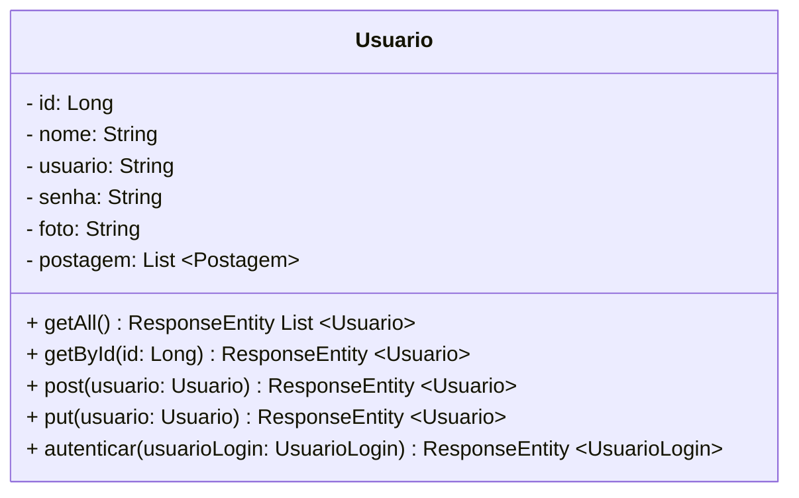
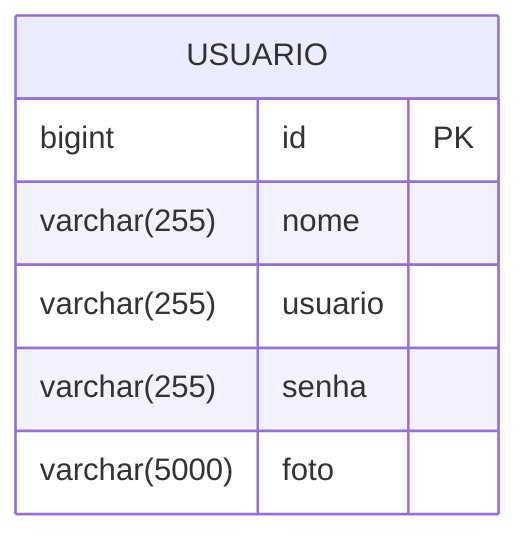
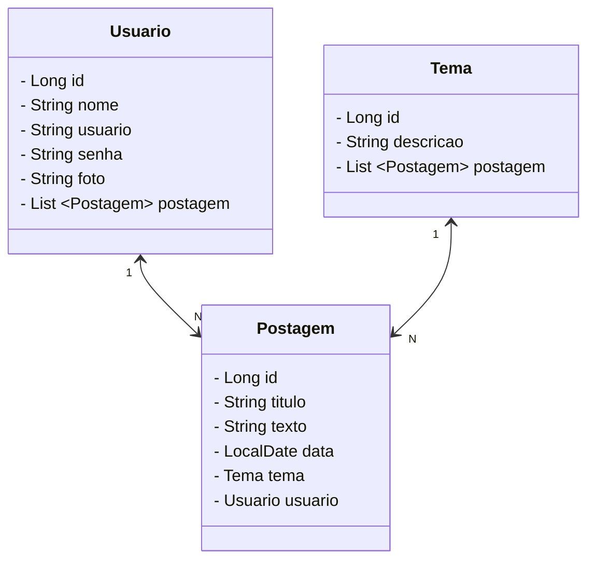
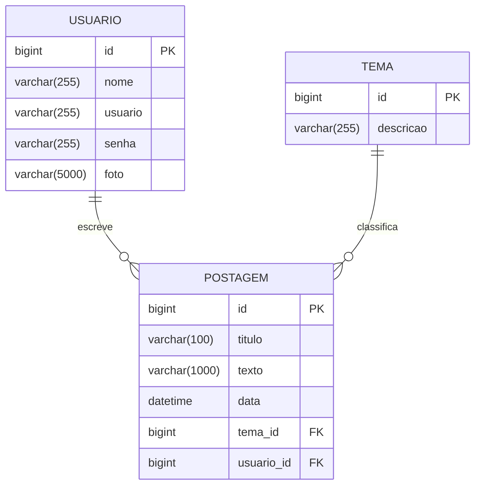
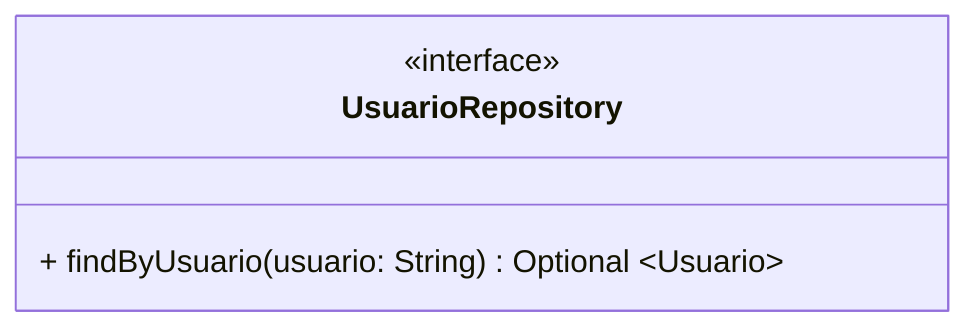
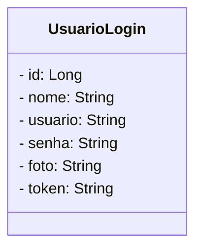

<h1>Projeto 02 - Blog Pessoal - Spring Security - Ecossistema do Usuário - Parte 01</h1>


O que veremos por aqui:

1. Ecossistema do Usuário
2. Apresentação do Recurso Usuário
3. Criação da classe Model `Usuario` e relacionamento com a classe `Postagem`
4. Criação da classe `UsuarioLogin`
5. Criação da Interface `UsuarioRepository`

<br />

<h2>1. Ecossistema do Usuario</h2>


O **Ecossistema do Usuário** é responsável por definir os dados do objeto `Usuario`, que será utilizado para autenticação e autorização de acesso ao Blog Pessoal, quando a camada de segurança da aplicação estiver totalmente implementada.

<br />

<h2>2. O Recurso Usuario</h2>


Nesta etapa, iniciaremos a construção do recurso **Usuário**, que será composto por duas classes principais: **`Usuario`** e **`UsuarioLogin`**.



A classe **`Usuario`** servirá como modelo para a criação da tabela **`tb_usuarios`** no banco de dados **`db_blogpessoal`**. Os atributos definidos na classe correspondem às colunas da tabela. Após implementarmos a classe modelo, ao executar o projeto no Spring Tool Suite (STS), a tabela será gerada automaticamente no banco de dados.

A seguir, apresentamos o Diagrama de Entidade e Relacionamento (DER) que representa a estrutura da tabela **`tb_usuarios`**:



O Dicionário de dados da nossa tabela **tb_Usuarios** será o seguinte:

| Atributo  | Tipo de dado  | Descrição           | Chave |
| --------- | ------------- | ------------------- | ----- |
| `id`      | bigint        | Identificador único | PK    |
| `nome`    | varchar(255)  | Nome do usuário     |       |
| `usuario` | varchar(255)  | E-mail do usuário   |       |
| `senha`   | varchar(255)  | Senha do usuário    |       |
| `foto`    | varchar(5000) | Foto do usuário     |       |

Além da classe **`Usuario`**, estabeleceremos o relacionamento com a classe **`Postagem`**, que foi criada anteriormente. Abaixo, apresentamos o diagrama de classes que representa esse relacionamento, incluindo também a classe **`Tema`**:



Com a implementação da classe **`Usuario`** e seu relacionamento com **`Postagem`**, a estrutura do banco **`db_blogpessoal`** ficará conforme o DER abaixo:



Note que a entidade **`POSTAGEM`** terá duas chaves estrangeiras (**FK**): `tema_id` e `usuario_id`, que estabelecem as relações com as tabelas **`TEMA`** e **`USUARIO`**, respectivamente.

Em seguida, construiremos a interface **`UsuarioRepository`**, responsável pela interação com o banco de dados. Essa interface será utilizada pelas classes **`UsuarioController`**, onde implementaremos os métodos CRUD e de autenticação descritos no diagrama de classes, e pela classe **`UsuarioService`**, onde aplicaremos as regras de negócio, especialmente as relacionadas ao Spring Security.

O diagrama da interface **`UsuarioRepository`** pode ser representado da seguinte forma:



Note que a **Query Method** utilizada na `UsuarioRepository` difere das utilizadas nas interfaces `PostagemRepository` e `TemaRepository`, pois, neste caso, ela realiza a busca de um usuário com base no e-mail (atributo `usuario`). O método retorna um `Optional<Usuario>`, pois a busca pode ou não encontrar um usuário correspondente, evitando, assim, retornos nulos e facilitando o tratamento do resultado.

<br />

> [!NOTE]
>
> **Alerta de BSM**
>
> *Mantenha a atenção aos detalhes*
>
> As camadas (pacotes: model, repository e controller) já foram criados e utilizados nos recursos `Postagem` e `Tema` — utilize-as como referência.

<br />

> [!TIP]
>
> 👉 Caso você tenha alguma dúvida sobre como criar a classe, executar o projeto, entre outras, **consulte os conteúdos referentes a construção dos Recursos Postagem e Tema**.

<br />

Também será criada a classe `UsuarioLogin`, que, embora pertença à camada *Model*, não será mapeada para o banco de dados. Ela será uma classe auxiliar, responsável por armazenar temporariamente os dados do login (usuário e senha), permitindo a autenticação do usuário. Além disso, essa classe será utilizada para retornar, na resposta da autenticação, os **demais dados do usuário autenticado**, como nome, token gerado, e outros dados relevantes que serão utilizados no frontend da aplicação.



<br />

<h2>👣 Passo 01 - Adicionar as Dependências - Spring Security</h2>


1.  Abra o arquivo **pom.xml**
2. Localize o trecho de código indicado na imagem abaixo:

<div align="center"></div>

3. Adicione as linhas abaixo (caso você ainda não tenha adicionado):

```xml
<!-- Adicionamos a Dependência - Spring Security -->
<dependency>
	<groupId>org.springframework.boot</groupId>
	<artifactId>spring-boot-starter-security</artifactId>
</dependency>
<!-- Dependências para Geração e Validação do Token JWT -->
<dependency>
	<groupId>io.jsonwebtoken</groupId>
	<artifactId>jjwt-api</artifactId>
	<version>0.12.6</version>
</dependency>
<dependency>
	<groupId>io.jsonwebtoken</groupId>
	<artifactId>jjwt-impl</artifactId>
	<version>0.12.6</version>
</dependency>
<dependency>
	<groupId>io.jsonwebtoken</groupId>
	<artifactId>jjwt-jackson</artifactId>
	<version>0.12.6</version>
</dependency>
```

4. Após a inserção do trecho de código acima, o arquivo `pom.xml` ficará semelhante a imagem abaixo:

<div align="center"></div>

A primeira dependência (`spring-boot-starter-security`) foi adicionada no conteúdo **Introdução ao Spring Security**, sendo responsável por integrar os recursos de autenticação e autorização na aplicação. Já as outras três dependências são responsáveis por **gerar, assinar e validar o Token JWT**, permitindo a implementação de autenticação baseada em tokens de forma segura e eficiente.

<br />

> [!WARNING]
>
> No momento em que este conteúdo foi escrito, a versão mais recente da dependência **JJWT** era a **0.12.6**. No entanto, ao acessar este material no futuro, é possível que uma nova versão já tenha sido lançada.

<br />
	
💾 **Salve as alterações antes de prosseguir ( File 🡪 Save All )!**

Após salvar as alterações no arquivo `pom.xml`, as dependências serão automaticamente baixadas do **Repositório Central do Maven**. Esse processo pode levar alguns segundos, dependendo da velocidade da sua conexão com a internet e da quantidade de dependências envolvidas. Aguarde a conclusão para garantir que todas as bibliotecas estejam disponíveis no projeto antes de prosseguir com o desenvolvimento.

<br />

<h2>👣 Passo 02 - Criar a Classe Usuario no Pacote Model</h2>


Agora vamos criar a terceira classe Model que chamaremos de **Usuario**.

1. Clique com o botão direito do mouse sobre o **pacote com.generation.blogpessoal.model**, na source folder principal (**src/main/java**), e clique na opção **New 🡪 Class**
2. Na janela **New Java Class**, no item **Name**, digite o nome da classe (**Usuario**), e na sequência clique no botão **Finish** para concluir.  


A seguir veja a implementação completa da **classe Usuario**:

```java
package com.generation.blogpessoal.model;

import java.util.List;

import com.fasterxml.jackson.annotation.JsonIgnoreProperties;

import jakarta.persistence.CascadeType;
import jakarta.persistence.Entity;
import jakarta.persistence.FetchType;
import jakarta.persistence.GeneratedValue;
import jakarta.persistence.GenerationType;
import jakarta.persistence.Id;
import jakarta.persistence.OneToMany;
import jakarta.persistence.Table;
import jakarta.validation.constraints.Email;
import jakarta.validation.constraints.NotBlank;
import jakarta.validation.constraints.Size;

@Entity
@Table(name = "tb_usuarios")
public class Usuario {

	@Id
	@GeneratedValue(strategy = GenerationType.IDENTITY)
	private Long id;

	@NotBlank(message = "O Atributo Nome é Obrigatório!")
	private String nome;

	@NotBlank(message = "O Atributo Usuário é Obrigatório!")
	@Email(message = "O Atributo Usuário deve ser um email válido!")
	private String usuario;

	@NotBlank(message = "O Atributo Senha é Obrigatório!")
	@Size(min = 8, message = "A Senha deve ter no mínimo 8 caracteres")
	private String senha;

	@Size(max = 5000, message = "O link da foto não pode ser maior do que 5000 caracteres")
	private String foto;

	@OneToMany(fetch = FetchType.LAZY, mappedBy = "usuario", cascade = CascadeType.REMOVE)
	@JsonIgnoreProperties(value = "usuario", allowSetters = true)
	private List<Postagem> postagem;

	public Long getId() {
		return this.id;
	}

	public void setId(Long id) {
		this.id = id;
	}

	public String getNome() {
		return this.nome;
	}

	public void setNome(String nome) {
		this.nome = nome;
	}

	public String getUsuario() {
		return this.usuario;
	}

	public void setUsuario(String usuario) {
		this.usuario = usuario;
	}

	public String getSenha() {
		return this.senha;
	}

	public void setSenha(String senha) {
		this.senha = senha;
	}

	public String getFoto() {
		return this.foto;
	}

	public void setFoto(String foto) {
		this.foto = foto;
	}

	public List<Postagem> getPostagem() {
		return this.postagem;
	}

	public void setPostagem(List<Postagem> postagem) {
		this.postagem = postagem;
	}

}
```

<br />

> [!NOTE]
>
> **Alerta de BSM**
>
> *Mantenha atenção aos detalhes.* 
>
> O atributo `senha`, definido anteriormente, **não deve conter** a propriedade `@Size(max = ...)`, que impõe um tamanho máximo para o campo. Isso porque, após a criptografia (hash) realizada pelo Spring Security, a senha poderá ultrapassar esse limite, provocando um erro **HTTP Status 500 – Internal Server Error**. Para evitar esse problema, configure **apenas a propriedade `@Size(min = ...)`**.
>
> Essa abordagem garante que a senha tenha um tamanho mínimo adequado para segurança, **sem impedir o armazenamento do hash completo**.

<br />


💾 **Salve as alterações antes de prosseguir ( File 🡪 Save All )!**

<br />

<h2>👣 Passo 03 - Criar a Relação ManytoOne na classe Postagem</h2>


A classe **`Postagem`** representará o lado **N:1** da relação, ou seja, **muitas postagens podem estar associadas a um único usuário**.

Para configurar essa relação, insira o seguinte trecho de código na classe **`Postagem`**:

```java
	@ManyToOne
	@JsonIgnoreProperties("postagem")
	private Usuario usuario;
```

Esse código deve ser adicionado **logo após o último atributo da classe (`tema`)**, conforme ilustrado na imagem abaixo:

<div align="center"></div>

Na sequência, atualize os **métodos Get e Set**, incluindo os correspondentes ao novo atributo **`usuario`**:

```java
	public Usuario getUsuario() {
		return usuario;
	}

	public void setUsuario(Usuario usuario) {
		this.usuario = usuario;
	}
```

Esses métodos devem ser posicionados logo após os *Getters* e *Setters* do atributo **`tema`**, mantendo a organização e a consistência da classe, como ilustrado na imagem a seguir:

<div align="center"></div>

A seguir, apresentamos a implementação completa da **classe `Postagem`** com as alterações aplicadas.

```java
package com.generation.blogpessoal.model;

import java.time.LocalDateTime;

import org.hibernate.annotations.UpdateTimestamp;

import com.fasterxml.jackson.annotation.JsonIgnoreProperties;

import jakarta.persistence.Column;
import jakarta.persistence.Entity;
import jakarta.persistence.GeneratedValue;
import jakarta.persistence.GenerationType;
import jakarta.persistence.Id;
import jakarta.persistence.ManyToOne;
import jakarta.persistence.Table;
import jakarta.validation.constraints.NotBlank;
import jakarta.validation.constraints.Pattern;
import jakarta.validation.constraints.Size;

@Entity
@Table(name = "tb_postagens")
public class Postagem {

	@Id
	@GeneratedValue(strategy = GenerationType.IDENTITY)
	private Long id;
		
	@Column(length = 100)
	@NotBlank(message = "O atributo título é obrigatório!")
	@Size(min = 5, max = 100, message = "O atributo título deve ter no minimo 5 e no máximo 100 caracteres.")
	@Pattern(regexp = "^[^0-9].*", message = "O título não pode ser apenas numérico")
	private String titulo;
	
	@Column(length = 1000)
	@NotBlank(message = "O atributo texto é obrigatório!")
	@Size(min = 10, max = 1000, message = "O atributo texto deve ter no minimo 10 e no máximo 1000 caracteres.")
	@Pattern(regexp = "^[^0-9].*", message = "O texto não pode ser apenas numérico")
	private String texto;
	
	@UpdateTimestamp
	private LocalDateTime data;

	@ManyToOne
	@JsonIgnoreProperties("postagem")
	private Tema tema;
	
	@ManyToOne
	@JsonIgnoreProperties("postagem")
	private Usuario usuario;
	
	public Long getId() {
		return id;
	}

	public void setId(Long id) {
		this.id = id;
	}

	public String getTitulo() {
		return titulo;
	}

	public void setTitulo(String titulo) {
		this.titulo = titulo;
	}

	public String getTexto() {
		return texto;
	}

	public void setTexto(String texto) {
		this.texto = texto;
	}

	public LocalDateTime getData() {
		return data;
	}

	public void setData(LocalDateTime data) {
		this.data = data;
	}

	public Tema getTema() {
		return tema;
	}

	public void setTema(Tema tema) {
		this.tema = tema;
	}

	public Usuario getUsuario() {
		return usuario;
	}

	public void setUsuario(Usuario usuario) {
		this.usuario = usuario;
	}
	
}
```

<br />
	
💾 **Salve as alterações antes de prosseguir ( File 🡪 Save All )!**

<br />


<h2>👣 Passo 04 - Criar a classe UsuarioLogin na Camada Model</h2>


Agora vamos criar a **quarta classe Model**, que chamaremos de **`UsuarioLogin`**.

A classe `UsuarioLogin` é responsável por definir os dados que o cliente deve fornecer ao tentar se autenticar (fazer login) no sistema: **usuário (e-mail)** e **senha**.

Essa classe funcionará como uma **DTO (Data Transfer Object)**, ou seja, uma classe utilizada para transitar dados entre as camadas da aplicação sem expor diretamente a classe `Usuario` (Model) para o cliente.

1. Clique com o botão direito do mouse sobre o **pacote com.generation.blogpessoal.model**, na source folder Principal (**src/main/java**), e clique na opção **New 🡪 Class**
3. Na janela **New Java Class**, no item **Name**, digite o nome da classe (**UsuarioLogin**), e na sequência clique no botão **Finish** para concluir.

A seguir veja a implementação completa da **classe UsuarioLogin**:

```java
package com.generation.blogpessoal.model;

public class UsuarioLogin {
	
	private Long id;
	private String nome;
	private String usuario;
	private String senha;
	private String foto;
	private String token;

	public Long getId() {
		return this.id;
	}

	public void setId(Long id) {
		this.id = id;
	}

	public String getNome() {
		return this.nome;
	}

	public void setNome(String nome) {
		this.nome = nome;
	}

	public String getUsuario() {
		return this.usuario;
	}

	public void setUsuario(String usuario) {
		this.usuario = usuario;
	}

	public String getSenha() {
		return this.senha;
	}

	public void setSenha(String senha) {
		this.senha = senha;
	}

	public String getFoto() {
		return this.foto;
	}

	public void setFoto(String foto) {
		this.foto = foto;
	}

	public String getToken() {
		return this.token;
	}

	public void setToken(String token) {
		this.token = token;
	}

}
```

<br />

> [!NOTE]
>
> **Alerta de BSM**
>
> *Mantenha atenção aos detalhes.* 
>
> Ao criar a classe `UsuarioLogin`, **não esqueça de adicionar o atributo `token`**. Esse atributo é **fundamental**, pois será utilizado para armazenar o **Token JWT gerado no login**.
>
> O token será enviado **no cabeçalho de todas as requisições** feitas pelo frontend para acessar os endpoints protegidos da API. Sem esse atributo, o sistema **não conseguirá realizar a autenticação e autorização corretamente**.

<br />
	
💾 **Salve as alterações antes de prosseguir ( File 🡪 Save All )!**

<br />

<h2>👣 Passo 05 - Executar o projeto e Checar o Banco de dados</h2>


1. Execute o projeto e verifique no **MySQL Workbench** se a tabela **tb_usuarios** foi criada no Banco de dados **db_blogpessoal** com o respectivo relacionamento com a tabela **tb_postagens**, onde foi criada a Chave Estrangeira **usuario_id**.

<div align="center"></div>

<br />

<h2>👣 Passo 06 - Criar a Interface UsuarioRepository na Camada Repository</h2>


Agora vamos criar a Interface Repository que chamaremos de **UsuarioRepository**.

1. Clique com o botão direito do mouse sobre o **pacote com.generation.blogpessoal.repository**, na source folder principal (**src/main/java**)
	
2. Na sequência, clique na opção **New 🡪 Interface**

3. Na janela **New Java Interface**, no item **Name**, digite o nome da Interface (**UsuarioRepository**), e na sequência clique no botão **Finish** para concluir.

<br />

A seguir veja a implementação completa da **Interface UsuarioRepository**:

```java
package com.generation.blogpessoal.repository;

import java.util.Optional;

import org.springframework.data.jpa.repository.JpaRepository;

import com.generation.blogpessoal.model.Usuario;

public interface UsuarioRepository extends JpaRepository<Usuario, Long>{

	Optional<Usuario> findByUsuario(String usuario);

}
```

<br />

> [!NOTE]
>
> **Alerta de BSM**
>
> *Mantenha atenção aos detalhes.* 
>
> Tome **muito cuidado** ao escrever os métodos `findBy` ou `findAllBy` na interface repository. Caso haja qualquer **erro de digitação** ou nome incorreto, o **Spring Data JPA não conseguirá interpretar corretamente** o método, e um **erro será exibido no console do STS**.
>
> Verifique sempre se os **nomes dos atributos usados no método correspondem exatamente** aos nomes declarados na classe model.

<br />

Observe que foi criada uma Query Method na Interface UsuarioRepository, conforme detalhado abaixo:

**Query Method**

```java
public Optional<Usuario> findByUsuario(String usuario);
```

**Instrução SQL equivalente**

```sql
SELECT * FROM tb_usuario WHERE usuario = "usuarios";
```

| Palavra            |      | Instrução SQL                                                |
| ------------------ | ---- | ------------------------------------------------------------ |
| **find**           | 🡪    | SELECT                                                       |
| **By**             | 🡪    | WHERE                                                        |
| **Usuario**        | 🡪    | Atributo da classe Usuario                                   |
| **String usuario** | 🡪    | Parâmetro do Método contendo o e-mail do usuário que você deseja procurar. |

<br />
	
💾 **Salve as alterações antes de prosseguir ( File 🡪 Save All )!**

<br />

<div align="left"> <a href="https://github.com/rafaelq80/backend_blogpessoal_spring/tree/11_Spring_Security" target="_blank"><b>Código fonte do Projeto</b></a></div>

<br />

<h2 id="anexo1">Anexo I - Principais Mensagens de Erro</h2>

| Erro                        | Descrição                                                    |
| --------------------------- | ------------------------------------------------------------ |
| ***BeanCreationException*** | Ao criar o Relacionamento Bidirecional, você criou apenas um lado da Relação (**@OneToMany**). Faltou criar o outro lado da Relação (**@ManyToOne**).<br />**Exemplo:** <br/>Habilitou o Relacionamento na classe Tema, mas não habilitou na classe Postagem. |

<br /><br />


<div align="left"><a href="README.md">Voltar</a></div>
