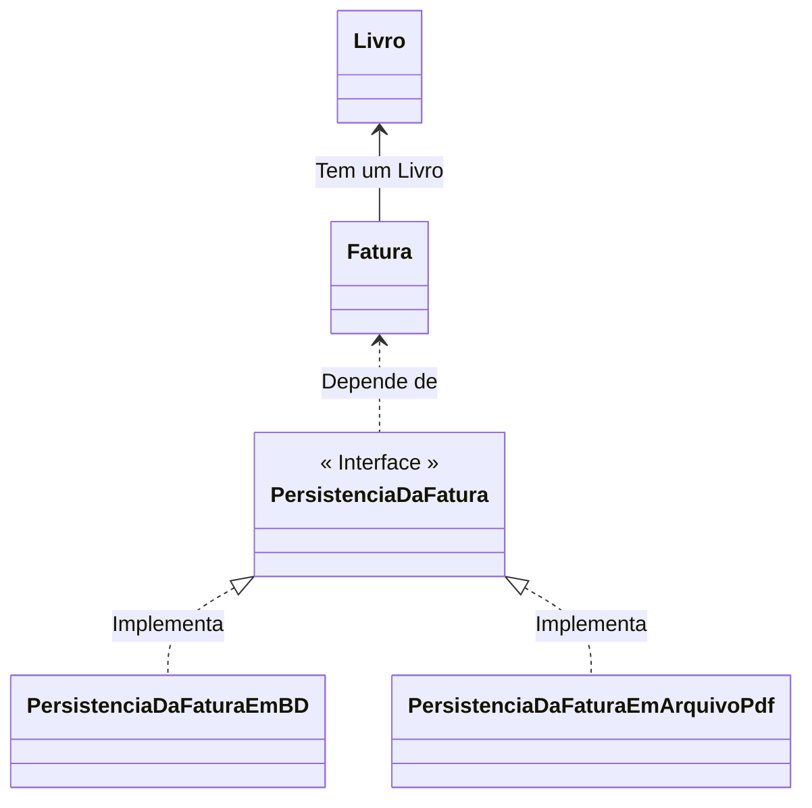

<h2>3. OCP — Open-Closed Principle</h2>

Software é um **produto evolutivo**, e raramente é feito uma única vez e nunca mais será modificado. Sendo assim, nosso software deve conseguir evoluir a medida que as **demandas por novas funcionalidade** crescem. Porém, como essas evoluções devem vir, por meio de alterações ou extensões? 

O **Princípio de Aberto/Fechado** diz que:

<div align="center"><h2><i>Objetos ou Entidades devem estar abertos para extensão, mas fechados para modificação.</i></h2></div>

<br />

<div align="center"></div>

<br />

Simplificando, quando novos comportamentos e recursos precisam ser adicionados no software, devemos estender e não alterar o código fonte original. A **extensibilidade** é uma das chaves da orientação a objetos. Quando um novo comportamento ou funcionalidade precisa ser adicionado, espera-se que as existentes sejam **estendidas** e não alteradas, dessa forma o código original permanece **intacto e confiável** enquanto as novas são implementadas através de extensibilidade.

As principais vantagens de utilizar o princípio aberto/fechado são:

- **Facilidade de manutenção do código**, já que cada classe possui uma responsabilidade única;
- **Contribui para a arquitetura sustentável do projeto**, possibilitando evoluções sem comprometer outras funcionalidades do projeto.


**Exemplo:**

Vamos explorar o conceito do princípio aberto/fechado através do exemplo anterior (Livraria). Vamos criar uma Classe para salvar as nossas faturas em um banco de dados, onde possamos fazer pesquisas facilmente e Salvar em um arquivo PDF, para ser compartilhado.

Sem pensar muito, Criamos uma nova Classe chamada **PersistenciaDaFatura** e adicionamos um Método para persistir a fatura no banco de dados e um outro Método para salvar em PDF, como vemos no código abaixo:

```java
package solid_srp_v1;

public class PersistenciaDaFatura {

	Fatura fatura;

    public PersistenciaDaFatura(Fatura fatura) {
        this.fatura = fatura;
    }

    public void salvarParaArquivoPdf(String nomeArquivo) {
		System.out.println("Salvar a fatura no arquivo: " + nomeArquivo);
	}

    public void salvarParaBancoDeDados() {
    	System.out.println("Salvar a fatura no banco de dados");
    }
    
}
```

Infelizmente da forma que criamos a Classe **PersistenciaDaFatura** ela não é extensível no futuro, desta forma, para adicionarmos novas formas de persistência, seriamos obrigados a modificar a classe **PersistenciaDaFatura**, violando o princípio aberto/fechado. Se a nossa classe fosse criada obedecendo o princípio aberto/fechado, não precisaríamos alterar essa classe.

Para corrigir o problema, vamos refatorar o código para que possamos atender ao princípio aberto/fechado. Primeiro, vamos alterar Classe **PersistenciaDaFatura** para uma Interface e adicionarmos um método de salvamento.

```java
public interface PersistenciaDaFatura {

    public void salvar(Fatura fatura);
}
```

Na sequência vamos criar uma Classe de persistência para o banco de dados chamada **PersistenciaEmBD** e uma Classe de persistência para um arquivo PDF chamada **PersistenciaEmPDF**, que implementarão a Interface **PersistenciaDaFatura**:

```java
package solid_ocp_v2;

public class PersistenciaEmBD implements PersistenciaDaFatura{

	public Fatura fatura;
	
	public PersistenciaEmBD(Fatura fatura) {
		this.fatura = fatura;
	}

	public Fatura getFatura() {
		return fatura;
	}

	public void setFatura(Fatura fatura) {
		this.fatura = fatura;
	}

	@Override
	public void salvar(Fatura fatura) {

		System.out.println("Salvar a fatura no Banco de dados...\n");
		this.fatura.imprimirFatura();
		
	}

}
```

<br />

```java
package solid_ocp_v2;

public class PersistenciaEmArquivoPdf implements PersistenciaDaFatura{

	public Fatura fatura;
	
	public PersistenciaEmArquivoPdf(Fatura fatura) {
		this.fatura = fatura;
	}

	public Fatura getFatura() {
		return fatura;
	}

	public void setFatura(Fatura fatura) {
		this.fatura = fatura;
	}
	
	@Override
	public void salvar(Fatura fatura) {

		System.out.println("Salvar a fatura no Arquivo PDF...\n");
		this.fatura.imprimirFatura();
		
	}

}
```

<br />

Agora, nossa lógica de persistência é facilmente extensível. Se precisarmos persistir em outro banco de dados, podemos fazer isso facilmente criando uma nova Classe que implementará a Interface **PersistenciaDaFatura**. Veja  o Diagrama de Classes abaixo:



Essa é a flexibilidade que a Interface nos oferece, através do Polimorfismo. 

<br />

<div align="left"> <a href="https://github.com/rafaelq80/exemplos_solid/tree/main/02_solid_ocp_v1" target="_blank"><b>Código fonte: Projeto - Livraria</b></a>

<br />
<br />

<div align="left"><a href="README.md">Voltar</a></div>
