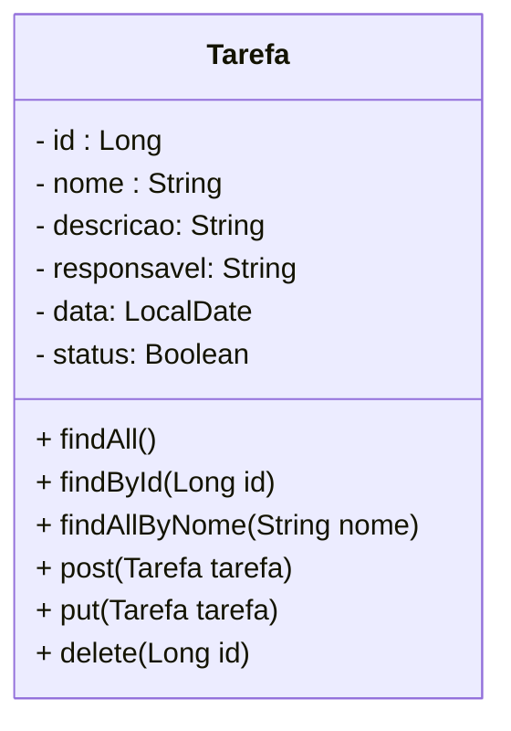

<h1>TDD na Prática</h1>

Vamos implementar o TDD em um projeto pré-configurado, que servirá de guia para o nosso aprendizado. O projeto Guia  será um **Todo-List (Lista de tarefas)**. Na imagem abaixo, vemos o Diagrama de Classes do Projeto que possui apenas uma Classe Model (Tarefa) e os Métodos do CRUD, que serão construídos através do TDD:



|  | <p align="justify"> **ATENÇÃO:** *Estamos implementando o TDD em outro projeto, porquê o Projeto Blog Pessoal já passou pelos testes na Sessão anterior e o projeto já está finalizado. * </p> |
| ------------------------------------------------------------ | ------------------------------------------------------------ |

O projeto guia está disponível no link abaixo:

<div align="left"> <a href="https://github.com/rafaelq80/tdd_todolist" target="_blank"><b>Código fonte do Projeto Guia - Todo-List</b></a>

<br /><br />

Após acessar o repositório, vamos seguir a sequência de passos abaixo:


<h2>👣 Passo 01 - Clonar o projeto</h2>

1. Abra o STS
2. Na pasta de qualquer projeto, clique com o botão direito do mouse e na sequência clique na opção: **Show in 🡢 System Explorer**
3. Será aberta a pasta Workspace onde o STS grava os seus projetos.
4. Clique com o botão direito do mouse dentro da pasta Workspace (não clique sobre nenhuma pasta de projeto) e clique na opção: **Git Bash Here**, como mostra a imagem abaixo:

<div align="center"></div>

5. No **Git Bash**, execute o comando abaixo para clonar o projeto guia **todolist**:

```bash
git clone https://github.com/rafaelq80/tdd_todolist.git
```

6. Após a clonagem, será criada a pasta **todolist** dentro da pasta Workspace.
7. Antes de continuarmos, precisamos apagar a pasta **.git**, na pasta **todolist**, caso contrário não será possível enviar o projeto para o seu Github ao conluir as atividades.
8. Abra a pasta **todolist** e localize a pasta **.git**

<div align="center"></div>

9. Caso esta pasta não esteja sendo exibida, na janela do Windows Explorer, clique na **Guia Exibir** e na sequência no botão **Opções**. Na janela **Opções de Pasta**, na **Guia Modo de Exibição**, no item **Configurações avançadas**, localize a opção: **Pastas e arquivos ocultos** e marque a opção **Mostrar arquivos, pastas e unidades ocultas** (como mostra a figura abaixo). Em seguida clique em **OK** para concluir.

<div align="center"></div>

10. Apague a pasta **.git**

<h2>👣 Passo 02 - Importar o projeto no STS</h2>

1. No STS, importe o projeto **todolist**, através do menu **File 🡢 Import**
2. Será aberta a janela **Import**. Clique na opção **Maven 🡢 Existing Maven Projects**, como mostra a figura abaixo e clique no botão **Next**.

<div align="center"></div>

3. Na  janela **Import Maven Projects**, clique no botão **Browse...** e selecione a pasta **todolist**, como mostra a figura abaixo e clique no botão **Finish** para concluir.

<div align="center"></div>

4. Na imagem abaixo, você confere o Projeto **todolist** após ser importado para o STS.

<div align="center"></div>

5. Observe que o projeto já está todo configurado para criar testes.

<h2>👣 Passo 03 - Criar o teste do Método Criar nova Tarefa</h2>

Vamos criar o nosso primeiro teste, seguindo modelo TDD:

Antes de criarmos a Classe, vamos criar em **src/test/java** o pacote **controller**:

1. No lado esquerdo superior, na Guia **Package explorer**, clique com o botão direito do mouse sobre a Package **com.generation.todolist**, na Source Folder **src/test/java** e clique na opção  **New 🡪 Package**.

2. Na janela **New Java Package**, no item **Name**, acrescente no final do nome da Package **.controller**, como mostra a figura abaixo:

<div align="center"></div>

Na sequência, vamos criar a Classe TarefaControllerTest, que será utilizada para testar a Classe Controladora TarefaController. Crie a Classe **TarefaControllerTest** na package **controller**, na Source Folder de Testes (**src/test/java**)

1. No lado esquerdo superior, na Guia **Package Explorer**, clique com o botão direito do mouse sobre a Package **com.generation.todolist.controller**, na Source Folder **src/test/java** e clique na opção  **New 🡪 Class**.

2. Na janela **New Java Class**, no item **Name**, informe o nome da Classe que será o mesmo nome da Classe Principal (**TarefaController**) + a palavra **Test**, para indicar que se trata de uma Classe de Testes, ou seja, **TarefaControllerTest**, como mostra a figura abaixo:

<div align="center"></div>

<br />

<div align="left"></div>

<br />
	
3. Implemente o código abaixo na Classe **TarefaControllerTest**. Na implementação abaixo vamos criar o Método de teste **Criar tarefa**:

```java
@SpringBootTest(webEnvironment = WebEnvironment.RANDOM_PORT)
@TestInstance(TestInstance.Lifecycle.PER_CLASS)
public class TarefaControllerTest {

	@Autowired
	private TestRestTemplate testRestTemplate;
	
	@Test
	@DisplayName("Criar nova Tarefa")
	public void deveCriarNovaTarefa() throws Exception {

		Tarefa tarefa = new Tarefa(0L, "Tarefa 01", "Tarefa numero 1", "João", LocalDate.now(), true);
		
		HttpEntity<Tarefa> corpoRequisicao = new HttpEntity<Tarefa>(tarefa);
		
		ResponseEntity<Tarefa> resposta = testRestTemplate
				.exchange("/tarefas", HttpMethod.POST, corpoRequisicao, Tarefa.class);

		assertEquals(HttpStatus.CREATED, resposta.getStatusCode());
         assertEquals(corpoRequisicao.getBody().getNome(), resposta.getBody().getNome());
		
	}
	
}
```

<br />

<div align="left"> <a href="https://github.com/rafaelq80/tdd_todolist/blob/01_deveCriarNovaTarefa/src/test/java/com/generation/todolist/controller/TarefaControllerTest.java" target="_blank"><b>Código fonte da Classe TarefaControllerTest</b></a>
	
<br /><br />

4. Para executar o Teste, na **Guia Package Explorer**, no pacote **src/test/java**, clique com o botão direito do mouse sobre a Classe **TarefaControllerTest** e clique na opção **Run As 🡪 JUnit Test**.

5. Acompanhe o resultado do teste, ao lado da **Guia Project Explorer**, na **Guia JUnit**.

<div align="center"></div>

6. Observe que o teste falhou, porquê a **Classe TarefaController** ainda não foi criada. 

<br />
	
<div align="left"></div>

<br />
	
7. Vamos criar a Classe **TarefaController** na Source folder Principal (**src/main/java**), no pacote **com.generation.todolist.controller** e implemente o código abaixo:

```java
@RestController
@RequestMapping("/tarefas")
@CrossOrigin(origins = "*", allowedHeaders = "*")
public class TarefaController {

	@Autowired
	private TarefaRepository tarefaRepository;
	
	@PostMapping
	public ResponseEntity<Tarefa> post(@Valid @RequestBody Tarefa tarefa){
		return ResponseEntity.status(HttpStatus.CREATED).body(tarefaRepository.save(tarefa));
	}
	
}
```

<br />

<div align="left"> <a href="https://github.com/rafaelq80/tdd_todolist/blob/02_Criar_TarefaController/src/main/java/com/generation/todolist/controller/TarefaController.java" target="_blank"><b>Código fonte da Classe TarefaController</b></a>
	
<br /><br />


<div align="left"></div>
	
<br />

8. Execute o Teste novamente e observe que desta vez ele passou!

<div align="center"></div>

10. Observe que na implementação do Método **post(Tarefa tarefa)**, foi feito o mínimo para passar o teste e o código não precisa de melhorias no momento.


<h2>👣 Passo 04 - Criar o teste do Método listar Tarefas por id</h2>

Vamos implementar o Método de teste **Listar tarefas por id**, na Classe **TarefaControllerTest**, seguindo o modelo TDD:

<br />

<div align="left"></div>

<br />

1. Implemente o Método **deveListarApenasUmaTarefa()**, na Classe **TarefaControllerTest**, logo abaixo do Método **deveCriarNovaTarefa()**:

```java
	@Test
	@DisplayName("Listar uma Tarefa Específica")
	public void deveListarApenasUmaTarefa() {
		
		Tarefa buscaTarefa = tarefaRepository.save(new Tarefa(0L, "Tarefa 02", "Tarefa numero 2", 
                                    "Maria", LocalDate.now(), true));
	
		ResponseEntity<String> resposta = testRestTemplate
				.exchange("/tarefas/" + buscaTarefa.getId(), HttpMethod.GET, null, String.class);

		assertEquals(HttpStatus.OK, resposta.getStatusCode());
		
	}
```

<br />

<div align="left"> <a href="https://github.com/rafaelq80/tdd_todolist/blob/03_deveListarApenasUmaTarefa/src/test/java/com/generation/todolist/controller/TarefaControllerTest.java" target="_blank"><b>Código fonte da Classe TarefaControllerTest</b></a>
	
<br /><br />

4. Para executar o Teste, na **Guia Package Explorer**, no pacote **src/test/java**, clique com o botão direito do mouse sobre a Classe **TarefaControllerTest** e clique na opção **Run As 🡪 JUnit Test**.

5. Acompanhe o resultado do teste, ao lado da **Guia Project Explorer**, na **Guia JUnit**.

<div align="center"></div>

6. Observe que o teste falhou, porquê o Método **findById(Long id)** ainda não foi implementado na **Classe TarefaController**. 

<br />

<div align="left"></div>

<br />

7. Vamos criar o Método **findById(Long id)** na Classe **TarefaController**, logo abaixo do Método **post(Tarefa tarefa)**:

```java
	@GetMapping("/{id}")
	public ResponseEntity<Optional<Tarefa>> getById(@PathVariable Long id) {
		Optional <Tarefa> buscaTarefa = tarefaRepository.findById(id);
		
		if(buscaTarefa.isPresent())
			return ResponseEntity.ok(buscaTarefa);
		else
			return ResponseEntity.notFound().build();
		
	}
```

<br />

<div align="left"> <a href="https://github.com/rafaelq80/tdd_todolist/blob/04_M%C3%A9todo_getById/src/main/java/com/generation/todolist/controller/TarefaController.java" target="_blank"><b>Código fonte da Classe TarefaController</b></a>

 <br /><br />

<div align="left"></div>

<br />

8. Execute o Teste novamente e observe que desta vez ele passou!

<div align="center"></div>

10. Observe que na implementação do Método **findById(Long id)**, foi feito o mínimo para passar o teste, entretanto nesta implementação o código pode ser melhorado, ou seja, **Refatorado**. Esta implementação está muito grande (verbosa) e pode ficar mais limpa.

<br />

<div align="left"></div>

<br />

11. Vamos refatorar o Método **findById(Long id)** utilizando uma **Expressão Lambda** em conjunto com o **Optional map**, como mostra o código abaixo:

```java
	@GetMapping("/{id}")
	public ResponseEntity<Tarefa> getById(@PathVariable Long id) {
		return tarefaRepository.findById(id)
			.map(resposta -> ResponseEntity.ok(resposta))
			.orElse(ResponseEntity.notFound().build());
	}
```

<br />

<div align="left"> <a href="https://github.com/rafaelq80/tdd_todolist/blob/05_Refatorar_getById/src/main/java/com/generation/todolist/controller/TarefaController.java" target="_blank"><b>Código fonte da Classe TarefaController - Refatorada</b></a>

<br /><br />

<div align="left"></div>

<br />

12. Execute o Teste novamente e observe que ele continua passando!

<div align="center"></div>

13. Neste teste vimos o processo completo do Ciclo do TDD.

No link abaixo, você confere o projeto completo, finalizado.

<br />

<div align="left"> <a href="https://github.com/rafaelq80/tdd_todolist/tree/05_Refatorar_getById" target="_blank"><b>Código fonte do Projeto Todo-List</b></a>

<br /><br />

<div align="left"><a href="README.md">Voltar</a></div>
